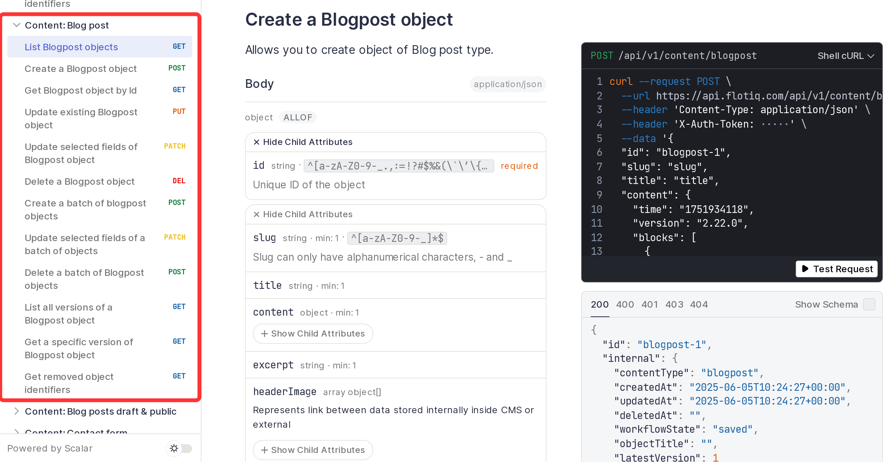

title: How to add Content Type Definitions | Flotiq docs
description: How to add Content Type Definitions in Flotiq API

# Creating new Content Types 

A new <abbr title="Content Type - a model of data that has been defined inside the Content Repository.">Content Type</abbr> 
can be created either by sending a properly formatted POST request to the ``/api/v1/internal/contenttype`` 
endpoint or through the Content Modeler tool provided with the platform.


## Creating new Content Types via API

Creating a new <abbr title="Content Type - a model of data that has been defined inside the Content Repository.">
Content Type</abbr> is simply a ``POST`` call with a payload similar to:

```
{
    "name": "blogposts",
    "label": "Blog Posts",
    "schemaDefinition": {
        "type": "object",
        "allOf": [
            {
                "$ref": "#/components/schemas/AbstractContentTypeSchemaDefinition"
            },
            {
                "type": "object",
                "properties": {
                    "title": {
                        "type": "string",
                        "minLength": 1
                },
                    "postContent": {
                        "type": "string",
                        "minLength": 1
                    }
                }
            }
        ],
        "required": [
            "title",
            "postContent"
        ],
        "additionalProperties": false
    },
    "metaDefinition": {
        "propertiesConfig": {
            "title": {
                "label": "Title",
                "inputType": "text",
                "unique": true
            },
            "postContent": {
                "label": "Post content",
                "inputType": "richtext",
                "unique": false
            }
        },
        "order": [
            "title",
            "postContent"
        ]
    }
}
```

`name` is the name of the <abbr title="Content Type - a model of data that has been defined inside the Content Repository.">
Content Type</abbr> and name of the endpoints that will be generated to handle requests with 
<abbr title="Content Object - an instance of a Content Type.">Content Objects</abbr>  of that type.

`label` is only for displaying the name correctly on the CMS panel.

The `schemaDefinition` part of the JSON payload is based on the bare JSON OpenAPI 3.0 Schema and is fully compatible. 
It holds information about properties of the 
<abbr title="Content Type - a model of data that has been defined inside the Content Repository.">CT</abbr> 
(in the `properties` key), its types and which properties are required (`required` key). 
It always should have `"type": "object"`, as it is an object, and `"additionalProperties": false` 
to ensure that API users will not post garbage to the objects of this CTD. To ensure that all objects have id property 
<abbr title="Content Type Definition - a JSON payload that defines the Content Type, it's validation rules, etc.">CTD</abbr> 
also should have information about the connection with `AbstractContentTypeSchemaDefinition` using:
```
"allOf": [
    {
        "$ref": "#/components/schemas/AbstractContentTypeSchemaDefinition"
    }
],
```

In the case of this example, it will add two properties, `title` and `postContent` which are both strings and required.

`metaDefinition` is used to tell CMS panel how to render a form for the Content Object, 
it holds information about the order of the properties (`order` key, which should contain all properties of the object), 
and about type and validation of the field. It also includes information on relations of the object with other Content Types. 

In this case, Blog Post will have `title` property which will be unique and will render as text input in CMS panel 
and `postContent` which can be duplicated and will be presented as CKEditor input in CMS panel. 
First input in the form in CMS panel will be `title` input, and second will be `postContent`.

!!! Example

    === "CURL"
    
        ```
        curl -X POST "https://api.flotiq.com/api/v1/internal/contenttype" -H 'accept: */*' -H 'X-AUTH-TOKEN: YOUR_API_KEY' -H 'Content-Type: application/json' --data-binary '{"name":"blogposts","label":"Blog Posts","schemaDefinition":{"type":"object","allOf":[{"$ref":"#/components/schemas/AbstractContentTypeSchemaDefinition"},{"type":"object","properties":{"title":{"type":"string"},"postContent":{"type":"string"}}}],"required":["title","postContent"],"additionalProperties":false},"metaDefinition":{"propertiesConfig":{"title":{"label":"Title",inputType":"text","unique":true},"postContent":{"label":"Post content","inputType":"richtext","unique":false}},"order":["title","postContent"]}}'
        ```

    === "C# + Restasharp"

        ```
        var client = new RestClient("https://api.flotiq.com/api/v1/internal/contenttype");
        var request = new RestRequest(Method.POST);
        request.AddHeader("content-type", "application/json");
        request.AddHeader("X-AUTH-TOKEN", "YOUR_API_KEY");
        request.AddParameter("application/json", "{\"name\":\"blogposts\",\"label\":\"Blog Posts\",\"schemaDefinition\":{\"type\":\"object\",\"allOf\":[{\"$ref\":\"#/components/schemas/AbstractContentTypeSchemaDefinition\"},{\"type\":\"object\",\"properties\":{\"title\":{\"type\":\"string\"},\"postContent\":{\"type\":\"string\"}}}],\"required\":[\"title\",\"postContent\"],\"additionalProperties\":false},\"metaDefinition\":{\"propertiesConfig\":{\"title\":{\"label\":\"Title\",inputType\":\"text\",\"unique\":true},\"postContent\":{\"label\":\"Post content\",\"inputType\":\"richtext\",\"unique\":false}},\"order\":[\"title\",\"postContent\"]}}", ParameterType.RequestBody);
        IRestResponse response = client.Execute(request);
        ```
    
    === "Go + Native"

        ```
        package main

        import (
            "fmt"
            "strings"
            "net/http"
            "io/ioutil"
        )
        
        func main() {
        
            url := "https://api.flotiq.com/api/v1/internal/contenttype"
        
            payload := strings.NewReader("{\"name\":\"blogposts\",\"label\":\"Blog Posts\",\"schemaDefinition\":{\"type\":\"object\",\"allOf\":[{\"$ref\":\"#/components/schemas/AbstractContentTypeSchemaDefinition\"},{\"type\":\"object\",\"properties\":{\"title\":{\"type\":\"string\"},\"postContent\":{\"type\":\"string\"}}}],\"required\":[\"title\",\"postContent\"],\"additionalProperties\":false},\"metaDefinition\":{\"propertiesConfig\":{\"title\":{\"label\":\"Title\",inputType\":\"text\",\"unique\":true},\"postContent\":{\"label\":\"Post content\",\"inputType\":\"richtext\",\"unique\":false}},\"order\":[\"title\",\"postContent\"]}}")
        
            req, _ := http.NewRequest("POST", url, payload)
        
            req.Header.Add("content-type", "application/json")
            req.Header.Add("X-AUTH-TOKEN", "YOUR_API_KEY")
        
            res, _ := http.DefaultClient.Do(req)
        
            defer res.Body.Close()
            body, _ := ioutil.ReadAll(res.Body)
        
            fmt.Println(res)
            fmt.Println(string(body))
        
        }
        ```
    
    === "Java + Okhttp"
        
        ```
        OkHttpClient client = new OkHttpClient();

        MediaType mediaType = MediaType.parse("application/json");
        RequestBody body = RequestBody.create(mediaType, "{\"name\":\"blogposts\",\"label\":\"Blog Posts\",\"schemaDefinition\":{\"type\":\"object\",\"allOf\":[{\"$ref\":\"#/components/schemas/AbstractContentTypeSchemaDefinition\"},{\"type\":\"object\",\"properties\":{\"title\":{\"type\":\"string\"},\"postContent\":{\"type\":\"string\"}}}],\"required\":[\"title\",\"postContent\"],\"additionalProperties\":false},\"metaDefinition\":{\"propertiesConfig\":{\"title\":{\"label\":\"Title\",inputType\":\"text\",\"unique\":true},\"postContent\":{\"label\":\"Post content\",\"inputType\":\"richtext\",\"unique\":false}},\"order\":[\"title\",\"postContent\"]}}");
        Request request = new Request.Builder()
            .url("https://api.flotiq.com/api/v1/internal/contenttype")
            .post(body)
            .addHeader("content-type", "application/json")
            .addHeader("X-AUTH-TOKEN", "YOUR_API_KEY")
            .build();
        
        Response response = client.newCall(request).execute();
        ```

    === "Java + Unirest"
      
        ```
        HttpResponse<String> response = Unirest.post("https://api.flotiq.com/api/v1/internal/contenttype")
            .header("content-type", "application/json")
            .header("X-AUTH-TOKEN", "YOUR_API_KEY")
            .body("{\"name\":\"blogposts\",\"label\":\"Blog Posts\",\"schemaDefinition\":{\"type\":\"object\",\"allOf\":[{\"$ref\":\"#/components/schemas/AbstractContentTypeSchemaDefinition\"},{\"type\":\"object\",\"properties\":{\"title\":{\"type\":\"string\"},\"postContent\":{\"type\":\"string\"}}}],\"required\":[\"title\",\"postContent\"],\"additionalProperties\":false},\"metaDefinition\":{\"propertiesConfig\":{\"title\":{\"label\":\"Title\",inputType\":\"text\",\"unique\":true},\"postContent\":{\"label\":\"Post content\",\"inputType\":\"richtext\",\"unique\":false}},\"order\":[\"title\",\"postContent\"]}}")
            .asString();
        ```

    === "Node + Request"
      
        ```
        const request = require('request');

        const options = {
            method: 'POST',
            url: 'https://api.flotiq.com/api/v1/internal/contenttype',
            headers: {'content-type': 'application/json', 'X-AUTH-TOKEN': 'YOUR_API_KEY'},
            body: {
                "name": "blogposts",
                "label": "Blog Posts",
                "schemaDefinition": {
                    "type": "object",
                    "allOf": [
                        {
                            "$ref": "#/components/schemas/AbstractContentTypeSchemaDefinition"
                        },
                        {
                            "type": "object",
                            "properties": {
                                "title": {
                                    "type": "string",
                                    "minLength": 1
                            },
                                "postContent": {
                                    "type": "string",
                                    "minLength": 1
                                }
                            }
                        }
                    ],
                    "required": [
                        "title",
                        "postContent"
                    ],
                    "additionalProperties": false
                },
                "metaDefinition": {
                    "propertiesConfig": {
                        "title": {
                            "label": "Title",
                            "inputType": "text",
                            "unique": true
                        },
                        "postContent": {
                            "label": "Post content",
                            "inputType": "richtext",
                            "unique": false
                        }
                    },
                    "order": [
                        "title",
                        "postContent"
                    ]
                }
            },
            json: true
        };
        
        request(options, function (error, response, body) {
            if (error) throw new Error(error);
            
            console.log(body);
        });
        ```

    === "PHP + CURL"
    
        ```
        <?php

        $curl = curl_init();
        
        curl_setopt_array($curl, [
            CURLOPT_URL => "https://api.flotiq.com/api/v1/internal/contenttype",
            CURLOPT_RETURNTRANSFER => true,
            CURLOPT_ENCODING => "",
            CURLOPT_MAXREDIRS => 10,
            CURLOPT_TIMEOUT => 30,
            CURLOPT_HTTP_VERSION => CURL_HTTP_VERSION_1_1,
            CURLOPT_CUSTOMREQUEST => "POST",
            CURLOPT_POSTFIELDS => "{\"name\":\"blogposts\",\"label\":\"Blog Posts\",\"schemaDefinition\":{\"type\":\"object\",\"allOf\":[{\"$ref\":\"#/components/schemas/AbstractContentTypeSchemaDefinition\"},{\"type\":\"object\",\"properties\":{\"title\":{\"type\":\"string\"},\"postContent\":{\"type\":\"string\"}}}],\"required\":[\"title\",\"postContent\"],\"additionalProperties\":false},\"metaDefinition\":{\"propertiesConfig\":{\"title\":{\"label\":\"Title\",inputType\":\"text\",\"unique\":true},\"postContent\":{\"label\":\"Post content\",\"inputType\":\"richtext\",\"unique\":false}},\"order\":[\"title\",\"postContent\"]}}",
            CURLOPT_HTTPHEADER => [
                    "X-AUTH-TOKEN: YOUR_API_KEY",
                    "content-type: application/json"
                ],
        ]);
        
        $response = curl_exec($curl);
        $err = curl_error($curl);
        
        curl_close($curl);
        
        if ($err) {
            echo "cURL Error #:" . $err;
        } else {
            echo $response;
        }
        ```

!!! Responses

    === "200 OK"

        Returned when schema has been correct and was saved

        ```
        {
            "name": "blogposts",
            "label": "Blog Posts",
            "schemaDefinition": {
                "type": "object",
                "allOf": [
                    {
                        "$ref": "#/components/schemas/AbstractContentTypeSchemaDefinition"
                    },
                    {
                        "type": "object",
                        "properties": {
                            "title": {
                                "type": "string",
                                "minLength": 1
                        },
                            "postContent": {
                                "type": "string",
                                "minLength": 1
                            }
                        }
                    }
                ],
                "required": [
                    "title",
                    "postContent"
                ],
                "additionalProperties": false
            },
            "metaDefinition": {
                "propertiesConfig": {
                    "title": {
                        "label": "Title",
                        "inputType": "text",
                        "unique": true
                    },
                    "postContent": {
                        "label": "Post content",
                        "inputType": "richtext",
                        "unique": false
                    }
                },
                "order": [
                    "title",
                    "postContent"
                ]
            }
        }
        ```

    === "400 Validation error"

        Returned when shema has not been correct and wasn't saved

        ```
        {
            "name": [
                "This value is already used."
            ],
            "label": [
                "Must be at least 1 characters long"
            ],
            "schemaDefinition.allOf[1].properties.title.type": [
                "Does not have a value in the enumeration [\"array\",\"boolean\",\"integer\",\"null\",\"number\",\"object\",\"string\"]",
                "String value found, but an array is required",
                "Failed to match at least one schema"
            ],
            "metaDefinition.propertiesConfig.price.label": [
                "The property label is required"
            ],
            "metaDefinition.propertiesConfig.price.inputType": [
                "Does not have a value in the enumeration [\"text\",\"richtext\",\"textarea\",\"textMarkdown\",\"email\",\"number\",\"radio\",\"checkbox\",\"select\",\"datasource\",\"object\",\"geo\"]"
            ]
        }
        ```

    === "401 Unauthorized"

        Returned when API key was missing or incorrect
  
        ```
        {
            "code": 401,
            "massage": "Unauthorized"
        }
        ```


After such call is made the 
<abbr title="Content Type - a model of data that has been defined inside the Content Repository.">Content Type</abbr> 
is created - the User API is immediately extended to support interaction with this new Content Type:

{: .center .width75 .border}

All Content Types have automatically added properties from `AbstractContentTypeSchemaDefinition`; they are:

* id - string identifier of Content Object, required in all requests, unique within the Content Type,
* internal - object necessary to proper work of CMS backend 
  (information about dates of creation and update, the whole object is described in JSON below). 

**Schema of Abstract Content Type**
```
"AbstractContentTypeSchemaDefinition": {
    "type": "object",
    "properties": {
        "id": {
            "type": "string"
        },
        "internal": {
            "type":"object",
            "description":"Immutable object containing system information, it will be automatically generated on object creation and regenerated on updates.",
            "additionalProperties":false,
            "required": [
                "createdAt",
                "updatedAt",
                "deletedAt",
                "contentType"
            ],
            "properties": {
                "contentType": {
                    "type":"string",
                    "description":"Name of Content Type Definition of object"
                },
                "createdAt": {
                    "type":"string",
                    "description":"Date and time of creation of Content Object, in ISO 8601 date format"
                },
                "updatedAt": {
                    "type":"string",
                    "description":"Date and time of last update of Content Object, in ISO 8601 date format"
                },
                "deletedAt": {
                    "type":"string",
                    "description":"Date and time of deletion of Content Object, in ISO 8601 date format"
                },
                "workflow_state": {
                    "type":"string",
                    "description":"Information about object's current state in workflow"
                }
            }
        }
    },
    "required": [
        "id"
    ]
},
```

### Property types

Property types (as of `schemaDefinition` properties), recognized by CMS panel:

| type    | Description                                                                                                                                  | Additional keys in property | Description                                                                                                                                                                                                                                                                  |
| ------- | -------------------------------------------------------------------------------------------------------------------------------------------- | --------------------------- | ---------------------------------------------------------------------------------------------------------------------------------------------------------------------------------------------------------------------------------------------------------------------------- |
| string  | Any string data that includes date and files                                                                                                 | minLength                   | Minimal length of filed content                                                                                                                                                                                                                                              |
|         |                                                                                                                                              | pattern                     | Regex pattern of filed content                                                                                                                                                                                                                                               |
|         |                                                                                                                                              | default                     | Default value of the field                                                                                                                                                                                                                                                   |
| number  | Any number, integer, float and double                                                                                                        | minLength                   | Minimal length of filed content                                                                                                                                                                                                                                              |
|         |                                                                                                                                              | default                     | Default value of the field                                                                                                                                                                                                                                                   |
| boolean | Represents two values `true` and `false`. Note that truthy and falsy values such as "true", "", 0 or null are not considered boolean values. | none allowed                |                                                                                                                                                                                                                                                                              |
| array   | Used for lists or relations.                                                                                                                 | items                       | For relations: it has to be an object containing `{"$ref": "#/components/schemas/DataSource"}`, as the items of the array are objects described in DataSource schema.<br>For list items: it should be a valid json schema following the same restrictions as wrapping schema |
|         |                                                                                                                                              | minItems                    | `0` for a not required property, and `1` for required property                                                                                                                                                                                                               |
| object  | Used for geo point type                                                                                                                      | properties                  | must be `{"lat": {"type": "number"},"lon": {"type": "number"}}`                                                                                                                                                                                                              |
|         |                                                                                                                                              | additionalProperties        | must be `false`                                                                                                                                                                                                                                                              |
|         |                                                                                                                                              | type                        | must be `object`                                                                                                                                                                                                                                                             |
|         |                                                                                                                                              | required                    | if the field is required it must be `["lat","lon"]`                                                                                                                                                                                                                          |

### Meta definition properties types

Input types of properties in `metaDefinition`:

| inputType  | Possible for schema type | Description                                                                                                        | Additional keys in property | Type   | Description                                                                                                        | Additional keys                                                      | Description                                                                          |
| ---------- | ------------------------ | ------------------------------------------------------------------------------------------------------------------ | --------------------------- | ------ | ------------------------------------------------------------------------------------------------------------------ | -------------------------------------------------------------------- | ------------------------------------------------------------------------------------ |
| text       | string                   | Renders text input in form                                                                                         | unique*                     | bool   | Information if the value of the property should be unique in all object of the specified type.                     | none allowed                                                         |                                                                                      |
|            |                          |                                                                                                                    | isTitlePart                 | bool   | Should this field be displayed when listing objects in relation select                                             | none allowed                                                         |                                                                                      |
|            |                          |                                                                                                                    | helpText                    | string | Help text displayed in dashboard Content Object form and as description in Open API Schema                         | none allowed                                                         |                                                                                      |
|            |                          |                                                                                                                    | label*                      | string | People friendly name of the field                                                                                  | none allowed                                                         |                                                                                      |
| textarea   | string                   | Renders textarea in form                                                                                           | unique*                     | bool   | Information if the value of the property should be unique in all object of the specified type.                     | none allowed                                                         |                                                                                      |
|            |                          |                                                                                                                    | isTitlePart                 | bool   | Should this field be displayed when listing objects in relation select                                             | none allowed                                                         |                                                                                      |
|            |                          |                                                                                                                    | helpText                    | string | Help text displayed in dashboard Content Object form and as description in Open API Schema                         | none allowed                                                         |                                                                                      |
|            |                          |                                                                                                                    | label*                      | string | People friendly name of the field                                                                                  | none allowed                                                         |                                                                                      |
| markdown   | string                   | Renders Markdown in form                                                                                           | unique*                     | bool   | Information if the value of the property should be unique in all object of the specified type.                     | none allowed                                                         |                                                                                      |
|            |                          |                                                                                                                    | helpText                    | string | Help text displayed in dashboard Content Object form and as description in Open API Schema                         | none allowed                                                         |                                                                                      |
|            |                          |                                                                                                                    | label*                      | string | People friendly name of the field                                                                                  | none allowed                                                         |                                                                                      |
| richtext   | string                   | Renders CKEditor in form                                                                                           | unique*                     | bool   | Information if the value of the property should be unique in all object of the specified type.                     | none allowed                                                         |                                                                                      |
|            |                          |                                                                                                                    | helpText                    | string | Help text displayed in dashboard Content Object form and as description in Open API Schema                         | none allowed                                                         |                                                                                      |
|            |                          |                                                                                                                    | label*                      | string | People friendly name of the field                                                                                  | none allowed                                                         |                                                                                      |
| email      | string                   | Renders email input in form                                                                                        | unique*                     | bool   | Information if the value of the property should be unique in all object of the specified type.                     | none allowed                                                         |                                                                                      |
|            |                          |                                                                                                                    | isTitlePart                 | bool   | Should this field be displayed when listing objects in relation select                                             | none allowed                                                         |                                                                                      |
|            |                          |                                                                                                                    | helpText                    | string | Help text displayed in dashboard Content Object form and as description in Open API Schema                         | none allowed                                                         |                                                                                      |
|            |                          |                                                                                                                    | label*                      | string | People friendly name of the field                                                                                  | none allowed                                                         |                                                                                      |
| number     | number                   | Renders number input in form, min is 0, max is MAX INT                                                             | unique*                     | bool   | Information if the value of the property should be unique in all object of the specified type.                     | none allowed                                                         |                                                                                      |
|            |                          |                                                                                                                    | isTitlePart                 | bool   | Should this field be displayed when listing objects in relation select                                             | none allowed                                                         |                                                                                      |
|            |                          |                                                                                                                    | helpText                    | string | Help text displayed in dashboard Content Object form and as description in Open API Schema                         | none allowed                                                         |                                                                                      |
|            |                          |                                                                                                                    | label*                      | string | People friendly name of the field                                                                                  | none allowed                                                         |                                                                                      |
| radio      | string                   | Renders radio input, options are taken from `options` property                                                     | unique*                     | bool   | Information if the value of the property should be unique in all object of the specified type, Can only be `false` | none allowed                                                         |                                                                                      |
|            |                          |                                                                                                                    | options                     | array  | Array of string options possible for the radio input                                                               | none allowed                                                         |                                                                                      |
|            |                          |                                                                                                                    | helpText                    | string | Help text displayed in dashboard Content Object form and as description in Open API Schema                         | none allowed                                                         |                                                                                      |
|            |                          |                                                                                                                    | label*                      | string | People friendly name of the field                                                                                  | none allowed                                                         |                                                                                      |
| checkbox   | boolean                  | Renders single checkbox input returning `true`/`false` value                                                       | unique*                     | bool   | Information if the value of the property should be unique in all object of the specified type, Can only be `false` | none allowed                                                         |                                                                                      |
|            |                          |                                                                                                                    | helpText                    | string | Help text displayed in dashboard Content Object form and as description in Open API Schema                         | none allowed                                                         |                                                                                      |
|            |                          |                                                                                                                    | label*                      | string | People friendly name of the field                                                                                  | none allowed                                                         |                                                                                      |
| select     | string                   | Renders single item select input, options are taken from `options` property                                        | unique*                     | bool   | Information if the value of the property should be unique in all object of the specified type.                     | none allowed                                                         |                                                                                      |
|            |                          |                                                                                                                    | options                     | array  | Array of string options possible for the select input                                                              | none allowed                                                         |                                                                                      |
|            |                          |                                                                                                                    | isTitlePart                 | bool   | Should this field be displayed when listing objects in relation select                                             | none allowed                                                         |                                                                                      |
|            |                          |                                                                                                                    | helpText                    | string | Help text displayed in dashboard Content Object form and as description in Open API Schema                         | none allowed                                                         |                                                                                      |
|            |                          |                                                                                                                    | label*                      | string | People friendly name of the field                                                                                  | none allowed                                                         |                                                                                      |
| object     | array                    | Renders one or multiple forms for nested `meta definition` element                                                 | items                       | object | `Meta definition` for single list item                                                                             | same as in wrapping meta definition (`order` and `propertiesConfig`) |                                                                                      |
|            |                          |                                                                                                                    | helpText                    | string | Help text displayed in dashboard Content Object form and as description in Open API Schema                         | none allowed                                                         |                                                                                      |
|            |                          |                                                                                                                    | label*                      | string | People friendly name of the field                                                                                  | none allowed                                                         |                                                                                      |
| datasource | array                    | Renders picker for choosing the objects of specified or any other Content Type, depending on `validation` property | unique*                     | bool   | Information if the value of the property should be unique in all object of the specified type.                     | none allowed                                                         |                                                                                      |
|            |                          |                                                                                                                    | validation                  | array  | Object contains restrictions for datasource                                                                        | relationContenttype                                                  | Name of the Content Type to which relation should be restricted                      |
|            |                          |                                                                                                                    |                             |        |                                                                                                                    | relationMultiple                                                     | Boolean value informing if the array should have only one ora can have more elements |
|            |                          |                                                                                                                    | helpText                    | string | Help text displayed in dashboard Content Object form and as description in Open API Schema                         | none allowed                                                         |                                                                                      |
|            |                          |                                                                                                                    | label*                      | string | People friendly name of the field                                                                                  | none allowed                                                         |                                                                                      |
| geo        | object                   | Renders two fields, one for the latitude, second for the longitude, saves it as an object                          | unique*                     | bool   | Information if the value of the property should be unique in all object of the specified type.                     | none allowed                                                         |                                                                                      |
|            |                          |                                                                                                                    | helpText                    | string | Help text displayed in dashboard Content Object form and as description in Open API Schema                         | none allowed                                                         |                                                                                      |
|            |                          |                                                                                                                    | label*                      | string | People friendly name of the field                                                                                  | none allowed                                                         |                                                                                      |

*Required property


??? "Example with every type of field"

    ```
    {
      "name": "example",
      "label": "Example",
      "schemaDefinition": {
        "type": "object",
        "allOf": [
          {
            "$ref": "#/components/schemas/AbstractContentTypeSchemaDefinition"
          },
          {
            "type": "object",
            "properties": {
              "text": {
                "type": "string",
                "minLength": 1,
                "pattern": "^\\d{2}-\\d{2}-\\d{4}$",
                "default": "01-01-2021"
              },
              "textarea": {
                "type": "string",
                "minLength": 1,
                "default": "Lorem ipsum dolor sit amet."
              },
              "markdown": {
                "type": "string",
                "minLength": 1
              },
              "rich_text": {
                "type": "string",
                "minLength": 1
              },
              "email": {
                "type": "string",
                "minLength": 1
              },
              "number": {
                "type": "number",
                "minLength": 1,
                "default": 0
              },
              "radio": {
                "type": "string",
                "minLength": 1
              },
              "checkbox": {
                "type": "boolean"
              },
              "select": {
                "type": "string",
                "minLength": 1,
                "default": "Option 1"
              },
              "relation": {
                "type": "array",
                "items": {
                  "$ref": "#/components/schemas/DataSource"
                },
                "minItems": 1
              },
              "list": {
                "type": "array",
                "minLength": 1,
                "items": {
                  "type": "object",
                  "properties": {
                    "text_in_subobject": {
                      "type": "string",
                      "pattern": "^[a-zA-Z ]*$",
                      "default": "Lorem"
                    },
                    "textarea_in_subobject": {
                      "type": "string",
                      "default": "Lorem ipsum"
                    },
                    "markdown_in_subobject": {
                      "type": "string"
                    },
                    "rich_text_in_subobject": {
                      "type": "string"
                    },
                    "emain_in_subobject": {
                      "type": "string"
                    },
                    "number_in_subobject": {
                      "type": "number",
                      "default": 1000
                    },
                    "radio_in_subobject": {
                      "type": "string"
                    },
                    "checkbox_in_subobject": {
                      "type": "boolean"
                    },
                    "select_in_subobject": {
                      "type": "string",
                      "default": "Option c"
                    },
                    "relation_in_subobject": {
                      "type": "array",
                      "items": {
                        "$ref": "#/components/schemas/DataSource"
                      },
                      "minItems": 0
                    },
                    "geo_in_subobject": {
                      "type": "object",
                      "properties": {
                        "lat": {
                          "type": "number"
                        },
                        "lon": {
                          "type": "number"
                        }
                      },
                      "additionalProperties": false
                    },
                    "media_in_subobject": {
                      "type": "array",
                      "items": {
                        "$ref": "#/components/schemas/DataSource"
                      },
                      "minItems": 0
                    }
                  }
                }
              },
              "geo": {
                "type": "object",
                "properties": {
                  "lat": {
                    "type": "number"
                  },
                  "lon": {
                    "type": "number"
                  }
                },
                "additionalProperties": false,
                "required": [
                  "lat",
                  "lon"
                ]
              },
              "media": {
                "type": "array",
                "items": {
                  "$ref": "#/components/schemas/DataSource"
                },
                "minItems": 1
              }
            }
          }
        ],
        "required": [
          "text",
          "textarea",
          "markdown",
          "rich_text",
          "email",
          "number",
          "radio",
          "select",
          "relation",
          "list",
          "geo",
          "media"
        ],
        "additionalProperties": false
      },
      "metaDefinition": {
        "propertiesConfig": {
          "text": {
            "inputType": "text",
            "unique": true,
            "isTitlePart": true,
            "helpText": "Text with regex for date, e.g. 01-01-2021",
            "label": "text"
          },
          "textarea": {
            "inputType": "textarea",
            "unique": true,
            "isTitlePart": true,
            "helpText": "Long text with default value",
            "label": "Textarea"
          },
          "markdown": {
            "inputType": "textMarkdown",
            "unique": true,
            "helpText": "Markdown long text",
            "label": "Markdown"
          },
          "rich_text": {
            "inputType": "richtext",
            "unique": true,
            "helpText": "Rich long text",
            "label": "Rich text"
          },
          "email": {
            "inputType": "email",
            "unique": true,
            "isTitlePart": true,
            "helpText": "Email field",
            "label": "Email"
          },
          "number": {
            "inputType": "number",
            "unique": true,
            "isTitlePart": true,
            "helpText": "Number filed with default value",
            "label": "Number"
          },
          "radio": {
            "inputType": "radio",
            "unique": false,
            "options": [
              "Option 1",
              "Option 2",
              "Option 3"
            ],
            "helpText": "Radio field with 3 options",
            "label": "Radio"
          },
          "checkbox": {
            "inputType": "checkbox",
            "unique": false,
            "helpText": "Checkbox field, if it would be required everybody would have to check it.",
            "label": "Checkbox"
          },
          "select": {
            "inputType": "select",
            "unique": true,
            "options": [
              "Option 1",
              "Option 2",
              "Option 3"
            ],
            "isTitlePart": true,
            "helpText": "Select field, because it must be unique and has only 3 options, there will be maximum of 3 objects of this type",
            "label": "Select"
          },
          "relation": {
            "inputType": "datasource",
            "unique": true,
            "validation": {
              "relationMultiple": true,
              "relationContenttype": "test"
            },
            "helpText": "Multiple relation restricted to test type",
            "label": "Relation"
          },
          "list": {
            "inputType": "object",
            "unique": false,
            "items": {
              "order": [
                "text_in_subobject",
                "textarea_in_subobject",
                "markdown_in_subobject",
                "rich_text_in_subobject",
                "emain_in_subobject",
                "number_in_subobject",
                "radio_in_subobject",
                "checkbox_in_subobject",
                "select_in_subobject",
                "relation_in_subobject",
                "geo_in_subobject",
                "media_in_subobject"
              ],
              "propertiesConfig": {
                "text_in_subobject": {
                  "inputType": "text",
                  "unique": false,
                  "helpText": "Text in subobject with regex ensuring only letters and spaces",
                  "label": "Text in subobject"
                },
                "textarea_in_subobject": {
                  "inputType": "textarea",
                  "unique": false,
                  "helpText": "Textarea in subobject",
                  "label": "Textarea in subobject"
                },
                "markdown_in_subobject": {
                  "inputType": "textMarkdown",
                  "unique": false,
                  "helpText": "Markdown in subobject",
                  "label": "Markdown in subobject"
                },
                "rich_text_in_subobject": {
                  "inputType": "richtext",
                  "unique": false,
                  "helpText": "Rich text in subobject",
                  "label": "Rich text in subobject"
                },
                "emain_in_subobject": {
                  "inputType": "email",
                  "unique": false,
                  "helpText": "Email field in subobject",
                  "label": "Emain in subobject"
                },
                "number_in_subobject": {
                  "inputType": "number",
                  "unique": false,
                  "helpText": "NUmber field in subobject with default value",
                  "label": "Number in subobject"
                },
                "radio_in_subobject": {
                  "inputType": "radio",
                  "unique": false,
                  "options": [
                    "Option a",
                    "Option b",
                    "Option c"
                  ],
                  "helpText": "Radio in subobject with 3 options",
                  "label": "Radio in subobject"
                },
                "checkbox_in_subobject": {
                  "inputType": "checkbox",
                  "unique": false,
                  "helpText": "Checkbox in subobject",
                  "label": "Checkbox in subobject"
                },
                "select_in_subobject": {
                  "inputType": "select",
                  "unique": false,
                  "options": [
                    "Option a",
                    "Option b",
                    "Option c"
                  ],
                  "helpText": "Select filed in subobject with 3 options and default value",
                  "label": "Select in subobject"
                },
                "relation_in_subobject": {
                  "inputType": "datasource",
                  "unique": false,
                  "validation": {
                    "relationMultiple": true,
                    "relationContenttype": "test"
                  },
                  "helpText": "Multiple relation in subobject restricted to test type",
                  "label": "Relation in subobject"
                },
                "geo_in_subobject": {
                  "inputType": "geo",
                  "unique": false,
                  "helpText": "Geo field in subobject, cantains lat and lon properties",
                  "label": "Geo in subobject"
                },
                "media_in_subobject": {
                  "inputType": "datasource",
                  "unique": false,
                  "validation": {
                    "relationContenttype": "_media",
                    "relationMultiple": true
                  },
                  "helpText": "Multiple relation to media in subobject",
                  "label": "Media in subobject"
                }
              }
            },
            "helpText": "List of subobjects",
            "label": "List"
          },
          "geo": {
            "inputType": "geo",
            "unique": true,
            "helpText": "Geo field, it has lat and lon property",
            "label": "Geo"
          },
          "media": {
            "inputType": "datasource",
            "unique": true,
            "validation": {
              "relationContenttype": "_media",
              "relationMultiple": true
            },
            "helpText": "Multiple relation to media type",
            "label": "Media"
          }
        },
        "order": [
          "text",
          "textarea",
          "markdown",
          "rich_text",
          "email",
          "number",
          "radio",
          "checkbox",
          "select",
          "relation",
          "list",
          "geo",
          "media"
        ]
      }
    }
    ```

## Creating Content Types through the Content modeller

[It is described in the public part of the documentation.](/panel/content-types/)

[Register to send all requests with your own API today](https://editor.flotiq.com/register.html){: .flotiq-button}
