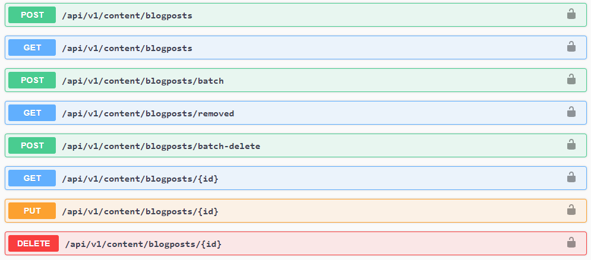

title: How to handle Content Type Definitions | Flotiq docs
description: How to handle Content Type Definitions in Flotiq

# Content Types

##API description

The CMS system API is divided into separate parts:

* internal system API
* user public API

The internal system API is used to define and list Content Types (models), which are [OpenAPI 3.0](https://swagger.io/docs/specification/about/) schemas.

The user public API exposes the user-defined Content Types (models) via a REST interface.

You can learn how to obtain your schema [here](open-api-schema.md).

## Key concepts

* **Content Repository** - the headless part of the Content Management Platform.
* **Content Type** - a model of data that has been defined inside the Content Repository.
* **Content Type Definition** - a JSON payload that defines the Content Type, it's validation rules, etc.
* **Content Object** - an instance of a Content Type.

The central part of the CMS system is the Content Repository. It enables users to store different kinds of content within the system. The users are allowed to design their own content types and define them within the Content Repository by means of <abbr title="Content Type Definition - a JSON payload that defines the Content Type, it's validation rules, etc.">Content Type Definitions</abbr> (a concept similar to DTDs familiar from XML), described in a [JSON Schema](https://json-schema.org/) format.

Every <abbr title="Content Type Definition - a JSON payload that defines the Content Type, it's validation rules, etc.">CTD</abbr> that is created in the system is validated against the predefined schema of ``ContentTypeDefinitionSchema`` type. A detailed example will be discussed [below](#creating-new-content-types-via-api).

Once created the <abbr title="Content Type - a model of data that has been defined inside the Content Repository.">Content Type</abbr> becomes available in the system and <abbr title="Content Object - an instance of a Content Type.">Content Objects</abbr>  of that type can be created, updated, deleted via API calls to their respective endpoints.  

Every <abbr title="Content Object - an instance of a Content Type.">Content Object</abbr> uploaded to the repository requires a <abbr title="Content Type Definition - a JSON payload that defines the Content Type, it's validation rules, etc.">Content Type Definition</abbr> already present in the system. 

Throughout this documentation, we will follow the example of defining a simple <abbr title="Content Type - a model of data that has been defined inside the Content Repository.">Content Type</abbr> of a BlogPost. 

Example: 
!!! note "Example: Content Type Definition for BlogPost"
    * Id – string, unique, required 
    * Title – string, required 
    * PostContent – string, required 

##API token

API token (described across the documentation as `YOUR API TOKEN` or `YOUR_API_TOKEN`) should be obtained from the User profile view of the Flotiq panel. 
All examples here have authentication in the request header, but you can also use `?auth_token=YOUR_API_TOKEN` in the request URL.
You can learn how to obtain your API key [here](index.md).

## Working with Content Type Definitions

The API endpoint ``/api/v1/internal/contenttype`` can be used to interact with
<abbr title="Content Type Definition - a JSON payload that defines the Content Type, it's validation rules, etc.">
Content Type Definitions</abbr> inside the Content Repository.
The endpoint documentation is provided in the API docs and describes the following actions:

* [Create](content-type/creating-ctd.md)
* [Update](content-type/updating-ctd.md)
* [List](content-type/listing-ctd.md)
* [Get single](content-type/getting-ctd.md)
* [Delete](content-type/deleting-ctd.md)

## Working with Content Objects

The supporting endpoints of a given
<abbr title="Content Type - a model of data that has been defined inside the Content Repository.">Content Type</abbr>
allow the user to perform basic REST operations

{: .center .width75 .border}

* [Create](content-type/creating-co.md)
    * [Batch create](/docs/API/content-type/creating-co/#batch-create-content-objects-through-api)
* [Update](content-type/updating-co.md)
    * [Batch update](/docs/API/content-type/creating-co/#batch-create-content-objects-through-api)
* [List](content-type/listing-co.md)
* [Get single](content-type/getting-co.md)
* [Delete](content-type/deleting-co.md)
    * [Batch delete](/docs/API/content-type/deleting-co/#batch-deleting)
* [List ids of deleted objects](content-type/listing-deleted-co.md)

[Register to send all requests with your own API today](https://editor.flotiq.com/register.html){: .flotiq-button}
