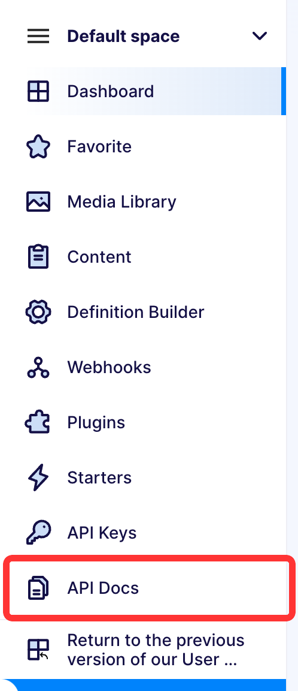
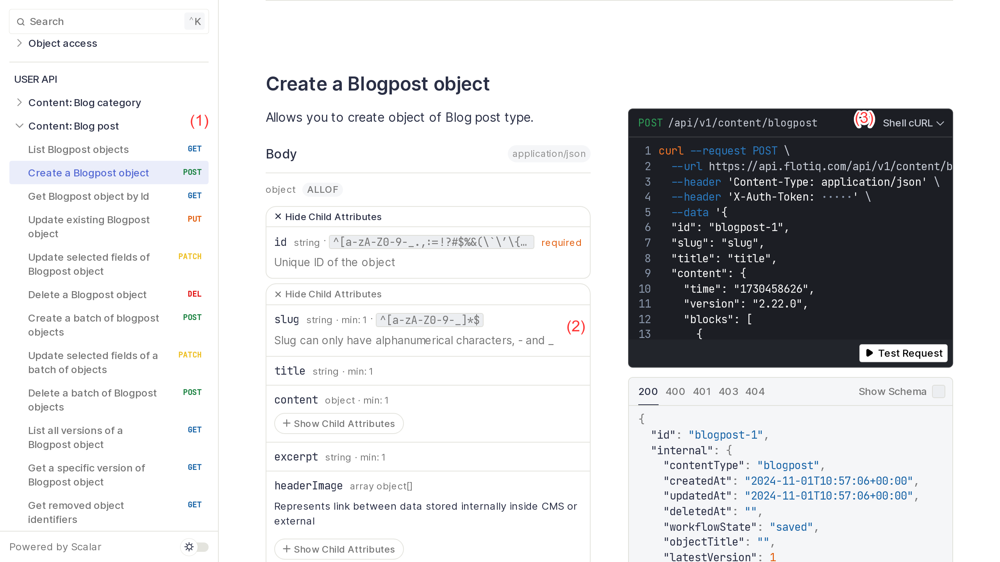
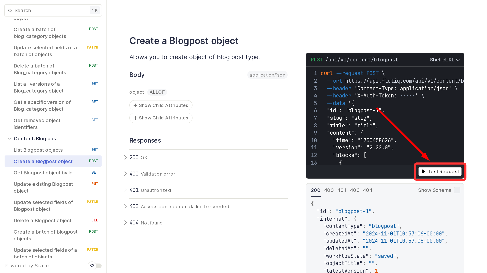
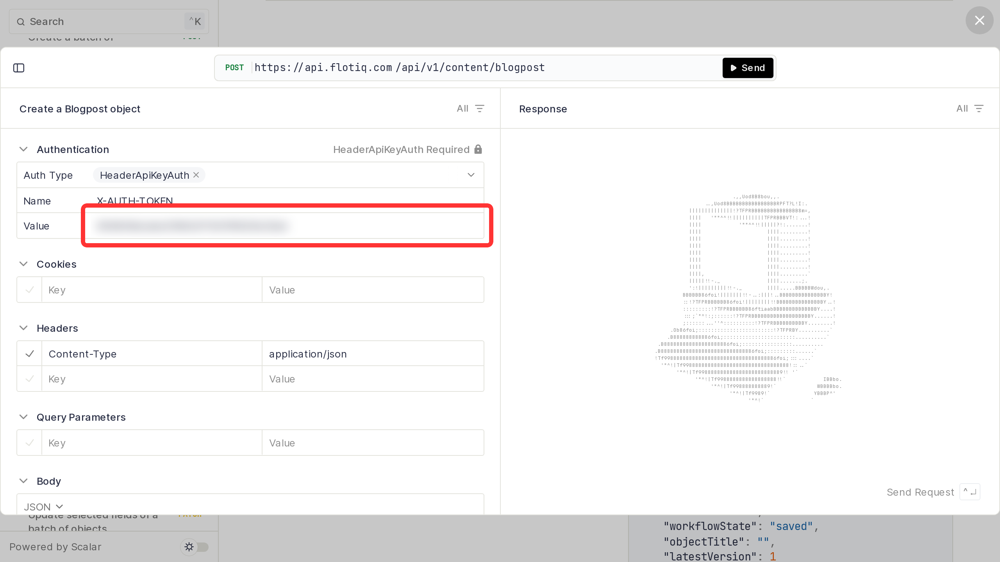
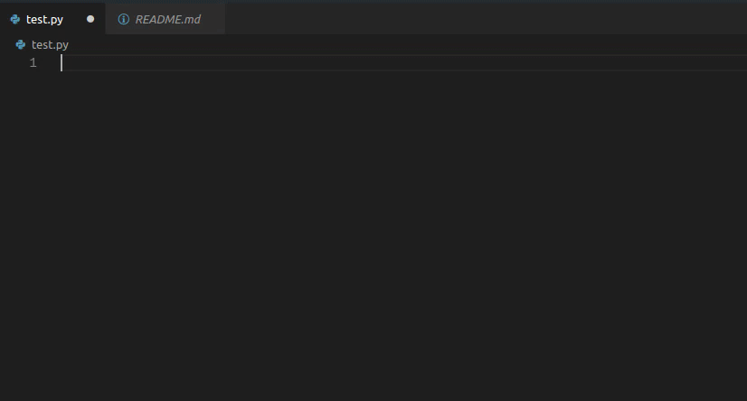
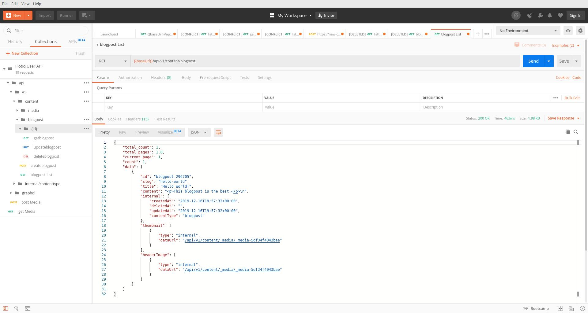

---
tags:
  - Developer
---

title: Flotiq Dynamic Content API | Flotiq docs
description: Flotiq's Dynamic Content API offers a flexible way to interact with your content. Built-in SDKs and API docs make integration easier.

# Dynamic Content API

## What is the Dynamic Content API?

The Dynamic Content API is Flotiq's primary interface for accessing your content. Unlike the internal system API (which manages Content Type Definitions), the Dynamic Content API is the **user-facing API** that provides RESTful endpoints automatically generated from your custom Content Type Definitions.

Every time you create a new Content Type Definition, Flotiq instantly generates a complete set of REST endpoints for that type. This means your API grows dynamically with your content model. For example, if you define a "Blog Post" content type, the system automatically creates endpoints like:

* `GET /api/v1/content/blogposts` - List all blog posts
* `GET /api/v1/content/blogposts/{id}` - Get a specific blog post
* `POST /api/v1/content/blogposts` - Create a new blog post
* `PATCH /api/v1/content/blogposts/{id}` - Update a blog post
* `DELETE /api/v1/content/blogposts/{id}` - Delete a blog post

## Internal API vs Dynamic Content API

Flotiq's API is divided into two parts:

| Feature       | Internal API                                         | Dynamic Content API                               |
|---------------|------------------------------------------------------|---------------------------------------------------|
| **Purpose**   | Define and manage Content Type Definitions (schemas) | Access and manipulate your content objects (data) |
| **Endpoint**  | `/api/v1/internal/contenttype`                       | `/api/v1/content/{type}/{id}`                     |
| **Use case**  | Setup and administration                             | Application development and content delivery      |
| **Generated** | Static, fixed structure                              | Dynamic, generated from your content types        |

The Dynamic Content API is designed for developers building applications that consume your content. It is the endpoint you will use most frequently in your projects.

!!! hint
    Remember - to work with the API you will need your API keys, you can find them in your User profile.

## API docs

To access your API documentation from the editor, please navigate to the `API Docs` section in the sidebar, as shown in the screenshot below.

{: .border style="height:50em"}

Part of the Content API are the beautiful API docs, along with code samples to simplify your work. You can explore your Content API or share with other teams to jumpstart integration.

There are 3 important parts of the API documentation that Flotiq provides for you:

{: .border}

1. Every time you create a Content Type Definition - your API is extended with endpoints that support this new Content Type.
2. The descriptions of these endpoints contain all the information regarding the structure and constraints of the Content Type you defined.
3. The API docs are enriched with code samples in several popular languages, which make it extremely easy to integrate your content into any external application.

If you want to send a test request, press the 'send test request' as shown in the image below.

{: .border}

!!! note
    The generated API documentation uses your read-only key to keep your account secure. If you wish to perform write actions, please enter your read-write API key in the field highlighted in the image below.

{: .border}

## SDKs

We offer a number of SDKs, that are also automatically generated based on your current API. The SDKs contain models based on your current Content Type Definitions and allow you to rip benefits off your IDE's autocompletion and docblock support.

We currently support the following SDKs:

* Angular
* C#
* Go
* Java
* JavaScript
* TypeScript
* PHP
* Python

## Postman collection

In a similar fashion - we also provide a downloadable Postman collection, which fully describes your entire Content API. 

{: .border}

Read more on how to configure Postman to work with Flotiq on the [Postman Sandbox Packages page](/docs/Universe/postman/).

## Related docs

- [Get Started with API](./get-started.md)
- [Content Objects](./content-objects.md)
- [Search API](./search.md)
- [API access & scoped keys](./index.md)

