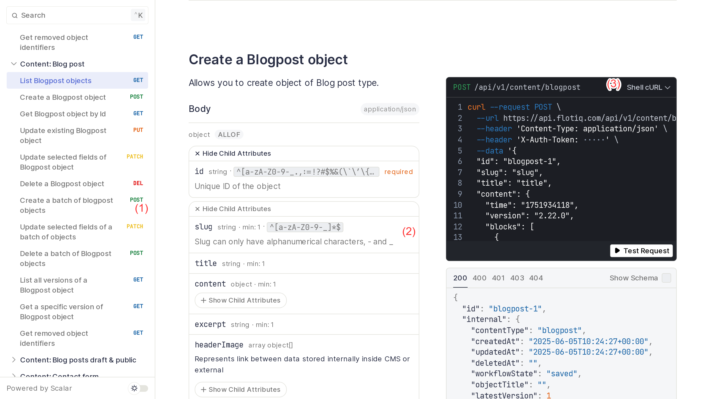

title: Flotiq deep dives | Flotiq docs
description: Flotiq's Dynamic Content API offers a unique way of interacting with your content, the way you design it. The builtin SDKs and APi docs make it extremely easy to use.

# Dynamic Content API

The Dynamic Content API is how Flotiq provides you with access to your content. For every Content Type you define - Flotiq will provide a set of RESTful endpoints that allow you to interact with your content, all based on the Content Type Definition you provided, either through the UI or through the API.

!!! hint
    Remember - to work with the API you will need your API keys, you can find them in your User profile.

  <iframe width="1280" height="720" src="https://www.youtube.com/embed/XHR4pANj4A8" frameborder="0" allowfullscreen></iframe>

    

## API docs

Part of the Content API are the beautiful API docs, along with code samples to simplify your work. You can explore your Content API or share with other teams to jumpstart integration.

There are 3 important parts of the API documentation that Flotiq provides for you:

1. Every time you create a Content Type Definition - your API is extended with endpoints that support this new Content Type.
2. The descriptions of these endpoints contain all the information regarding the structure and constraints of the Content Type you defined.
3. The API docs are enriched with code samples in several popular languages, which make it extremely easy to integrate your content into any external application.

## SDKs

We offer a number of SDKs, that are also automatically generated based on your current API. The SDKs contain models based on your current Content Type Definitions and allow you to rip benefits off your IDE's autocompletion and docblock support.

We currently support the following SDKs:

* PHP
* Python
* Java
* Go
* C#
* Node.js
* Angular

## Postman collection

In a similar fashion - we also provide a downloadable Postman collection, which fully describes your entire Content API. 

Read more on how to configure Postman to work with Flotiq in [API access → Postman](../#postman)
