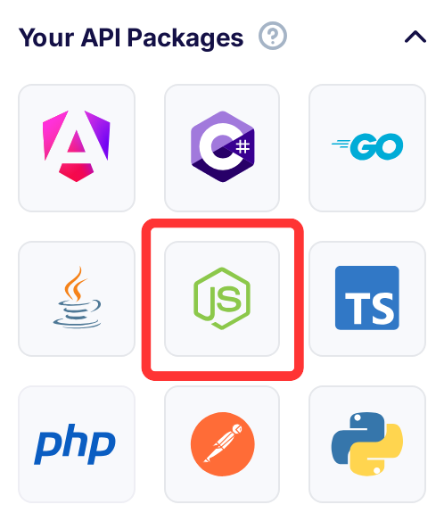

title: Generate Package - SDK NodeJS
description: Flotiq provides SDK NodeJS to access your Content.

# SDK NodeJS

## Download a package

On your Flotiq dashboard, you can find link to download client library SDK NodeJS.



These package is automatically generated every time you modify your Content Type definitions, just like your API documentation.

### 1. Installation

To use SDK in your project follow below steps:

1. Unzip and move this package to `[projectDirectory]/flotiq-javascript-sdk/`
2. In your `[projectDirectory]/flotiq-javascript-sdk/` run `npm i && npm run build`
3. In your `[projectDirectory]` run `npm i ./flotiq-javascript-sdk --save`

_Other installation methods are described in [Additional usage methods](#additional-usage-methods) section._

### 2. Configure your SDK

To initialize SDK we will use `FlotiqUserApi.ApiClient.init` method, which requires to provide the `API_KEY` value.

Your Flotiq API_KEY is located in the [Flotiq Dashboard](https://editor.flotiq.com).
If you need more directions go to the [docs](https://flotiq.com/docs/API/).

```javascript
const FlotiqUserApi = require("flotiq_user_api");
FlotiqUserApi.ApiClient.init("API_KEY");
```
{ data-search-exclude }

### 3. Make requests to the Flotiq

```javascript
let api = new FlotiqUserApi.ContentBlogAuthorApi();
let opts = {
  page: "1", // {Number} Listing page number, 1-based
  limit: "20", // {Number} Page limit
  orderBy: "internal.updatedAt", // {String} Order by field
  orderDirection: "asc", // {String} Order direction
  hydrate: "0", // {Number} Should hydrate relations of object, for now only two levels of hydration are possible
  filters:
    '{"slug":{"type":"contains","filter":"test"},"title":{"type":"contains","filter":"test"}}', // {String} List filters
  ids: '["null"]', // {[String]} Ids of objects to return.
};
api.listFlotiqblogauthor(opts).then(
  function (data) {
    console.log("API called successfully. Returned data: " + data);
  },
  function (error) {
    console.error(error);
  }
);
```
{ data-search-exclude }

### 4. SDK NodeJS common use cases

The Main concept of Flotiq is that your API Specification represents your set of content definitions literally.

Can be use:

- SearchApi: The Flotiq API provides a powerful search engine, which is a wrapper for ElasticSearch queries.
- MediaApi: Endpoint for upload or get media files.
- InternalApi: Returns, delete or create an user-defined Content Definitions
- GraphQlApi: Endpoint for GraphQL Queries for Headless Types
- Content...Api: Endpoints for automatically generated Content Type definitions


## Additional usage methods

### Local development

You can also use this package as local dependency.
To use the library locally without publishing to a remote npm registry or committing to the repository, first install the dependencies
by changing into the directory containing package.json (and this README). Let's call this JAVASCRIPT_CLIENT_DIR. Then run:

```shell
npm install
```
{ data-search-exclude }

Next, link it globally in npm with the following, also from JAVASCRIPT_CLIENT_DIR:

```shell
npm link
```
{ data-search-exclude }

To use the link you just defined in your project, switch to the directory you want to use your flotiq_user_api from, and run:

```shell
npm link /path/to/<JAVASCRIPT_CLIENT_DIR>
```
{ data-search-exclude }

Finally, you need to build the module:

```
npm run build
```
{ data-search-exclude }