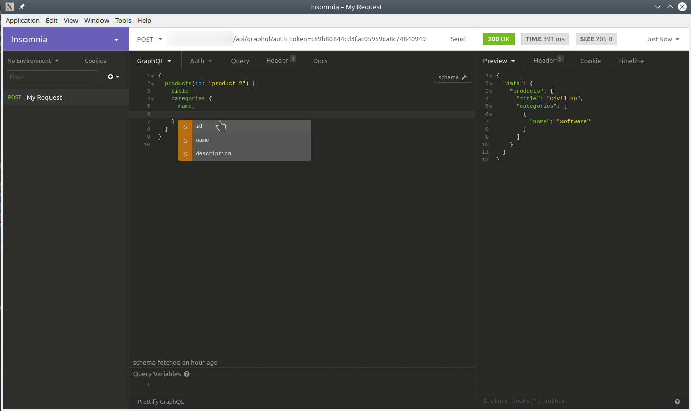

<div class="breadcrumbs">
<a href="/">Docs</a> / <a href="/API/">API</a> / <a href="/API/graph-ql/">GraphQL</a>
</div>

# GraphQL

The Flotiq API supports a GraphQL endpoint, which is currently in `BETA` state.
The system supports GraphQL queries for Content Types. Endpoints used for this are:

 * ```POST /api/graphql``` - query execution
 * ```GET /api/graphql/schema ``` - information about GraphQL types of data
 
For every Content Type there are two types of queries:

 * **For single object**. Required parameter: `id`, e.g. `products(id:"product-2")`
 * **For list of objects**. Possible parameters: `page`, `limit`, `order_by`, `order_direction`, e.g. `productsList(limit:2)`, 

Queries can be done also using API explorer (available from left menu as "API doc").

Example queries (depending on the data pattern, the system queries may vary):

```
curl --request POST \
    --url 'https://api.flotiq.com/api/graphql?auth_token=__YOUR_AUTH_TOKEN__' \
    --header 'content-type: application/json' \
    --data '{"query":"query{productsList(limit:2){id,title,categories{id,name}}}"}'
``` 
  
```
curl --request POST \
    --url 'https://api.flotiq.com/api/graphql?auth_token=__YOUR_AUTH_TOKEN__' \
    --header 'content-type: application/json' \
    --data '{"query":"query{products(id:\"product-2\"){title,categories{name}}}"}'
```
  
### Relation resolving

Objects relations (e.g. product has category) are resolved automatically based on the type of `DataSource`.

For example, when we have a product object: 
```json
{
   "id":"product-1",
   "categories":[
      {
         "dataUrl":"/api/v1/content/categories/",
         "type":"internal"
      }
   ]
}
```


and category: 
```json
{
   "id":"category-1",
   "name":"Software"
}
```

query:
```
curl --request POST \
    --url 'https://api.flotiq.com/api/graphql?auth_token=__YOUR_AUTH_TOKEN__' \
    --header 'content-type: application/json' \
    --data '{"query":"query{productsList(limit:1){id,title,categories{id,name}}}"}'
```

will return:
```json
{
    "data": {
        "productsList": [
            {
                "id": "product-3",
                "title": "Maya",
                "categories": [
                    {
                        "id": "category-3",
                        "name": "Mobile app"
                    }
                ]
            }
        ]
    }
}
```

Example query using [Insomnia REST Client](https://insomnia.rest/):


