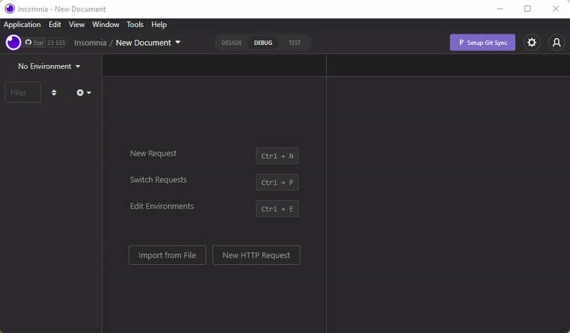

---
tags:
  - Developer
---

# GraphQL

The Flotiq API supports a GraphQL queries. 
It is an alternative way to REST API to get your data. We provide the complete, **always up-to-date** GraphQL description of your data and the endpoint
which understands GraphQL queries for your Content Objects. 

## What is a GraphQL?

GraphQL is a query language for APIs.
It is designed to make API more flexible than REST API - it is all about giving clients precisely the data they request.
The developers can pull various data, in the desired shape, with a single API call.

## Graphql in Flotiq

The system supports GraphQL queries for Content Objects. 
Endpoints that allow you to interact with the system in a GraphqQL way are:

* `GET /api/graphql/schema` - get GraphQL schema,
* `POST /api/graphql` - execute GraphQL query.


### Authentication

To authenticate the GraphQL query, you need to use one of the Application API Keys [available in your
Flotiq Dashboard](/docs/API/). 

As in the whole Flotiq API, you can pass your API Key in the following way:

* `X-AUTH-TOKEN` header
* `auth_token` query parameter

!!! Note
    If you need more information on how to get your API Key and how to use it - go to the [API access & scoped keys](/docs/API/) page.

GraphQL API endpoints are unavailable for the User Defined (scoped) API keys.


### Get GraphQL Schema

To get the full GraphQL schema that describes your data you have to call the GET endpoint.
It describes the shape of your current Content Type Definitions, including attribute types,
required fields and relations.

!!! Request
     ```
     curl -X GET 'https://api.flotiq.com/api/graphql/schema' --header 'X-AUTH-TOKEN: YOUR_API_TOKEN'
     ```
     { data-search-exclude }

!!! Response

    === "200 OK"

        Returned when the request was correctly formatted

        ```
        type Query {
            category(id: String!): category
            categoryList(page: Int, limit: Int, order_by: String, order_direction: String, filter: String): [category]
            product(id: String!): product
            productList(page: Int, limit: Int, order_by: String, order_direction: String, filter: String): [product]
            _media(id: String!): _media
            _mediaList(page: Int, limit: Int, order_by: String, order_direction: String, filter: String): [_media]
        }
        
        """Auto generated Headless CMS type: _media"""
        type _media {
            id: String
            url: String
            size: Float
            type: String
            width: Float
            height: Float
            source: String
            fileName: String
            mimeType: String
            extension: String
            externalId: String
        }
        
        """Auto generated Headless CMS type: category"""
        type category {
            id: String
            name: String
            description: String
        }
        
        """Auto generated Headless CMS type: product"""
        type product {
            id: String
            name: String
            slug: String
            price: Float
            categories: [category]
            description: String
            productImage: [_media]
            productGallery: [_media]
        }
        ```
        { data-search-exclude }

    === "401 Unauthorized"

        Returned when API key was missing or incorrect
  
        ```
        {
            "code": 401,
            "massage": "Unauthorized"
        }
        ```
        { data-search-exclude }

### Execute GraphQL Query

To make a query for your objects, you need to call `POST /api/graphql` GraphQL endpoint.
We can specify two types of queries - responsible for retrieving a single object and listing objects.

#### Query single object

To a get single object, you need to pass the object identifier and fields you want to receive in the response.
Example Query in GraphQL language to get `id` and `title` for the product with id `product-1` looks like:

!!! Note
    By default, this endpoint will return only objects with the status **public** [read more](/docs/API/draft-public/draft-public),
    to modify this behavior use [preview mode](/docs/API/draft-public/draft-public/#preview-mode)

!!! Example

    === "Use id to fetch object"

        The most straight-forward way of querying your Flotiq single object with GraphQL is to use the objects ID:

        !!! GraphQL query

            ```graphql
            query {
                products(id:"product-1") {
                    id
                    title
                }
            }
            ```
            { data-search-exclude }

        To pass this query to the Flotiq, you need to call:

        !!! Request
            ```
            curl -X POST 'https://api.flotiq.com/api/graphql' \
                --header 'X-AUTH-TOKEN: YOUR_API_TOKEN' \
                --header 'Content-Type: application/json' \
                --data-raw '{"query":"{ products(id: \"product-1\") { id title } }"}'
            ```
            { data-search-exclude }

        !!! Response
            === "200 OK"
                ```json
                {
                    "data": {
                        "products": {
                            "id": "product-1",
                            "title": "Green Tea"
                        }
                    }
                }
                ```
                { data-search-exclude }

    === "Use custom field to fetch object"

        You can use your own field from your content type definition to query Flotiq data with GraphQL.
        To do so, your content type definition has to have a text field with [unique property](../panel/content-types.md?h=unique#property-settings).
        This will allow you to query objects of that type using arguments:

        - field: `<your unique text field name>`,
        - value: `<the value you want to query by>`

        !!! GraphQL query

            ```graphql
            query {
                products(field: "title", value: "Green Tea") {
                    id
                    title
                }
            }
            ```
            { data-search-exclude }

        To pass this query to the Flotiq, you need to call:

        !!! Request
            ```
            curl -X POST 'https://api.flotiq.com/api/graphql' \
                --header 'X-AUTH-TOKEN: YOUR_API_TOKEN' \
                --header 'Content-Type: application/json' \
                --data-raw '{"query":"{ products(field: \"title\", value: \"Green Tea\") { id title } }"}'
            ```
            { data-search-exclude }

        !!! Response
            === "200 OK"
                ```json
                {
                    "data": {
                        "products": {
                            "id": "product-1",
                            "title": "Green Tea"
                        }
                    }
                }
                ```
                { data-search-exclude }

#### List objects

While listing objects, you can use the optional parameters
`page`, `limit`, `order_by`, `order_direction`, or `filter`.

| Param name      | Param description                                                                                                                                                   | Defalut value |
|-----------------|---------------------------------------------------------------------------------------------------------------------------------------------------------------------|---------------|
| page            | Number of objects on page                                                                                                                                           | 20            |
| limit           | Number of the requested page                                                                                                                                        | 1             |
| order_by        | What field should list be ordered by                                                                                                                                |               |
| order_direction | Order direction, possible values `asc`, `desc`                                                                                                                      | asc          |
| filter          | Json encoded object containing conditions on which the list of CO should be filtered<br/> Example filter value: {"title":{"type":"equals","filter":"Hello world!"}} |               |

The below example shows how to list all products ordered by title, limited to 2 results:

!!! Example

    !!! GraphQL query
        ```graphql
        query {
            productsList(limit: 2, order_by: "title", order_direction: "asc") {
                id
                title
            }
        }
        ```
        { data-search-exclude }

    To pass this query to the Flotiq, you need to call:

    !!! Request
        ```
        curl -X POST 'https://api.flotiq.com/api/graphql' \
            --header 'X-AUTH-TOKEN: YOUR_API_TOKEN' \
            --header 'Content-Type: application/json' \
            --data-raw '{"query":"query {productsList(limit: 2, order_by: \"title\", order_direction: \"desc\") {id, title}}"}'
        ```
        { data-search-exclude }

    !!! Response

        === "200 OK"
            ```json
            {
            "data": {
                "productsList": [
                {
                    "id": "product-3",
                    "title": "Rooibos"
                },
                {
                    "id": "product-2",
                    "title": "Earl Grey"
                }
                ]
            }
            }
            ```
            { data-search-exclude }

### Relation resolving (hydration)

GraphQLs flexibility also covers object relations (e.g. product has category). 
In Flotiq, the related objects are resolved automatically based on the type of `DataSource`.

For example, when we have a product object:
```json
{
   "id":"product-1",
   "categories":[
      {
         "dataUrl":"/api/v1/content/categories/",
         "type":"internal"
      }
   ]
}
```
{ data-search-exclude }

and category:
```json
{
   "id": "category-1",
   "name": "Tea"
}
```
{ data-search-exclude }

The GraphQL query for listing objects including categories will look like:

!!! Example

    !!! GraphQL query
        ```graphql
        query {
            productsList(limit: 1) {
                id
                title
                categories {
                    id
                    name
                }
            }
        }
        ```
        { data-search-exclude }

    !!! Request
        ```
        curl --request POST \
            --url 'https://api.flotiq.com/api/graphql?auth_token=__YOUR_AUTH_TOKEN__' \
            --header 'content-type: application/json' \
            --data '{"query":"query{productsList(limit:1){id,title,categories{id,name}}}"}'
        ```
        { data-search-exclude }

    !!! Response

        === "200 OK"
            Will return automatically resolved relation:
            ```json
            {
                "data": {
                    "productsList": [
                        {
                            "id": "product-3",
                            "title": "Rooibos",
                            "categories": [
                                {
                                    "id": "category-1",
                                    "name": "Tea"
                                }
                            ]
                        }
                    ]
                }
            }
            ```
            { data-search-exclude }

    As you can see, the related element, `category`, was fetched, including its properties.

## Explore using Insomnia client

GraphQL queries can be complex. To efficiently interact with Flotiq GraphQL API, we suggest you use
apps like Insomnia. It helps to create queries with autocomplete, based on your current schema, 
validate your input and display a preview of the response.

An example query using [Insomnia REST Client](https://insomnia.rest/) with endpoint
`https://api.flotiq.com/api/graphql?auth_token=YOUR_AUTH_TOKEN`:


