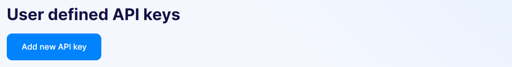
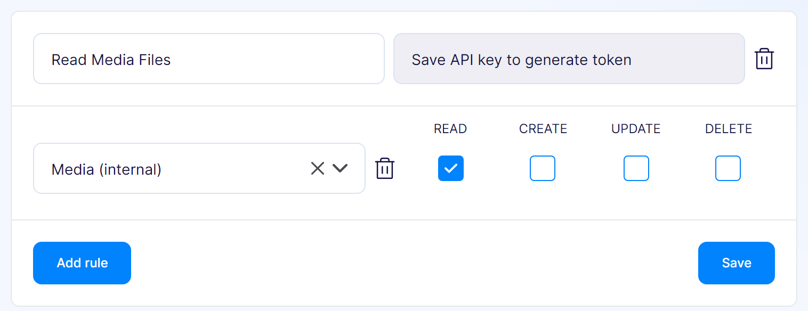
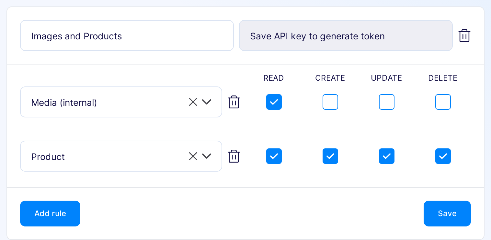
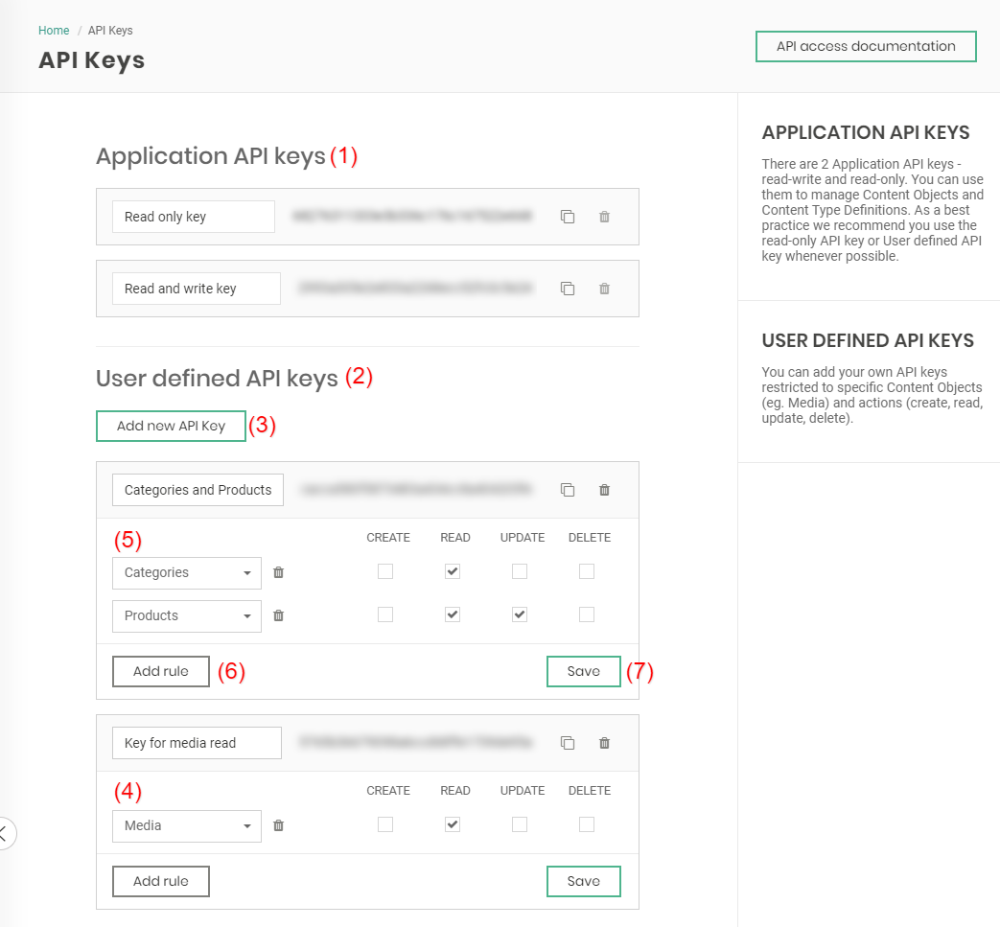

---
tags:
  - Developer
---

# API access

All API endpoints that are published in Flotiq are currently using an API-key authorization method. 

There are two types of API keys - [Application Keys](#application-api-keys) and [User Defined Keys](#user-defined-api-keys). Both types of keys can be retrieved from the API Keys page in the Flotiq Panel:

{: .center .width25 .border}

All keys restrict access to not only CRUD of the Content Objects, but also to their hydration and search; the same restrictions apply to GraphQL endpoint.

!!! note 
    _**Keys CAN NOT be obtained through programmatic API, and they are accessible only from the Flotiq Panel.**_

## Application API Keys

Every Flotiq account has 2 Application API keys - read-write and read-only. Application keys are system-wide keys, and you can use them to manage all of your Content Objects and Content Type Definitions. Please note, that for most applications you should create User Defined API keys - scoped to a particular set of Content Types and permissions.

{: .center .width75 .border}

All keys can be copied using {: style="margin-bottom: -7px; height:1.5em"} button. 
You can open QR code with the key using {: style="margin-bottom: -7px; height:1.5em"} button, 
you can regenerate keys using {: style="margin-bottom: -7px; height:1.5em"} button, and
you can generate API docs for key using {: style="margin-bottom: -7px; height:1.5em"} button. 
Only user defined keys can be removed using {: style="margin-bottom: -7px; height:1.5em"} button.

!!! hint
    You can use the QR code of your API keys to authorize your Flotiq Mobile Expo installation to access your data. Head over to the [Flotiq Mobile Expo repository](https://github.com/flotiq/flotiq-mobile-demo) to learn more.

## User Defined API Keys :fontawesome-solid-triangle-exclamation:{ .pricing-info title="Limits apply" }[^1]

{: .center .width75 .border}

You can add your own API keys restricted to specific Content Objects (e.g. Media) and actions (create, read, update, delete). 

{: .center .width75 .border}

You can also mix and match access to any Content Objects from your account, to add new access rule for CO, click "Add Rule" button. When the key is complete, don't forget to save it using the "Save" button. 

{: .center .width75 .border}

Every key has to be saved separately.

To restrict access for already used keys you can remove all rules or remove the key. You can regenerate keys if you suspect somebody unauthorized had access to them.

And here you can see how it looks all in the User Interface:

{: .center .width75 .border}

## Usage

You can authenticate your requests by `X-AUTH-TOKEN` header, or by the query part of the request url: `?auth_token=YOUR_API_TOKEN`.

An example query request with endpoint:

!!! Example
    <pre class="h-3em">
    <code class="hljs plaintext">https://api.flotiq.com/api/v1/content/your_content_name?auth_token=YOUR_AUTH_TOKEN
    </code>
    </pre>

Or an example queries with `X-AUTH-TOKEN` header:

!!! Example

    === "CURL"

        ``` 
        curl --location --request GET "https://api.flotiq.com/api/v1/internal/contenttype/blogposts" \
        --header 'accept: */*' \
        --header 'X-AUTH-TOKEN: YOUR_API_KEY'
        ```
        { data-search-exclude }

    === "C# + Restasharp"

        ```
        var client = new RestClient("https://api.flotiq.com/api/v1/internal/contenttype/blogposts");
        var request = new RestRequest(Method.GET);
        request.AddHeader("X-AUTH-TOKEN", "YOUR_API_KEY");
        IRestResponse response = client.Execute(request);
        ```
        { data-search-exclude }
    
    === "Go + Native"

        ```
        package main

        import (
            "fmt"
            "net/http"
            "io/ioutil"
        )
        
        func main() {
        
            url := "https://api.flotiq.com/api/v1/internal/contenttype/blogposts"
        
            req, _ := http.NewRequest("GET", url, nil)

            req.Header.Add("X-AUTH-TOKEN", "YOUR_API_KEY")
        
            res, _ := http.DefaultClient.Do(req)
        
            defer res.Body.Close()
            body, _ := ioutil.ReadAll(res.Body)
        
            fmt.Println(res)
            fmt.Println(string(body))
        
        }
        ```
        { data-search-exclude }
    
    === "Java + Okhttp"
        
        ```
        OkHttpClient client = new OkHttpClient();

        Request request = new Request.Builder()
            .url("https://api.flotiq.com/api/v1/internal/contenttype/blogposts")
            .get()
            .addHeader("X-AUTH-TOKEN", "YOUR_API_KEY")
            .build();
        
        Response response = client.newCall(request).execute();
        ```
        { data-search-exclude }

    === "Java + Unirest"
      
        ```
        HttpResponse<String> response = Unirest.get("https://api.flotiq.com/api/v1/internal/contenttype/blogposts")
            .header("X-AUTH-TOKEN", "YOUR_API_KEY")
            .asString();
        ```
        { data-search-exclude }

    === "Node + Request"
      
        ```
        const request = require('request');

        const options = {
            method: 'DELETE',
            url: 'https://api.flotiq.com/api/v1/internal/contenttype/blogposts',
            headers: {'X-AUTH-TOKEN': 'YOUR_API_KEY'},
        };
        
        request(options, function (error, response, body) {
            if (error) throw new Error(error);
            
            console.log(body);
        });
        ```
        { data-search-exclude }

    === "PHP + CURL"
    
        ```
        <?php

        $curl = curl_init();
        
        curl_setopt_array($curl, [
            CURLOPT_URL => "https://api.flotiq.com/api/v1/internal/contenttype/blogposts",
            CURLOPT_RETURNTRANSFER => true,
            CURLOPT_ENCODING => "",
            CURLOPT_MAXREDIRS => 10,
            CURLOPT_TIMEOUT => 30,
            CURLOPT_HTTP_VERSION => CURL_HTTP_VERSION_1_1,
            CURLOPT_CUSTOMREQUEST => "DELETE",
            CURLOPT_HTTPHEADER => [
                    "X-AUTH-TOKEN: YOUR_API_KEY",
                ],
        ]);
        
        $response = curl_exec($curl);
        $err = curl_error($curl);
        
        curl_close($curl);
        
        if ($err) {
            echo "cURL Error #:" . $err;
        } else {
            echo $response;
        }
        ```
        { data-search-exclude }

## Validating API key

You can check if your API key is valid by sending a request to `/api/auth-context`.

!!! Example

    === "CURL"

        ``` 
        curl --location --request GET "https://api.flotiq.com/api/auth-context" \
        --header 'accept: */*' \
        --header 'X-AUTH-TOKEN: YOUR_API_KEY'
        ```
        { data-search-exclude }

    === "C# + Restasharp"

        ```
        var client = new RestClient("https://api.flotiq.com/api/auth-context");
        var request = new RestRequest(Method.GET);
        request.AddHeader("X-AUTH-TOKEN", "YOUR_API_KEY");
        IRestResponse response = client.Execute(request);
        ```
        { data-search-exclude }
    
    === "Go + Native"

        ```
        package main

        import (
            "fmt"
            "net/http"
            "io/ioutil"
        )
        
        func main() {
        
            url := "https://api.flotiq.com/api/auth-context"
        
            req, _ := http.NewRequest("GET", url, nil)

            req.Header.Add("X-AUTH-TOKEN", "YOUR_API_KEY")
        
            res, _ := http.DefaultClient.Do(req)
        
            defer res.Body.Close()
            body, _ := ioutil.ReadAll(res.Body)
        
            fmt.Println(res)
            fmt.Println(string(body))
        
        }
        ```
        { data-search-exclude }
    
    === "Java + Okhttp"
        
        ```
        OkHttpClient client = new OkHttpClient();

        Request request = new Request.Builder()
            .url("https://api.flotiq.com/api/auth-context")
            .get()
            .addHeader("X-AUTH-TOKEN", "YOUR_API_KEY")
            .build();
        
        Response response = client.newCall(request).execute();
        ```
        { data-search-exclude }

    === "Java + Unirest"
      
        ```
        HttpResponse<String> response = Unirest.get("https://api.flotiq.com/api/auth-context")
            .header("X-AUTH-TOKEN", "YOUR_API_KEY")
            .asString();
        ```
        { data-search-exclude }

    === "Node + Request"
      
        ```
        const request = require('request');

        const options = {
            method: 'DELETE',
            url: 'https://api.flotiq.com/api/auth-context',
            headers: {'X-AUTH-TOKEN': 'YOUR_API_KEY'},
        };
        
        request(options, function (error, response, body) {
            if (error) throw new Error(error);
            
            console.log(body);
        });
        ```
        { data-search-exclude }

    === "PHP + CURL"
    
        ```
        <?php

        $curl = curl_init();
        
        curl_setopt_array($curl, [
            CURLOPT_URL => "https://api.flotiq.com/api/auth-context",
            CURLOPT_RETURNTRANSFER => true,
            CURLOPT_ENCODING => "",
            CURLOPT_MAXREDIRS => 10,
            CURLOPT_TIMEOUT => 30,
            CURLOPT_HTTP_VERSION => CURL_HTTP_VERSION_1_1,
            CURLOPT_CUSTOMREQUEST => "DELETE",
            CURLOPT_HTTPHEADER => [
                    "X-AUTH-TOKEN: YOUR_API_KEY",
                ],
        ]);
        
        $response = curl_exec($curl);
        $err = curl_error($curl);
        
        curl_close($curl);
        
        if ($err) {
            echo "cURL Error #:" . $err;
        } else {
            echo $response;
        }
        ```
        { data-search-exclude }


## Frequently Asked Questions

### What can I do if my API key got compromised?

If you accidentally committed your `.env` file to a public repository or in any other way shared your key publicly - you can regenerate the key using the {: style="margin-bottom: -7px; height:1.5em"} button.

### How can I provide read-only access to a single kind of data?

You can use the User Define API keys and create a key that has a limited scope and permissions. For example - you can easily create a new key that only provides access to `Product` data and set it to be read-only.

### Are the API request limits[^2] calculated on a per-key or per-account basis?

API request limits are assigned to your account, so all your keys' usage will add to the consumption of the API request quotas.

### Why my API call limit did not reset at the end of the month?

The API call limit is based on a 30-day rolling window, not a fixed calendar month. This means your usage is tracked over the past 30 days from the current date. For example, if you made 100 API calls today, those 100 calls will count towards your limit for the next 30 days. On the 31st day, the calls you made today will drop off and no longer count against your limit.

#### How it Works

Imagine a window that's exactly 30 days wide. Every day, this window slides forward, dropping the oldest day's usage and adding the newest day's usage. The system continuously calculates your total calls within this 30-day period.

* **Fixed Monthly**: A fixed monthly limit would reset to zero on the first day of each month (e.g., January 1st, February 1st). This can lead to a "use it or lose it" rush at the end of the month and then a sudden drop in usage.
* **Rolling Window**: A rolling window ensures a more consistent and fair usage policy. It prevents you from being penalized for high usage at the end of a month or having your quota completely reset, which could cause a service disruption. It allows for more flexible and predictable scaling of your application's usage over time.

#### Key Benefits for You

* **Flexibility**: You're not restricted by the calendar. If you have a period of high demand in the middle of a month, you can use your quota as needed without waiting for a new month to start.
* **Predictability**: It provides a steady, continuous look at your usage, making it easier for you to manage and anticipate your needs. You can always see exactly how many calls you've made in the last 30 days.
* **Fairness**: This model ensures that the limit is applied consistently, regardless of when you began your subscription. Everyone's limit is managed in the same way, based on their individual usage history.

[Register to send all requests with your own API today](https://editor.flotiq.com/register?plan=1ef44daa-fdc3-6790-960e-cb20a0848bfa){: .flotiq-button}


[^1]: Number of available User API keys depends on the chosen subscription plan. [Check pricing and limits](https://flotiq.com/pricing){:target="_blank"}
[^2]: Number of available API calls depends on the chosen subscription plan. [Check pricing and limits](https://flotiq.com/pricing){:target="_blank"}
