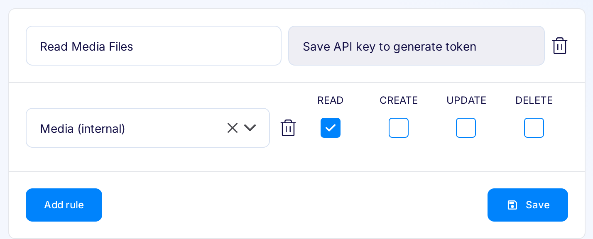

# API access

## API Key
There are two types of API keys - [Application Keys](#application-api-keys) and [User Defined Keys](#user-defined-api-keys). Both types of keys can be retrieved from the API Keys page in the Flotiq Panel (click on your avatar to open menu):

{: style="height:150px;"}

All keys restrict access to not only CRUD of the Content Objects, but also to their hydration and search; the same restrictions apply to GraphQL endpoint.

_**Keys CAN NOT be obtained through programmatic API, and they are accessible only from the Flotiq Panel.**_

### Application API Keys

There are 2 Application API keys - read-write and read-only (1). Application keys are system-wide keys, and you can use them to manage Content Objects and Content Type Definitions. Although as a best practice, we recommend you use the Application read-only API key or User Defined API key whenever possible.

### User Defined API Keys

You can add (3) your own API keys (2) restricted to specific Content Objects (e.g. Media) and actions (create, read, update, delete) (4). 

You can also mix and match access to any Content Objects from your account (5), to add new access rule for CO, click "Add Rule" button (6). When the key is complete, don't forget to save it using the "Save" button (7). 

Every key has to be saved separately.

To restrict access for already used keys you can remove all rules or remove the key. There isn't a way to regenerate Application Keys for now, so you should protect access to them.

And here you can see how it looks all in the User Interface:

