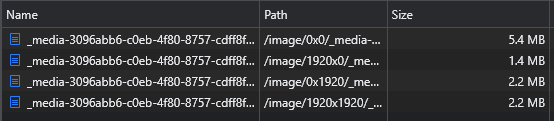

title: Flotiq Media Library | Flotiq docs
description: Learn more about the powerful Media Library that Flotiq offers.

#Media library

You can interact with the media library via Flotiq Dashboard or REST API. In this section, we show you how to use our REST API to store and retrieve files.

##File upload :fontawesome-solid-triangle-exclamation:{ .pricing-info title="Limits apply" }[^1]

To upload a file to the Flotiq, you need to send `POST` multipart request to `/api/media` endpoint with required request parameters.

### Request parameters

| Parameter | Description                                         |
| --------- | --------------------------------------------------- |
| file      | binary data of a file                               |
| type      | `image` for image types, `file` for everything else |

Below example shows how to do simple file upload in nodeJS application:

!!! example "Example nodeJs image upload"
    ```
    const fs = require(`fs`)
    const FormData = require(`form-data`)
    ...
    const form = new FormData();
    form.append(`file`, fs.createReadStream(file), file);
    form.append(`type`, `image`);
    let json = await fetch(`https://api.flotiq.com/api/media`, {
        method: `POST`,
        body: form,
        headers: headers,
    }).then(res => res.json());
    console.log(json); //logs example object return shown below
    ```

### Response parameters

The response will be a Content Object of type `_media`. 

!!! example "Example response"
    ```
    {
        "id": "_media-456456",
        "extension": "jpg",
        "fileName": "example_image.jpg",
        "mimeType": "image/jpeg",
        "size": 45896,
        "type": "image",
        "source": "disk",
        "externalId": "",
        "url": "/image/0x0/_media-456456.jpg",
        "height": 300,
        "width": 150
    }
    ```
    
Now you can see uploaded images in the media library. Your files are accessible also via REST API like other Content Objects. 
To get list of images with metadata use `GET /api/v1/content/_media` endpoint.

Fetching original or resized files directly is described in the next sections.


## Media Content Object

As we see in the response uploaded media has its own representation as Content Object. You can use all the content 
api methods to get, list, remove Content objects. Be aware, that changing the `_media` metadata can lead to unexpected behaviour.

Below we listed all parameters describing the `Media` object.

| Parameter  | Description |
| ---------- | ----------- |
| id         | The id is given by the backend by which the file on the disk is named. The `id` property is unique, final and immutable and is used to create the URI of the uploaded object. |
| extension  | File extension without dot |
| fileName   | Full name of uploaded file |
| mimeType   | Mime type of uploaded file |
| size       | Size of file in bytes |
| type       | Type of the file, it can be 'image' or 'file' |
| source     | Source of the file, it can be 'disk' or 'unsplash' |
| externalId | Id of the photo on unsplash if it was downloaded from there
| url        | Url to original image without API host (e.g. /image/0x0/_media-456456.jpg) |
| height     | Height, or 0 for 'file' type |
| width      | Width, or 0 for 'file' type |

### Media Content Type Definition

All the Media Content Object parameters are described also in the `Media` Content Type Definition.

??? "Structure of the `_media` Content Type Definition:"
    ```json
    {
        "name": "_media",
        "label": "Media",
        "schemaDefinition": {
            "type": "object",
            "allOf": [
                {
                    "$ref": "#/components/schemas/AbstractContentTypeSchemaDefinition"
                },
                {
                    "type": "object",
                    "properties": {
                        "fileName": {
                            "type": "string"
                        },
                        "mimeType": {
                            "type": "string"
                        },
                        "size": {
                            "type": "number"
                        },
                        "width": {
                            "type": "number"
                        },
                        "height": {
                            "type": "number"
                        },
                        "url": {
                            "type": "string"
                        },
                        "externalId": {
                            "type": "string"
                        },
                        "source": {
                            "type": "string"
                        },
                        "extension": {
                            "type": "string"
                        },
                        "type": {
                            "type": "string"
                        }
                    }
                }   
            ],
            "required": [
                "fileName",
                "mimeType",
                "size",
                "url",
                "source",
                "extension",
                "type"
            ],
            "additionalProperties": false
        },
        "metaDefinition": {
            "order": [
                "fileName",
                "mimeType",
                "size",
                "width",
                "height",
                "url",
                "externalId",
                "source",
                "extension",
                "type"
            ],
            "propertiesConfig": {
                "fileName": {
                    "label": "File name",
                    "inputType": "text",
                    "unique": false,
                    "idTitlePart": true
                },
                "mimeType": {
                    "label": "MIME type",
                    "inputType": "text",
                    "unique": false
                },
                "size": {
                    "label": "Size",
                    "inputType": "number",
                    "unique": false
                },
                "width": {
                    "label": "Width",
                    "inputType": "number",
                    "unique": false
                },
                "height": {
                    "label": "Height",
                    "inputType": "number",
                    "unique": false
                },
                "url": {
                    "label": "Url",
                    "inputType": "text",
                    "unique": false
                },
                "externalId": {
                    "label": "External id",
                    "inputType": "text",
                    "unique": false
                },
                "source": {
                    "label": "Source",
                    "inputType": "select",
                    "unique": false,
                    "options": ["disk","unsplash"]
                },
                "extension": {
                    "label": "Extension",
                    "inputType": "text",
                    "unique": false
                },
                "type": {
                    "label": "Type",
                    "inputType": "select",
                    "unique": false,
                    "options": ["file","image"]
                }
            }
        }
    }
    ```


##Getting files

To fetch resized image use the `/image/{width}x{height}/{id}.{extension}` endpoint where
`width` and `height` are the dimensions of the scaled photo.
Is it possible to use the file name in URL `/image/{width}x{height}/{id}/{fileName}.{extension}`,
`fileName` is any name; it does not check whether a file with that name exists.
Using filenames improves SEO.

To download the original photo, or download a non-photo file as width and height, 
enter `0`, e.g. `/image/0x0/_media-54723892824.doc`.

!!! example 
    `image/1920x0/_media-5472384.jpg` will choose a photo with a width of 1920px and a proportional height of id `_media-5472384`, the file will be JPG. The extension must match the original extension of the uploaded file.

##Resizing images

You can choose different sizes and depend of them, you get other results.

Set the appropriate values `width` and `height` in the media url `https://api.flotiq.com/image/[width]x[height]/_media-123.jpg`, for example:

* `0x0` This way let you download original pictures size and won't make any differents.
* `1920x0` This will force width defined by you and height will be scaled to a proportionate size.
* `0x1920` This way let you to force height defined by you and width will be scaled to a proportionate size.
* `1920x1920` This will force images size to choosen by you. When the image is taller or wider, it will crop it. Worth to know is that this endpoint won't upscale images.

As we can see below weight follows sizes, the smaller the size, the less weight. It's important to choose suitable size for your picture, without making it pixelated but having appropriate weight.

{: .center .border}

Flotiq automatically scale images and save them for future, faster use, if the size requested by the user does not yet exist.  

!!! note
    See also: [Manage assets using the Media Library in Dashboard](/docs/panel/media-library/)


[Register to start storing your files](https://editor.flotiq.com/register.html){: .flotiq-button}

[^1]: Number of available Content Objects and available disk space depends on the chosen subscription plan. Check pricing and limits [here](https://flotiq.com/pricing){:target="_blank"}
