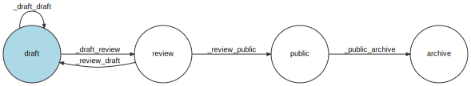

---
tags:
  - Developer
---

title: Flotiq workflows - content publishing | Flotiq documentation
description: Flotiq support for custom workflows helps teams collaborate and produce quality content.

# Flotiq workflows

!!! note
    Flotiq workflows can be customized only in the << plan_names.paid_3 >> plan.
    Reach out to us to discuss possible implementation.

Workflows are a powerful feature that helps teams collaborate and produce quality content.
Flotiq implements workflows for all content types defined in the system, however the default 
workflow supports only a single state - `saved`. Every content object in the system carries a `workflowState` field under the `internal` section, see last line of the snippet below:

```json
{
    "id": "snipcart-584874",
    "name": "Gunpowder Temple Of Heaven",
    "image": [
        {
            "type": "internal",
            "dataUrl": "/api/v1/content/_media/_media-5e17192889e87"
        }
    ],
    "price": 22,
    "internal": {
        "createdAt": "2020-01-08T13:29:28+00:00",
        "deletedAt": "",
        "updatedAt": "2020-01-09T12:30:38+00:00",
        "contentType": "snipcart",
        "workflowState": "saved"
    }
}
```
{ data-search-exclude }

## Custom workflows

Custom workflows can be defined in Flotiq, for example a simple editorial workflow that introduces the following states:

- draft
- review
- public
- archive

with the following possible transitions

{: .center}

can be used to help teams curate content, manage publication and archiving of content.

!!! hint
    Transitions are named using the following rule: `_fromState_toState`


### Changing the workflow of a Content Type Definition

Workflows are defined at the Content Type Definition level, in order to change the workflow of a Content Type Definition from the default one - execute a `PUT` update on the `/api/v1/internal/contenttype/:label` endpoint and provide the additional attribute pointing to the workflow identifier:

```json
{
    "id": "d954df66-3623-11a4-ba9a-ca80993425cb",
    "name": "post",
    "label": "Blog posts",
    "internal": false,
    "workflowId":"publishing",

 //   ...

}
```
{ data-search-exclude }

To see which workflows have been implemented in Flotiq, you need to query the `GET` `/api/v1/workflow` endpoint.

### Transitioning objects in the workflow

Every content object created in the system will automatically be assigned the first state of the workflow, in the example above - `draft`. In order to transition the object to a different state use a simple `PUT` request to `/api/v1/workflow/:content_type/:object_id` endpoint with the following body:

```json
{
    "action":"_draft_review"
}
```
{ data-search-exclude }

### Verifying possible transitions of an object

If you'd like to verify what are the possible transitions of an object, given its current state - you can issue a `GET` request to `/api/v1/workflow/:content_type/:object_id`, the response will contain the current state of the object as well as possible transitions from that state:

```json
{
    "state": "public",
    "enabled_transitions": [
        {
            "name": "_public_archive",
            "froms": [
                "public"
            ],
            "tos": [
                "archive"
            ]
        }
    ]
}
```
{ data-search-exclude }

### Internal fields workflowPublishedAt and workflowPublicVersion

Every content object has `workflowPublishedAt` and `workflowPublicVersion` fields under the `internal` section. These fields contain information (such as `updatedAt` and `latestVersion`) about the last content object version in the public state.

!!! note
    If there are no content object versions in the `public` state, the `workflowPublishedAt` field will be set to `-1`, and the `workflowPublicVersion` field will be set to an empty string (`""`).

!!! note
    If the object itself is the latest `public` version, its `workflowPublishedAt` and `workflowPublicVersion` fields will point to the current object version's `updatedAt` and `latestVersion` fields. See the example below.

```json
{
    "id": "snipcart-584874",
    "name": "Gunpowder Temple Of Heaven",
    "image": [
        {
            "type": "internal",
            "dataUrl": "/api/v1/content/_media/_media-5e17192889e87"
        }
    ],
    "price": 22,
    "internal": {
        "createdAt": "2020-01-08T13:29:28+00:00",
        "deletedAt": "",
        "updatedAt": "2020-01-09T12:30:38+00:00",
        "contentType": "snipcart",
        "workflowState": "public",
        "latestVersion": 2,
        "workflowPublicVersion" : 2, 
        "workflowPublishedAt" : "2020-01-09T12:30:38+00:00",
    }
}
```
{ data-search-exclude }

!!! note
    When a content object is unpublished, all `workflowPublishedAt` and `workflowPublicVersion` fields pointing to this version will be set to `-1` and an empty string (`""`).

### Published content

The `public` state is a special state name, which teams can use in their workflows for an easy way to query for approved content. All Flotiq endpoints support a `x-visibility` header, which - if set to `public` - will force the endpoints to limit their work to content that is in the `public` state.
