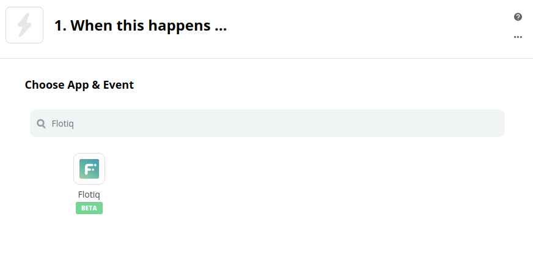
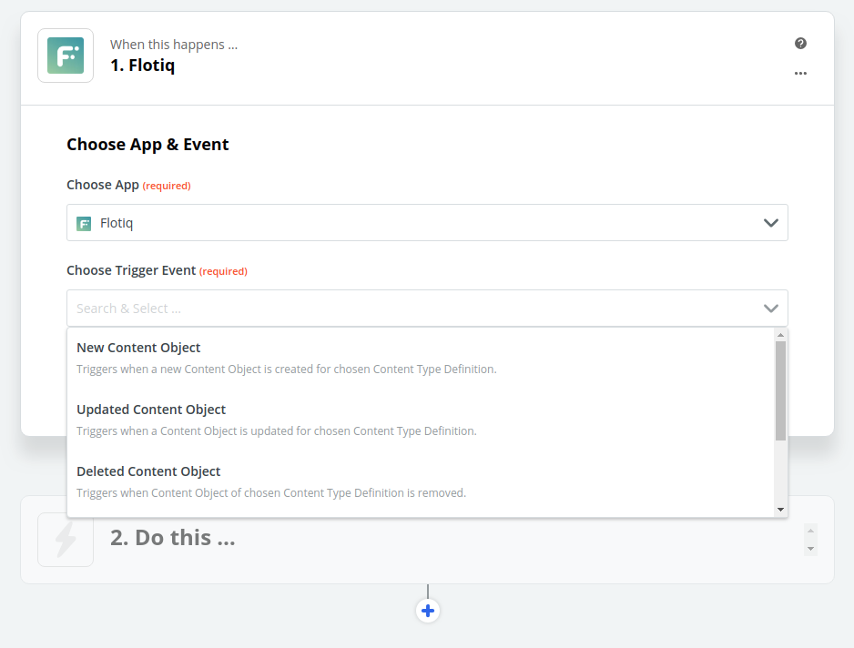
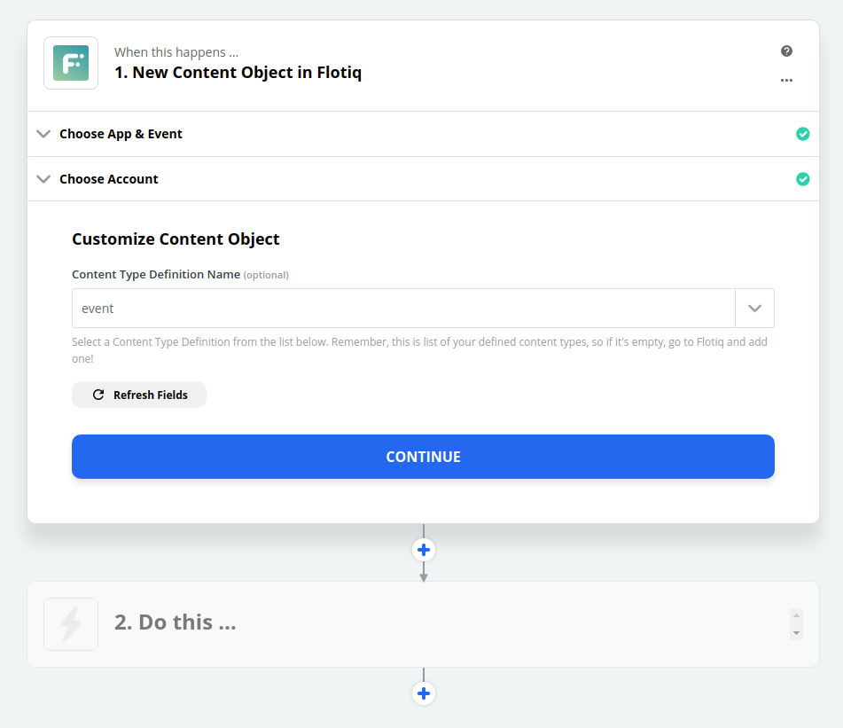
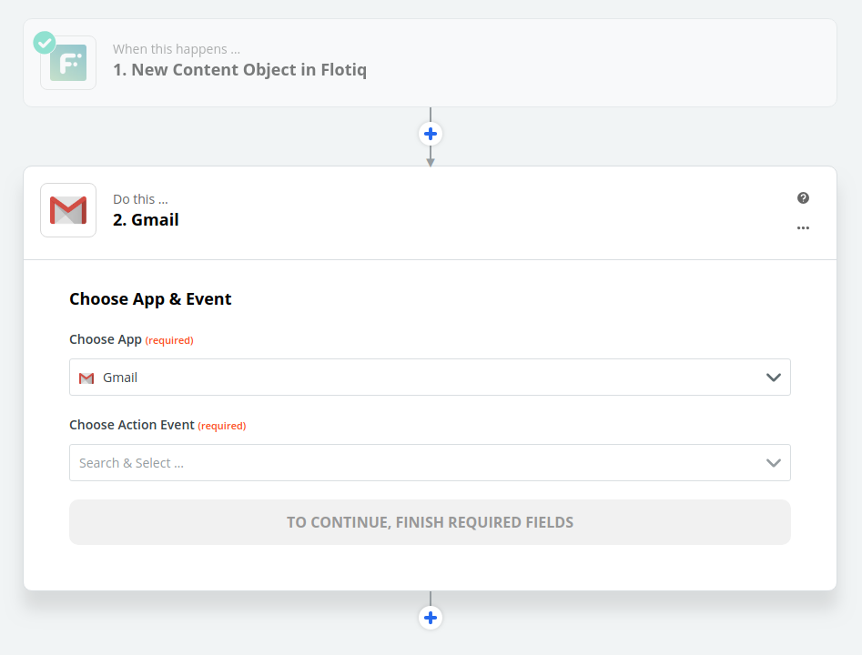

title: Flotiq Zapier integration | Flotiq docs
description: Flotiq allows you to integrate your content with any system easily.

# Zapier integrations (version 1.2.0)

Thanks to Zapier, it has become straightforward to build complex pipelines that integrate multiple sources of content. Flotiq's goal is to help you make the best use of your content, so we provide [Zapier integrations](https://zapier.com/apps/flotiq/integrations) 
for the following events:

* Content Object Created (instant, poll)
* Content Object Updated (instant, poll)
* Content Object Removed (instant)

Instant and poll define a reaction time of Zap. For free account on Zapier, when you create a poll Zap, it will run it every ~15 minutes.

We also provide an action:

* Create New Content Object

So you can push data into Flotiq directly. For this, you have to log in using your API_KEY (not ReadOnly).

This way you will be able to perform complex actions, triggered by your content,
without writing a single line of code.

## How to use Flotiq and Zapier

1. In your Zapier account hit "Create Zap".
2. In the form field "Choose App" type Flotiq, to be able to select Flotiq events as the trigger for the pipeline

3. Select which event you'd like to trigger on - we'll choose New Content Object event trigger for now.

4. Select your Flotiq account from the list. If you haven't provided one yet, click "Add a New Account" and authorize by your ReadOnly API Key.

5. Choose which Content Type you'd like to watch. Remember you have to create at least one Content Type Definition in Flotiq Editor.

6. Click "Test and Review". This will get a sample object data of your chosen Content Type Definition. Select one and hit "Done Editing". You can check the chosen object before approving to make sure everything is in place.

7. Next step is to choose target integration. We will use Gmail for that.

8. For the tutorial purpose, we will follow with sending a new mail, so in "Choose Action Event" field we selected "Send Email" from the event dropdown list.

9. Choose a Gmail account from the list or add one if you haven't authorized it yet.

10. Zapier lets you choose the fields of the content type you defined, with default values from the sample data chosen in the first step. Choose which fields you'd like to be included in the email. Fill the required fields and click "Continue".

11. You can click "Test & Review" to send a test mail to the given recipient (field "To:"), but it's not necessary. If you don't want to send test mail click "Skip Test".

12. That's it! Hit Continue, turn on your new Zap and watch your content flow through Zapier! Sometimes you won't see the screen as below. Then click on a slider in the bottom or upper-right corner to turn on the Zap.

