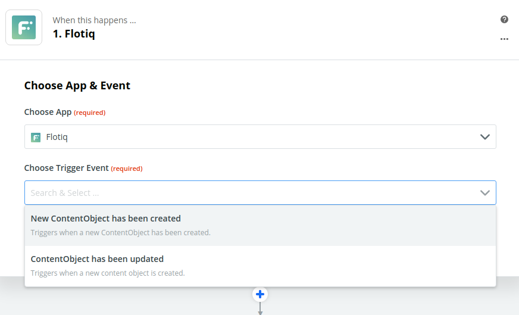
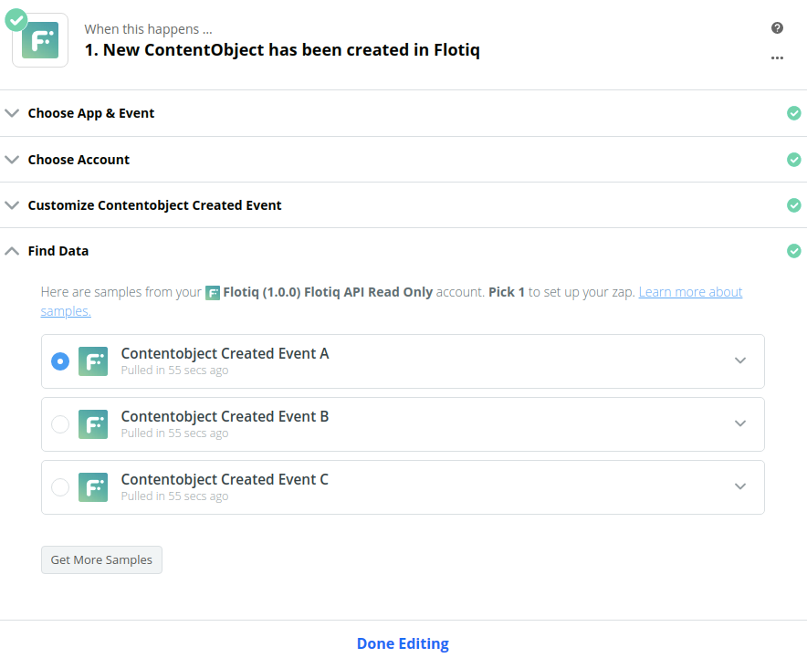
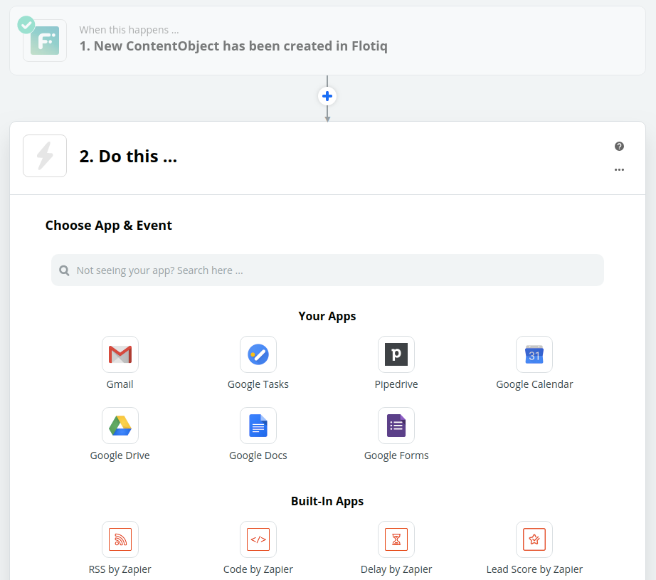
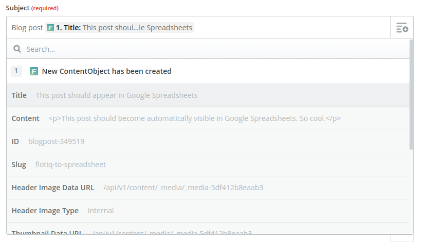

title: Flotiq Zapier integration | Flotiq docs
description: Flotiq allows you to easily integrate your content with any system.

# Zapier integrations

Thanks to Zapier it's become extremely easy to build complex pipelines that 
integrate multiple sources of content together. Flotiq's goal is to help you 
make the best use of your content, so we provide [Zapier integrations](https://zapier.com/apps/flotiq/integrations) 
for the following events:

* Content Object Created
* Content Object Updated.

This way you will be able to perform complex actions, triggered by your content,
without writing a single line of code.

## How to use Flotiq and Zapier

1. In your Zapier account hit "Create Zap".
2. In the form type Flotiq, to select Flotiq events as the trigger for the pipeline

3. Select which event you'd like to trigger on - we'll choose Content Object Created for now.

4. Authorize Zapier to access your Flotiq account - provide your ReadOnly API key.

5. Choose which Content Type you'd like to watch

6. Load data samples and hit "Done editing"!

7. Choose the target integration, we'll pick Gmail for this tutorial

8. Select the action event, we chose Send email

9. Zapier let's you choose the fields of the content type you defined, choose which fields you'd like to be included in the email

10. That's it! Hit Continue, turn on your new Zap and watch your content flow through Zapier!
