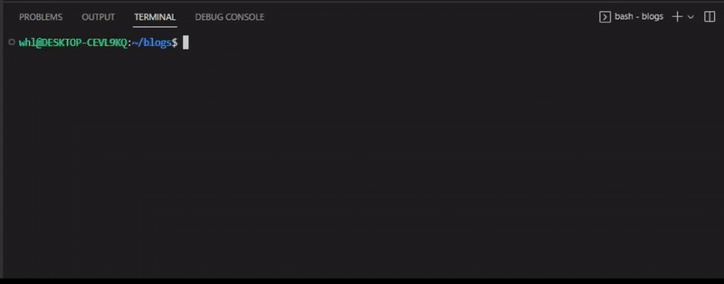

---
tags:
  - Developer
---

title: Flotiq CLI Overview | Flotiq docs
description: Overview of Flotiq CLI tool

# Flotiq CLI

## Overview

We've prepared Flotiq CLI (command-line interface) to help launch and manage Flotiq projects more efficiently using Flotiq's blazing-fast API.

It allows for many actions for your Flotiq account management, like automatically starting one of our Gatsby or Next.js starters, importing data from a third-party service or programs like Excel or WordPress and much more.

## Installation

!!! Warning
       You need [node](https://nodejs.org/en/download/) version 9 or higher to install and use Flotiq CLI.

To install Flotiq CLI globally use the following command in the terminal of your choosing:

```bash
npm install -g flotiq-cli
```
{ data-search-exclude }

## Usage

{: .center .border}

Flotiq CLI currently supports the following commands:

* `flotiq start` quickly launches one of our Next.js or Gatsby starters. This is a starter-based approach. For new Next.js projects, prefer `flotiq-nextjs-setup`. Check support and compatibility notes on the starter pages: [Gatsby](./starting-new-project-gatsby.md#support-and-compatibility) and [Next.js](./starting-new-project-nextjs.md#support-and-compatibility).

* `flotiq import` imports data from a local JSON export directory produced by `flotiq export`, and it can also be used to seed starter projects from their `.flotiq` directory. (more on `flotiq import` for [Gatsby](./starting-new-project-gatsby.md#import-example-data) and [Next.js](./starting-new-project-nextjs.md#import-example-data))

* `flotiq export` exports data from the Flotiq account to local JSON files. If the key is limited to selected Content Types, then the data available for this key will be exported.

* `flotiq sdk install` installs Flotiq SDK in the selected language. You can choose from the following languages: `csharp`, `go`, `java`, `javascript`, `php`, `python`, and `typescript`.

* `flotiq wordpress-import` sets up your Flotiq account to include required Content Type Definitions and pull tags, categories, media, posts and pages from the provided WordPress URL into your Flotiq account. (more on `flotiq wordpress-import` [here](./wordpress-importer.md))

* `flotiq contentful-import` imports content types, assets and content objects from Contentful space to your Flotiq account. (more on `flotiq contentful-import` [here](./contentful-importer.md))

* `flotiq excel-export` exports Content Objects from the given Content Type to an MS Excel file in .xlsx format. (more on Flotiq's commands for MS Excel [here](./excel-data-migration.md))

* `flotiq excel-import` imports Content Objects from an MS Excel file to the given Content Type. (more on Flotiq's commands for MS Excel [here](./excel-data-migration.md))

* `flotiq purge` purges your account of all Content Objects data (if you want to purge data from your account after testing different imports). (more on `flotiq purge` [here](./purge.md))

* `flotiq stats` displays your Flotiq API Key statistics, i.e. number of Content Types, Content Objects and other types of data of your Flotiq API key.

For more information on each CLI command explore further the CLI section in this documentation or visit our [Flotiq CLI](https://github.com/flotiq/flotiq-cli) site on GitHub.
