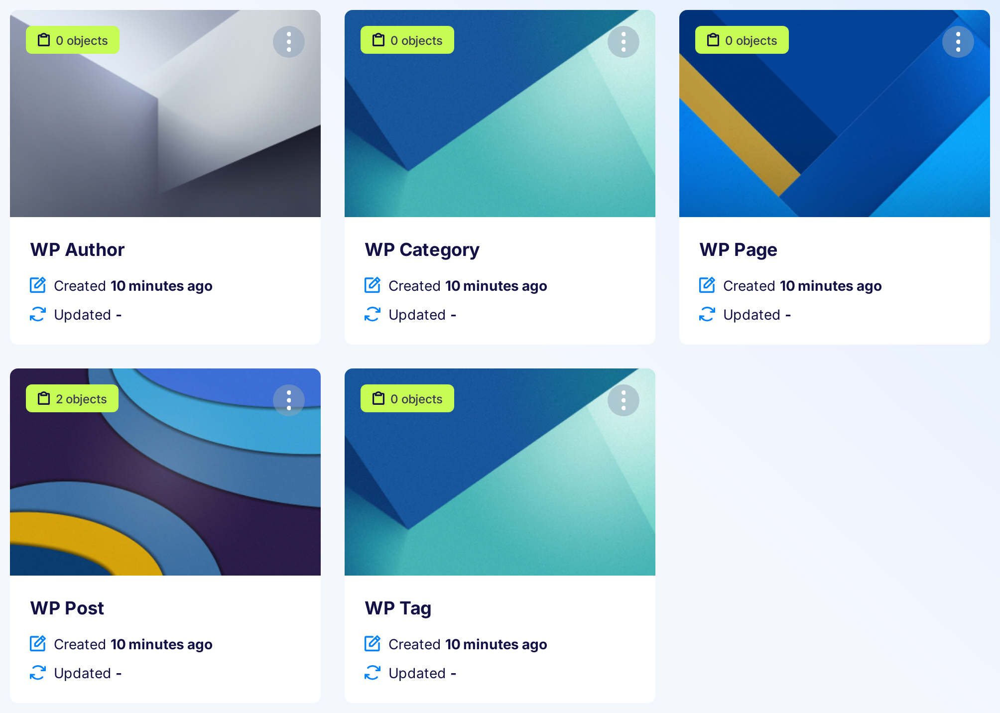

# Migrate WordPress blog content to Flotiq

To migrate content from WordPress blog with Flotiq CLI you need a Flotiq account (you can [register here](http://editor.flotiq.com/register.html)) and your "Read and write API key" (more about API keys [here](../API/index.md)).

The command looks like this:

```bash
flotiq wordpress-import [flotiqApiKey] [wordpressUrl]
```

After running the command, you should have new content types added to your Flotiq account that was imported from Wordpress site.

### Parameters

`flotiqApiKey` - Read and write API key to your Flotiq account

`wordpressUrl` - full link to WordPress site

### Imported Data

The importer will make all the required Content Type Definitions and will pull all your posts, authors, categories, tags, pages and media into your Flotiq account. They are all properly linked and ready to use, e.g. in a Gatsby-based website. 




!!! hint
    Instead of coding, you can try our [one-click migration tool](https://flotiq.com/services/migrate-wordpress-to-flotiq-headless-cms/) to move your data from WordPress to Flotiq.
    All you need is your personal [Flotiq Read And Write API Key](http://flotiq.com/docs/API/#application-api-keys) and your WordPress Site address.
    Read more in our [blog post](https://flotiq.com/blog/migrate-wordpress-to-flotiq-headless-cms).

