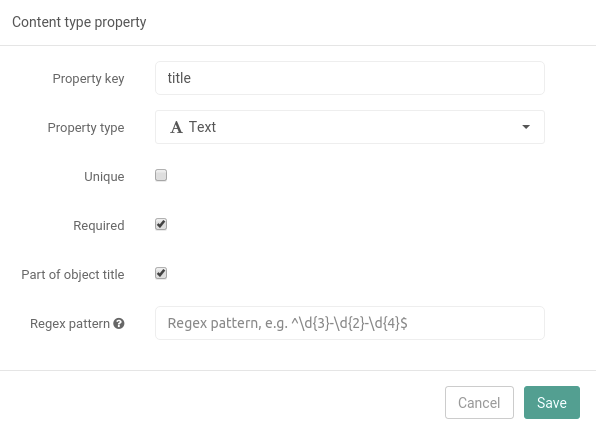
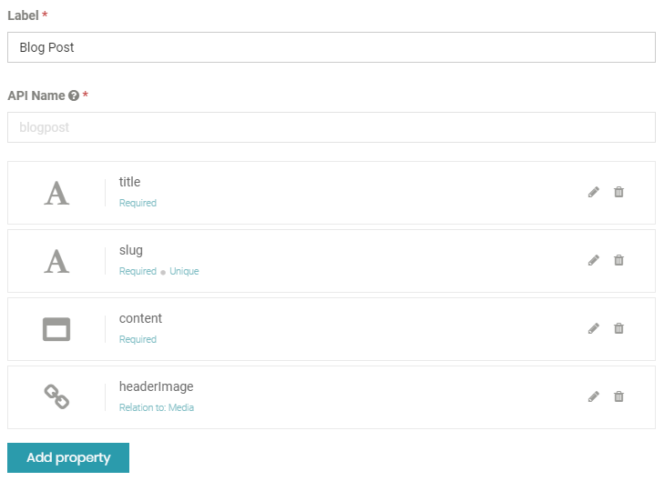
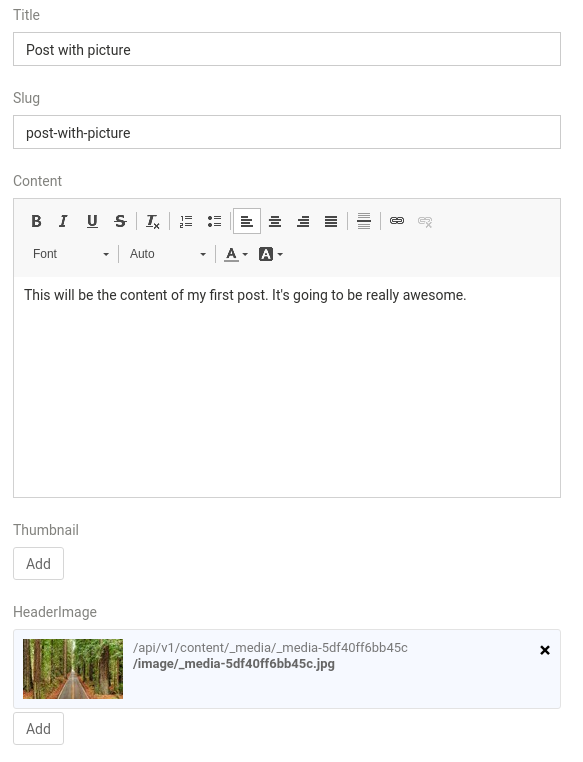
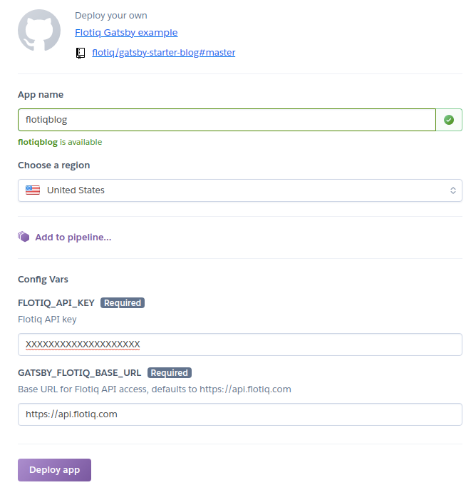
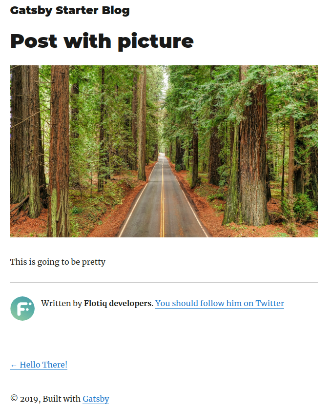

title: Building a blog in 3 minutes with Flotiq, Gatsby and Heroku | Flotiq docs
description: A deep dive tutorial on how to build your first blog using a headless CMS system like Flotiq, GatsbyJS and Heroku.

<a href="/">Docs</a> / <a href="/Deep-Dives/">Deep Dives</a> / <a href="/Deep-Dives/Building-a-blog-in-3-minutes/">Building a blog</a>

# Building a blog in 3 minutes with Flotiq, Gatsby and Heroku

In this deep dive you will learn how easy it is to build and deploy a blog with Flotiq, Gatsby and Heroku. Follow along and you should end up with a working blog page in no more than 3 minutes!

  <iframe width="1280" height="720" src="https://www.youtube.com/embed/hz3RK5qqhrQ" frameborder="0" allowfullscreen></iframe>

    

## Define a Content Type

First off - you will need to define how your content will be structured in Flotiq. Open the `Type definitions` menu and click on `Add Definition`.

!!! caution
    This tutorial assumes you will follow along and use the same naming as we did. You're free to adapt this to your needs, but please mind that the code repository we provide will make use of the specific field names we defined. If you make any changes in the Content Type - you will also need to apply them later on - in the code.

We labeled the new Content Type `Blog Post` and gave it an API name `blogpost`. Once you do that - you'll have to add the properties that will be defined for each of the entries. The `Add property` button will open a form, where you will define the characteristics of each of the fields (like if it's required, what kind of a field it is, etc.):

{: .center .width75 .border}
Here are the details of the fields we added for this tutorial:

| Field name | Field type | Additional attributes | Comments |
|------------|------------|-----------------------|----------|
| title | Text | Required, Part of object title | Title of your post |
| slug | Text | Required, Unique | URL of the post |
| content | Richtext | - | The post itself |
| thumbnail | Relation | Restrict to type: Media | Thumbnail image |
| headerImage | Relation | Restrict to type: Media | Main image of the post |

and this is how the Content Type Editor should look like in the end:

{: .center .width75 .border}

If you're happy with the result - click the `Save` button and navigate to `Content` → `Blog Posts` in the side menu. 

!!! hint
    At this point you can also verify the result of your work in the [Dynamic Content API](../API/dynamic-content-api.md) - head to you API docs and see how the API has automatically expanded to support your new Content Type:
    

    Three important things to note here:

    1. The list of endpoints now contains endpoints specific to the Blog Posts type you just defined.
    2. The API docs are automatically generated and contain all the characteristics you provided during Content Type creation.
    3. The API docs are enriched with code samples that will help you immediately work with your content.

## Build your content

!!! note
    If this is the first time you're using Flotiq - check out the `Media library` section in the main menu. This is where you can upload your media files (images, documents, etc.) or download free images from the vast Unsplash library. Before adding your first blog post - go and upload a picture, it will be more fun to browse through the blog once you build it.

It's now time to write your first post! The first time you go to the `Blog Posts` item in the `Content` menu you will be prompted with a screen encouraging to create your first Content Object, go ahead and click the `Add new Blog Post object` button. You will see an empty form that is automatically generated based on the Content Type Definition you provided in the previous step. Fill it in, however you like!

{: .center .width75 .border}

That's it. Now make sure you have your [read-only API key](../API/index.md) in your clipboard!

## Deploy

!!! caution
    This part assumes you already have a Heroku account. It's free to create and doesn't require a Credit Card, just like Flotiq, so we really recommend it. If you don't have a Heroku account yet, [click here to sign up](https://signup.heroku.com/).

Ok, we're almost done. Have your API key in the clipboard? 
Click here:  and paste the key in the `Flotiq API key` field. 

{: .center .width75 .border}

Also make sure to give your app a name, then click `Deploy app` and there - in a minute your blog will become publicly available! Just like [this one](https://flotiq-blog.herokuapp.com/).

!!! success
    Congratulations! You just deployed your Flotiq-based blog. Please share your success with us - drop us an email, a chat message or mention us on Twitter. We're eager to see what you build!

!!! note 
    For this particular example we used the seminal work of Gatsby developers and forked their `gatsbyjs/gatsby-starter-blog` in order to provide integrations with Flotiq and Heroku. You can explore [our Github repository](https://github.com/flotiq/gatsby-starter-blog) to see how easy it was to connect Gatsby to Flotiq. 
    
The end result should look like this:

{: .center .border .width75}

## Summary

Congrats! Your all-shiny blog should now be live. You also learned a couple of important concepts that will help you make the most out of your Flotiq account, here's the recap:

1. Defining Content Types with constraints,
2. Populating data,
3. Deploying a Flotiq-powered blog to Heroku, via Gatsby.

You probably want to get your hands dirty now, huh? Try the [next deep dive](wordpress-import.md) and see how Flotiq makes your work easier with SDK packages that will put your Content Types straight into your favorite IDE. Oh, and by the way we will import all your Wordpress posts at the same time.

You can also learn how to add a custom domain to your blog, for free, in [this Deep Dive](../add-a-custom-domain-to-heroku-for-free/), featuring Cloudflare Workers.
