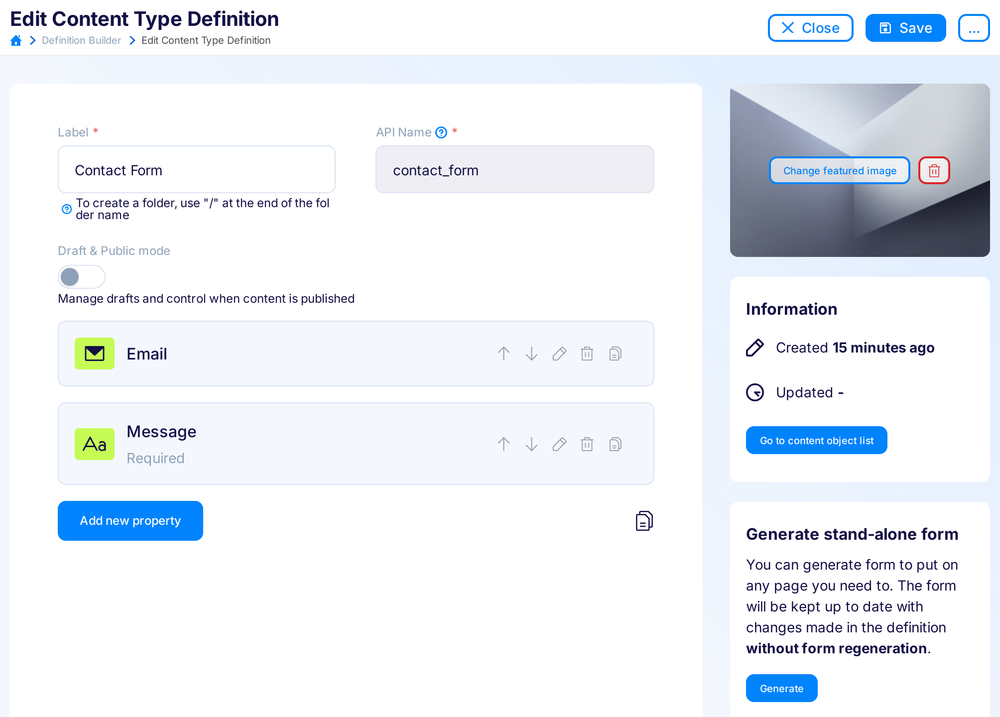
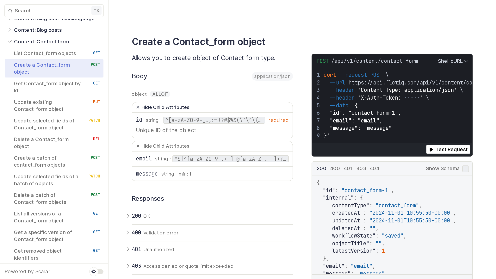

title: Contact form using Flotiq | Flotiq docs
description:

# Contact form using Flotiq

You can easily use headless CMS systems like Flotiq to store data from contact forms or other places where you collect information from your users. With Flotiq it's super easy to create Content Types, push new data to the system and integrate it with other systems through Zapier. Follow along for a complete, working example of how this can be done.

## What you'll learn in this deep dive

Create a contact form with notifications, without backend code, in 10 minutes.

Steps:

1. Create a model in Flotiq
2. Create a simple form on your website
3. Zapier - sending notifications to email


## Configuring Flotiq


Create a simple Content Type Definition "Contact Form".


We need a type with two attributes:


| Field name | Field type | Additional attributes | Comments |
|------------|------------|-----------------------|----------|
| email | email | Not required | Optional e-mail address of your guest |
| message | textarea | Required | The message |


Here's how you would create that Content Type Definition using the [Flotiq editor](https://editor.flotiq.com/register.html):

{: .center .border .width75}

Once you save that Content Type - you can see the endpoints that were generated to support it in your API documentation (click "API doc" link in the menu):

{: .center .border .width75}

Now you can manage contact form entries via Flotiq. Let's now create a contact form on your site to post data directly to the FLotiq API.


## HTML Form implementation


We will use a simple HTML form. The code below code is a complete, working solution. You only need to replace the "FLOTIQ_TOKEN" variable. Here, we also use classes from the Bootstrap4 CSS framework, but it's optional.

```html
<!-- form -->
<div class="container">
    <form id="contact_form">
        <div class="form-group">
            <label for="email">Email address</label>
            <input type="email" class="form-control" name="email" id="email">
        </div>
        <div class="form-group">
            <label for="message">Message</label>
            <textarea class="form-control" name="message" id="message"></textarea>
        </div>
        <button type="submit" class="btn btn-primary">Submit</button>
    </form>
</div>
```
{ data-search-exclude }

We need also a few lines of javascript to pass data from our form to the Flotiq API:


```html

<!-- we use jQuery to handle form data -->
<script src="https://code.jquery.com/jquery-3.4.1.min.js"
        integrity="sha256-CSXorXvZcTkaix6Yvo6HppcZGetbYMGWSFlBw8HfCJo="
        crossorigin="anonymous"></script>

<script>

    // Handle form submit - push to Flotiq instead of default HTML Form action.
    $('#contact_form').on('submit', function (ev) {

        ev.preventDefault();

        // Prepare form data and generate id for Flotiq Content Object
        var formData = {
            id: Date.now() + '_' + Math.random().toString().substring(2),
            email: $(this).find('[name=email]').val(),
            message: $(this).find('[name=message]').val(),
        }

        // Caution! Other users can see your token, and can use it
        // not only for creating contact messages, but also for listing or
        // deleting. You can hide this token using Cloudflare
        // (see: https://flotiq.com/docs/Deep-Dives/securing-write-api-access/) or custom backend
        var FLOTIQ_TOKEN = '_YOUR_FLOTIQ_READ_WRITE_TOKEN_';

        $.ajax({
            method: 'POST',
            url: 'https://api.flotiq.com/api/v1/content/contact_form?auth_token=' + FLOTIQ_TOKEN,
            data: formData,
            dataType: 'json',
            success: function () {
                $("#contact_form").html("<h5 class='text-success'>Thank you for getting in touch!</h5>");
            },
            error: function (errorResponse, err) {
                if(errorResponse.status === 400) {
                    alert('Please fill all required fields');
                } else {
                    alert('Server error');
                }
            }
        });
    })

</script>
```
{ data-search-exclude }

!!! caution
    To protect your API Key you should use a custom backend proxy or, for example, a serverless function like Cloudflare Workers, we have an extensive Flotiq Developer Documentation article about it here: [How to secure a JAMstack app with Cloudflare workers](https://flotiq.com/docs/Deep-Dives/securing-write-api-access/)

Now you can test if this form is sending data to your Contact Form type in Flotiq app.


## Hooking up Zapier e-mail notifications


If you want to receive emails when the form is submitted you can use Flotiq and Zapier integration. You can also adapt this step to push your contacts to other sources, e.g. CRM systems, Mailchimp, Google Sheets, whatever you like.

1. Log in or register in [Zapier](https://zapier.com)
1. Create a zap - select connection between Flotiq and Gmail (you can use other integrations if you want). It should look like:

1. Next you need to pass your Flotiq API Key in Choose Account section (it should be your global read-only API KEY),
1. In Customize content object section select "contact_form".

In the "Do this..." field you need to configure email address and content. See our example config:

{: .center .border .width75}


That's all. You will now get an email notification about every message left through your Contact Form.

!!! hint
    * Read more about Flotiq & Zapier integration [here](../../Universe/zapier/)
    * Set up your own integration with one of 1000+ systems [here](https://zapier.com/apps/flotiq/integrations)

## Conclusion


* It's super easy to create forms without any backend code.
* Flotiq's Integration with Zapier allows you to use your data with many applications, check more ways to [integrate with Flotiq](https://zapier.com/apps/flotiq/integrations)
* Contact form data will be available in your Flotiq account.
