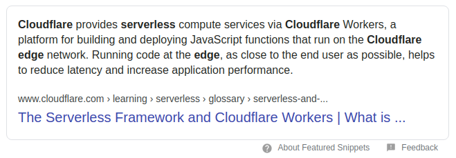
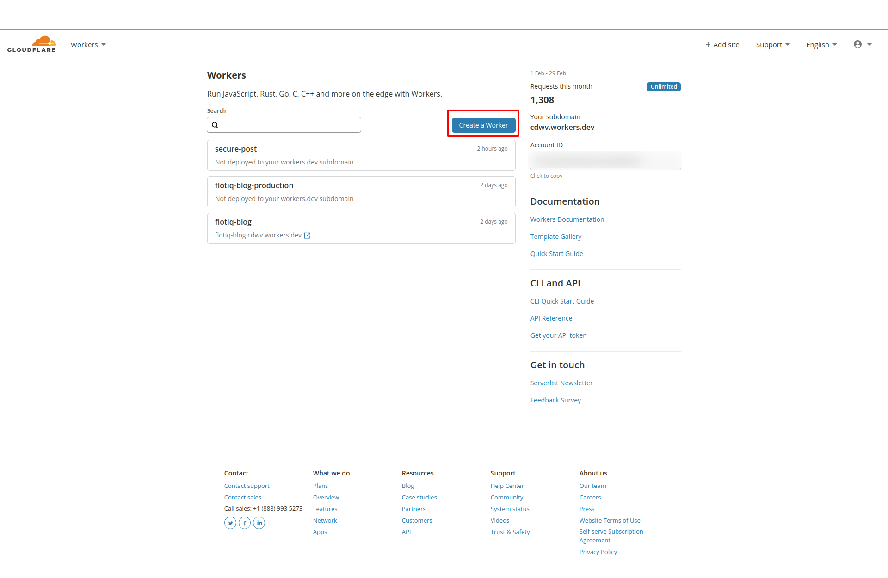
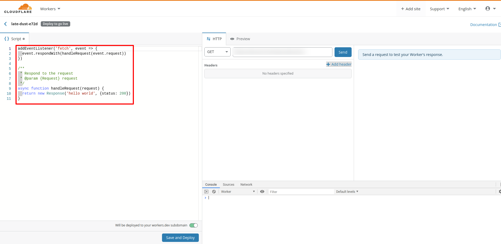
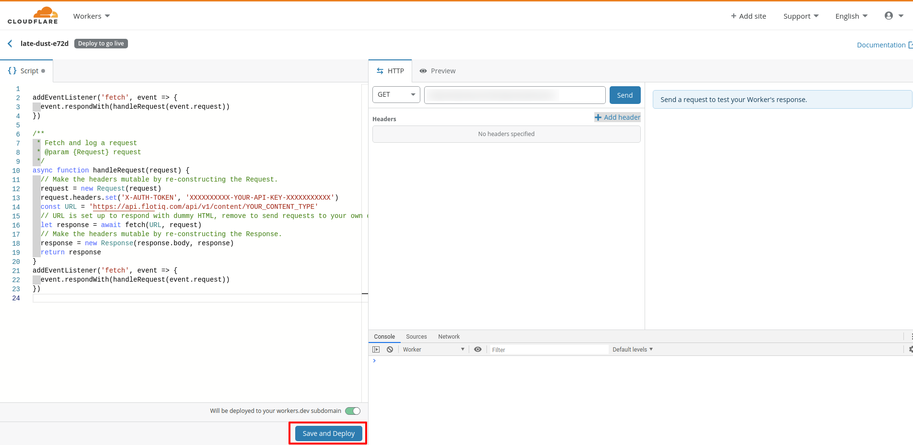
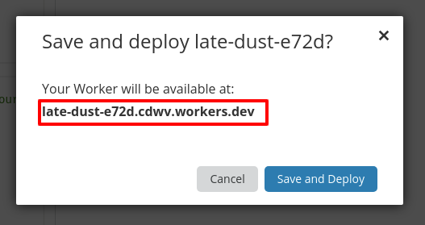
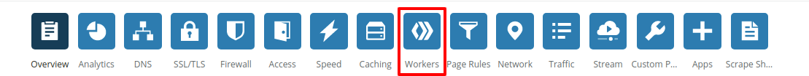
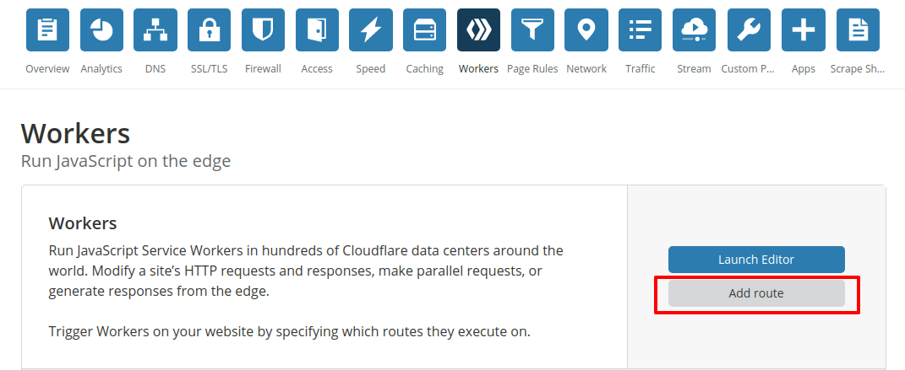
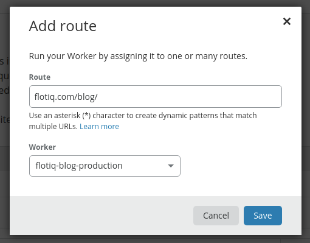

title: How to add a custom domain to your Heroku-hosted blog with Cloudflare workers | Flotiq docs
description: Read this tutorial to learn how you can use Cloudflare workers to add a free custom domain to a Heroku-hosted blog.

# How to add custom domains to free Heroku apps

Heroku is pretty great for hosting websites and their `Deploy to Heroku` buttons are so awesome, especially with how they can be integrated with static website generators, like Gatsby. Heroku's free account is also quite capable, you are allowed to deploy up to 5 applications, hosted in their `*.herokuapp.com` domain. But, as soon as you'd like to move this app to a custom domain - you have to pay. If you've already built and deployed your blog, for example using [this tutorial](../Building-a-blog-in-3-minutes/) your next step will probably be adding a custom domain for your blog.

Here's a quick tutorial how to get around this, with Cloudflare Workers.


!!! caution
    **Prerequisites:**

    * Cloudflare account (free)
    * Cloudflare Workers enabled (free)
    * Flotiq account (free)

## Cloudflare Workers

Cloudflare is a global CDN (Contend Delivery Network), which provides websites across the globe with features like anti-DDoS protection, global content distribution and the possibility to run serverless applications "on the edge".



Cloudflare provides a pretty handy CLI tool to work with your Workers code, you can read more about how to get started [here](https://developers.cloudflare.com/workers/quickstart/). In this tutorial, however, we will use the Cloudflare GUI to build the solution.

### Creating the worker
Once you login to your Cloudflare account go to Menu / Workers. From the Workers dashboard select Create Worker.



You will be redirected to the Worker editor tool, which will be filled out with a Hello World code for you, this is the part that we'll update next.



## Proxying content inside the Worker code

The Worker code below is going to take care of rewriting the URLs from `yourdomain.com/blog/*` to `your.herokuapp.com/*`. 

```javascript
// keep track of all our blog endpoints here
const myBlog = {
  hostname: "flotiq-com-blog.herokuapp.com",
  targetSubdirectory: "/blog",
  assetsPathnames: ["/public/", "/assets/"]
}

async function handleRequest(request) {
  // returns an empty string or a path if one exists
  const formatPath = (url) => {
    const pruned = url.pathname.split("/").filter(part => part)
    return pruned && pruned.length > 1 ? `${pruned.join("/")}` : ""
  }
  
  const parsedUrl = new URL(request.url)
  const requestMatches = match => new RegExp(match).test(parsedUrl.pathname)
  
  // if its blog html, get it
  if (requestMatches(myBlog.targetSubdirectory)) {
    console.log("this is a request for a blog document", parsedUrl.pathname)
    const targetPath = formatPath(parsedUrl).substr(myBlog.targetSubdirectory.length)
    return fetch(`https://${myBlog.hostname}/${targetPath}`)
  }
  
  // if its blog assets, get them
  if ([myBlog.assetsPathnames].some(requestMatches)) {
    console.log("this is a request for blog assets", parsedUrl.pathname)
    const assetUrl = request.url.replace(parsedUrl.hostname, myBlog.hostname);

    return fetch(assetUrl)
  }

  console.log("this is a request to my root domain", parsedUrl.host, parsedUrl.pathname);
  // if its not a request blog related stuff, do nothing
  return fetch(request)
}

addEventListener("fetch", event => {
  event.respondWith(handleRequest(event.request))
})


```
{ data-search-exclude }

which is adapted from [this Cloudflare article](https://blog.cloudflare.com/subdomains-vs-subdirectories-improved-seo-part-2/).

Simply paste this code in the Worker editor, replacing the original Hello World code. Don't forget to update your Heroku APP URL. Next - click Save and Deploy.



That's it! Cloudflare has deployed your worker to an automatically generated endpoint, you can start using it right away, the URL will be presented to you in the confirmation dialog.



## Add routing

In order to publish your blog under a subfolder of your domain - in your domain dashboard click `Workers`.



Next, click the `Add Route` button:



and finally - define the route, where you'd like to display the Heroku-hosted content:




## Conclusions

You can use a free Cloudflare Workers account to add custom domains to your free Heroku Apps account. 
