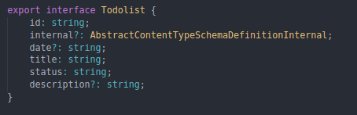
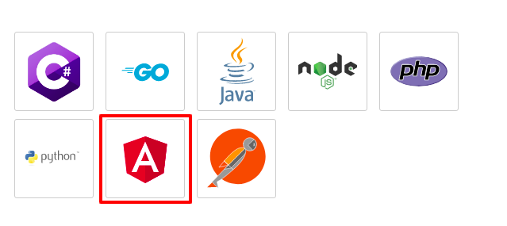
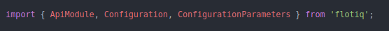
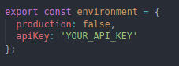
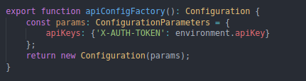
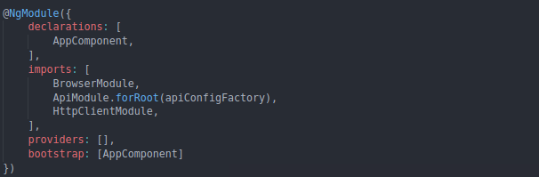
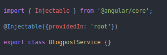

title: Angular 8 and Flotiq headless CMS - getting started with your custom application using Angular 8 generated package in Flotiq.
description: Start building your Angular 8 app quickly with an SDK package generated in Flotiq.


## Prerequisites

1. [Flotiq account](https://editor.flotiq.com)
2. At least one your own Content Type in Flotiq (we will use Blogpost as an example)
3. Generated Angular package that you can download on your Flotiq Dashboard page.
4. Little knowledge of [rxjs](https://angular.io/guide/rx-library)

Additional information: We used Angular 8.3.25 in this example, but it shouldn't be problem if you use the newest one (for now it's Angular 9).

## Overview

### About packages

We decided to give a hand to developers by automatically generate a layer package that contains all required materials to work with Flotiq API. Thanks to [Open API Generator](https://github.com/OpenAPITools/openapi-generator) it is possible to work with various frameworks or programming languages as well as a Postman Collection just for API calls.

## Package overview

When we extract downloaded package we will see some directories and typescript configuration files. We are interested mostly in only two positions:

*    `/api` directory, which contains services for every content type object definition as well as for some internal types like media and also for functionalities like graphQL and search.
*    `/model` directory, which has all Content Type Definitions that exists on your Flotiq account. They are implemented as exported interfaces with the following template body:

Example: 




## Package installation

1. Download Angular package from your account dashboard 


2. In package directory run:
```
npm install
npm run build
```


This will create a `dist` directory, which will be used for installing your package in project.

Go to generated `dist` directory and run:
```
npm link
```
    

3. In your application directory:
```
npm install
npm install <path_to_your_package>/dist
npm link flotiq
```


And that's all. Basic setup is done!

**IMPORTANT!** There are known issues with `npm link` on Windows OS, but they only concern installed packages via path, not registry.

## Package usage

In your project `app.module.ts` file import following classes:




In `environments` directory are two `env` files. Add your `API_KEY` as a key-value pair in your `environtment.ts` file, so it should look like this:




If you plan to deploy your application, remember to fill out `environment.prod.ts` file too!

Next, you have to export a function that will hold all needed configuration to work with Flotiq. You can include it in your `app.module.ts` file below the imports. As a minimum only your `API_KEY` is required:



For the final step add Flotiq `ApiModule` into providers array in your application `AppModule`. You must call `fotRoot()` function on `ApiModule` providing required configuration that you set step before:

```
ApiModule.forRoot(apiConfigFactory);
```

It's important to also import `HttpClientModule` from `@angular/common/http`. Otherwise you won't be able to make API calls to Flotiq.


Your `@NgModule` decorator should look like that after whole setup process:




## Example Service (Blogpost)

Create a simple service file `blogpost.service.ts`

Export a class and provide an `@Injectable()` decorator, so you can inject other services into this service. Remember to import it from `@angular/core`.

To make this service application-wide pass an parameter object `{providedIn: 'root'}` to `Injectable` decorator (it's a shortcut, you can also import and add your service to `providers` array in `app.module.ts` file)

Your file should like this:




Next, import your Blogpost model and ContentService provided by installed package. 

```
import { ContentBlogpostService, Blogpost } from 'flotiq';
```

Next, create a constructor and add your ContentService

```
constructor(private blogpostApiService: ContentBlogpostService) {}
```

`blogpostApiService` is just example variable name, you can change it if you like.


Add a simple method (for example `addBlogpost`) which will take any value as an argument, but it's preferred that it has `Blogpost` model type.

```
addBlogpost(blogpost: Blogpost) {}
```

In the body return a result of ContentService function, so you can `subscribe` to it later and handle response and errors.

```
addBlogpost(blogpost: Blogpost) {
    return this.blogpostApiService.createblogpost(post);
}
```

It's important here to pass an object of type `Blogpost` here, because in other cases types will mismatch and Typescript will throw an error.

That's all! Implement the rest of methods and use your custom service in other parts of your application.

Look into your generated package to find what models and ContentServices where created for you and start developing!

Here is a small animation that shows you an example project based on generated package(To-do-list content type definition used) and [Tailwind CSS](https://tailwindcss.com/):


## Important information

When you start your application use `npm start` instead of `ng serve`. This will avoid confusion and incompatibility with your global installed angular-cli and it's dependencies with those specified in `package.json` file.

## Conclusion

Generated package based on your OpenApiSchema is a powerful tool, that can speed up your development process a lot. You can install it in your project and don't worry anymore about writing API calls

Helpful links:
1. Learn how to get your own OpenApiSchema [here](https://flotiq.com/docs/API/open-api-schema/).
2. Didn't find a package in a langauage or framework you love? No problem check this [link](https://flotiq.com/docs/API/generate-package/) to learn how to generate your own!

