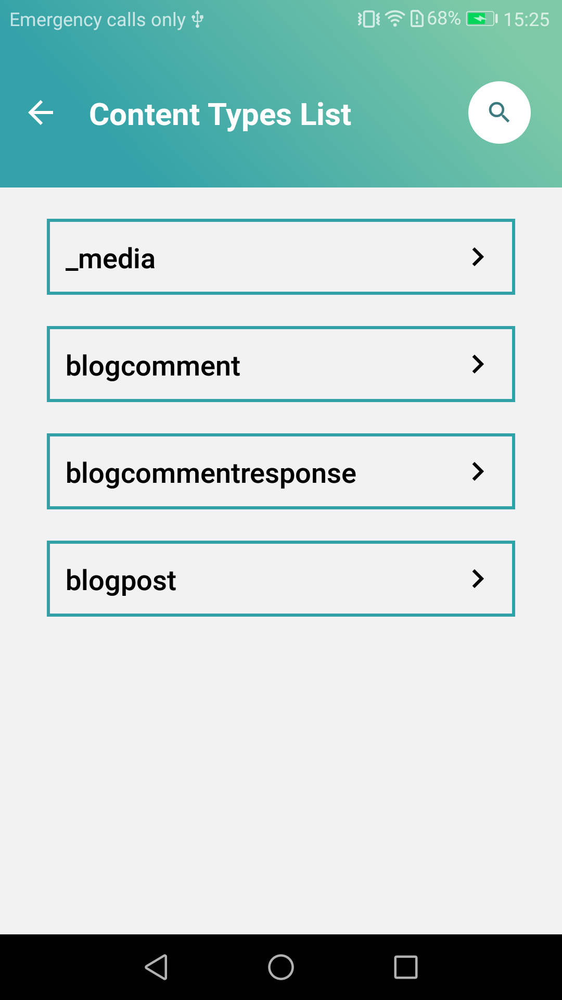
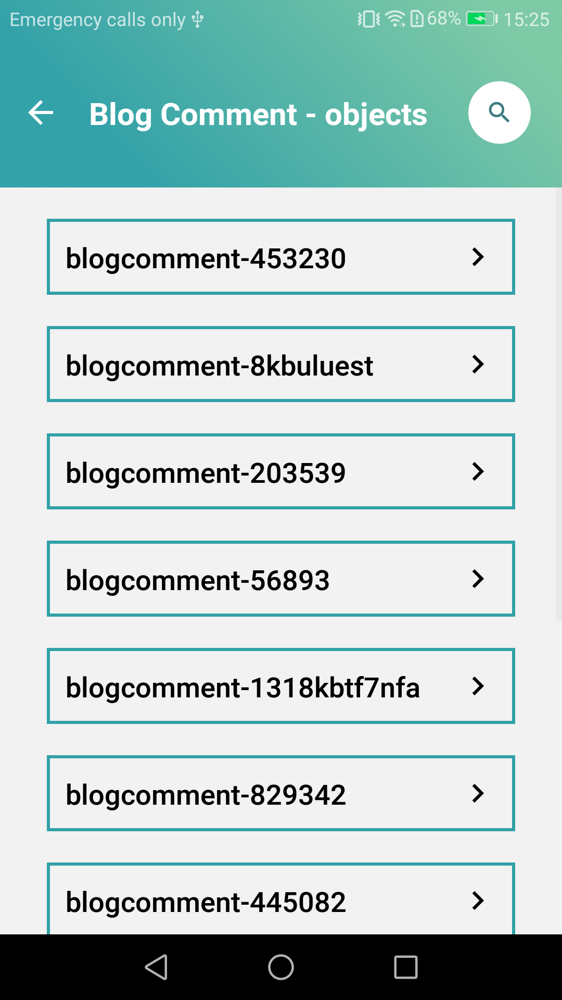
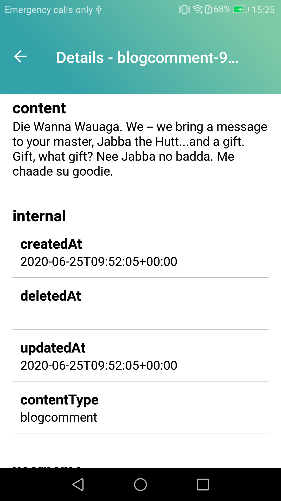
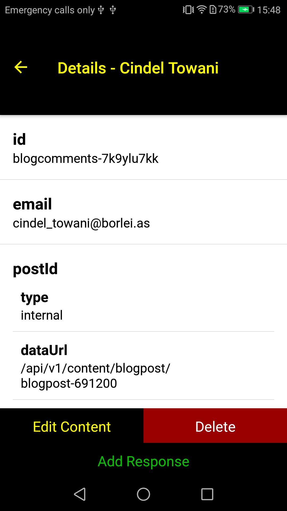
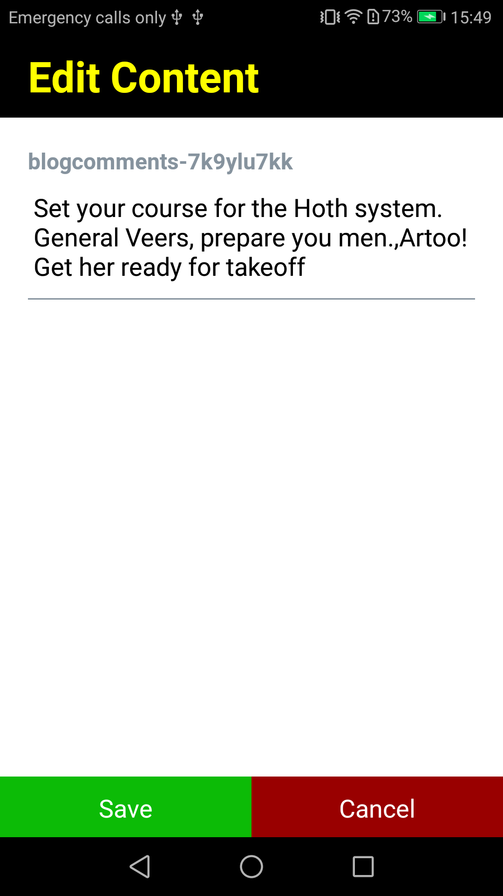
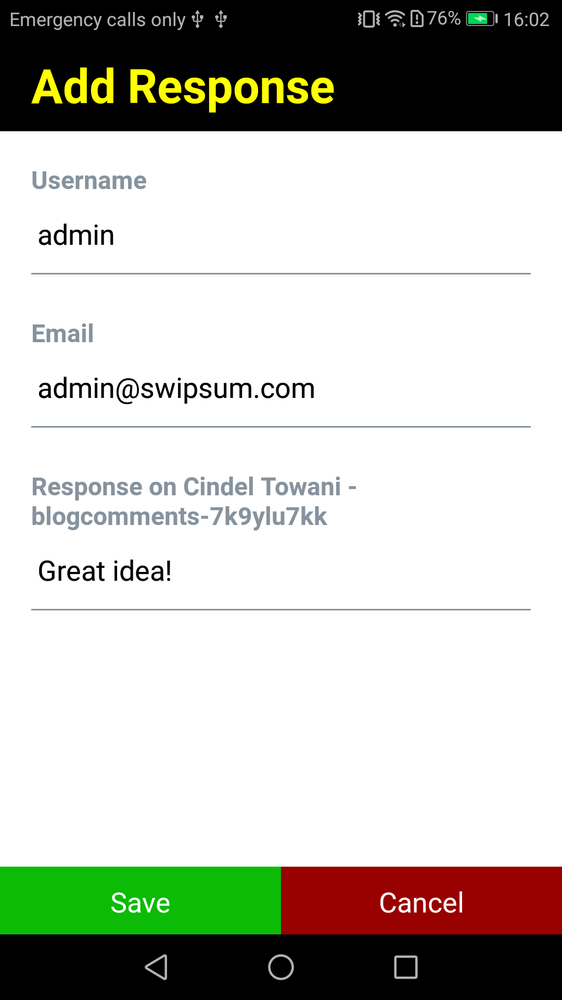
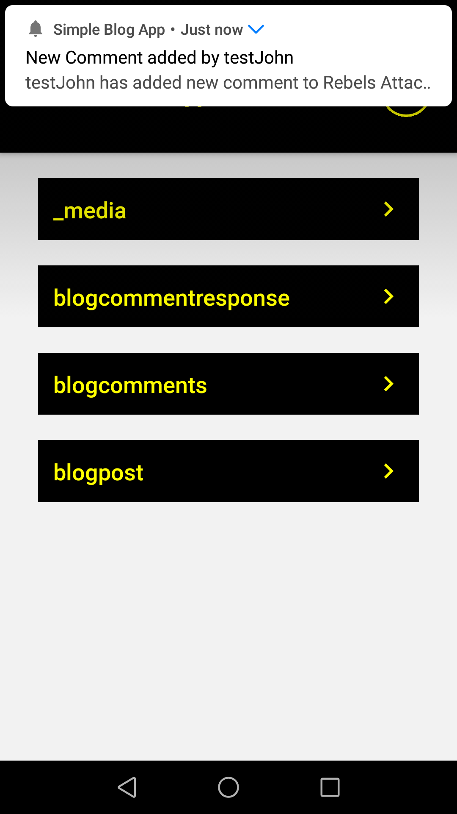

# Your blog comments management using Flotiq and Flotiq Mobile App Starter

## Introduction

In the previous article, I showed you how to setup blog with comments and a middleware to protect valuable data. Now, I will guide you step by step how to set up your mobile application based on Flotiq Starter to manage your comments that includes:

* Blogposts and comments display
* New comments notification
* Comments manual validation (apply/refuse)
* Responding to comments

## Prerequisites

All that I needed was:
1. [Flotiq Mobile Starter](https://github.com/flotiq/flotiq-mobile-demo)
2. [OneSignal](https://onesignal.com/) - their React-Native package, which URL is mentioned deeper in the article
3. Firebase account - required for OneSignal notification package to work
4. Flotiq account

You can check official Flotiq Mobile Application by installing it on your phone and providing your Flotiq API_KEY:

* [Google Play](https://play.google.com/store/apps/details?id=com.flotiqmobiledemo)
* [ Apple App Store](https://apps.apple.com/app/flotiq-mobile-expo/id1505331246)

## Project setup

I forked [Flotiq Mobile Starter](https://github.com/flotiq/flotiq-mobile-demo) and configured it as it is in README file. If you are having any issues check [React Native environment setup documentation](https://reactnative.dev/docs/environment-setup) for help.

Application plays browser role, so basic operations like getting data from Flotiq are already implemented.









## Adding and editing comments

I have decided, that editing comments will be available in the specific comment view. There I will be able to delete such one or respond to it. For this case i edited `ObjectScreen` and created two helper components: `EditBar` and `EditContent`

>EditBar.js

```jsx
// imports above

const EditBar = (props) => {
    const { onEditPress, onDeletePress, onAddPress, showResponse } = props;

    return (
        <>
            <View
                style={styles.container}
            >
                <View
                    style={styles.btnEditWrapper}
                >
                    <CustomBtn
                        title="Edit Content"
                        onPressBtn={onEditPress}
                        buttonStyle={{
                            backgroundColor: Colors.primary,
                        }}
                        titleStyle={{
                            color: Colors.secondary,
                        }}
                    />
                </View>
                <View
                    style={styles.btnDelWrapper}
                >
                    <CustomBtn
                        title="Delete"
                        onPressBtn={onDeletePress}
                        buttonStyle={{
                            backgroundColor: Colors.danger,
                        }}
                    />
                </View>
            </View>
            {showResponse
            && (
                <View
                    style={styles.btnAddWrapper}
                >
                    <CustomBtn
                        title="Add Response"
                        onPressBtn={onAddPress}
                        buttonStyle={{
                            backgroundColor: Colors.primary,
                        }}
                        titleStyle={{
                            color: Colors.accent1,
                        }}
                    />
                </View>
            )}
        </>
    );
};

export default EditBar;
```

>EditContent.js

```jsx
// [imports]

const EditContent = (props) => {
    const { isModalVisible, onPressSave, onPressCancel, contentTitle, content, isResponse } = props;

    const [textContent, setTextContent] = useState((content && !isResponse) ? content : '');
    const [usernameValue, setUsernameValue] = useState('');
    const [emailValue, setEmailValue] = useState('');

    const onPressBtnHandler = () => {
        const response = { content: textContent };
        if (isResponse) {
            if (!usernameValue || !emailValue) {
                Alert.alert('Missing data!', 'Complete all data!');
                return;
            }
            response.username = usernameValue;
            response.email = emailValue;
        }
        onPressSave(response);
    };

    const getTitle = () => {
        if (!contentTitle) return 'No title';
        if (contentTitle && isResponse) return `Response on ${contentTitle}`;
        return contentTitle;
    };
    return (
        <Modal
            visible={isModalVisible}
            animationType="fade"
        >
            <View
                style={styles.headerContainer}
            >
                <Text
                    style={styles.header}
                >
                    Edit Content
                </Text>
            </View>
            <View
                style={styles.bodyContainer}
            >
                <View>
                    {isResponse && (
                        <>
                            <Input
                                label="Username"
                                maxLength={40}
                                value={usernameValue}
                                placeholder="Username"
                                keyboardType="default"
                                onChangeText={(username) => setUsernameValue(username)}
                            />
                            <Input
                                label="Email"
                                maxLength={50}
                                value={emailValue}
                                placeholder="Email Address"
                                keyboardType="email-address"
                                onChangeText={(email) => setEmailValue(email)}
                            />
                        </>
                    )}
                    <Input
                        label={getTitle()}
                        maxLength={1000}
                        multiline
                        placeholder="Content (max 1000 characters)"
                        keyboardType="default"
                        value={textContent}
                        onChangeText={(text) => setTextContent(text)}
                    />
                </View>
            </View>
            <View
                style={styles.btnWrapper}
            >
                <View
                    style={styles.btnSaveWrapper}
                >
                    <CustomBtn
                        title="Save"
                        buttonStyle={{
                            backgroundColor: Colors.accent1,
                        }}
                        onPressBtn={() => onPressBtnHandler(textContent)}
                    />
                </View>
                <View
                    style={styles.btnCancelWrapper}
                >
                    <CustomBtn
                        title="Cancel"
                        buttonStyle={{
                            backgroundColor: Colors.danger,
                        }}
                        onPressBtn={onPressCancel}
                    />
                </View>
            </View>
        </Modal>
    );
};

export default EditContent;


```

In `ObjectScreen.js` file I have added a simple handler, that handles adding response as well as editing specific comment.

```jsx
const onSavePressHandler = async (value) => {
    const { dataUrl } = data.postId[0];
    const newBody = response
        ? resonseObject(objectId, dataUrl, value.email, value.username)
        : data;
    newBody.content = value.content;

    try {
        if (!response) {
            await httpCT.updateContentObject(ctoName, objectId, newBody);
        } else {
            await httpCT.createContentObject('blogcommentresponse', objectId, newBody);
        }
    } catch (error) {
        Alert.alert(
            'Error!',
            error.message,
        );
    }
    setShowEditContentModal(!showEditContentModal);
};
```

After changes, single comment view presents like on images below:









## Notifications

I wanted to expand my application by adding new comment/response notification. I used [Flotiq integration with Zapier](https://flotiq.com/docs/API/zapier/) and [One-Signal react-native package](https://github.com/OneSignal/react-native-onesignal).

I just followed [One Signal documentation](https://documentation.onesignal.com/docs/react-native-sdk-setup) and Flotiq integration with Zapier mentioned above to quickly setup easy Notification System in my application.

In Zapier I have created a Zap, that was triggered when `New Content Object` of type `BlogComment` was added.

Below you can check `OneSignal` implemenation in project:

>PushNotifications.js

```jsx
    import { useEffect } from 'react';
    import { Platform } from 'react-native';
    import OneSignal from 'react-native-onesignal';

    import { ONESIGNAL_APPLE_ID, ONESIGNAL_ANDROID_ID } from '../env';

    const PushNotifications = (props) => {
        useEffect(() => {
            OneSignal.setLogLevel(6, 0);
            const onesignalID = Platform.OS === 'android' ? ONESIGNAL_ANDROID_ID : ONESIGNAL_APPLE_ID;
            OneSignal.init(onesignalID, {
                kOSSettingsKeyAutoPrompt: false,
                kOSSettingsKeyInAppLaunchURL: false,
                kOSSettingsKeyInFocusDisplayOption: 2,
            });
            OneSignal.inFocusDisplaying(2);

            OneSignal.getPermissionSubscriptionState((status) => {
                console.log('[getPermissionSubscriptionState]', status);
            });
        }, []);

        const onReceived = (notification) => {
            console.log('Notification received: ', notification);
        };

        const onOpened = (openResult) => {
            console.log('Message: ', openResult.notification.payload.body);
            console.log('Data: ', openResult.notification.payload.additionalData);
            console.log('isActive: ', openResult.notification.isAppInFocus);
            console.log('openResult: ', openResult);
        };

        const onIds = (device) => {
            console.log('Device info: ', device);
        };

        useEffect(() => {
            OneSignal.addEventListener('received', onReceived);
            OneSignal.addEventListener('opened', onOpened);
            OneSignal.addEventListener('ids', onIds);

            return () => {
                OneSignal.removeEventListener('received', onReceived);
                OneSignal.removeEventListener('opened', onOpened);
                OneSignal.removeEventListener('ids', onIds);
            };
        }, []);

        return (
            null
        );
    };

    export default PushNotifications;
```

<br>

Required changes in `App.js` file:

```jsx
    [...]

    const App: () => React$Node = () => {
        return (
            <>
                <StatusBar translucent={true} barStyle="light-content" backgroundColor={'black'}/>
                <Provider store={store}>
                    <PersistGate loading={null} persistor={persistor}>
                        <PushNotifications />
                        <FlotiqNavigator />
                    </PersistGate>
                </Provider>
            </>
        );
    };

    [...]
```

<br>

This is how example notification looks like:



## Publication

Application can be published in store (after some modifications). I don't cover here all use cases. It would be nice to be able to add new posts, images or share content. I just wanted to show you how quickly and easy it is to create such mobile representation of your content in Flotiq, and it is absolutely free!

Flotiq documentation as well as software are constantly developed. I had to contact with them few times, but their response was very quick so I there wasn't a time I was stuck with developing my application.

Wish you best experience with Flotiq!
