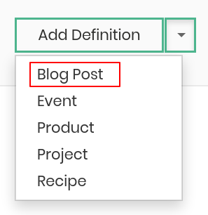
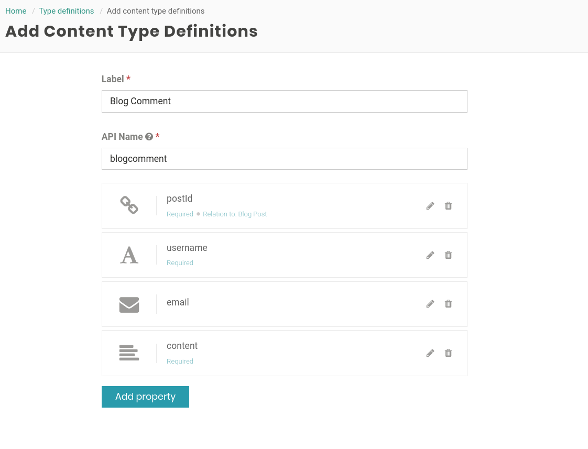
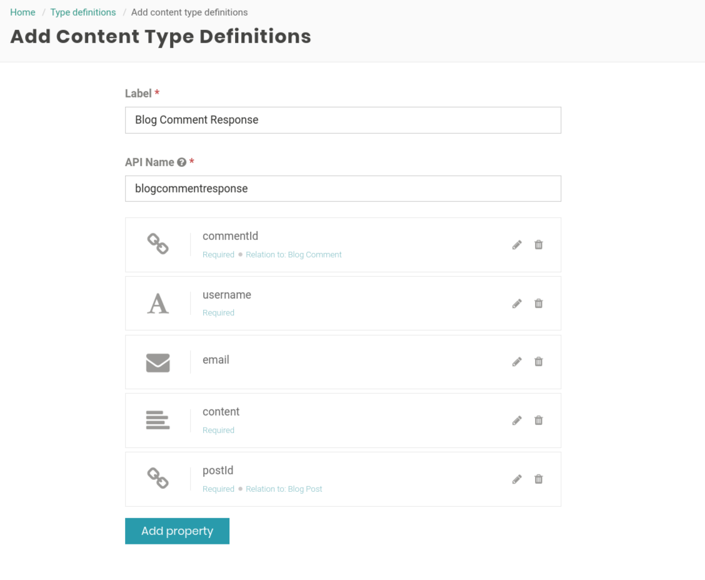
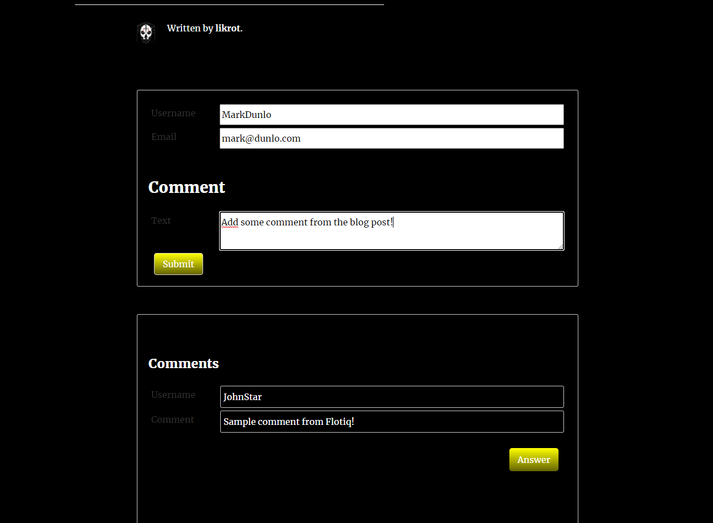
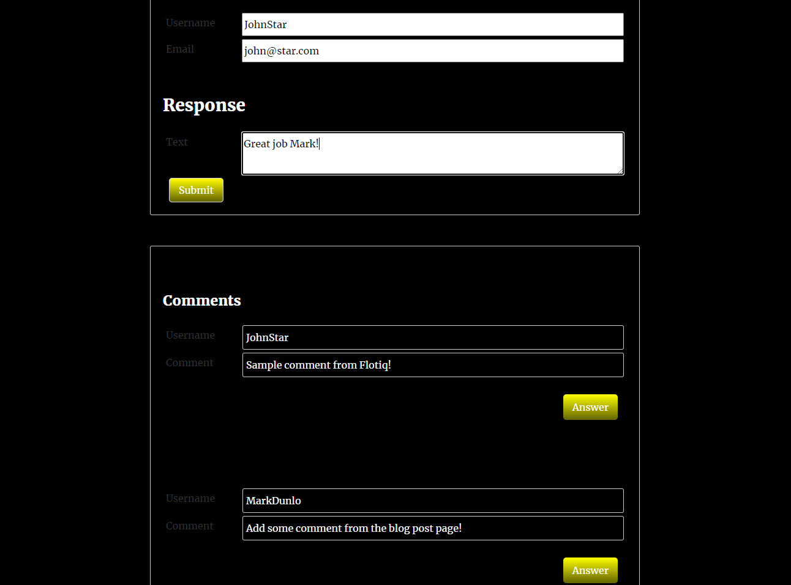

# Flotiq Blog Project with comments like a Pro featuring Netlify and Zapier
## Introduction

Some time ago, I had an opportunity to test [Flotiq](https://flotiq.com). They share a lot of prepared tools and tutorials about starting a journey with their Headless CMS as well as SDK, good documentation, Gatsby starter templates and mobile starter application.

I wanted to test this software. I asked myself a question `How far can I come and what can I do with just little effort?`. I decided, that I will make a simple personal blog with comments module - using Flotiq Gatsby Blog and Mobile application starter to manage them all.

## Prerequisites

To create such application I used things below:

1. [Flotiq](https://editor.flotiq.com) account -  for Content Management and API_KEY for Blog Starter
2. [Flotiq Gatsby Starter Blog Template](https://github.com/flotiq/gatsby-starter-blog) fork as your project base.
3. [Netlify](https://www.netlify.com/) account - for hosting
4. [Zapier](https://zapier.com) account - for keeping site up-to-date without manual rebuilding.

## Blog Preparation

I have created 3 Content Type Definitions

1. Blog Post - shared by Flotiq - in the top right corner in Type Definitions section.




2. Blog Comment:

```json
        "required": [
            "postId",
            "username",
            "content"
        ],

        [...]

        "propertiesConfig": {
            "email": {
                "unique": false,
                "helpText": "",
                "inputType": "text"
            },
            "postId": {
                "unique": false,
                "helpText": "",
                "inputType": "datasource",
                "validation": {
                    "relationContenttype": "blogpost"
                }
            },
            "content": {
                "unique": false,
                "helpText": "",
                "inputType": "textarea"
            },
            "username": {
                "unique": false,
                "helpText": "",
                "inputType": "text"
            }
        }
```




3. Blog Comment Response:

```json
        "required": [
            "commentId",
            "username",
            "email",
            "content",
            "postId"
        ],

        [...]

        "propertiesConfig": {
            "email": {
                "unique": false,
                "helpText": "",
                "inputType": "email"
            },
            "postId": {
                "unique": false,
                "helpText": "",
                "inputType": "datasource",
                "validation": {
                    "relationContenttype": "blogpost"
                }
            },
            "content": {
                "unique": false,
                "helpText": "",
                "inputType": "textarea"
            },
            "username": {
                "unique": false,
                "helpText": "",
                "inputType": "text"
            },
            "commentId": {
                "unique": false,
                "helpText": "",
                "inputType": "datasource",
                "validation": {
                    "relationContenttype": "blogcomment"
                }
            }
        }
```

<br>



I have forked Flotiq Gatsby Blog starter template, and followed instructions written in README file.

## Comments Section setup and development

I have extended starter by adding components that will handle render and operations in Comments section. The basic are:

* `CommentList` - for getting all comments
* `CommentItem` - for rendering specific comment
* `ResponseItem` - for rendering specific response to comment

I have created Comment Form using [react-final-form](https://github.com/final-form/react-final-form) package. Install it in your project and create component called `CommentForm`. I inserted code samples below.

>CommentList.js

```jsx
    const CommentsList = (props) => {
    const { comments, responses, onResponse } = props;

        return (
            <>
                {comments && 
                    <CommentItem
                        comments={comments}
                        responses={responses}
                        onResponse={onResponse}
                    />
                }
            </>
        );
    }

    export default CommentsList;
```

<br>

>CommentItem.js

```jsx
const CommentItem = (props) => {
    const { comments, responses } = props;

    return (
        comments.map((i) => {
            const itemId = i.id.replace('blogcomment_', '');
            const comment = i.comment || i.content;
            
            return (
                <>
                    <div>
                        <label>Username</label>
                        <div className="comment-input">
                            {i.username}
                        </div>
                    </div>

                    <div style={styles.comment}>
                        <label>Comment</label>
                        <div className="comment-message">
                            {comment}
                        </div>
                    </div>
                    
                    {responses &&
                        <ResponseItem
                            commentId={itemId}
                            responses={responses}
                        />
                    }

                    <div style={styles.answerBtnWrapper}>
                        <button
                            type="button"
                            style={styles.answerBtn}
                            onClick={() => props.onResponse(itemId)}
                        >Answer</button>
                    </div>
                    <hr className="hr-line"/>
                </>
            );
        })
    );
}

export default CommentItem;
```

<br>

>ResponseItem.js

```jsx
const ResponseItem = props => {
    const { commentId, responses} = props;

    const responsesItem = (comId, items) => {
        return (
            items.map((i) => {
                const relatedCommentId = i.commentId[0].dataUrl.split('/').pop();
                if(comId !== relatedCommentId){
                    return;
                }
                return (
                    <>
                        <div>
                            <label>Username</label>
                            <div className="comment-input">
                                {i.username}
                            </div>
                        </div>
    
                        <div style={{marginBottom: rhythm(1)}}>
                            <label>Comment</label>
                            <div className="comment-message">
                                {i.response || i.content}
                            </div>
                        </div>
                    </>
                );
            })
        );
    }

    return(
        <>
            {(commentId && responses) ?
                <section
                    className="response-wrapper"
                    style={{
                        width: '80%',
                        marginRight: 0,
                        marginLeft: 'auto',
                        marginTop: 10
                    }}
                >
                    {responsesItem(commentId, responses)}
                </section>
                : null
            }
        </>
    );
};

export default ResponseItem;
```

<br>

>CommentForm.js

```jsx
[imports]

const initialValues = {
    email: '',
    username: '',
    comment: ''
};

const CommentForm = props => {
    const { commentId, onFormSubmit } = props;
    const [isSending, setIsSending] = useState(false);

    const { executeRecaptcha } = useGoogleReCaptcha();

    const clickHandler = async () => {
        if (!executeRecaptcha) {
            return false;
        }
        const response = await executeRecaptcha('comment');
        
        const responseChalange = await fetch(`/.netlify/functions/chelangeReCaptcha?googleToken=${response}`);
        const result = await responseChalange.json();
    
        if(result && result.success === true){
            return result.data.googleResponse;
        }
        return false;
    };

    const onSubmitHandler = async (value) => {
        const tokenResponse = await clickHandler();
        if(!tokenResponse){
            return false;
        }

        const postId = props.postId;
        const payload = {
            value,
            postId: postId,
            commentId: commentId,
        }
        
        try {
            setIsSending(true);
            const result = await fetch('/.netlify/functions/addComment', {
                method: 'POST',
                body: JSON.stringify(payload)
            });

            const response = await result.json();
            setIsSending(false);
            if(result.status === 200){
                if(response.success === true){
                    onFormSubmit();
                    return true;
                }
            }else{
                console.log('[error on add]');
            }
            return false;
        } catch (error) {
            setIsSending(false);
            console.log('[addComment -- error]', error.message);
            return false;
        }
    }

    const validate = (value) => {
        const errors = {};
        if(!value.username) errors.username = 'Username is required!';
        if(!value.comment) errors.comment = 'Comment is required!';
        if(value.username && value.username.length > 50) errors.username = 'Max limit is 50 characters!';
        if(value.email && value.email.length > 40) errors.email = 'Max limit is 40 characters!';
        if(value.comment && value.comment.length > 1000) errors.comment = 'Max limit is 1000 characters!';
        return errors;
    }

    return (
        <div>
            {isSending ? (
                <div className="comment-wrapper">
                    <Loader />
                </div>
            )
                :
                (
                    <Form
                        initialValues={initialValues}
                        onSubmit={onSubmitHandler}
                        validate={validate}
                        render={({ handleSubmit, form, invalid }) => (
                            <form
                                name="comment-form"
                                onSubmit={async event => {
                                    const aw = await handleSubmit(event);
                                    if(aw){form.reset()}
                                }}
                            >
                                <div>
                                    <Field
                                        name="username"
                                        render={({input, meta}) => (
                                            <>
                                                <label>Username</label>
                                                <div className="form-input--wrapper">
                                                    <input
                                                        {...input}
                                                        type="text"
                                                        placeholder="Username"
                                                    />
                                                    {meta.error && meta.touched && <span>{meta.error}</span>}
                                                </div>
                                            </>
                                        )}
                                    />
                                </div>
                                <div>
                                    <Field
                                        name="email"
                                        render={({input, meta}) => (
                                            <>
                                                <label>Email</label>
                                                <div className="form-input--wrapper">
                                                    <input
                                                        {...input}
                                                        type="text"
                                                        placeholder="Email Address"
                                                    />
                                                    {meta.error && meta.touched && <span>{meta.error}</span>}
                                                </div>
                                            </>
                                        )}
                                    />
                                </div>

                                <h2>{!commentId ? 'Comment' : 'Response'}</h2>
                                <Field
                                    name="comment"
                                    render={({ input, meta }) => (
                                        <div>
                                            <label>Text</label>
                                            <div className="form-input--wrapper">
                                                <textarea {...input} />
                                                {meta.touched && meta.error && <span>{meta.error}</span>}
                                            </div>
                                        </div>
                                    )}
                                />

                                <div style={{ display: 'none' }}>
                                    <label>Week Jedi</label>
                                    <Field name="weekjedi" component="input" placeholder="Week Jedi message"/>
                                </div>

                                <button
                                    type="submit"
                                    style={{cursor: 'pointer'}}
                                >Submit</button>
                            </form>
                        )}
                    />
                )
            }
        </div>
    );
};

export default CommentForm;
```

## Netlify functions and middleware

Every request to Flotiq requires an API token to be sent. This is problematic, because you don't want to expose such important information.
Netlify helped me with their [Serverless Functions](https://docs.netlify.com/functions/overview/#manage-your-serverless-functions) and middleware.

Follow these steps:
1. Install [netlify-cli](https://github.com/netlify/cli) globally by running `npm install netlify-cli -g`. If you have any problems look at the [official documentation](https://docs.netlify.com/cli/get-started/#installation).
2. Install [netlify-lambda](https://github.com/netlify/netlify-lambda) and [http-proxy-middleware](https://github.com/chimurai/http-proxy-middleware) packages.
3. Modify your `gatsby-config.js` file by adding the following lines:

```javascript
    const { createProxyMiddleware } = require("http-proxy-middleware")

    module.exports = {
        developMiddleware: app => {
            app.use(
                "/.netlify/functions/",
                createProxyMiddleware({
                    target: "http://localhost:8888",
                    pathRewrite: {
                        "/.netlify/functions/": "",
                    },
                })
            )
        },
        plugins: [...]
```

If you get stuck, see [this documentation](https://www.gatsbyjs.org/docs/api-proxy/#advanced-proxying) for more help. Server port 8888 is required for Netlify functions to work.

In `package.json` file add the following line to the scripts section:

```Json
    "build:lambda": "netlify-lambda build src/.netlify/functions"
```

In project root folder create `netlify.toml` file and paste the following lines:

```toml
    [build]
    command = "netlify-lambda build src/.netlify/functions && gatsby build"
    publish = "public/"
    functions = "lambda"

    [template.environment]
    GATSBY_FLOTIQ_BASE_URL="https://api.flotiq.com"
    GATSBY_FLOTIQ_API_KEY="YOUR FLOTIQ API KEY"
    GATSBY_FLOTIQ_API_URL="https://api.flotiq.com/api/v1/"
    GATSBY_GOOGLE_RECATPCHA_KEY="YOUR GOOGLE RECAPTCHA KEY"
    GATSBY_GOOGLE_RECATPCHA_SECRET_KEY="YOUR GOOGLE RECAPTCHA SECRET KEY"
```

Remember to provide environment values by replacing "YOUR FLOTIQ API KEY" with the value from your account. Google Recaptcha is optional, you can omit this for now.

In `src` folder create `.netlify/functions` catalog, where you will store functions, which will be responsible for exchanging data with Flotiq. See `fetchComment` and `addComment` code below for reference.

>fetchComment.js

```javascript
    const axios = require('axios');

    export async function handler(event) {
        const apiToken = process.env.GATSBY_FLOTIQ_API_KEY;
        const apiUrl = process.env.GATSBY_FLOTIQ_API_URL;
        const postId = event.queryStringParameters.postId;

        if(!apiToken){
            return {
            statusCode: 400,
            headers: {
                "Content-Type": "application/json",
            },
            body: JSON.stringify({ success: false, message: 'error' }),
            }
        }

        let responseComments = null;
        let responseResponses = null;
        const filters = encodeURIComponent(`{"postId[*].dataUrl":{"type":"contains","filter":"/api/v1/content/blogpost/${postId}"}}`);
        const requestUrl = `${apiUrl}content/blogcomment?filters=${filters}&order_by=internal.createdAt`;

        try {
            const result = await axios.get(requestUrl, {
                headers: {
                    'X-AUTH-TOKEN': apiToken,
                    "Accept": "application/json",
                },
            });

            if(result.status !== 200){
                return {
                    statusCode: 400,
                    headers: {
                        "Content-Type": "application/json",
                    },
                    body: JSON.stringify({ success: false, message: 'error' }),
                }
            }
            responseComments = result.data;

            const filtersResp = encodeURIComponent(`{"postId[*].dataUrl":{"type":"contains","filter":"/api/v1/content/blogpost/${postId}"}}`);
            const requestUrlResp = `${apiUrl}content/blogcommentresponse?filters=${filtersResp}&order_by=internal.createdAt&auth_token=${apiToken}`;

            const resultResp = await axios.get(requestUrlResp, {
                headers: {
                    'X-AUTH-TOKEN': apiToken,
                }
            });

            if(resultResp.status !== 200){
                return {
                statusCode: 400,
                headers: {
                    "Content-Type": "application/json",
                },
                body: JSON.stringify({ success: false, message: 'error' }),
                }
            }
            responseResponses = resultResp.data;

        } catch (error) {
            console.log('[fetchComment -- error]', error.message);
            return {
                statusCode: 400,
                headers: {
                    "Content-Type": "application/json",
                },
                body: JSON.stringify({ success: false, message: 'error' }),
            }
        }

        if(!responseComments){
            return {
                statusCode: 400,
                headers: {
                    "Content-Type": "application/json",
                },
                body: JSON.stringify({ success: false, message: 'error' }),
            }
        }

        return {
            statusCode: 200,
            headers: {
                "Content-Type": "application/json",
            },
            body: JSON.stringify({
                success: true,
                message: 'message',
                data: {
                comments: responseComments.data,
                responses: responseResponses.data
                },
            }),
        }
    }
```

<br>

>addComment.js

```javascript
    const axios = require('axios');
    const uniqid = require('uniqid');

    export async function handler(event) {
    const apiToken = process.env.GATSBY_FLOTIQ_API_KEY;
    const apiUrl = process.env.GATSBY_FLOTIQ_API_URL;
    const data = JSON.parse(event.body);

    if(!data || !apiToken){
        return {
        statusCode: 404,
        headers: {
            "Content-Type": "application/json",
        },
        body: JSON.stringify({ success: false, message: 'error' }),
        }
    }

    const payload = data.value;
    const postId = data.postId;

    const commentId = data.commentId || '';

    if(!payload || !postId){
        return {
        statusCode: 400,
        headers: {
            "Content-Type": "application/json",
        },
        body: JSON.stringify({ success: false, message: 'error' }),
        }
    }
    const weekJedi = payload.weekjedi || null;

    if(weekJedi){
        return {
        statusCode: 400,
        headers: {
            "Content-Type": "application/json",
        },
        body: JSON.stringify({ success: false, message: 'error'}),
        }
    }

    const checkedComment = (payload.comment && payload.comment.length > 1000) ? payload.comment.substr(0, 1000) : payload.comment;
    const checkedUsername = (payload.username && payload.username.length > 40) ? payload.username.substr(0, 40) : payload.username;
    const checkedEmail = (payload.email && payload.email.length > 50) ? payload.email.substr(0, 50) : payload.email;

    const genId = uniqid('blogcomment-');
    const commentData = {
        id: genId,
        email: checkedEmail || '',
        postId: [
            {
                type: 'internal',
                dataUrl: `/api/v1/content/blogpost/${postId}`
            }
        ],
        content: checkedComment || '',
        username: checkedUsername,
    };

    const genId2 = uniqid('blogcommentresponse-');
    const responseData = {
        id: genId2,
        email: checkedEmail || '',
        postId: [
            {
                type: 'internal',
                dataUrl: `/api/v1/content/blogpost/${postId}`
            }
        ],
        commentId: [
            {
                type: 'internal',
                dataUrl: `/api/v1/content/blogcomment/${commentId}`
            }
        ],
        content: checkedComment,
        username: checkedUsername,
    };

    const urlD = commentId ? 'blogcommentresponse' : 'blogcomment';
    const urlDa = commentId ? responseData : commentData;

    try {
        const result = await axios({
            method: 'POST',
            url: `${apiUrl}content/${urlD}`,
            headers: {
                'Accept': 'application/json',
                'Content-Type': 'application/json',
                'X-AUTH-TOKEN': apiToken
            },
            data: JSON.stringify(urlDa)
        });

        if(result.status === 200){
            const response = result.data;

            if(response.id){
                return {
                statusCode: 200,
                headers: {
                    "Content-Type": "application/json",
                },
                body: JSON.stringify({ success: true, message: 'message', data: response.data }),
                }
            }

            return {
            statusCode: 400,
            headers: {
                "Content-Type": "application/json",
            },
            body: JSON.stringify({ success: false, message: 'error', data: response }),
            }
        } else {
            return {
                statusCode: 400,
                headers: {
                    "Content-Type": "application/json",
                },
                body: JSON.stringify({ success: false, message: 'error' }),
            }
        }
    } catch (error) {
        console.log('[addComment -- error]', error.message);
        return {
            statusCode: 400,
            headers: {
                "Content-Type": "application/json",
            },
            body: JSON.stringify({ success: false, message: 'error' }),
        }
      }
    }
```

<br>

I rebuilt project using `netlify dev` command and tested my work. See images below for a reference:





`Netlify dev` replaces `gatsby develop` so you should build your local instance this way.

## Optional: Google Recaptcha v3

As the last step I configured recaptcha in project using [react-google-recaptcha-v3](https://github.com/t49tran/react-google-recaptcha-v3) package. Remember to fill out required information in `netlify.toml` file by replacing `YOUR GOOGLE RECAPTCHA KEY` and `YOUR GOOGLE RECAPTCHA SECRET KEY` to provided values by Google. `CommentForm.js` file mentioned above has already implemented google-recaptcha, so skip there to see how it is done.

## Keep your site up-to-date!

The last thing is to make comments appear almost instantly on the page (without manually rebuilding whole page in Netlify). For this I used Zapier and prepared [Flotiq-Netlify Zap Template](https://zapier.com/apps/flotiq/integrations/netlify/137950/deploy-your-netlify-site-when-new-content-objects-are-created-in-flotiq). Follow [this guide](https://flotiq.com/docs/Deep-Dives/netlify-zapier-gatsby-serverless-deployment-pipeline/#manage-netlify-deploys-using-zapier) to make sure your content is always up-to-date (including comments!).

## Publication

I pushed my code to GitHub, and proceed to Netlify account. Added project repository and configured environment variables. Added my own domain and hit deploy button! That's all!


### Resources:
1. [Project Code](https://github.com/likrot/simple-blog-flotiq)
2. [Live demo](https://swipsum.blog/)
3. [Flotiq](https://flotiq.com)
4. [Add Netlify Serverless Functions to your Gatsby project](https://medium.com/@nick.a.mcmillan/a-guide-to-adding-a-netlify-serverless-function-to-your-gatsby-site-34a85f4a5d2b) article