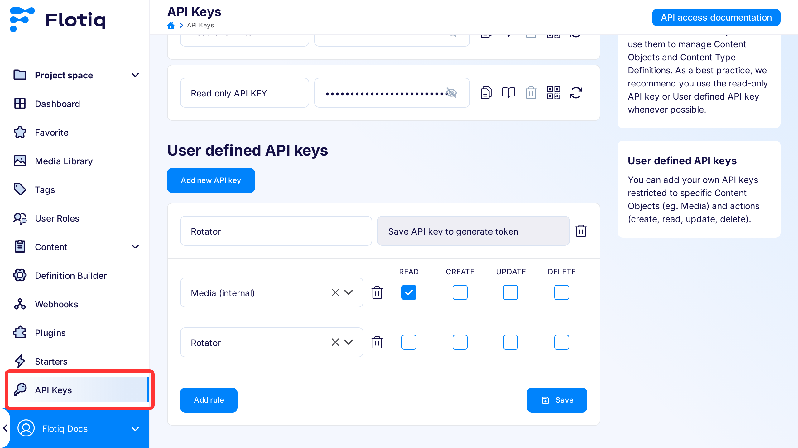

---
tags:
  - Developer
---

title: Building a banner rotator with an admin interface | Flotiq docs
description: This example shows how you can use Flotiq to build your own system that can rotate ads on your website.

# Building a banner rotator with an admin interface

This example shows how you can build your own system that can rotate ads on your website. You can easily adapt it to many other solutions and several techniques shown here may come handy in different projects.

Requirements:

- easy to use interface for administering ad banners,
- banner admin system decoupled from website CMS,
- option to group banners, for example vertical / horizontal,
- no changes to existing Web CMS code.

Plan:

- prepare a data model in Flotiq headless CMS,
- generate a read-only API key,
- write a simple script to load banners and display random one,
- attach the minified script to the website.

## 1. The Content Type Definition

The first step will be to define the data model. In Flotiq you do that by creating a new Content Type Definition. You can start with something simple - Flotiq supports iterative development because you can change your Content Type Definitions any time and adjust them to changing needs.

Since one of the requirements is the ability to group banners together - we can create a single Content Type Definition that will reflect a `Rotator` which will be composed of an array of `Banner` objects. In our case we chose not to build a separate `Banner` type - we'll simply add the required properties using Flotiq's `List` field.

{: .center}

Here are the properties we will require:

* Name (text)
* Width (number)
* Height (number)
* Banners (list)
    * Enabled (boolean)
    * Image (media)
    * Link (text)
    * Title (text)

after adding that into a new Flotiq Content Type you should see the following:

{: .center .border .width50}

Hit Save and you can start adding new Rotators!

## 2. Create an API Key

It's always recommended to use a scoped API key - that way access to content is restricted to specific Content Types and even if you add new data models in the future - your data will be safe.In our case - we will need access to 2 Content Types - `Rotator` and `Media`, so let's add a key for that purpose.

{: .border}

## 3. Build the rotator script

The rotator script should pull a particular rotator, randomly select one of the banners and display it in the target HTML container.

The HTML container can look like this:

```html
<div data-rotator-id="__ROTATOR_ID__" 
     data-rotator-key="__FLOTIQ_SCOPED_READ_ONLY_KEY__">
</div>
```
{ data-search-exclude }

and here's a very simple JavaScript that downloads the banner and shows it in the target container:

```html
<script>
let initRotator = function (linkElement) {

    /* Build html element with banner */
    let createHtmlBanner = (src, title, link) => {
        let anchor = document.createElement("a");
        let image = document.createElement("img");
        anchor.href = link;
        anchor.title = title;
        image.src = src;
        image.alt = title;
        image.classList.add('img-responsive', 'img-fluid');
        anchor.append(image);
        return anchor;
    }

    /* Get elements data */
    const rotatorId = linkElement.getAttribute('data-rotator-id');
    const readOnlyKey = linkElement.getAttribute('data-rotator-key');

    /* Fetch data from Flotiq API */
    fetch(`https://api.flotiq.com/api/v1/content/rotator/${rotatorId}?hydrate=1&auth_token=${readOnlyKey}`)
        .then(response => response.json())
        .then(rotator => {
            let enabledBanners = rotator.Banners.filter((banner) => banner.enabled === true);
            let randomBanner = enabledBanners[Math.floor(Math.random() * enabledBanners.length)];
            if (enabledBanners.length) {
                linkElement.innerHTML = '';
                linkElement.append(createHtmlBanner(
                    `https://api.flotiq.com/image/${rotator.Width}x${rotator.Height}/${randomBanner.image[0].id}.${randomBanner.image[0].extension}`,
                    randomBanner.title,
                    randomBanner.link));
            }
        });
    }

/* Initialize rotators */
document.querySelectorAll('[data-rotator-id]').forEach((element) => {
    initRotator(element);
})
</script>
```
{ data-search-exclude }

Who! That's not even 40 lines of code and we have a working ad rotator!

## 4. Simple CDN - GitHub + jsDelivr

One of the goals is to have a solution that will not change any CMS code and as such - can be used with any CMS tool. For that purpose we'll put the script on GitHub and serve through [jsDelivr](https://jsdelivr.com). How does this work?

1. Start with creating a public GitHub repo
2. Put the script in that repo
3. jsDelivr will do its magic
 
The only thing you need to do is prepare a correct URL. According to [jsDelivr](https://www.jsdelivr.com/features) docs you can use `https://cdn.jsdelivr.net/gh/[user]/[repo]@[version]/[file]`. If you add `.min.js` to the URL - the CDN will automatically minify the file for you.

With that - we don't need to put the entire script on our website, it's enough to reference it. The full banner rotator setup is then reduced to pasting these lines in your HTML:

```html
<div data-rotator-id="__ROTATOR_ID__" 
     data-rotator-key="__FLOTIQ_SCOPED_READ_ONLY_KEY__">
</div>
<script src="https://cdn.jsdelivr.net/gh/trzcina/flotiq-rotator@1/src/script.min.js" defer></script>
```
{ data-search-exclude }

This code can be pasted in any CMS. Here's how it looks in BoltCMS 

{: .center .border .width75}

and Wordpress

{: .center .border .width75}


## Next Steps

The solution shown in this article meets the basic requirements and is ready to use.Possible next steps are:

- ability to choose if the link should open in a new tab
- sending out a click event to Google Analytics
- ability to add AdSense ads to the Rotator.

!!! hint 
        Heads up! Try not to use `ad` or `adv` or `banner` in your paths and filenames. This way your chances of triggering AdBlock tools are lower!
