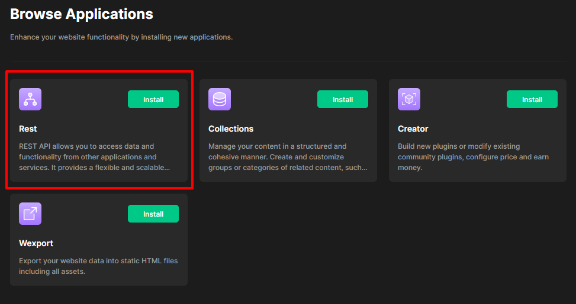
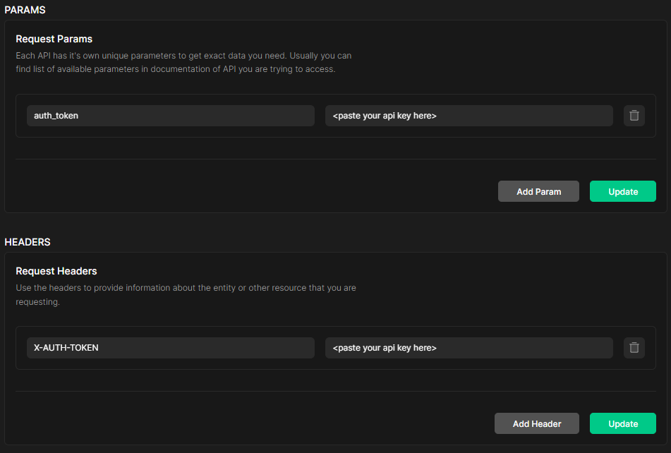
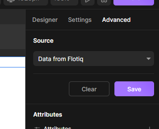
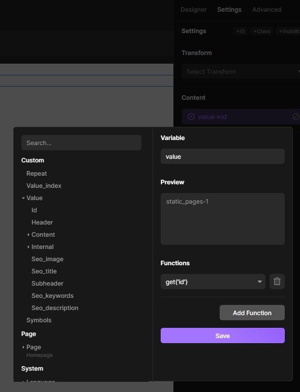
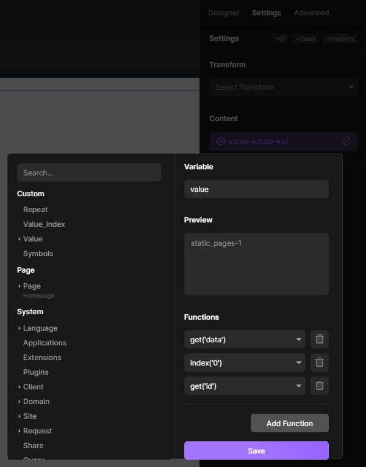
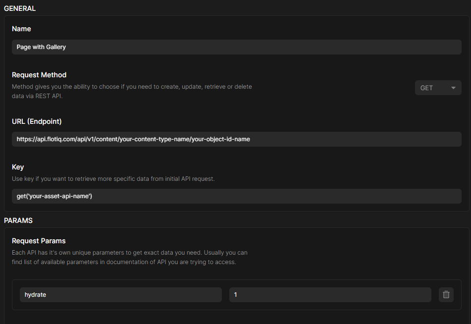
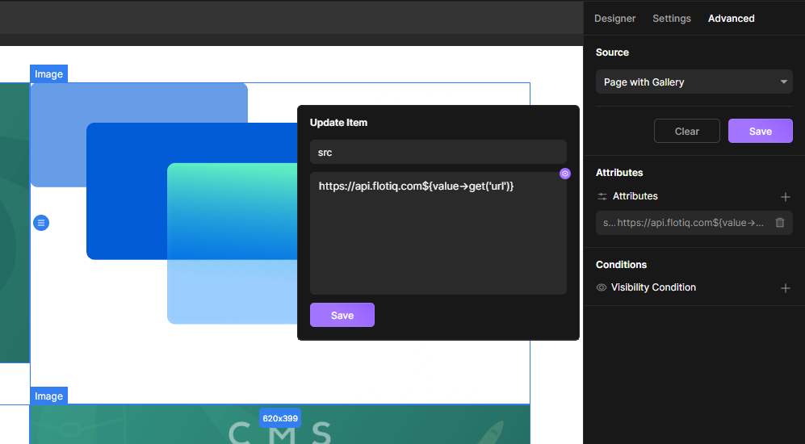

---
tags:
  - Content Creator
  - Developer
---

title: Flotiq Divhunt integration | Flotiq docs
description: Integrate Flotiq with Divhunt to jump-start your project code-free

# Use Divhunt and Flotiq to build a headless website without coding

This guide shows how to combine an online website builder Divhunt with Flotiq API. It will allow you to create beautiful webpages based on headless CMS workflow without coding for free.

## Prerequisites

1. Flotiq account [Register a Flotiq account here](https://editor.flotiq.com/register?plan=1ef44daa-fdc3-6790-960e-cb20a0848bfa){:target="_blank"}.
2. Flotiq API Key [More about Flotiq API Keys](https://flotiq.com/docs/API/){:target="_blank"}.
3. Divhunt account [Register a Divhunt account here](https://www.divhunt.com/sign-up){:target="_blank"}.

## Create new Divhunt project and connect it to Flotiq via Rest API

Head to Divhunt [projects page](https://www.divhunt.com/projects/){:target="_blank"} and create a new project or edit existing one, and open it in Divhunt's builder.

Then select `settings` in the top bar, navigate to `Browse Applications` and install Rest API.

 {: .center .border}

After the Rest API successfully installs you can use it from the `Applications` section in settings to create GET requests to Flotiq.

In the request editor, you have to fill the URL (Endpoint) field with the address for retrieving your content object data from your Flotiq account. You can find more information on retrieving Flotiq content object data with API in the [Working with Content Objects](https://flotiq.com/docs/API/content-objects/){:target="_blank"} section.

We also recommend using [Dynamic API Docs](https://flotiq.com/docs/API/dynamic-content-api/#api-docs){:target="_blank"} which allows you to quickly copy-paste dynamically generated code samples for your content to simplify your work.

Do not forget about adding an authorization method for your GET request from Divhunt, otherwise, the request will result in 401 error. You can do that either by adding a new request header with the key name `X-AUTH-TOKEN` and the key value being your Flotiq API Key, or adding a similar request param, but with key name = `auth_token`.

 {: .center .border}

Once you successfully add a request for Flotiq content in Divhunt, you have to embed it in your site using Divhunt builder. You can do so by adding a new element, be it a paragraph, rich text, image or other type of content. Then select it and navigate to the `Advanced` section in the editor, where you can set the source of this field's value to data retrieved from Flotiq.

 {: .center .border}

Now your new element can use Flotiq data to get its content, but it doesn't point to any exact value (unless you modified keys while creating the request).

To get the value from the source, head to `settings` of the selected element in Divhunt and modify the `Content` field using the `Set Variable` option.
A new window will pop up presenting you with variables available in your project. Data from Flotiq will be located in the `Custom` section in the `Value` dropdown.

The structure of the data in this section will vary, depending on whether you used an [endpoint for getting a single content object](https://flotiq.com/docs/API/content-type/getting-co/){:target="_blank"} from Flotiq, or an [endpoint for listing all content objects of your content type](https://flotiq.com/docs/API/content-type/listing-deleted-co/){:target="_blank"}.

If you used an endpoint for a single content object, all there is left to do is select the exact property, Divhunt element is supposed to get its value from.

 {: .center .border}

If you used an endpoint for listing all content objects, you will get a list of your content with this list's metadata. To use value from one of the objects in this list expand the `Value` dropdown and select `Data`. In the `Preview` section, you will be presented with an array of objects from your content type.

You can operate on the given list of content with functions. For example, if you want to get the value from the first object of this list, click on the `Add Function` button, add the function `Index` and set its value to 0. The result will be the same as if you retrieved the newest content object with an endpoint for getting a single object. Now you can use the `get` function to select the property of the content object you want to assign to your Divhunt element.

Below, we present you an example of functions used to get the ID from the first content object of the list.

 {: .center .border}

!!! Note 
    Use endpoints for single content object and list of objects depending on what type of content should be presented on the website.

    For example, if you want to create a blog section, that always presents to the viewer the newest `blog post` objects, use listed objects ordered by `createdAt` date.

    If you are adding a page description, that shouldn't change unless its exact `static pages` content object is modified, use an endpoint for getting single objects with this object's ID, or use filters on the objects list to ensure you will always get the value of correct object from your content type.

### Creating a gallery with images downloaded from Flotiq

You can easily create an image gallery on your Divhunt Page with Flotiq data. To do so you will need previously mentioned prerequisites and Flotiq content object, that contains `asset` property with `multiple` option enabled.

Once you have your Flotiq content ready, add a new GET request in your Divhunt's RST API application, which will source data from the content object with the gallery. This time you have to also add a request param with key: `hydrate`, and value: `1`, and a key with api name of your asset property in Flotiq. This will result in relation content properties like `asset` to retrieve the content object the relation is pointing towards.

{: .center .border}

After you finish configuring your request for an object with the gallery, go back to the builder and create a container that will hold images from the gallery. In the `designer` tab, you can change its layout to `grid` or any other type of layout you prefer.

Inside of your new container for the gallery create a single element of type `image` and set its source to your newly added GET request in `Advanced` tab.
Below the `Source` section, there will be `attributes` field you need to edit to change the default Divhunts URL to Flotiqs, and add a function for retrieving `url` value from your object: `https://api.flotiq.com${value->get('url')}`.

You should end up with a grid containing all of your images from your Flotiq content object. You can then transform the size, scale and other properties of the images in the `designer` section.

{: .center .border}

## Conclusion

Flotiq and Divhunt form a dynamic duo for website creation, enabling users to effortlessly build headless websites without the need for coding. This powerful combination streamlines the development process, offering a user-friendly solution that caters to both seasoned developers and beginners alike. With Flotiq's advanced content management capabilities and Divhunt's intuitive site-building tools, crafting captivating websites has never been easier.
