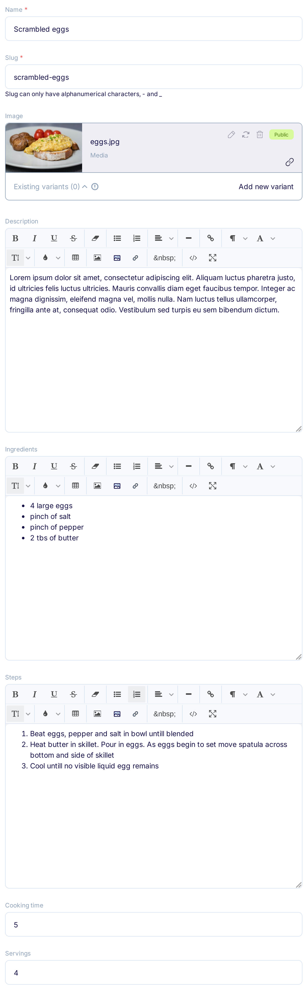
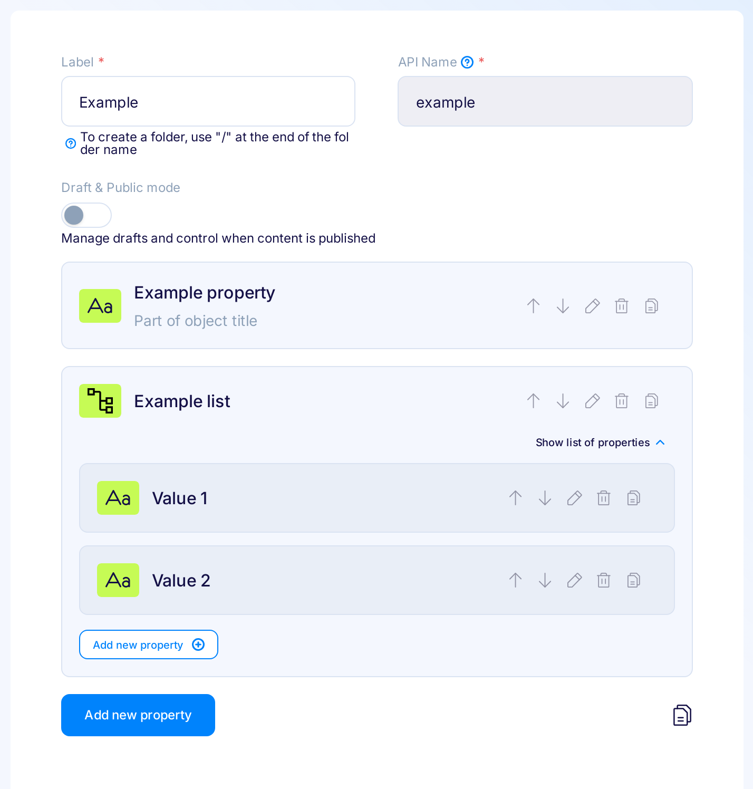
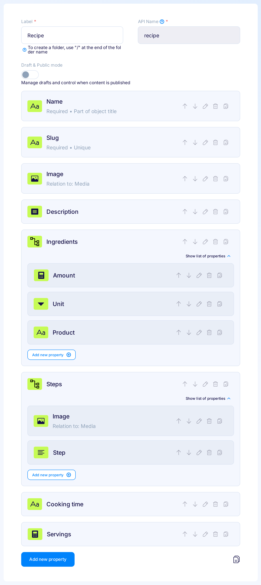

title: Building a stunning recipe website with Flotiq and Gatsby | Flotiq docs
description: A deep dive tutorial on Flotiq's complex data structures and accidentally building a stunning recipes website with Gatsby.

# Building a recipes website using complex data structures

## Introduction

Once you start building data models that are a little more complex you'll find that standard, fixed data types will be too restrictive. Flotiq has always supported  composition, where one Content Type can define a relation to another, but sometimes that's not enough. 

In this article we'll discuss a couple of particular problems you might encounter in designing a data model and later - working with it. Accidentally - we'll also build a stunning website with your favorite culinary recipes (scrambled eggs, of course). 

{: .center .width75 .border}

A simple `Recipe` model you might find useful for a recipe website could look like this:

* Name - text
* Slug - text
* Image - image
* Description - rich text
* **Ingredients** - rich text
* **Steps** - rich text
* Cooking time - number
* Servings - number

For such a model - Flotiq would generate a form looking like this:

{: .center .width75 .border}

and your API docs would describe that model this way:

{: .center .width75 .border}

This model might be acceptable for very simple websites, but having the `Ingredients` and `Steps` entered as unstructured text (even if using HTML `<li>`) will soon become an issue. 

Here's why:

1. No easy, programmatic, access to ingredients - eg. no way to build a shopping list out of it
2. Can't easily iterate through the recipe's steps - difficult to build an interactive UI, doesn't help with SEO either
3. People editing the content will use different formatting every time and the content will quickly become messy. You'll get entries like:

```
    2 eggs
    1 pinch of salt
    1 tbsp of butter
```
{ data-search-exclude }

```
- Eggs: 2
- Salt: 1 pinch
- Butter: 1 tbsp
```
{ data-search-exclude }

```
<ul>
    <li>2 eggs</li>
    <li>1 pinch of salt</li>
    <li>1 tablespoon of butter</li>
</ul>
```
{ data-search-exclude }

and so on.


## Solution


The problem of unstructured data can be solved using repeatable content fragments defined directly in a data model. It's a simple and convenient solution - both for developers modeling data and content editors as well.

Here's how you would go about it with Flotiq's `list` data type:

{: .center .width75 .border}


Benefits:

* Less mess, providing structure without the need to create additional content types.
* The `list` data type will render as a set of sub-forms - makes it easier for content editing.
* Easier data access from the API - more readable data structure.
* Easier to interpret complex data on the frontend.

## Use case: Recipe content type


Now - let's apply the `list` data type to the recipes Content Type. Let's assume each step  will include a description and an optional image and every ingredient - it's amount, unit, product name.

We can now extend the example mentioned above:

* Name - text
* Slug - text
* Image - image
* Description - richtext
* **Ingredients - a list of:**
    * amount - number
    * unit - text
    * product - text
* **Steps - a list of:**
    * description - textarea
    * image - image
* Cooking time
* Servings

Your Content Type definition in Flotiq would then look like this:

{: .center .width75 .border}

and you would expect this in the API docs:

{: .center .width75 .border}

> Yup, we know, we're drooling over Flotiq's API docs every time, too. And you know what? You don't need to write a line of code - the docs, just as your entire RESTful API are generated every time you change your model definitions!

And this is how the form for that Content Type would render:

{: .center .width75 }

We used the `list` datatype in this [Gatsby & Flotiq recipes starter](https://github.com/flotiq/gatsby-starter-recipes) and you can see the results [here](https://flotiq-starter-recipes.herokuapp.com/). With this data model it's now really simple for a frontend developer to interpret that content on the website.

{: .center .width75 .border}

## Experiment with the Gatsby starter

If you'd like to dig a little deeper into this recipe website, here's your quickstart:

1. **Install gatsby**
    ```bash
    npm install -g gatsby
    ```
    { data-search-exclude }

2. **Start project from the template using Gatsby CLI**
    
    ```bash
    gatsby new gatsby-starter-recipes https://github.com/flotiq/gatsby-starter-recipes.git
    ```
    { data-search-exclude }

3. **Setup "Recipe" Content Type in Flotiq** 

    Create your [Flotiq.com](https://flotiq.com) account. Next, create the `Recipe` Content Type:

    {: .center .width75 .border}

    _Note: You can also create `Recipe` using [Flotiq REST API](https://flotiq.com/docs/API/)._ 
    
4. **Configure application**

    The next step is to configure our application to know from where it has to fetch the data.
       
    You need to create a file called `.env` inside the root of the directory, with the following structure:

    ```
    GATSBY_FLOTIQ_BASE_URL="https://api.flotiq.com"
    FLOTIQ_API_KEY="YOUR FLOTIQ API KEY"
    ```
    { data-search-exclude }

5. **Launch the Gatsby project**

    Navigate into your new site’s directory and start it up.

    ```sh
    cd gatsby-starter-recipes
    npm install
    gatsby develop
    ```
    { data-search-exclude }

6. **Open the source code and start editing!**
    
    Your site is now running at `http://localhost:8000`!

## Conclusions

Flotiq's list data type is an extremely easy to use solution for structuring your data. It organizes the content and makes it easy for content editors to build content, at the same time it's fully supported in the API and API docs. 

Go play with the recipe website project - we've shared a Gatsby starter for that:

* [Gatsby starter recipes - GitHub](https://github.com/flotiq/gatsby-starter-recipes)
* [Gatsby starter recipes - deployed on Heroku](https://flotiq-starter-recipes.herokuapp.com)
