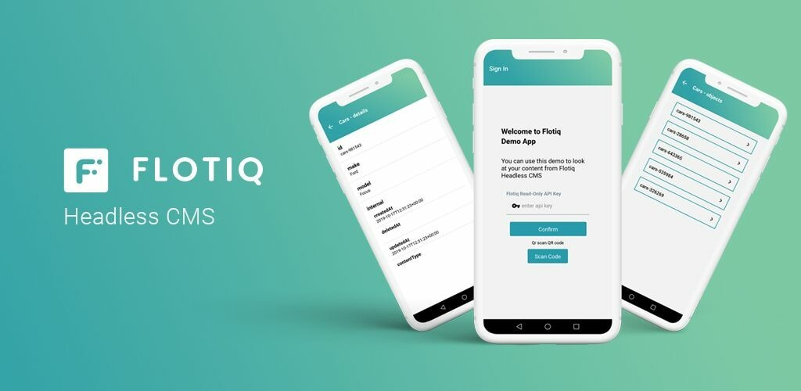
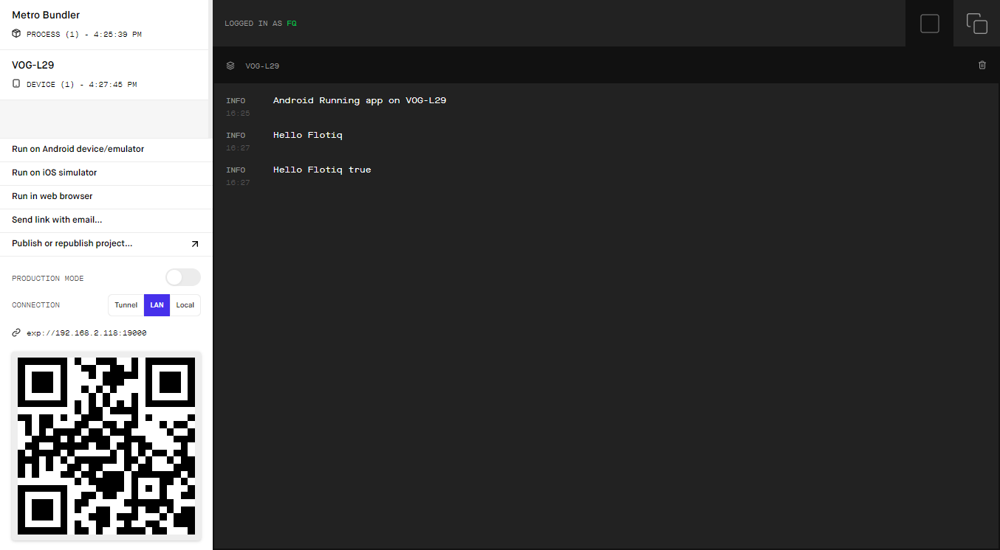
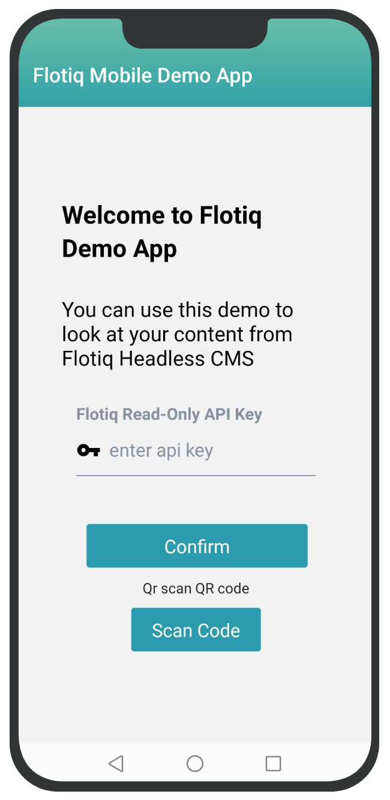
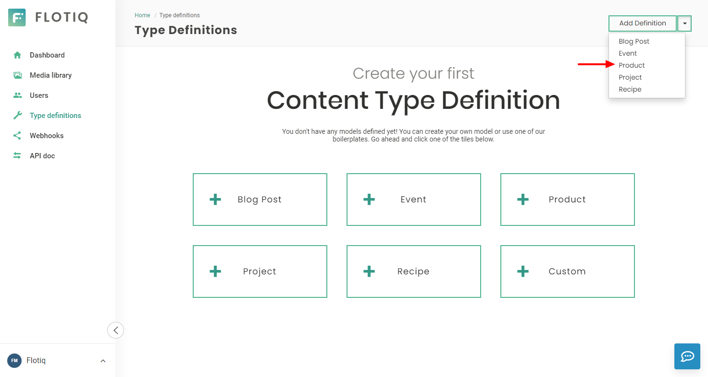
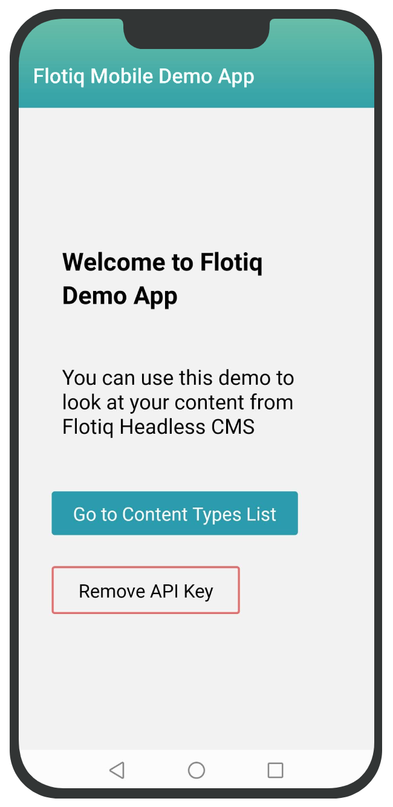
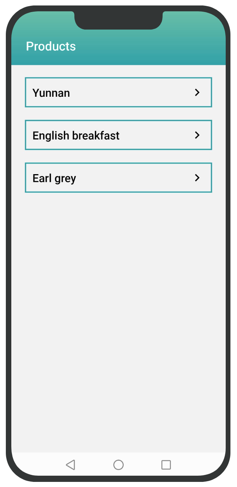
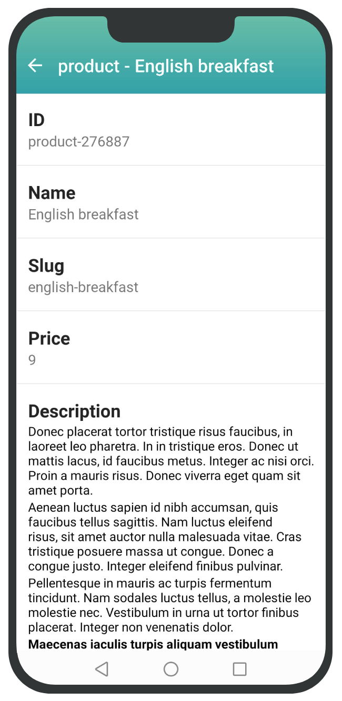

title: React-native mobile product showcase | Flotiq docs
description: This example shows how to use Flotiq and the Flotiq Mobile Expo to build a CMS-managed mobile application quickly.


# React-native mobile product showcase



This simple guide will show you how to adapt the [Flotiq Mobile Expo](https://github.com/flotiq/flotiq-mobile-demo) application source code to work as a product showcase app.

You will build a mobile app that will let your users:

- browse through the list of products,
- read product details,
- search through the product list.

The app will synchronize with your Flotiq account, so you can use the CMS to add and update products, and it will compile for Android and iOS phones out of the box.
The code changes required in this guide are minimal, but it might take some time to set up the working environment.


## Before you start

We encourage you to download the Flotiq mobile expo application from Google Play or Apple App Store and connect it with your Flotiq account. This way, you will understand how the application works and what you can expect.

[](https://apps.apple.com/app/flotiq-mobile-expo/id1505331246) [](https://play.google.com/store/apps/details?id=com.flotiqmobiledemo)


## Prerequisites

We assume:

- you already [registered a free Flotiq account](https://editor.flotiq.com/register.html)
- you know how to [retrieve your API keys](https://flotiq.com/docs/API/).
- you have Node 12 LTS or greater installed


## Quickstart

###  Fork the application repo

Go to [Flotiq Mobile Expo on GitHub](https://github.com/flotiq/flotiq-mobile-demo) and fork our repo. You will be making some changes to the code, and it will be easier to keep track of it later on. Don't forget to give us a star if you find it useful :smile:

### Set up your workspace

Install Expo CLI
```
npm install -g expo-cli
```
{ data-search-exclude }

### Start developing

Go to the projects' directory, install dependencies and run the Expo server.

```
cd flotiq-mobile-demo/
npm install
npm start
```
{ data-search-exclude }

The above commands will start Metro server [http://localhost:19002](http://localhost:19002/) where you can start the app on Android and iOS simulator or the real device.

{: .border}


### Explore the Flotiq Mobile app

To run the app on a real device, you have to have the Expo Go app installed ([Android app](https://play.google.com/store/apps/details?id=host.exp.exponent), [iOS app](https://apps.apple.com/us/app/expo-go/id982107779)).

When you open the Expo Go app, you have to scan the QR code presented on the [http://localhost:19002](http://localhost:19002/) page.

!!! note
    For more development tips, check the projects [GitHub repository](https://github.com/flotiq/flotiq-mobile-demo).


Now, on your device (or emulator), you should see the start screen of the Flotiq app.

{.width25}

The screen you will see allows you to connect with your Flotiq account, but we will do this through a simple change in the source code.

!!! note
    If you have any issues - consult the README file in the application repo.


## Create product Content Type in Flotiq

Now it's time to create the Content Type definition in the Flotiq. You can use our predefined
types to speed up the modelling process. You can update the Content Type definition in further development.

Go to the Content Type definitions tab and choose `Products`.
Save your Content Type definition. Now you can add your products to the Flotiq.

{: .border}

## Code updates

Here are the steps needed to connect the app to your Flotiq account and simplify it to display only the products.

### Authenticate with your Flotiq API key
The code in the repository uses a login screen to authenticate with your API key. We won't need that for our Product Showcase application, but we still need to authenticate with the Flotiq API.

1. Log in to the [Flotiq dashboard](https://editor.flotiq.com)
2. Create a [scoped API key](https://flotiq.com/docs/API/#user-defined-api-keys) for the Product and Media content types
4. Copy the key.
5. Now save it in your React code by adding the following line to the `App.js` file:
    ```
    import FlotiqNavigator from './app/navigation/FlotiqNavigator/FlotiqNavigator';
    import contentTypesReducer from './app/store/reducers/contentTypes';
    import authReducer from './app/store/reducers/auth';

    // Add this line after imports:
    AsyncStorage.setItem('flotiqApiKey', '<< YOUR FLOTIQ READ-ONLY API KEY HERE >>');

    enableScreens();
    ```
    { data-search-exclude }

Once you save the file, the application should automatically reload in the emulator and skip the login screen. You should now see the application's home screen:

{: .width25}

### Simplify navigation

We would like to skip to the products list immediately instead of showing the default Home screen and Content Type browser screen for our Product Showcase app. To achieve that - you will need to update how the navigation is structured.

Open the `StackNavigator.js` file and make the necessary adjustments:

- remove the `{HomeStackScreen()}` line in the `RootStackNavigator` component,
- remove the entire `Stack.Screen` called `ContentTypesScreen` in the `ContentTypesStackScreen` constant,

Make the following adjustments in `ContentTypeObjectsScreen.js`. Comment out the first lines add the following constants:
```
// const { 
//    contentTypeName, 
//    partOfTitleProps, 
//    withReachTextProps, 
//    refetchData, 
//    contentTypeLabel
// } = props.route.params;
const contentTypeName = 'product';
const partOfTitleProps = ['name'];
const withReachTextProps = ['description'];
const refetchData = true;
```
{ data-search-exclude }

### Cleanup list view

We want to replace the empty state view in the products list view and hide edit/remove options.

Open the `ContentTypeObjectsScreen.js` file and change those lines:

- Add the following import statement:
  ```
  import { Text } from 'react-native-elements';
  ```
  { data-search-exclude }

- Comment `NoData` component and use simple text for empty data placeholder
  ```
  // <NoData
  //     title="Create your first"
  //     message="Object of type"
  //     dataType={contentTypeLabel}
  // />
  <Text>No products to display</Text>
  ```
  { data-search-exclude }

- Remove the `FloatButton` component, as we don't want to allow users to add the products
  ```
  <FloatButton
      onPressFloatBtn={() => setFormModalVisibility(!formModalVisibility)}
  />
  ```
  { data-search-exclude }

- Comment the swipeable behaviour on the list to disable the edit and delete button when swiping an item
  ```
  // isSwipeable
  ```
  { data-search-exclude }

- In the `contentTypeObjectsScreenOptions` method - replace the `screenTitle` const with a static one:
  ```
  const screenTitle = "Products";
  ```
  { data-search-exclude }

### Cleanup single product view

In the `ObjectScreen.js` file, we want to remove additional menu options (edit, delete).
```
// headerRight: () => (
//     <MenuDropdown
//         items={items}
//     />
// ),
```
{ data-search-exclude }

Here's the [complete list of changes](https://github.com/netboxsoft/flotiq-mobile-demo/pull/1/files) that have been made in this tutorial to simplify the original app in case you missed something.

## Effects

That's it! You should now see the product list immediately after the app has loaded:

{: .width25 }
{: .width25 }

Now, you can go and play with it and publish it straight to the App stores.

The original application has already been approved by Apple and Google stores, so it should be a quick and easy task to get your app approved too!
