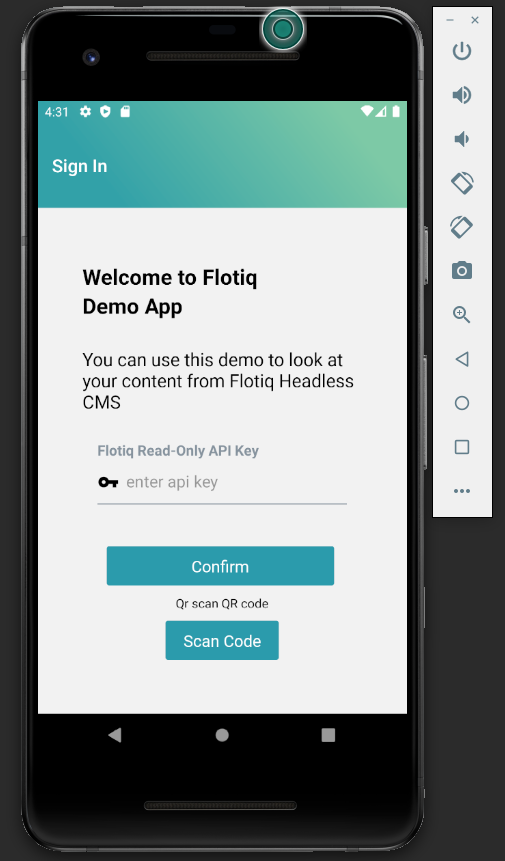
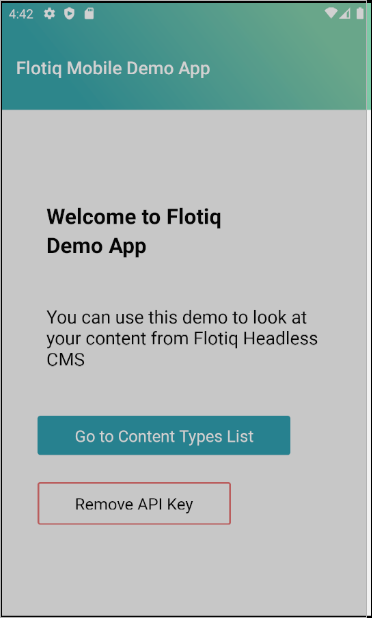
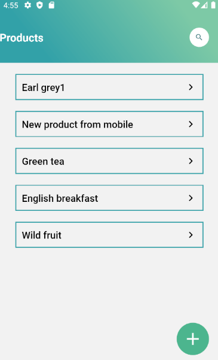

title: React-native mobile product showcase | Flotiq docs
description: This example shows how to use Flotiq and the Flotiq Mobile Expo to quickly build a CMS-managed mobile application.

# React-native mobile product showcase


This simple guide will show you how to adapt the [Flotiq Mobile Expo](https://github.com/flotiq/flotiq-mobile-demo) application source code to work as a product showcase app. 

You will build a mobile app that will let your users:

- browse through the list of products, 
- read product details,
- search through the product list.

The app will be synchronized with your Flotiq account, so you can use the CMS to add and update products and it will compile for Android and iOS phones, out of the box. The code changes required in this guide are minimal, but it might take some time to setup the working environment, both for Android and iOS.

## Prerequisites

We encourage you to download the Flotiq mobile expo application from your Google Play or Apple App Store and connect it with your Flotiq account. This way you will understand how the application works and what you can expect.

[](https://apps.apple.com/app/flotiq-mobile-expo/id1505331246) [](https://play.google.com/store/apps/details?id=com.flotiqmobiledemo)

The article assumes:

- you already [registered a free Flotiq account](https://editor.flotiq.com/register.html) 
- you know how to [retrieve your API keys](https://flotiq.com/docs/API/).

Here are the remaining essentials:

1. Fork the application repo

    Go to [Flotiq Mobile Expo on GitHub](https://github.com/flotiq/flotiq-mobile-demo) and fork our repo. You will be making some changes to the code and it will be easier to keep track of it later on. Don't forget to give us a star if you find it useful ;-)

2. Setup your workspace

    - Install [XCode](https://apps.apple.com/us/app/xcode/id497799835?mt=12) on your Mac or 
    - Install Android Studio, for example through [JetBrains Toolbox](https://www.jetbrains.com/toolbox-app/). Once installed - launch it and [install an emulator](https://developer.android.com/studio/run/emulator#install) with a recent Android Virtual Device
    - Clone the git repository you just forked or use ours: 
    `git clone https://github.com/flotiq/flotiq-mobile-demo`
    - Install node dependencies in your project directory:
    `npm install`
    - Start the iOS emulator
    `npx react-native run-ios`
    - Or start the Android emulator
    `npx react-native run-android`
    
    This should bring up the emulator and launch Flotiq app.
    {: .center .border .width10}

    The screen you will see allows you to connect with your Flotiq account, but we will do this through a simple change in the source code.

    If you have any issues - consult the README file in the application repo.

## Code updates

Here are the steps needed to connect the app to your Flotiq account and simplify it, so it only displays the products.

### Authenticate with your Flotiq API key
The code in the repository uses a login screen to authenticate with your API key. We won't need that for our Product Showcase application, but we still need to authenticate with the Flotiq API.
    
1. Login to the [Flotiq dashboard](https://editor.flotiq.com)
2. Create a [scoped API key](https://flotiq.com/docs/API/#user-defined-api-keys) for the Product and Media content types
3. Copy the key. 
4. Now save it in your React code, by adding the following line to the `App.js` file:
    ```
    import FlotiqNavigator from './app/navigation/FlotiqNavigator/FlotiqNavigator';
    import contentTypesReducer from './app/store/reducers/contentTypes';
    import authReducer from './app/store/reducers/auth';

    // Add this line after imports:
    AsyncStorage.setItem('flotiqApiKey', "<< YOUR FLOTIQ READ-ONLY API KEY HERE >>");

    enableScreens();
    ```

    Once you save the file - the application should automatically reload in the emulator and the login screen should be skipped. You should now see the application's home screen:

    {: .center .border .width10}

### Simplify navigation

For our Product Showcase app we would like to skip to the product list immediately, instead of showing the default Home screen and Content Type browser screen. To achieve that - you will need to update how the navigation is structured. 

Open the `StackNavigator.js` file and make the necessary adjustments:
   - remove the `{{HomeStackScreen()}}` line in the `RootStackNavigator` component,
   - remove the entire `Stack.Screen` called `ContentTypesScreen` in the `ContentTypesStackScreen` constant,
   - Make the following adjustments in `ContentTypeObjectsScreen.js`
        - comment out the first line add the following constants:
        ```
            //const { contentTypeName, partOfTitleProps, withReachTextProps, refetchData, contentTypeLabel } = props.route.params;
            const contentTypeName = 'product'
            const partOfTitleProps = ['name']
            const withReachTextProps = ['description']
            const refetchData = true

        ```
        - add the following import statement:
        ```
        import SplashScreen from 'react-native-splash-screen';
        ```
        - add the following `useEffect()` before the first one:
        ```
        useEffect(() => {
            if (!isLoading) {
                SplashScreen.hide();
            }
        }, [isLoading]);
        ```
        - In the `contentTypeObjectsScreenOptions` method - replace the `screenTitle` const with a static one:
        ```
        const screenTitle = "Products"
        ```
            
Here's the [full list of changes](https://github.com/andrzejwp/flotiq-mobile-demo/pull/1/files) that have to be made to simplify the original app, in case you missed something.

## Effects

That's it! You should now see the product list immediately after the app has loaded:
    {: .center .border .width10}


Now, you can go and play with it or publish it straight to the App stores. The original application has already been approved by Apple and Google stores, so it should be a quick and easy task to get your app approved too!