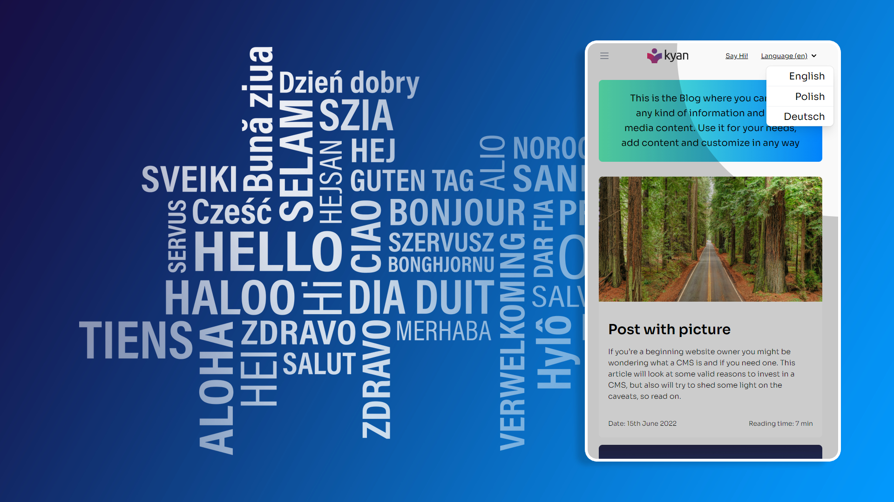
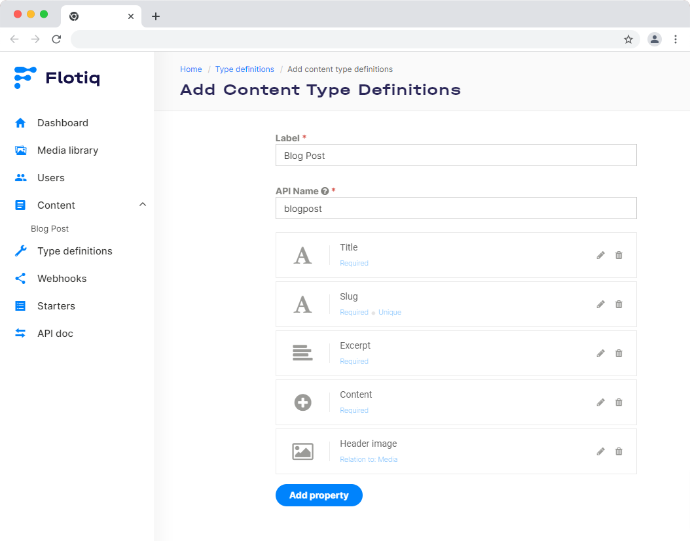
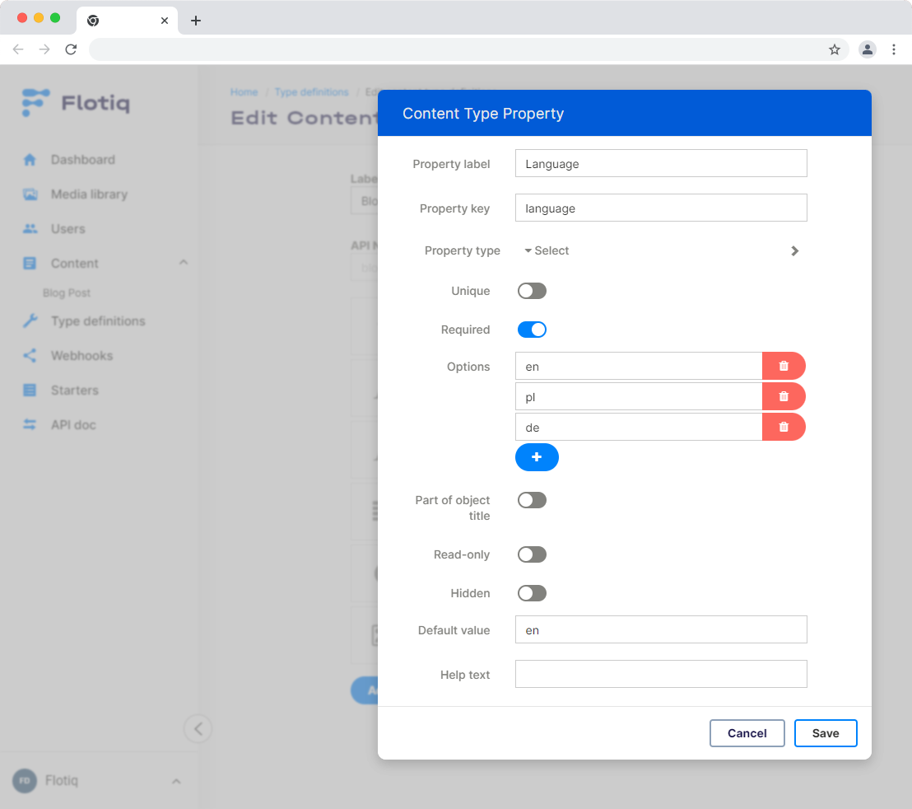
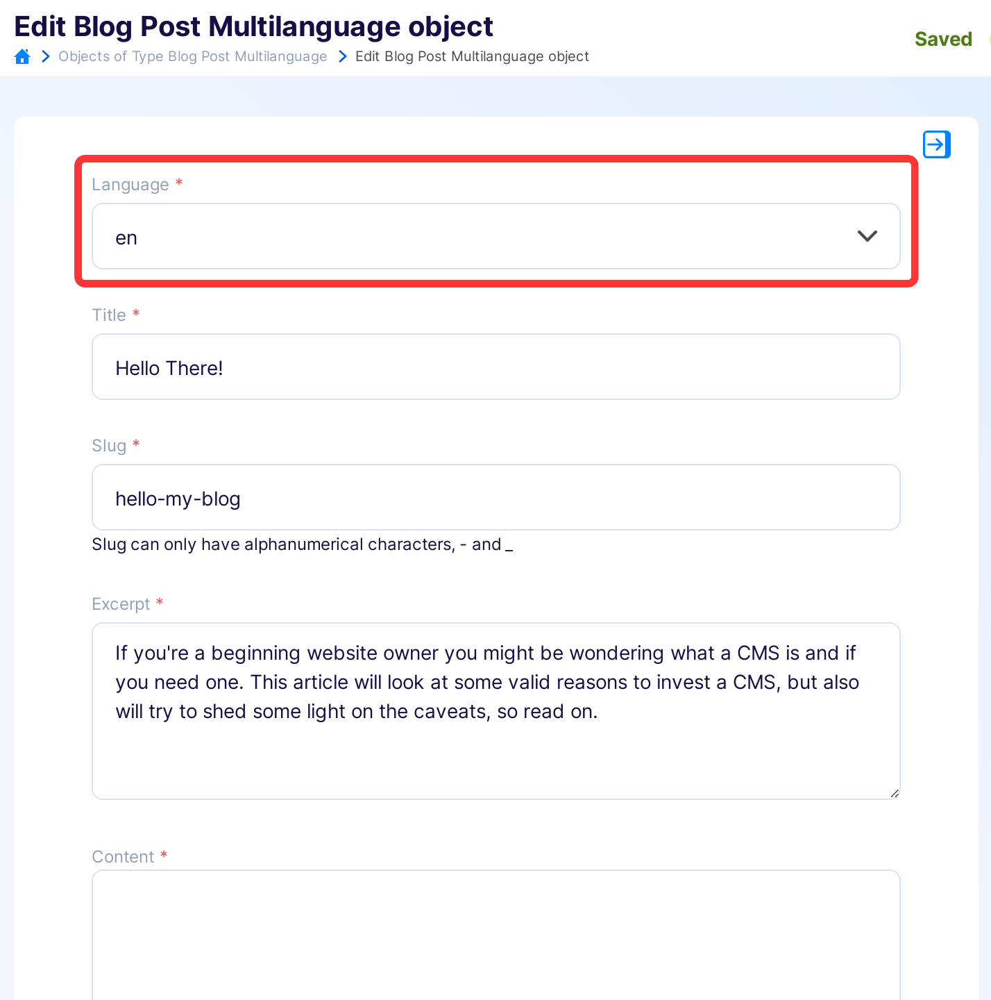
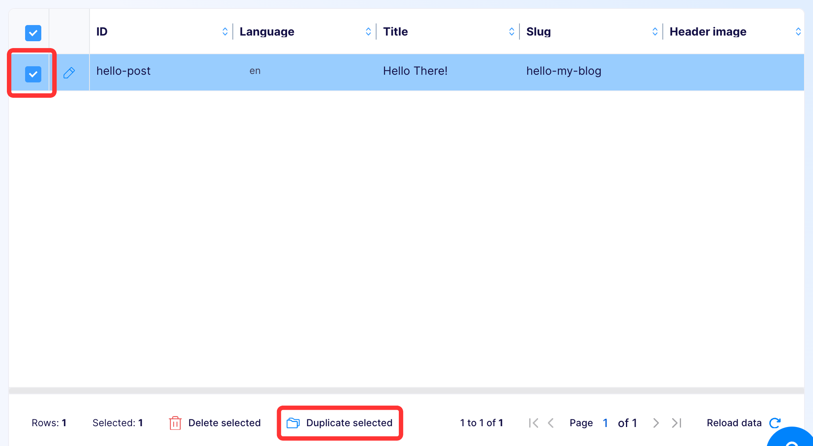
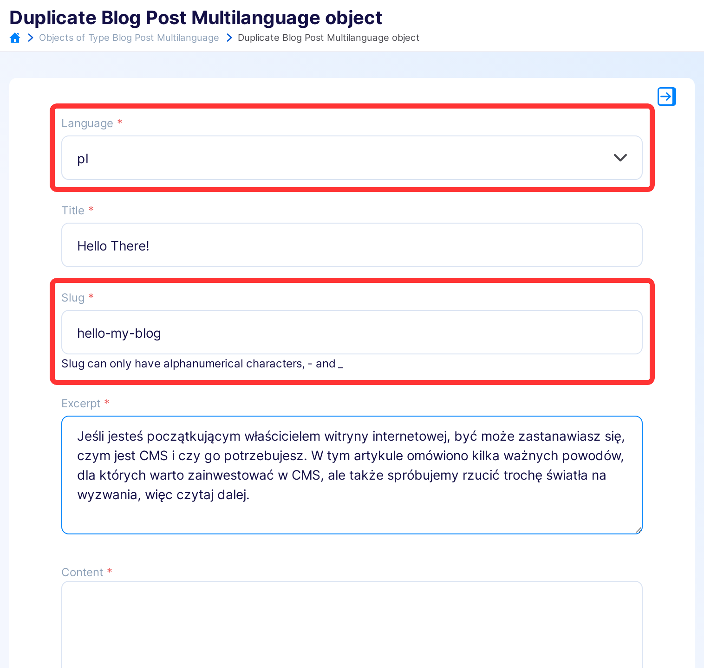
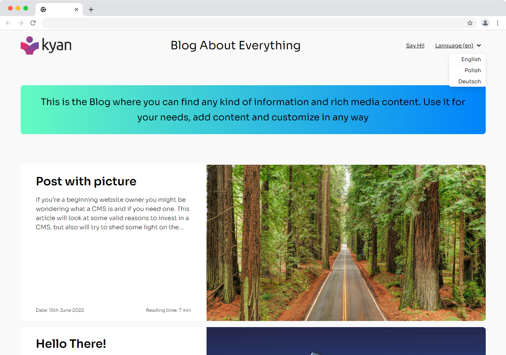

title: Multilingual content in Flotiq Headless CMS. Example model, API Calls & Demo | Flotiq docs
description: Nowadays, the multilingual site is quite a common thing. This article will show you how you can manage multilingual data in Flotiq.


# Multilingual content in Flotiq Headless CMS. Example model, API Calls & Demo




Nowadays, the multilingual site is quite a common thing. It is appreciated for the company to speak to
the client in their language.

This article will show you how to manage multilingual content in Flotiq. We use blog posts as an example,
but remember that you can use the Flotiq to manage various data.


## Step 1: Create a model for your data

At first, we create Content Type Definition (CTD) based on our predefined types. It will be a standard 
blog post object. Let’s see what the example blogpost CTD looks like:

{.border}

Next, we want to add minor modifications to this CTD. We need to make two changes:

* Add language attribute (input type select, required, default value ‘en’);
* Make slug not unique because now our unique identifier will be language + slug.

{.border}

That is our final blog post CTD. Now it’s time to add some data.

## Step 2: Add multilingual data to the Flotiq

Our workflow will be simple. We will create content in the base language (in our case, it is English);
for example:

{: .border}

Next, we will use the duplicate option on the data grid view to create an alternative language version. 
Make sure to set proper language. The slug should remain unchanged, as this property matches different
versions of the same entry.

{: .border}

{: .border}

Before going to the next step, we recommend adding a few posts with language versions.

## Step 3: Play with your API to get multilingual content

Here we will check what our data looks like via our personalized API.


### 1. List all articles:

```bash
curl --request GET 'https://api.flotiq.com/api/v1/content/blogpost?auth_token=_YOUR_TOKEN_'
```
{ data-search-exclude }

### 2. List all articles in the Polish language

```bash
curl --request GET 'https://api.flotiq.com/api/v1/content/blogpost?filters={"language":{"type":"equals","filter":"pl"}}&auth_token=_YOUR_TOKEN_'
```
{ data-search-exclude }

### 3. List all language versions of a single article

```bash
curl --request GET 'https://api.flotiq.com/api/v1/content/blogpost?filters={"slug":{"type":"equals","filter":"hello-my-blog"}}&auth_token=_YOUR_TOKEN_'
```
{ data-search-exclude }

!!! Note
    You can use a [Postman package](https://flotiq.com/docs/API/generate-package/) to play with your API easily. 
    To generate your own package, go to the Flotiq Dashboard. Next, import it to the Postman app.


## Pros and cons

This is a convenient way of implementing multilingual content in your project. 
Let's sum up the possible pros and cons of this approach:

Pros:

* You can easily enable multilanguage to your existing site;
* A simple data structure, simple API;
* Language versions can differ in plain values and even in relations and connected media;
* Separated entries for each language.

Cons:

* You cannot localize slug;
* Switching between languages in the dashboard could be more convenient.

## Extra: Multilingual ready-to-use Gatsby Starter

We created a simple Gatsby Starter with multilingual content stored in Flotiq. It shows how to utilize 
the assumptions of this article and how they can be implemented in a real-world application.

See live demo here: [https://flotiqgatsbyblogmultilanguage.gtsb.io](https://flotiqgatsbyblogmultilanguage.gtsb.io)



You can check the [GitHub PR](https://github.com/flotiq/flotiq-gatsby-blog-multilanguage/pull/1),
which contains changes between a simple non-multilingual site and a multilingual one.

This [example repository](https://github.com/flotiq/flotiq-gatsby-blog-multilanguage) contains:

* Data source Flotiq configured to use multilanguage content
* Content Type Definition for multilingual blogpost site
* Multilanguage routing (/en /pl /de routes)
* Browser language detection
* Reusable LanguageSelect component
* LanguageFallback component for displaying non-translated article fallback
* Template translations using i18n with example JSON files
* Command to extract translation keys to JSON files
* Example data

See the source code or follow the [README](https://github.com/flotiq/flotiq-gatsby-blog-multilanguage) 
to develop and deploy your own multilingual site in a few minutes.
