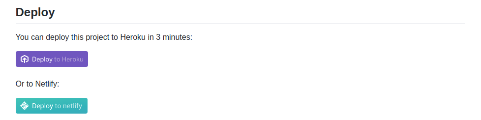
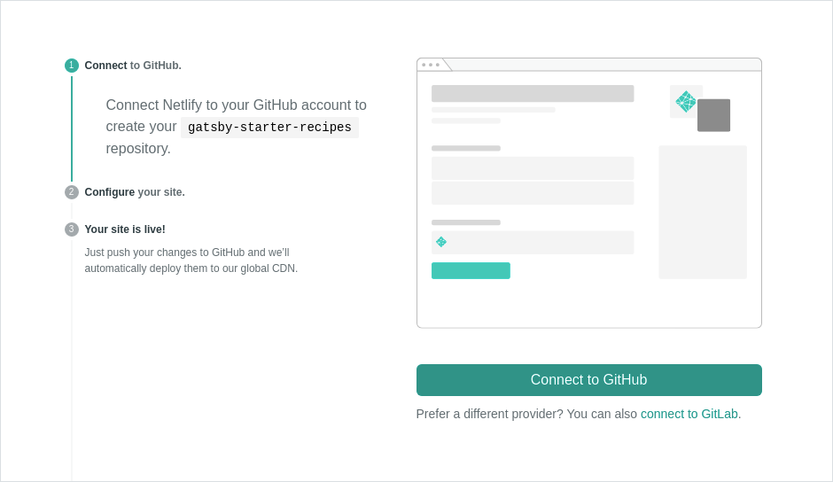
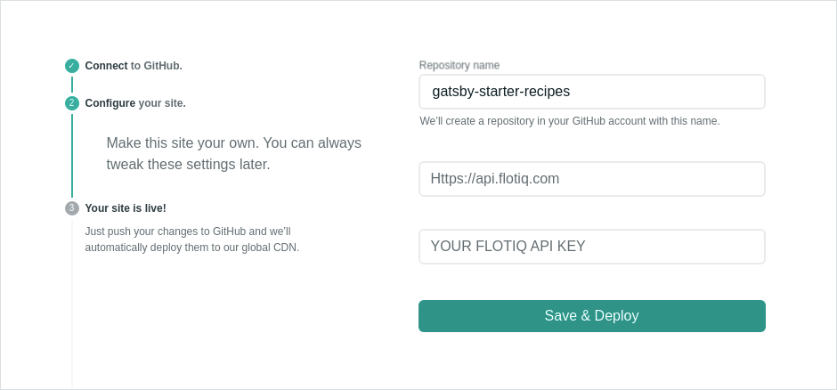
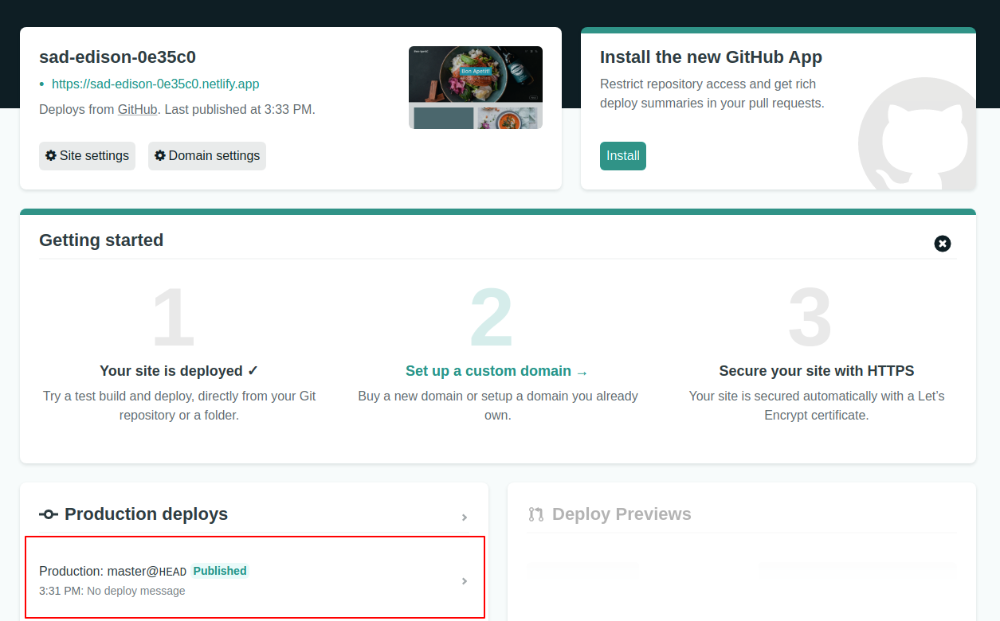
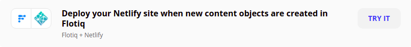
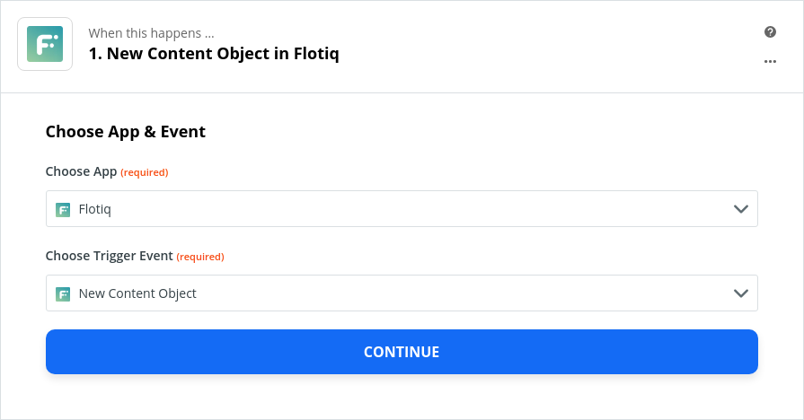
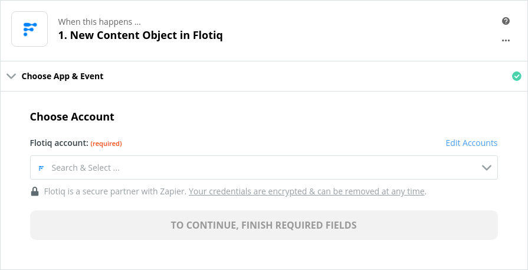
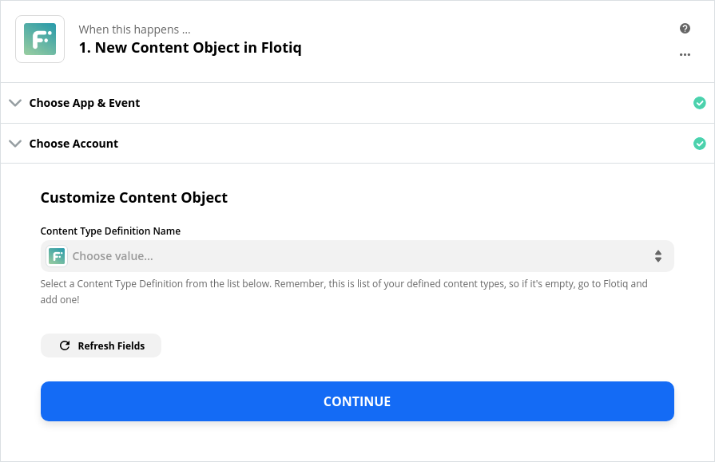
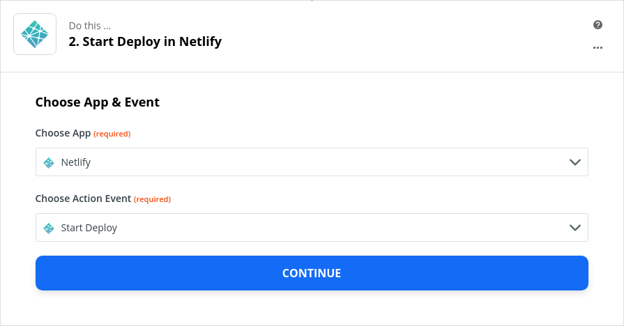
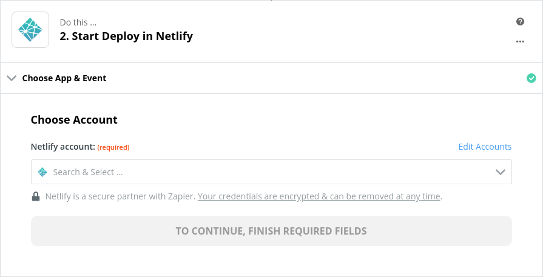

title: Use Netlify, Zapier and Gatsby to instantly deploy your Flotiq content. | Flotiq Deep dives
description: Build your own serverless deployment pipeline using Gatsby, Netlify, Zapier and Flotiq, instantly deploy your updated content, for free.

# Use Netlify, Zapier and Gatsby to instantly deploy your Flotiq content

## Overview

In this article, we'll setup an extremely powerful, yet totally effortless (and free!) deployment pipeline for your Gatsby websites. We'll use Netlify as a deployment target, so no servers required.

## Why?

Gatsby is a static website generator. What that means is - your content won't update, unless you rebuild and redeploy your website. This might quickly become a bit of a pain if you're doing content updates often, or if the person doing these updates doesn't know how to rebuild your site.

You can easily set up GitHub hooks to update your website when your code changes, but that doesn't work for **content** changes.

> Go explain to a copywriter that they need to `gatsby build` and `npm run deploy` every time they update the website's content!

What you want to have is an automated process that will publish the website once your **content** is updated.

This article covers step by step guide, how to: 

1. Setup your data source using a Gatsby Starter and Flotiq
2. Setup your page deployment in Netlify
3. Setup an automation workflow in Zapier

In the end - whenever you update your page content in Flotiq, Zapier will trigger deploy process in Netlify to make sure your site is up to date!


Let's dive deep.

## Prerequisites

1. Netlify Account (free) [Sign up for Netlify](https://app.netlify.com/signup){:target="_blank"}
2. GitHub/Gitlab/Bitbucket account (free) [Sign up for GitHub](https://github.com/join){:target="_blank"}
3. Zapier account (free) [Sign up for Zapier](https://zapier.com/sign-up/){:target="_blank"}
4. Flotiq account (free) [Register a Flotiq account here](https://editor.flotiq.com/register.html){:target="_blank"}.

## Grab one of our Gatsby Starters!

Head out to our [Github repository](https://github.com/flotiq) and pick one of Gatsby starter projects. Let's use the popular [Gatsby Recipes Starter](https://github.com/flotiq/gatsby-starter-recipes). 

```bash
gatsby new gatsby-starter-recipes https://github.com/flotiq/gatsby-starter-recipes.git
cd gatsby-starter-recipes
```
{ data-search-exclude }

You can either build the Content Types yourself or use our predefined content

```
node ./example/importExample.js
```
{ data-search-exclude }

This handy command will add 4 images and 2 recipes to your Flotiq account.


Each of our gatsby starters has a "Deploy to Netlify" button at the bottom of the README:

{: .center .width75 .border}

Click it: [](https://app.netlify.com/start/deploy?repository=https://github.com/flotiq/gatsby-starter-recipes){: .button-center-vertical}

## Configure your Netlify site deploy

You'll now see a 3-step configuration process, that involves:

1. Connecting to your GitHub account
2. Setting up required parameters for deploy
3. Deploying your site

{: .center .width75 .border}

Connect your GitHub account and head on to the next step.

In the next view, you will be prompted to enter 3 parameters:

* Repository name - this is where Netlify will create a new repository for you.
* Flotiq API url - enter: `https://api.flotiq.com`
* Your Flotiq read-only API Key.

> We advise that you always create a scoped API key. Its disposable nature makes it a safer choice. More about Flotiq API Keys [here](https://flotiq.com/docs/API/)

{: .center .width75 .border}


After filling in all the fields, hit the `Save & Deploy` button and wait for your site to build.

That's all! You will be redirected to your Netlify dashboard. You can check the build logs by clicking here:

{: .center .width75 .border}

## Manage Netlify deploys using Zapier

By default, Netlify will observe any changes in your repository, so any push will trigger a build on Netlify. This is usually what you want because you might be pushing some new features to your website and you want them to automatically appear online.  

But your website is not just the code in your repository. You want your **content** to be up to date too! We'll show you how to use [Zapier](https://zapier.com) to update your website every time you create new content.

1. Log in to Zapier
2. On your account dashboard, hover over the left sidebar and click `Make a Zap` or use our [Zap Template](https://zapier.com/apps/flotiq/integrations/netlify/137950/deploy-your-netlify-site-when-new-content-objects-are-created-in-flotiq) to speed up the basic setup.

    {: .center .width75 .border}

3. As a trigger application, choose `Flotiq`, and for the event `New Content Object`.

    {: .center .width75 .border}

4. Next, choose your Flotiq account and click `Continue`. 

    {: .center .width75 .border}


5. Choose your Content Type Definition from the list.

    {: .center .width75 .border}

6. Click continue. You can skip the test phase and proceed to the next action.

7. Choose `Netlify` as an action application, and `Start deploy` as an event.

    {: .center .width75 .border}

8. Sign in to your Netlify account and proceed further.

    {: .center .width75 .border}

9. Select your site from the list. Alternatively, you can choose to clear build cache, but it will increase the build time.

    {: .center .width75 .border}

10. In the last step, you can test if this action works properly. It will rebuild your site.


## That's it
You're set! Click `Turn the Zap On!`. Now you can create a new entry in the [Flotiq editor](https://editor.flotiq.com) and see that your recipe will appear on your website in a moment.

## Useful links
Learn more about building powerful integrations with Zapier and Flotiq:

1. [More about Zapier Integrations in Flotiq](../../Universe/zapier/)

Or try one of the awesome Gatsby starters we've integrated with Flotiq:

1. [Build an e-commerce site using Gatsby, Flotiq and Snipcart](https://dev.to/flotiq/build-an-e-commerce-site-with-gatsby-and-snipcart-3jpg)
2. [Build a recipe website using Gatsby and Flotiq](https://dev.to/flotiq/building-a-recipes-website-using-gatsby-and-flotiq-2b3a)


