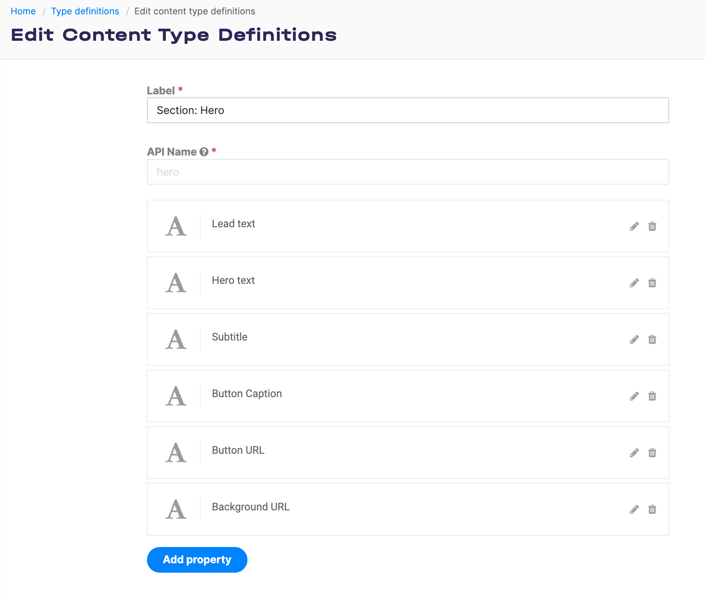
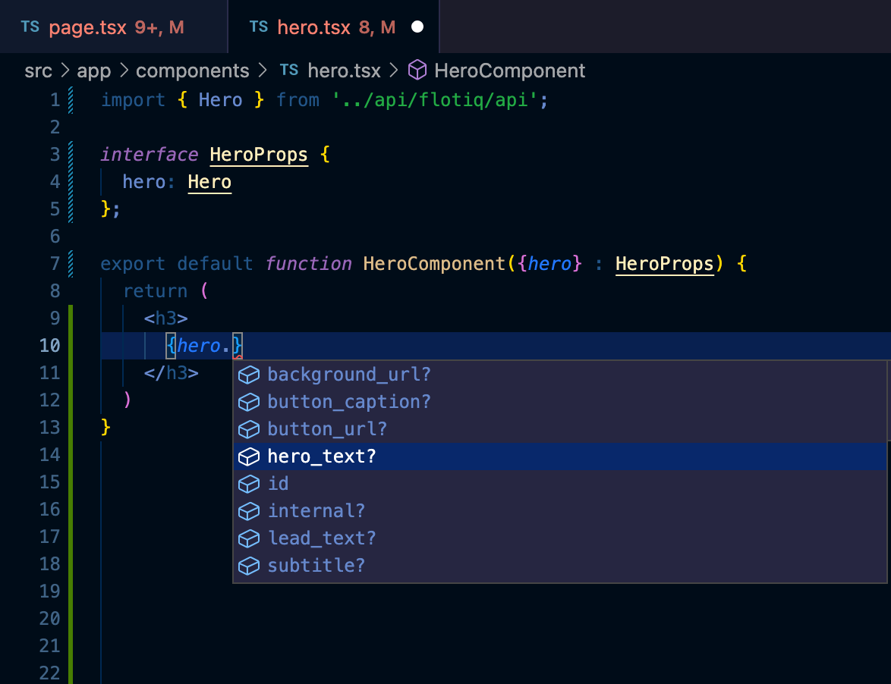

---
tags:
  - Developer
---

title: Learn how to use data from Flotiq in React and Typescript projects with Flotiq SDK | Flotiq docs
description: Generate an OpenAPI API client library and integrate it in Next.js projects, benefit from Typescript support and code autocompletion in your IDE.

# Use data from Flotiq in React and Typescript projects

!!! info
    This page demonstrates a TypeScript-based approach to React components hydrated with data coming from Flotiq

## Introduction

In this short article we will show how to setup a Flotiq content type and use your OpenAPI schema to generate a Typescript-compatible API client that will integrate seamlessly with your Next.js project. As a result, you will be able to consume any data you store in Flotiq in Next.js with benefits like code completion in your IDE.

## Prerequisites

* Flotiq account
* basic Typescript and React knowledge.

## Create a content type in Flotiq

Start with a simple content type, for example one that represents a Hero section in your website.

 {: .center .border .width75}

Once you create the content type definition - go ahead and add some objects too.

## Create NextJS project

Next, use the `create-next-app` to setup a fresh Next.js project

```bash
npx create-next-app@latest flotiq-component-demo --typescript --eslint
cd flotiq-component-demo
```
{ data-search-exclude }

Read more about [create-next-app here](https://nextjs.org/docs/api-reference/create-next-app).

## Get Flotiq API Key

To access your Flotiq data in your app, you need to obtain your Flotiq API key.
There are two ways of doing that:

### Flotiq Setup

We can use `flotiq-setup` to import API keys to variable files like `.env`.

Simply run `npx flotiq-setup` to automatically import your API keys to variable files.
After running the `flotiq-setup` script, your browser will pop-up with a prompt to select which space the app will be able to access.
 

### Flotiq Dashboard

If you want to manually get your API key for your application, you can do so by visiting Flotiq Dashboard.
API Keys can be accessed via the API Keys page in the Flotiq Panel.
For our purpose, the Read-only key is sufficient.
{: .center .width25 .border}
{: .center .border}


After you obtain your API key, you need to provide it to Codegen and your app.
To do so, just create `.env` file in the app folder with the following content:
```
FLOTIQ_API_KEY=<YOUR_API_KEY>
```
{ data-search-exclude }

Now that you added the API key, you can proceed with the next steps.

!!! note
    You can read more about [API Keys here.](/docs/API/)

## Flotiq Codegen TS - Flotiq SDK

This package simplifies Typescript Fetch API integration for your Flotiq project, tailored to your Flotiq account data.
To build your customized API package, just run this command:

To install Flotiq SDK, you can use flotiq-nextjs-setup CLI, that will not only seamlessly generate SDK for your Next.js project but will also add content cache revalidation endpoint, handle draft mode for unpublished content on Flotiq, and more. To use the flotiq-nextjs-setup CLI simply run the setup:
    ```bash
    npx flotiq-nextjs-setup
    ```
    { data-search-exclude }

If you want to read more about our flotiq-nextjs-setup CLI, refer to our [Flotiq NextJS docs](docs/CLI/starting-new-project-nextjs.md).

If instead you prefer to install only Flotiq SDK manually, do the following steps:

```bash
npx flotiq-codegen-ts generate 
```
{ data-search-exclude }

!!! note 
    If you make any changes (additions or deletions) to the content type definitions in your Flotiq account,
    you will need to rerun npx `flotiq-codegen-ts generate` command

!!! note 
    You can use the `flotiq-codegen-ts generate --watch` to enable automatic detection of changes to your
    `Content definitions` by `Flotiq Codegen TS`. This will automatically regenerate the SDK to reflect the current
    state of your `Content definitions`.

## Use the API

We’re almost done! Now you have to edit 2 files in the NextJS repo: 1. `src/app/page.tsx` and 2. `src/app/components/hero.tsx` (new file) to start using the API.

Let’s start with `page.tsx`. First, we need to connect to Flotiq API, add the following lines to your file

```javascript
// add this at the beginning of the file, with other imports
import { FlotiqApi } from '../flotiqApi/index'

const apiKey = process.env.FLOTIQ_API_KEY

async function getData(
    page = 1,
    limit = 10,
    filters = undefined,
    direction = 'asc',
    orderBy = 'date'
) : HeroList {
  const api = new FlotiqApi(apiKey);

  // let's fetch all sections and make sure we hydrate them 
  return await api.hero.list({
      page,
      limit,
      filters,
      order_by: orderBy,
      order_direction: direction,
      hydrate:1
  })
    
}
```
{ data-search-exclude }

next, let’s update the `Home()` component to display all the sections found:

```bash
export default async function Home() {
  const list = await getData();
  return (
    <main>
      <div className="bg-white py-24 sm:py-32">
          {list.data?.map((section, index)=>{
              return <HeroComponent hero={section}></HeroComponent>
            });
          }
          </div>
    </main>
  )
}
```
{ data-search-exclude }

now, let’s create that HeroComponent in the `src/app/components/hero.tsx` file:

```bash
import { Hero } from "../../../flotiqApi/src";

interface HeroProps {
  hero: Hero
}

export default function HeroComponent({hero} : HeroProps){
    
    return (
            <div>
             <h3>
                 {hero.lead_text}
             </h3>
            </div>
    );
}
```
{ data-search-exclude }


That’s it! Start using TypeScript with Flotiq data. By now you probably noticed how convenient it is to have explicit typing and code completion in your editor:

 {: .center .border}
