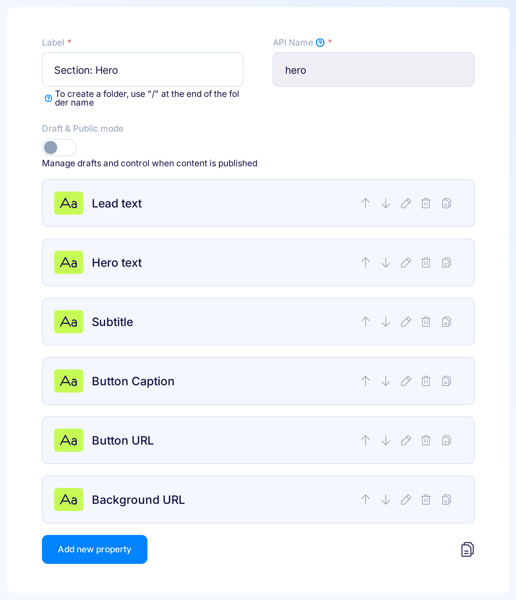

title: Learn how to use data from Flotiq in React and Typescript projects | Flotiq docs
description: Generate an OpenAPI API client library and integrate it in Next.js projects, benefit from Typescript support and code autocompletion in your IDE.

# Use data from Flotiq in React and Typescript projects


!!! info
    This page demonstrates a TypeScript-based approach to React components hydrated with data coming from Flotiq


## Introduction

In this short article we will show how to setup a Flotiq content type and use your OpenAPI schema to generate a Typescript-compatible API client that will integrate seamlessly with your Next.js project. As a result you will be able to consume any data you store in Flotiq in Next.js with benefits like code completion in your IDE.

## Prerequisites

* Flotiq account
* basic Typescript and React knowledge.

## Create a content type in Flotiq

Start with a simple content type, for example one that represents a Hero section in your website.

 {: .center .border}

once you create the content type definition - go ahead and add some objects too.

## Create NextJS project

Next, use the `create-next-app` to setup a fresh Next.js project

```bash
npx create-next-app@latest flotiq-component-demo --typescript --eslint
cd flotiq-component-demo
```
{ data-search-exclude }

Read more about [create-next-app here](https://nextjs.org/docs/api-reference/create-next-app).

## Export Flotiq API and build the API package

When the Next.js project is already up and running you will now connect it to your Flotiq API. Start by exporting the API definition into a file. You will need your read-only API key to do this - [here’s how to get it](https://flotiq.com/docs/API/?h=api+key#application-api-keys).

```bash
export FLOTIQ_RO_API_KEY=<YOUR_RO_API_KEY_HERE>
curl -X GET "https://api.flotiq.com/api/v1/open-api-schema.json?hydrate=1" -H "X-Auth-Token: ${FLOTIQ_RO_API_KEY}" > oas.json
```
{ data-search-exclude }

This command will save your OpenAPI definition into a file called `oas.json` in your current directory. Next - you will process that file with `openapi-generator` to build the API client:

```bash
docker run --rm -it -v "${PWD}:/tmp" \
       --workdir /tmp openapitools/openapi-generator-cli \
       generate -i /tmp/oas.json -g typescript-node -o /tmp/flotiq-api \
       --additional-properties=modelPropertyNaming=original,paramNaming=original,withNodeImports=true,supportsES6=true,npmName=component-api,npmVersion=0.1.0
```
{ data-search-exclude }

This will save the API in `flotiq-api` directory, so you now have to move the built API into its proper location (note that the target path will change if you are not using NextJS `src` and `app` directories):

```bash
mv flotiq-api ./src/app/flotiq
```
{ data-search-exclude }


## Use the API

We’re almost done! Now you have to edit 2 files in the NextJS repo: 1. `src/app/page.tsx` and 2. `src/app/components/hero.tsx` (new file) to start using the API.

Let’s start with `page.tsx`. First, we need to connect to Flotiq API, add the following lines to your file

```bash
// add this at the beginning of the file, with other imports
import { ContentHeroApi, ContentHeroApiApiKeys, HeroList } from './flotiq/api'


const FLOTIQ_API_URL = "https://api.flotiq.com";
const FLOTIQ_API_KEY = "<YOUR_RO_API_KEY_HERE>"; // RO


async function getData() : HeroList {

  const heroApi = new ContentHeroApi(FLOTIQ_API_URL);
  heroApi.setApiKey(ContentHeroApiApiKeys.HeaderApiKeyAuth, FLOTIQ_API_KEY);

  // let's fetch all sections and make sure we hydrate them 
  const {body: list} = await heroApi.listHero(undefined, undefined, undefined, undefined, 1)
  
  return list;

}
```
{ data-search-exclude }

next, let’s update the `Home()` component to display all the sections found:

```bash
export default async function Home() {
  const list = await getData();
  return (
    <main>
      <div className="bg-white py-24 sm:py-32">
          {list.data?.map(function(section, index){
  
              return <HeroComponent hero={section}></HeroComponent>
            })
          }
          </div>
    </main>
  )
}
```
{ data-search-exclude }

now, let’s create that HeroComponent in the `src/app/components/hero.tsx` file:

```bash
import { Hero } from "../flotiq/api";

interface HeroProps {
  hero: Hero
}

export default function HeroComponent({hero} : HeroProps){
    
    return (
            <div>
             <h3>
                 {hero.lead_text}
             </h3>
            </div>
    );
}
```
{ data-search-exclude }


That’s it! Start using TypeScript with Flotiq data. By now you probably noticed how convenient it is to have explicit typing and code completion in your editor:

 {: .center .border}

