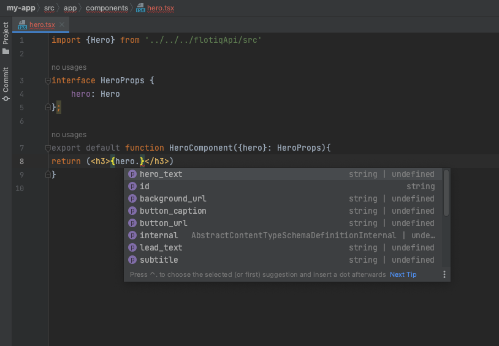

title: Learn how to use data from Flotiq in React and Typescript projects | Flotiq docs
description: Generate an OpenAPI API client library and integrate it in Next.js projects, benefit from Typescript support and code autocompletion in your IDE.

# Use data from Flotiq in React and Typescript projects


!!! info
    This page demonstrates a TypeScript-based approach to React components hydrated with data coming from Flotiq


## Introduction

In this short article we will show how to setup a Flotiq content type and use your OpenAPI schema to generate a Typescript-compatible API client that will integrate seamlessly with your Next.js project. As a result you will be able to consume any data you store in Flotiq in Next.js with benefits like code completion in your IDE.

## Prerequisites

* Flotiq account
* basic Typescript and React knowledge.

## Create a content type in Flotiq

Start with a simple content type, for example one that represents a Hero section in your website.

 {: .center .border .width75}

once you create the content type definition - go ahead and add some objects too.

## Create NextJS project

Next, use the `create-next-app` to setup a fresh Next.js project

```bash
npx create-next-app@latest flotiq-component-demo --typescript --eslint
cd flotiq-component-demo
```
{ data-search-exclude }

Read more about [create-next-app here](https://nextjs.org/docs/api-reference/create-next-app).

## Flotiq Codegen TS 
This package simplifies Typescript Fetch API integration for your Flotiq project, tailored to your Flotiq account data.
To build your customized API package, just run this command:

```bash
npx flotiq-codegen-ts generate 
```
{ data-search-exclude }

!!! note 
    If you make any changes (additions or deletions) to the content type definitions in your Flotiq account,
    you will need to rerun npx `flotiq-codegen-ts generate` command

!!! note 
    You can use the `flotiq-codegen-ts generate --watch` to enable automatic detection of changes to your 
    `Content definitions` by `Flotiq Codegen TS`. This will automatically regenerate the SDK to reflect the current 
    state of your `Content definitons`.

## Use the API

We’re almost done! Now you have to edit 2 files in the NextJS repo: 1. `src/app/page.tsx` and 2. `src/app/components/hero.tsx` (new file) to start using the API.

Let’s start with `page.tsx`. First, we need to connect to Flotiq API, add the following lines to your file

```javascript
// add this at the beginning of the file, with other imports
import { FlotiqApi } from '../flotiqApi/index'

const apiKey = process.env.FLOTIQ_API_KEY

async function getData(
    page = 1,
    limit = 10,
    filters = undefined,
    direction = 'asc',
    orderBy = 'date'
) : HeroList {
  const api = new FlotiqApi(apiKey);

  // let's fetch all sections and make sure we hydrate them 
  return await api.hero.list({
      page,
      limit,
      filters,
      order_by: orderBy,
      order_direction: direction,
      hydrate:1
  })
    
}
```
{ data-search-exclude }

next, let’s update the `Home()` component to display all the sections found:

```bash
export default async function Home() {
  const list = await getData();
  return (
    <main>
      <div className="bg-white py-24 sm:py-32">
          {list.data?.map((section, index)=>{
              return <HeroComponent hero={section}></HeroComponent>
            });
          }
          </div>
    </main>
  )
}
```
{ data-search-exclude }

now, let’s create that HeroComponent in the `src/app/components/hero.tsx` file:

```bash
import { Hero } from "../../../flotiqApi/src";

interface HeroProps {
  hero: Hero
}

export default function HeroComponent({hero} : HeroProps){
    
    return (
            <div>
             <h3>
                 {hero.lead_text}
             </h3>
            </div>
    );
}
```
{ data-search-exclude }


That’s it! Start using TypeScript with Flotiq data. By now you probably noticed how convenient it is to have explicit typing and code completion in your editor:

 {: .center .border}
