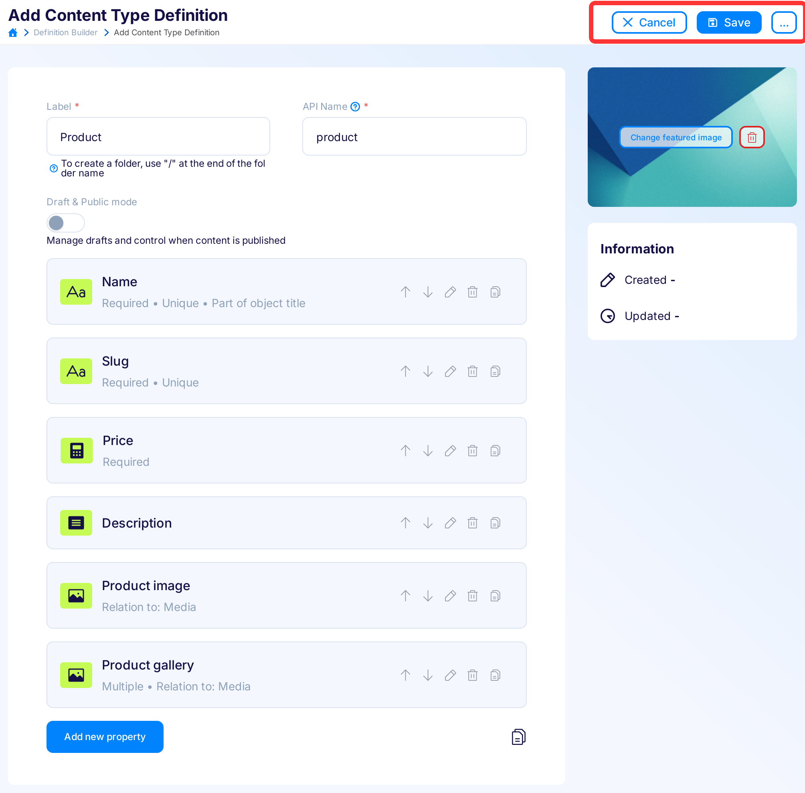
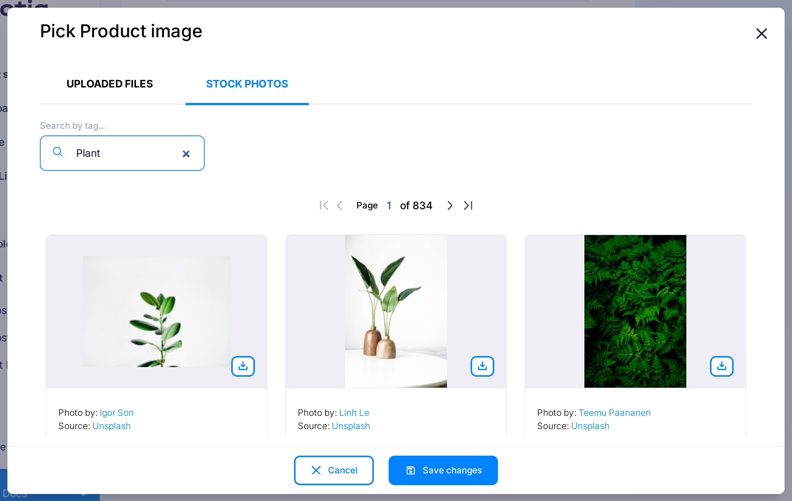

title: Start selling online - Node.js e-commerce tutorial using Snipcart, Flotiq and Gatsby | Flotiq deep dives
description: Start selling products online instantly. Use our step-by-step tutorial on Snipcart, Gatsby and Flotiq and put your e-commerce live in 5 minutes.

# Start selling online with Snipcart, Flotiq, Gatsby and Netlify

This time, we'll dive deep into building e-commerce with Snipcart, Flotiq and Gatsby. We'll start with a fresh Flotiq account, build a Content Type Definition, hook it up with a Gatsby starter and finally - deploy it live using Netlify.

What you'll get:

1. A simple, but beautiful, functional e-commerce website with your own products, running live on the Internet.

{: .center .border}

What you'll need:

1. Flotiq account (free),
2. Snipcart account (free for testing), register [here](https://snipcart.com)
3. Node.js & NPM installed
4. [This repository](https://github.com/flotiq/flotiq-gatsby-shop-2)
5. Netlify account (free) if you'd like to put it live.

Let's get started!

## Prepare your Flotiq account

For this particular project - we'll use Flotiq to store the information about products - names, prices, etc.
There's a couple of simple steps that shouldn't take longer than 1 minute to complete.

### Register an account, 30 seconds
The first thing you'll need is a free Flotiq account, [register a free account in Flotiq](https://editor.flotiq.com/register.html). No payments, no credit cards, simply connect using your Github account or email. 

### Create your Content Type Definition, 30 seconds

The most crucial step - you have to tell Flotiq what kind of data you want to store in the system. What are the names of the content types and their properties. 

When you first log in - it's going to be pretty empty. No content, nothing. Head over to the `Type definitions` screen.

{: .center .width75 .border}


Here you find a list of simple boilerplate content types, which are a great start if you're in a hurry. 

Click on `Product` and then `Save`. You don't need to make any changes to get up and running with this project!

{: .center .border .width75}

### Create your content, 2 minutes

For this project to work - you have to create a couple of products. In the left sidebar click on `Content` → `Products` and click the `Add new Product object` button and enter the product detail.

{: .center .border .width50}

You can upload your images or use our awesome Unsplash integration - head over to the `Stock photos` tab in the Media Library and browse through thousands of beautiful images.

{: .center .border}

Finally - click the `Save button`. 

Repeat for as many products as you want.

!!! hint
    If you'd like to programmatically import hundreds or thousands of products, instead of typing them by hand - you can use Flotiq's `batch` endpoints in your API. Read more about [batch content creation in Flotiq](https://flotiq.com/docs/API/content-types/#batch-content-upload).


## Start your Gatsby project, 2 minutes

To make this extremely simple, we have prepared a Gatsby starter, that integrates with Flotiq as a data source for products. You will configure the project, install its dependencies and put the site live in no-time.

### Clone the repo


Start by cloning the repository:

```
git clone https://github.com/flotiq/flotiq-gatsby-shop-2
```
{ data-search-exclude }

### Configure Flotiq

Then, in the root folder of the repository create a file called `.env`. This file store the configuration for Flotiq and Snipcart. Put the following contents in the `.env` file:

```
GATSBY_FLOTIQ_API_KEY="YOUR FLOTIQ API KEY"
SNIPCART_API_KEY="YOUR SNIPCART API KEY"
```
{ data-search-exclude }

You can find your Flotiq API keys in `API Keys` section:

{: .border .width25 .center}

!!! caution
    We strongly recommend that you create a scoped API key (read more about [API access](../API/index.md)), but for development, you can use the default Read Only key provided in the interface. 
  
### Check if it works!

It's as simple as that. You should be good to go. Install the NPM dependencies and start your gatsby project:

```
yarn install
yarn run develop
```
{ data-search-exclude }

You should now see your store at `http://localhost:8000`.

{: .border}

## Start selling online

Yes, it is **that** simple. You're almost ready to start selling; the final part is to configure Snipcart properly.

### Configure Snipcart

Head over to [Snipcart](https://snipcart.com) and in your account - retrieve your Public API Key.


Put that key in the `.env` file, so the file now looks like this:

```
GATSBY_FLOTIQ_API_KEY="YOUR FLOTIQ API KEY"
SNIPCART_API_KEY="YOUR SNIPCART API KEY"
```
{ data-search-exclude }

and restart gatsby with `yarn run develop`.

Here's what you should now see, once you put an item in the cart:


Once you complete the checkout steps, you'll see the final screen:


So - if you want to test the integration entirely - it's time to put this site live!

## Putting the website live using Netlify, 2 minutes

To make it super simple - we've prepared a button, that immediately put your project live on the Internet. 

Press the button!
  [](https://app.netlify.com/start/deploy?repository=https://github.com/flotiq/flotiq-gatsby-shop-2)
  
Once you log in to Netlify (you can use a free account for that) - you have to pick a domain name for your project. 
We used `snipcart-flotiq` and copy the details from your `.env` file in the input fields.

 

and hit `Save & Deploy`. In a minute (or two) - your app is live!


### Provide the domain name in Snipcart

While you're waiting for the deployment to finish - go to your Snipcart profile page and configure your domain name:


### Verify the result

Result? You've successfully placed an order! 


And you immediately see it in Snipcart, too.


## Conclusions

You've successfully built and deployed an end-to-end e-commerce platform using no code, thanks to the tools and templates provided by Flotiq, Snipcart and Gatsby. While there are still many important things to consider before you launch your e-commerce - this is a great way to minimize the cost and effort required on the technical side.

As always - let us know how it worked for you!
