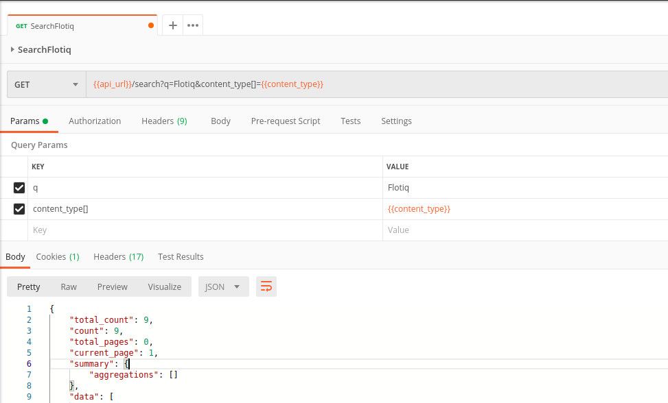
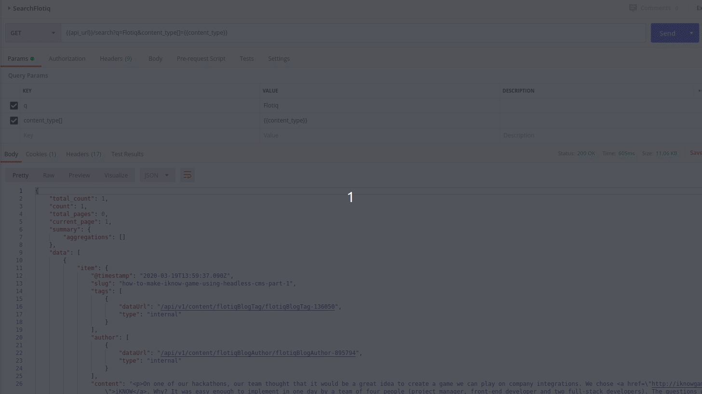
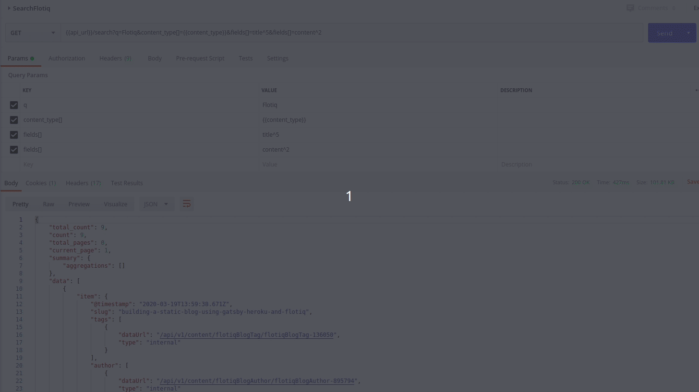

<div class="breadcrumbs">
<a href="/">Docs</a> / <a href="/Deep-Dives/">Deep Dives</a> / <a href="/Deep-Dives/search-api-deepdive/">Full-text search</a>
</div>

# Search API in Flotiq

## Overview

Flotiq provides powerful full-text search capabilities by partially exposing the ElasticSearch (ES) engine through inside Flotiq's search API. In order to provide the best Developer Experience we're not exposing ES directly, but wrapping it and stripping to leave only the essentials.

We still pass queries to ES, but to provide compatibility with the rest of the API we abstracted it one level higher into a wrapper that can allow us to do all the magic and still maintain Flotiq's natural simplicity.

In this article we will focus on search operations like:
* Global Search (all content types)
* Limited Search (particular content type)
* Limited Search using filters (objects with specific attributes)
* Results aggregation (a.k.a. faceted search)
* Results ranking / scoring (using ES field boosting).


> Remember to check our [Flotiq Search API Documentation](https://flotiq.com/docs/API/search/) for more details and examples.

For this article's purpose we will use Postman to provide request examples and responses.

On the screenshots below you'll see values like `api_url` and `content_type`. These are our own Postman Global Variables so remember to change them to your own values if you want to test Search Feature.

Let's dive deep into it!

## Global search

By default, you would probably want to find everything related to a entered query. This is what most of our competitors offer as well, so no surprises here.

To achieve that you have to pass the query parameter `q`. The result set will contain all entries in your Flotiq instance that match the query content.


The response object also contains:
- `total_count` - number of found entries,
- `count` - number of entries on current page,
- `total_pages` - number of pages,
- `current_page` - ehm, current page,
- `summary` - object containing aggregates / buckets,
- `data` - the array containing matched entries.

## Limited search

The `/api/v1/search` endpoint also supports parameters that can narrow the search or limit display count per page:
* `limit` - basic parameter for limiting per page results
* `content_type[]` - narrow search area to specific Content Type Definition. Don't forget you have to add square brackets `[]` to a parameter name here. We have provided an example below:
* `fields[]` - restrict to search only in specific field names ex. <code>name, title</code>



So if you'd like to narrow down the search to a specific content type, e.g. `blogpost` - it's as simple as adding `content_type[]=blogpost` to your search query.

## Limited search using filters

We can also add a filter to our query to search for specific values in provided fields. 

Remember, it must have the following syntax: `filters[propertyName]=propertyValue`. 

If you want to have more filters then add more parameters using syntax above by separating them with `&` like this `filters[status]=draft&filters[type]=post`.




## Results aggregation

This is, by far, one of the coolest features described in this article. Using this technique you'll be able to immediately build faceted search results that look like this

Simply add `aggregate_by[]=value` parameter to populate the `summary` object in your response - it will now contain the numbers of unique occurences per property value that you provided earlier.


The part of response that is interesting us in this case looks like in image below:


## Increase search score by using ElasticSearch field boosting

And finally, probably the most sought after and extremely powerful features that will allow you to define how your search results should be ranked. With this technique you can decide what is more important in your search query and display desired result in an order that matches your defined importance.

Achieving it is - again - extremely simple. You only need to add fields weights using the `fields` parameter like `^3` or `^5` or whatever multiplier you want to set.

For example if you define your field boosting like this:
`fields[]=category^2&fields[]=title^5`

you basically say that entries matching your query in the `title` field will be considered more important than those, where the match is in `category`. The order of the results returned by the search endpoint will reflect that and you will also find the score assigned by ES in the `score` property for each entry.



The request above produces a response like the following:

Search score for text found in title 
```json
{
    ...
    "score": 5.0425596
}
```

Search score for text found in content
```json
{
    ...
    "score": 2.0425596
}
```
## Conclusion

Flotiq is built to be extremely easy to use, yet very powerful. Our search feature is trivial to use, but at the same time offers features that make us stand out from out competitors (see Headless CMS Full-text search comparison article). Using Flotiq's search you can now build a complex search engine into your apps without the need to worry about integrating with external solutions.


