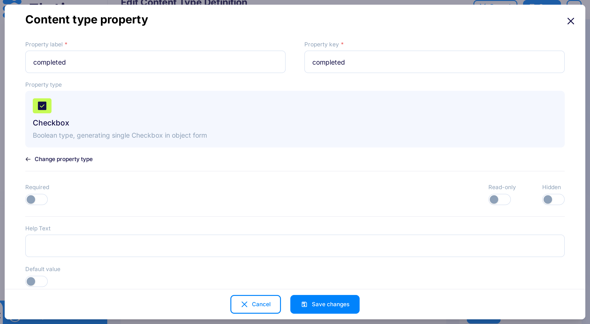
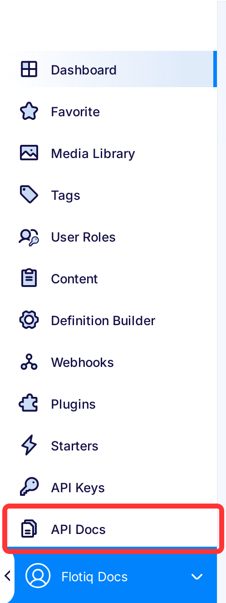
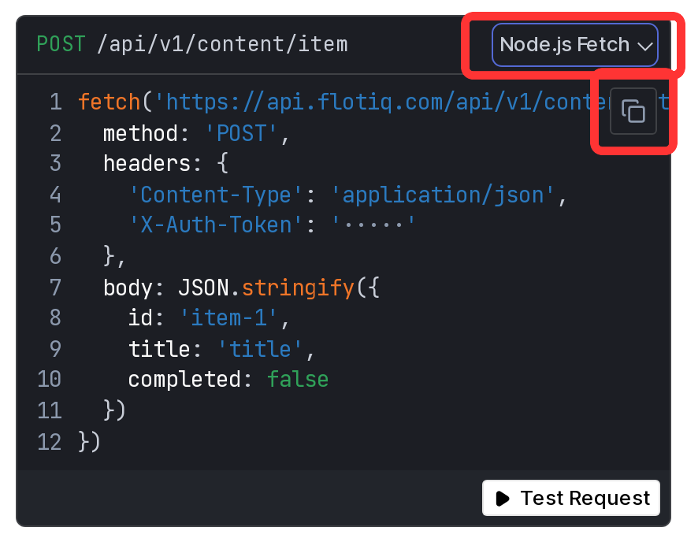
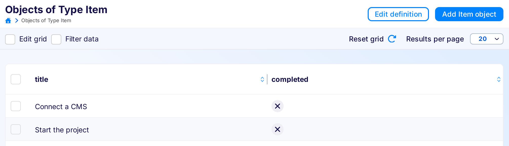
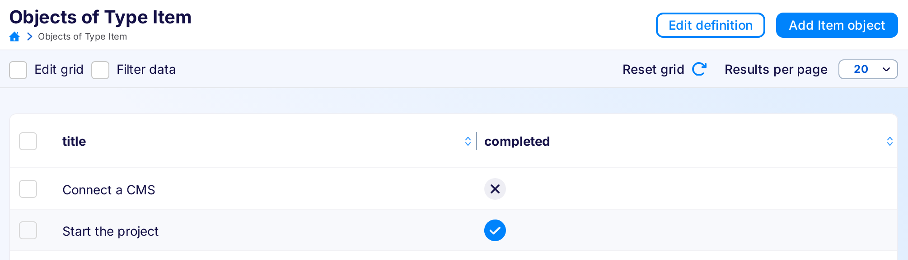

---
tags:
  - Administrator
  - Developer
---

title: Hooking-up React TodoMVC with Flotiq headless CMS  | Flotiq docs
description: Discover how to seamlessly connect a headless CMS to your React applications with our step-by-step guide. Learn to use Flotiq with the classic TodoMVC app for efficient data storage and management, making your frontend development smoother and more scalable.
keywords: React, headless CMS, TodoMVC, Flotiq, frontend development, web application, data storage, API integration, JavaScript, React hooks, content management system

# Hooking-up a headless CMS to React apps

!!! info
    This article shows how to hook up the React version of classical TodoMVC app to a Content Management System and use it to store data.
    After completing this tutorial, you will have a basic Todo application using React, which will sync its data into a cloud-based Content Management System.

## Intro

When we’re building web applications, we always hit the problem of storing data somewhere - should it be a database or a file on a cloud storage or something else? Frontend developers, in particular, don’t usually like to play around with setting up servers or AWS services to support their apps. Using a headless CMS is a perfect option in that case. In this short tutorial we will go through setting up [Flotiq headless CMS](https://flotiq.com) to make it super easy to connect our React application and use it as a permanent data store. 

## Prerequisites

1. Basic JavaScript knowledge
2. Interest in React :)
3. Headless CMS account, we will use [Flotiq headless CMS for React](https://flotiq.com) (a << plan_names.free >> subscription will be just fine)

## TodoMVC

TodoMVC is one of the most popular projects on GitHub and has been used by thousands of developers as an introduction to different frontend frameworks.

 {: .center .width75 .border}

Let’s start with getting this up and running, and it’s straightforward.

1. Clone the repo
   ```bash
   git clone --depth=1 https://github.com/tastejs/todomvc.git
   ```
   { data-search-exclude }

2. Navigate to the React example
   ```bash
   cd todomvc/examples/react
   ```
   { data-search-exclude }

3. Install the dependencies
   ```bash
   yarn
   ```
   { data-search-exclude }

4. Start the project!
   ```bash
   yarn run dev
   ```
   { data-search-exclude }

Your browser should now open and display the TodoMVC app, and you can start adding tasks:

 {: .center .width75 .border}

## Code

Let’s now have a look at the files of this project. It’s really simple, and you can start by looking at the `app.jsx` file, which will help you understand what’s going on in the application:

 {: .center .width75 .border}

The app uses the `useReducer` hook to manage the state. It’s a simple yet elegant way of dealing with an application state through events. It forces us to structure our code in a cleaner way without directly accessing the state with each user interaction. All state-handling logic is centralised and stored in a component called the `reducer`.

If you check the `reducer.js` file, you will see that it follows the [best practices for writing reducers](https://react.dev/reference/react/useReducer#writing-the-reducer-function) :

* it’s restricted to a bare minimum
* it doesn’t call any external entities
* it replaces the state instead of mutating it
* it uses a switch over the `action.type` field

 {: .center .width75 .border}

We will keep that in mind when connecting to the CMS.

## Data model & a headless CMS

Items are the only model in the TodoMVC app, and their model is quite simple:

* `id` - a unique identifier of the item,
* `title` - a text field containing the title,
* `completed` - a boolean flag stating if the item is completed or not.

Before we connect the React application with our backend - we need to set up the data model in Flotiq. Let’s do it now.

1. Login to Flotiq, you can [register a free Flotiq account](https://beta.flotiq.com/register)
2. Once logged in - create a new Content Type Definition, follow [this link](https://beta.flotiq.com/content-type-definitions/add) or click on

   1. **Definition builder** in the left sidebar menu
   2. **Add definition type** in the top right corner
3. Design the model:

   1. Set the Label to `Item`
   2. Make sure the API Name is set to `item`
   3. Add a new text property `title`
      {: .center .width75 .border}
   4. Add a checkbox called `completed` 
      {: .center .width75 .border}
   5. Click on the `Save` button in the top right corner to add the Content Type to the system.

      {: .center .width75 .border}

Good job! At this point, your Flotiq account is ready to accept data from the application! 

!!! tip
    Please note, that we did not explicitly create an `id` field in the system. Flotiq creates that for us automatically. When we create new objects we will have 2 options:

    * submit them with an ID that we define, or 
    * let Flotiq fill-in the `id` field with autogenerate values.

## Connecting React with Flotiq

Now, let’s finally make our todo items persistent! We will implement the following connections between the React TodoMVC app and Flotiq:

* creating new items in TodoMVC should create objects in the CMS
* toggling the item’s completion state should also be reflected in the CMS.

> **Disclaimer** - there are many other ways to achieve the same result! Please let us know in the comments if you can come up with other interesting ideas!

### Adding new items

The simplest way to achieve that, without breaking the reducer, is to add an API call to Flotiq **before** a state update event is dispatched. Let’s make these simple changes in `app.jsx`:

1. Install `node-fetch`
   ```bash
   npm install --save node-fetch@2
   ```
   { data-search-exclude }
2. Add the `useCallback` import in the first line of `app.jsx`:
   ```bash
   import { useReducer, useCallback } from "react";
   ```
   { data-search-exclude }
3. Import `node-fetch`
   ```bash
   import fetch from "node-fetch";
   ```
   { data-search-exclude }
4. Add the `FLOTIQ_API_KEY` const right after the imports (Check this documentation on [how to obtain a Flotiq API key](https://flotiq.com/docs/API/?h=api+key#application-api-keys)).
   ```bash
    const FLOTIQ_API_KEY = 'PUT YOUR READ-WRITE KEY HERE';
   ```
   { data-search-exclude }
5. Finally, add the `preDispatch` function in `app.jsx`
    ```bash
    // Find this in app.jsx:

    export function App() {
    const [todos, dispatch] = useReducer(todoReducer, []);

    // Add this:
    const preDispatch = useCallback( async (action) => {
            
            if(action.type == 'ADD_ITEM'){

                const options = {
                    method: 'POST',
                    headers: {'content-type': 'application/json', 'X-AUTH-TOKEN': FLOTIQ_API_KEY},
                    body: JSON.stringify({title: action.payload.title, completed: false}),
                };

                // Create the object in Flotiq
                const res = await fetch('https://api.flotiq.com/api/v1/content/item', options);
                // Retrieve the response to get the object ID
                const data = await res.json();
                // Add the ID as part of payload for the reducer            
                action.payload.id = data.id;           

            }
            
            dispatch(action);
            
        }, []);
    ```
    { data-search-exclude }

    !!! success
        Did you know that Flotiq automatically publishes a set of OpenAPI-compliant endpoints for the content model you define? On top of that there is more - Postman collection, SDKs and API docs, where you can find code snippets that you can simply copy from Flotiq directly into your project!

        Click on the `API Docs` Link in your Flotiq dashboard: 
        {: .center .width25 .border}

        Find the endpoint that you need and copy the code. That’s what I did to build this tutorial :-)

        {: .center .width50 .border}

3. Pass `preDispatch` instead of `dispatch` to the `Header` and `Main` components:
   ```bash
      return (
           <>
               <Header dispatch={preDispatch} />
               <Main todos={todos} dispatch={preDispatch} />
               <Footer todos={todos} dispatch={dispatch} />
           </>
       );
   ```
   { data-search-exclude }

4. Last thing - we need to update the existing reducer to support IDs that are generated outside of the reducer itself:
   ```bash
       switch (action.type) {
           case ADD_ITEM:
               return state.concat({ id: action.payload.id === undefined ? nanoid() : action.payload.id, title: action.payload.title, completed: false });
   ```
   { data-search-exclude }

With this, you should now see new items appear in Flotiq while you add them in your TodoMVC!

 {: .center .width75 .border}

### Toggling item state

We will need to add a couple more changes to synchronise the completion state. The `preDispatch` function will have to handle another type of action: `TOGGLE_ITEM`, and we will also have to fetch the current state of the toggle so we can send it to Flotiq. Here’s the complete updated `preDispatch`:

```bash
    const preDispatch = useCallback( async (action) => {
     
        if(action.type == 'ADD_ITEM'){

            const options = {
                method: 'POST',
                headers: {'content-type': 'application/json', 'X-AUTH-TOKEN': RW_AUTH_TOKEN},
                body: JSON.stringify({title: action.payload.title, completed: false}),
            };

            const res = await fetch('https://api.flotiq.com/api/v1/content/item', options);
            const data = await res.json();
            action.payload.id = data.id;           

        } else if (action.type == 'TOGGLE_ITEM'){
            
            // Find the toggled item, so we know its state
            const item = todos.find( (item)=>{
                return item.id == action.payload.id
            });
            

            const options = {
                method: 'PATCH',
                headers: {'content-type': 'application/json', 'X-AUTH-TOKEN': RW_AUTH_TOKEN},
                body: JSON.stringify({id: action.payload.id, completed: !item.completed}), // negate current value of completed
            };

            const res = await fetch('https://api.flotiq.com/api/v1/content/item/' + action.payload.id, options);
            const data = await res.json();

        }
        
     
        dispatch(action);        

    }, [todos]);
```
{ data-search-exclude }

That’s it! You will now see the state of the `completed` checkbox change in the CMS every time you make an update in your app:

 {: .center .width75 .border}

## Summary

In this short walkthrough, we demonstrated how to run the React version of the classic TodoMVC project. We then integrated it with a cloud-hosted CMS, where the data is persisted and can be accessed whenever we want. 

Next steps? Fetch the list of todo items from Flotiq when the application starts!

Follow us to get notified about our next article, where we will complete the demo.