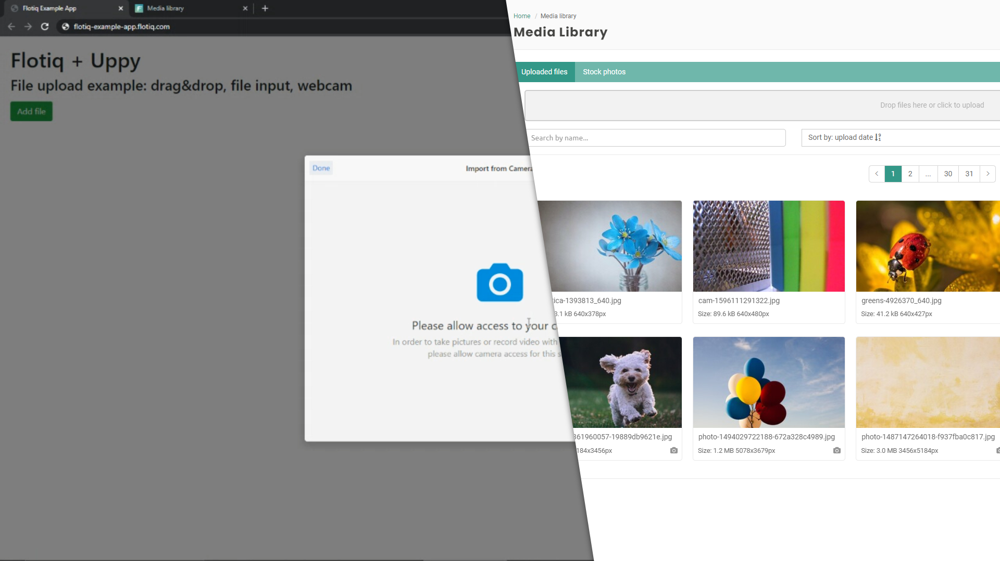

# Upload media using the Flotiq API. Save photos from disk and webcam.

Media streaming support is an essential part of many applications. Regardless of whether you are building a blog, store or an advanced mobile app, it is worth using ready-made solutions. Flotiq as Headless CMS allows you to manage media not only from the user interface but also through a convenient REST API.

In addition to the theory and simple examples, you will see how to upload media from the camera to Flotiq in several lines of simple code.

{: .center .border .width75}

## File upload - Flotiq API assumptions

The advantage of using a Flotiq system is that we do not have to worry about preparing a place for storing files and supporting their storage on disk or in the cloud.

You use `POST` `https://api.flotiq.com/api/media` endpoint in Flotiq, for uploading photos.

The request should contain:

* `file` - payload with a file
* `type` - the type of the transferred file, `image` or `file`
* `save` - a value of 1 means that the saved file will go to the media library.

After completing the above request, you will receive a response containing information about the saved file or an error message. So much for the theory, below we can see how to do upload photos in practice in a few lines.

## Upload files - test using the Postman application

While you have an account in the Flotiq, you get personalized tools for using and testing your data. Among them is the Postman collection that allows you to check how the Flotiq API works.

The video below shows how, simply, test the operation of the media upload endpoint:

<figure class="center width75">
    <div class="video_container">
      <iframe src="https://www.youtube.com/embed/F-2UKdaF0NI" frameborder="0" allowfullscreen="true"> </iframe>
    </div>
</figure>

1. Create an account in [Flotiq](https://flotiq.com)
1. Download the Postman package from the Flotiq panel
1. Import the collection into Postman
1. Use the endpoint `/api/media` to transfer the file
1. Check, if the file has appeared in the application

## Upload files - simple html form

Now that we know how to upload files to the media library, we can prepare a simple file transfer form.

```html
<form enctype="multipart/form-data" action="https://api.flotiq.com/api/media?auth_token=_YOUR_SCOPED_API_TOKEN_" method="post">
    <input name="file" type="file" />
    <input name="type" type="hidden" value="image"/>
    <input name="save" type="hidden" value="1"/>
    <button type="submit">Save</button>
</form>
```
{ data-search-exclude }

!!! Caution
    Remember that this is only an example - in open applications, you should:
    
    * Not disclose the API key in the frontend application (you can do this by creating your server-side code, or use [other solutions like Cloudflare](https://flotiq.com/docs/Deep-Dives/securing-write-api-access/))
    * Secure forms with reCaptcha or other anti-spam tools

## Upload files - drag & drop, input, camera image

The next example will show how to implement a profound media transfer panel using the [Flotiq](https://flotiq.com) API and [Uppy](https://uppy.io).

<figure class="center width75">
    <div class="video_container">
        <iframe src="https://www.youtube.com/embed/ERCFBCbeyIY" frameborder="0" allowfullscreen="true"> </iframe>
    </div>
</figure>


The implementation is simple and requires only basic knowledge of HTML and JS. The code consists of three parts:

* Including Uppy and Bootstrap (optional) external dependencies
* Uppy initialization
* Plugins configuration, including a plugin for sending photos to Flotiq

You can find the entire working example with comments below. You only have to replace the fragment `__YOUR_SCOPED_API_TOKEN__` in the code with the API key. It's simple, isn't it?

```html
<html>
  <head>
    <link href="https://transloadit.edgly.net/releases/uppy/v1.19.0/uppy.min.css" rel="stylesheet">
    <link rel="stylesheet" href="https://stackpath.bootstrapcdn.com/bootstrap/4.5.0/css/bootstrap.min.css">
  </head>
  <body>
    
    <h1>Flotiq + Uppy</h1>
    <h3>File upload example: drag&drop, file input, webcam</h3>
    <button class="upload-trigger btn btn-success">
      Add file 
    </button>

    <script src="https://transloadit.edgly.net/releases/uppy/v1.19.0/uppy.min.js"></script>
      
    <script>
      
      // Initialize Uppy
      var uppy = Uppy.Core({
        debug: true, 
        restrictions: {
          maxNumberOfFiles: 3
        }
      });
    
      // Use Dashboard Plugin
      uppy.use(Uppy.Dashboard, {
          trigger: '.upload-trigger' ,
          showLinkToFileUploadResult: false
      });

      // Use additional source: Webcam
      uppy.use(Uppy.Webcam, { 
        target: Uppy.Dashboard,
        modes: ['picture'],
        facingMode: 'environment' 
      });

      // Use Target: XHR upload with Flotiq as backend
      // Api token is available in Flotiq Dashboard
      uppy.use(Uppy.XHRUpload, {
        endpoint: 'https://api.flotiq.com/api/media',
        headers: {
          'X-AUTH-TOKEN': '__YOUR_SCOPED_API_TOKEN__'
        }, 
        formData: true,
        fieldName: 'file',
        limit: 5
      });

      // Add parameters required by Flotiq API (required!)
      uppy.on('file-added', (file) => {
        uppy.setFileMeta(file.id, {
          type: 'image',
          save: 1,
        });
      });
 
    </script>
  </body>
</html>
```
An example is also available here: [https://plnkr.co/edit/8kUJo8UZzWSi1c6s](https://plnkr.co/edit/8kUJo8UZzWSi1c6s)
{ data-search-exclude }

Remember that in production solutions, the API key should not be included in the frontend code of the application. You can hide it using the backend part or use a proxy.

### Useful links:
 * [About Flotiq](https://flotiq.com)
 * [About Uppy](https://uppy.io)
 * [About Postman](https://www.postman.com)
 * [Flotiq Developer Documentation: Api keys](https://flotiq.com/docs/API/)
 * [Flotiq Developer Documentation: Media library](https://flotiq.com/docs/API/media-library/)
