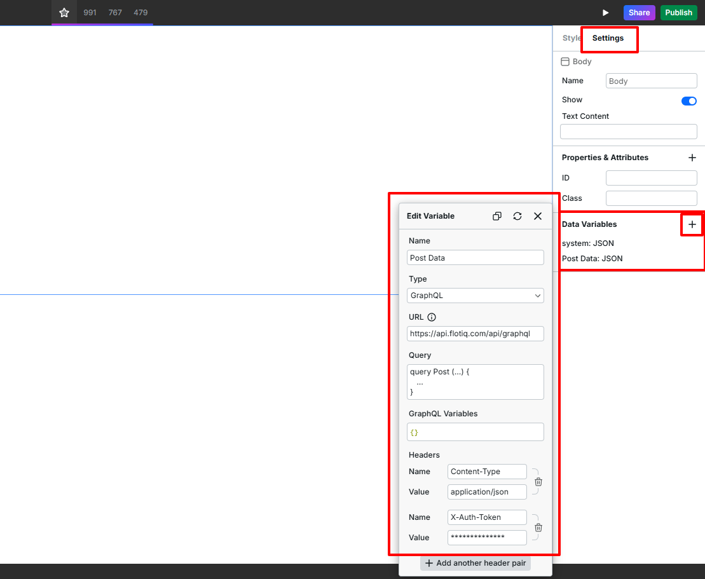
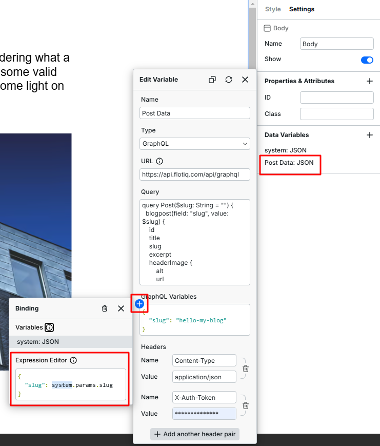
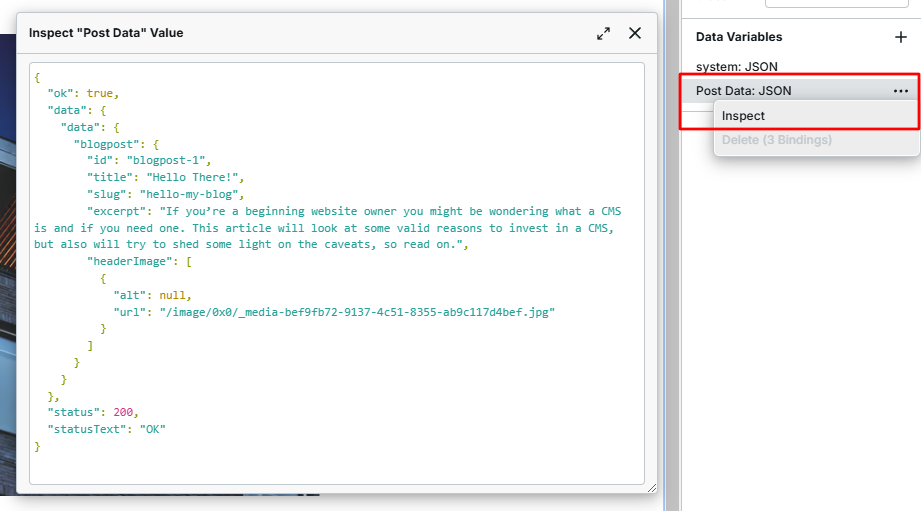

---
tags:
  - Content Creator
  - Developer
---

title: Flotiq WebStudio integration | Flotiq docs
description: Integrate Flotiq with WebStudio to jump-start your project code-free

# Using Flotiq with WebStudio to build a headless website code free

In this deepdive you will learn how to easily integrate Flotiq with WebStudio to build a website code-free with all the advantages of a headless workflow.

## Prerequisites

1. Flotiq account [Register a Flotiq account here](https://editor.flotiq.com/register.html){:target="_blank"}.
2. Flotiq API Key [More about Flotiq API Keys](https://flotiq.com/docs/API/){:target="_blank"}.
3. WebStudio account [Register a WebStudio account here](https://webstudio.is/){:target="_blank"}.

!!! Note
    WebStudio requires [Pro tier plan](https://webstudio.is/pricing){:target="_blank"} in order to use the [Resource Feature](https://docs.webstudio.is/university/foundations/variables#resource){:target="_blank"}.
    If you don't yet own this plan tier in WebStudio, you can use 14-days trial, or use Divhunt that also allows for building code-free website with headless workflow, but offers API features in free tier.
    You can also check our [guide for integrating Flotiq with Divhunt](https://flotiq.com/docs/Deep-Dives/divhunt/).

    Flotiq doesn't require a paid plan for integration with any of the tools mentioned above.

# Integrating Flotiq with WebStudio

## Flotiq Setup

To create dynamic pages you will need a [content type](https://flotiq.com/docs/API/content-type/creating-ctd/){:target="_blank"} that individual pages will get their content from.
In this guide we are using Flotiq's blogpost template, that contains `title`, `slug`, `excerpt`, `content` and `header image` fields that we will use in the dynamically generated pages later on.

After creating the content type, add a few example posts and proceed to WebStudio setup.

## WebStudio Setup

### Creating a project

Start by going to [WebStudio dashboard](https://apps.webstudio.is/dashboard){:target="_blank"} and edit your project or create a new one. You can use either an existing template, or create an empty project. Then select your newly created project and proceed to either [creating dynamic content on your page](#embed-data-from-flotiq-to-webstudio-page) or [creating dynamic pages](#defining-a-dynamic-page).

### Defining a dynamic page

With Flotiq and WebStudio you can automate the process of creating pages, which is ideal in uses like blog or portfolio.
With this integration you can easily create dynamic pages for your site.

When setting up WebStudio for dynamic pages, start off by creating a new page with dynamic path, as presented in the image below.

 {: .center .border}

Pay attention to the last part of the `Dynamic Path` being `:slug`.
It defines the variable that will be used as a unique path to each page generated, so it should use a unique text field from your content type, be it slug, title, or something else.
Don't forget the colon `:`, which indicates to WebStudio that this part is a variable.

Once you create the dynamic path variable, define its value in the `Toggle dynamic page address` setting in WebStudio.
Assign a value from one of the objects you added in Flotiq.

 {: .center .border}

### Adding data variable

After you've defined the dynamic page, you have to create a data variable, that WebStudio will use to get the content from Flotiq.
Data variables are a tool that allow you to fetch external content and save it in your project.
In order to add a data variable select your page settings; there you will find a section called `Data Variables` with an option to add new data variable.

 {: .center .border}

In the data variable configuration, you have to define the following properties:

* Name - a name for the variable of your choice,
* Type - the type of the variable, in this guide we use GraphQL, although the `resource` type could also be used (mind that both variable types require a Pro WebStudio account),
* URL - if you are using GraphQL type, it should always be `https://api.flotiq.com/api/graphql`. For resource type this value will differ, depending on your contenttype name,
* Headers - the headers for the request to Flotiq. Here, you have to add a header with `X-Auth-Token` in the title [Flotiq API Key](https://flotiq.com/docs/API/){:target="_blank"} as a value,
* Query - here you have to define a Query for fetching data from Flotiq in GraphQL. It should fetch the custom field, that you've selected as your dynamic page identifier earlier,
        using the [content object GraphQL fetch with custom field](https://flotiq.com/docs/API/graph-ql/#__tabbed_2_2), so in this case we use `slug`. Whole query for fetching the content of blogpost from Flotiq BlogPost template is presented below:
  ```graphql
  query Post($slug: String = "") {
    blogpost(field: "slug", value: $slug) {
      id
      title
      slug
      excerpt
      headerImage {
          alt
          url
      }
    }
  }
  ```
  { data-search-exclude }

* GraphQL Variables - here you have to bind the value of your dynamic path (the one you defined in the dynamic page configuration) to the field that you query your Flotiq data by. The expression will look like this:
  ```json
  {
    "<your graphql query value variable>": system.params.<webstudio dynamic path variable>
  }
  ```
  { data-search-exclude }

 {: .center .border}

Once you add the data variable, you will be able to inspect it. If all properties were defined properly, you will see the content of your Flotiq content object with the slug (or other field you use as page identifier) as the inspect value.

 {: .center .border}

### Embed data from Flotiq to WebStudio page

Now that your Flotiq data is fetched and saved in the WebStudio data variable, you can embed it in components on your page.
To do so, add a new component to your page in WebStudio, and open it's settings.
There you can edit the properties of the selected component and assign them values from your content objects data fetched from Flotiq,
for example for a text field, edit the `Text Content` property, open Expression editor (accessed by clicking the blue "plus" button),
type in the data variable name that you defined earlier, and select the values from your fields, for example: `VariableName.data.data.blogpost.title`.

 {: .center .border}

Different content fields may require embedding them in different components. For example in order to insert an image from Flotiq, you should add `image` component to your page,
open expression editor for `Source` property, and provide the URL value from the media link from your content object, with Flotiq's base url at the start of the expression,like so:

  `"https://api.flotiq.com/" + VariableName.data.data.blogpost.headerImage[0].url`.

### Creating pages overview

With WebStudio you can create an overview of all your objects fetched from Flotiq. This way you can create a collection of blogposts, events on other on your main page.
Start by going to home page or whatever page you want to include the overview. Then [add new data variable](#adding-data-variable), which will look similarly to the one for dynamic pages,
but this one will use the endpoint for listing all content objects from your Flotiq content type, not a specific one. To do this, append `List` to the API name of the type.
For Flotiq's blog post template it will look like this:

```graphql
query Posts {
  blogpostList {
    id
    title
    slug
    excerpt
    headerImage {
        alt
        url
    }
  }
}
```
{ data-search-exclude }

After you have your data variable working correctly, add a `Collection` component to your page in WebStudio, select it, and edit it's `data` property with an expression,
similarly to how it's done for [embedding data to dynamic page](#embed-data-from-flotiq-to-webstudio-page), however this time you will use the whole array of objects,
so the expression will look more or less like this:

`<Data Variable Name>.data.data.<Content Type API name>List`, in my case it will be `Post List.data.data.blogpostList`.

If the data is fetched correctly, WebStudio will create a placeholder for all your content objects from the selected content type, however for now it will be only raw data in JSON format.
If you click on the collection component on the sidebar, you will notice a new data variable being `Collection Item`. It represents every item from the array of objects.
You may edit it by giving it a custom name of your choice.

 {: .center .border}

Once you have a collection item with items from our Flotiq's content list, you can edit the collection by adding new components to the collection items. Mind that editing one item will automatically edit all of them. Now you can create the custom card using the data from your content object, similarly to [embedding data to dynamic page](#embed-data-from-flotiq-to-webstudio-page) but now you are gonna use the `Collection Item` variable.

 {: .center .border .width90}

## Conclusion

Integrating Flotiq with WebStudio enables the seamless creation of dynamic, content-driven websites using a headless workflow without the need for coding. This combination empowers users to manage and deliver content efficiently while focusing on design and functionality. By simplifying the process, it ensures both developers and non-technical users can achieve professional results effortlessly.
