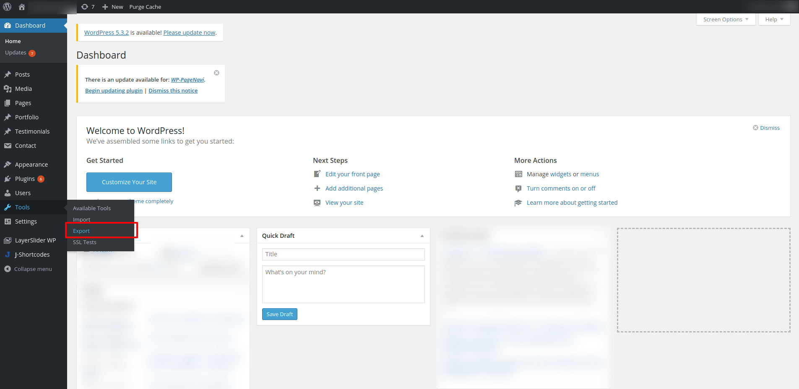
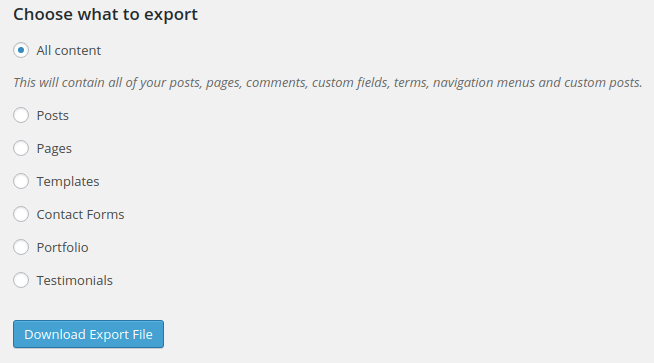
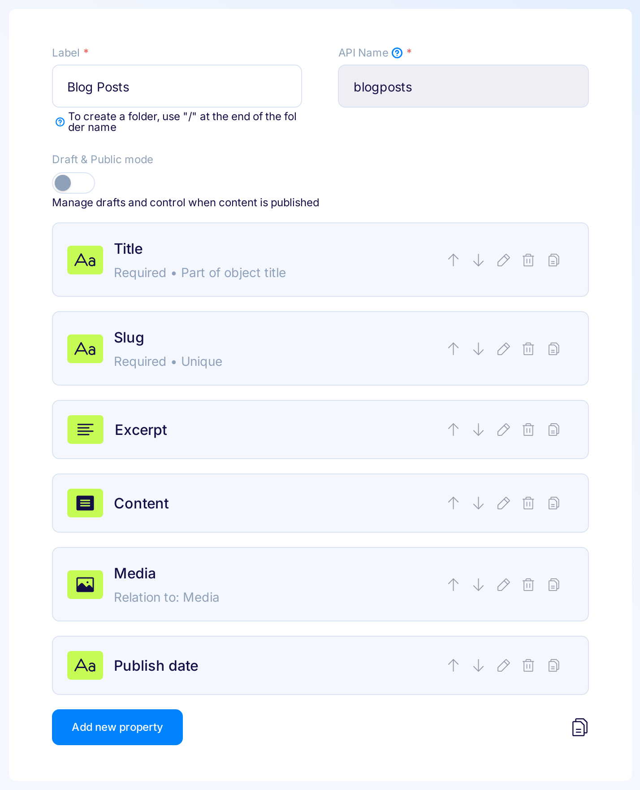

title: Importing Wordpress posts, migrate from Wordpress to Flotiq headless CMS | Flotiq docs
description: Get into this deep dive into Flotiq to learn how to easily import your blog posts from Wordpress to Flotiq.

# Importing posts from WordPress

Replacing Wordpress is one of the most common use cases for Headless CMS, and for good reasons. Let's take a look at how easy it's going to be.

!!! hint
    Instead of coding, you can try our [one-click migration tool](https://flotiq.com/services/migrate-wordpress-to-flotiq-headless-cms/) to move your data from WordPress to Flotiq.
    All you need is your personal [Flotiq Read And Write API Key](http://flotiq.com/docs/API/#application-api-keys) and your WordPress Site address.
    Read more in our [blog post](https://flotiq.com/blog/migrate-wordpress-to-flotiq-headless-cms).

## Export Wordpress data

Go to Tools → Export in the main Wordpress menu



in the Export view - accept the defaults and press the `Download Export File` button



save the file and remember the path.

## Create a BlogPost Content Type in Flotiq

You now have to create a Content Type Definition in Flotiq, and this is how you describe the kind of content you will be storing in the system. For a simple blog, you can use the template that we prepared, or go to the Content Type Editor and create a Content Type like the following:



## Download the SDK

For this tutorial, I will use the Python SDK, but you can easily adapt this to your favorite language (or reach out to us and ask for help!). 
You can download the SDK from Flotiq dashboard, once it's built and downloaded - extract it and head to the extracted folder. Make sure you have all the required python packages installed by running

``` bash
pip install -r requirements.txt
```
{ data-search-exclude }

 and then create a new file, called `import.py` in the extracted folder.

!!! hint
    Remember, the Flotiq API docs and SDKs are automatically generated for you, based on your own Content Types. That means you have to download the SDK **after** you created the BlogPosts content type.

## Connect to Flotiq API

Now, let's connect to your Flotiq API, enter the following lines into the `import.py` file:

``` python
import flotiq
from flotiq.rest import ApiException
import sys

configuration = flotiq.Configuration()
configuration.api_key['X-AUTH-TOKEN'] = sys.argv[1]
api_instance = flotiq.ContentBlogPostsApi(flotiq.ApiClient(configuration))

entries = api_instance.entries_list()
print(entries)
```
{ data-search-exclude }

!!!hint
    For the next steps you will need your API key, go to your user profile view and copy the Read/Write key from there.

Now let's try to execute this script and see if the connection is up and running, remember to put your API key in the command line:

``` bash
python import.py YOUR_API_KEY
{'data': []}
```
{ data-search-exclude }

unless you already added a blog entry - you will see an empty response. That was easy, right?

!!! success
    You made your first call to the Flotiq API. That's great! Keep reading, we're almost done!

## Import XML

In this step we will modify the code, it will now:

* read through the WordPress XML dump
* create a BlogPosts object for each wp:post item in the dump
* call the create method and import each post through your Flotiq API.

Make sure you have the `lxml` python package, it's the one we're going to use to parse through the XML tree:

``` bash
pip install lxml
```
{ data-search-exclude }

add this to your `import.py` file 

``` python
tree = ET.parse(sys.argv[2])
root = tree.getroot()

namespaces = {'wp':'wp', 'content':'content', 'excerpt':'excerpt'}
items = root.findall(".//wp:post_type",namespaces)
print("Loaded XML, number of posts:" + str(len(items)))
```
{ data-search-exclude }

and verify if it correctly reads the XML (remember to point to the correct location of the WP dump file):

``` bash
python import.py YOUR_API_KEY wordpress-export.xml
Loaded XML, number of posts:20172
...
```
{ data-search-exclude }

Now, for each post - create an appropriate blog entry and save it into Flotiq:

``` python

import uuid

for item in items:
    post = item.getparent()
    title = post.find('title').text
    content = post.find('content:encoded', namespaces).text
    date = post.find('wp:post_date', namespaces).text
    link = post.find('link').text
    slug = post.find('wp:post_name', namespaces).text
    try:
        post = flotiq.models.Blogposts(
            id=str(uuid.uuid1()), 
            slug= slug,
            title=title,
            publish_date=date,
            content=content)
        api_instance.createblogposts(blogposts=post)
    except Exception as e:
        print(e)
    
```
{ data-search-exclude }

this is the final listing of your program

``` python
import flotiq
from flotiq.rest import ApiException
import uuid
import sys
from lxml import etree as ET

tree = ET.parse(sys.argv[2])
root = tree.getroot()

namespaces = {'wp':'wp', 'content':'content', 'excerpt':'excerpt'}
items = root.findall(".//wp:post_type",namespaces)

configuration = flotiq.Configuration()
configuration.api_key['X-AUTH-TOKEN'] = sys.argv[1]
api_instance = flotiq.ContentBlogPostsApi(flotiq.ApiClient(configuration))

print("Loaded XML, number of posts:" + str(len(items)))

for item in items:
    post = item.getparent()
    title = post.find('title').text
    content = post.find('content:encoded', namespaces).text
    date = post.find('wp:post_date', namespaces).text
    link = post.find('link').text
    slug = post.find('wp:post_name', namespaces).text
    try:
        post = flotiq.models.Blogposts(
            id=str(uuid.uuid1()), 
            slug= slug,
            title=title,
            publish_date=date,
            content=content)
        api_instance.createblogposts(blogposts=post)
    except Exception as e:
        print(e)
    
    
```
{ data-search-exclude }

Please mind that we only cared to import the basic fields, like slug, title, content, etc. Feel free to amend this code and import anything else you might need.

!!! success
    Hopefully, you now have a bunch of blog posts imported from Wordpress. Go ahead and fork our [example Gatsby starter](https://github.com/flotiq/flotiq-gatsby-blog-1) and deploy it to Heroku - if you followed our naming closely - you will only need to provide your Read Only API key to have a fully working blog page in a couple of minutes!
