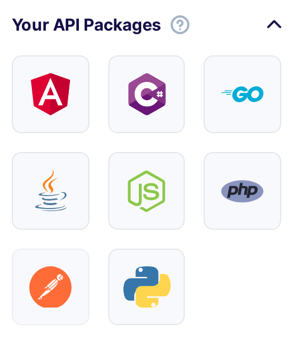

---
tags:
  - Developer
---

title: Flotiq SDKs
description: Discover how to use Flotiq SDKs to simplify development with your headless CMS. Learn about our official JavaScript/TypeScript SDK or generate SDKs for any language using OpenAPI.

# Flotiq SDKs

Flotiq SDKs provide developers with convenient, type-safe ways to interact with content stored in
a headless CMS. Whether you are building web apps with JavaScript/TypeScript or using SDKs for 
other programming languages, Flotiq makes working with your content API seamless and developer-friendly.

## Why use an SDK with Flotiq?

SDKs help you:

* Speed up development by offering ready-to-use API client libraries.
* Get fully typed data models, generated from your content types.
* Work with class and attribute names that match your content model in the Flotiq editor.
* Enjoy auto-complete and IDE support out-of-the-box.

You have two main options for using SDKs with Flotiq - using official SDKs 
or generating your own SDKs based on the OpenAPI specification.

## JavaScript/TypeScript SDK

For JavaScript and TypeScript developers, we offer a ready-made
SDK [@flotiq/flotiq-api-sdk](https://www.npmjs.com/package/@flotiq/flotiq-api-sdk)

It’s actively maintained and integrates perfectly with modern frameworks like Next.js. 
This SDK is used in all our official starters and demo projects. 
It provides a simplified interface to work with your Flotiq API, 
supports authentication, pagination, filtering, and more.

This option works best if you’re building an application using JavaScript or TypeScript (especially with frameworks like Next.js or Astro).

[Read more about JavaScript/TypeScript SDK →](./sdk-js-ts.md)

## Custom SDK with OpenAPI

Flotiq’s API is fully described using the OpenAPI Specification. 
That means you can generate a custom SDK in nearly any language – Python, Java, PHP, Ruby, Go, 
and more – using tools like: 

* OpenAPI Generator
* Swagger Codegen

The generated SDK will reflect the types and structure of your content model in the selected language.

This is ideal if you’re working with a language other than JavaScript/TypeScript
or want customized integration with your own stack.

[Read more about generating Custom SDKs with OpenAPI →](./generate-package.md)

## Download a package for your language

On your Flotiq dashboard, you can always find shortcuts to SDKs for specific frameworks or languages.

{: .width25 .center .border}

