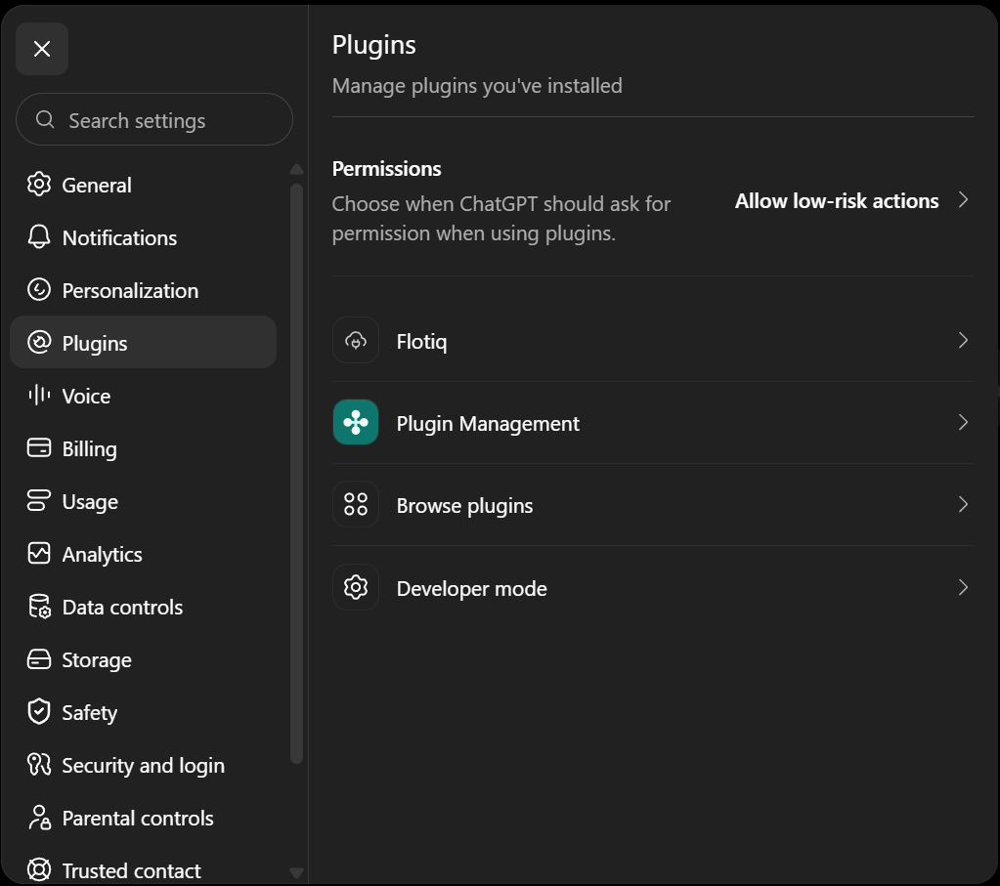
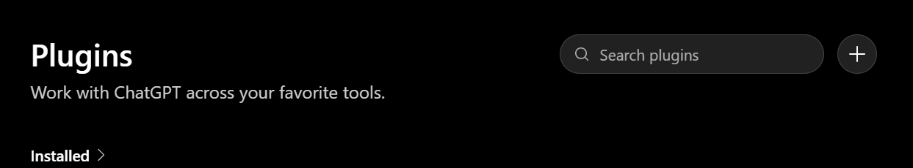
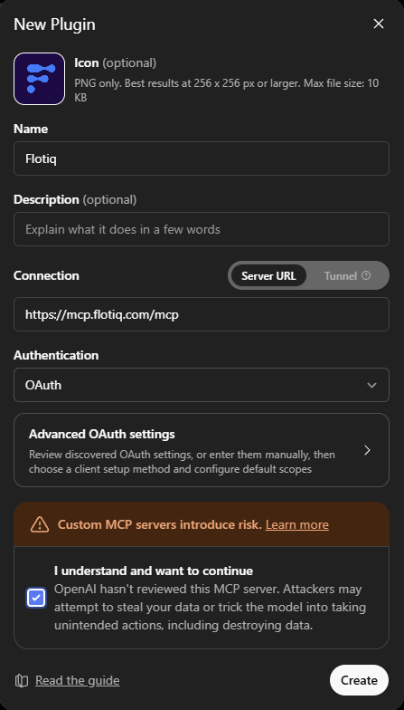
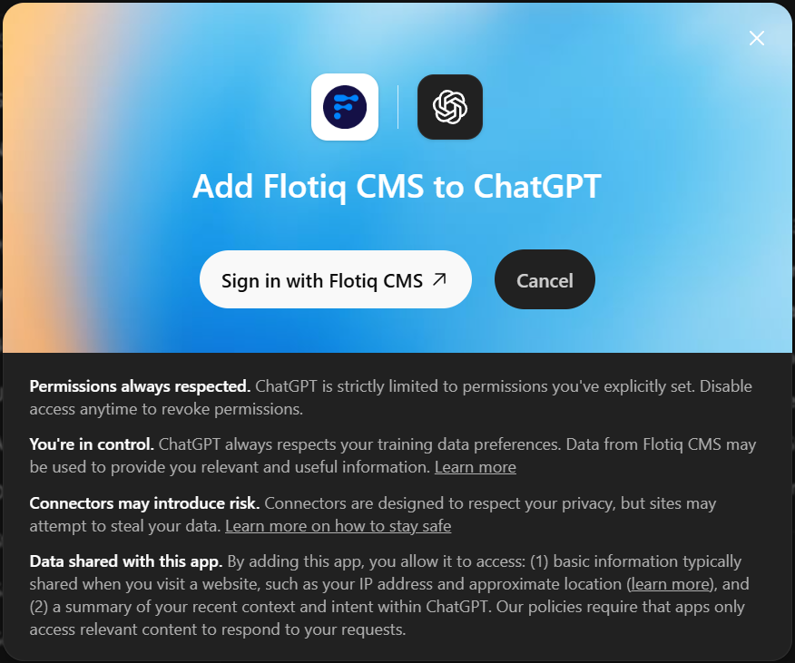
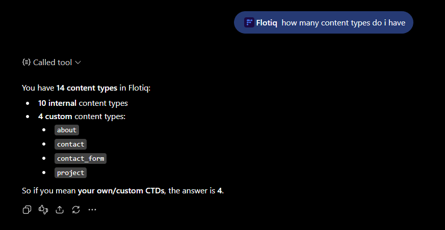

---
tags:
  - Developer
  - Content Creator
---

title: Flotiq MCP Server in ChatGPT | Flotiq docs
description: Connect your Flotiq content to ChatGPT using a custom MCP plugin.

# Flotiq MCP Server in ChatGPT

This guide shows how to connect the [Flotiq MCP Server](index.md) to ChatGPT as a custom plugin.

## Prerequisites

1. [Flotiq account](https://editor.flotiq.com){:target="_blank"}
2. ChatGPT plan that supports custom connectors

## Setup

### 1. Enable Developer mode

Go to [Settings &rarr; Plugins &rarr; Developer mode](https://chatgpt.com/#settings/Plugins){:target="_blank"} and turn
on **Developer mode**.

### 2. Open plugins configuration

Go back to **Settings &rarr; Plugins** and click **Browse plugins**.

{: .center .width75 .border}

### 3. Create the plugin

Click **create**.

{: .center .width75 .border}

### 4. Enter the configuration

{: .center .width50 .border}

Confirm the risk notice and click **Create**.

### 5. Sign in to Flotiq

Click **Sign in with Flotiq CMS**. Flotiq takes you through the
[authorization flow](index.md#authentication), where you pick the Space and the access scope.

{: .center .width75 .border}

## Using the tools

Start a new chat, make sure the Flotiq plugin is enabled in the message composer, and ask a question about your content:

{: .center .width75 .border}

!!! Note
    ChatGPT decides on its own which tools to call.
    Read [Working safely with write tools](index.md#working-safely-with-write-tools) before letting it create or update
    content or Content Types.

## Related docs

- [Flotiq MCP Server overview](index.md)
- [Universe overview](../overview.md)
- [Get Started with API](../../API/get-started.md)
