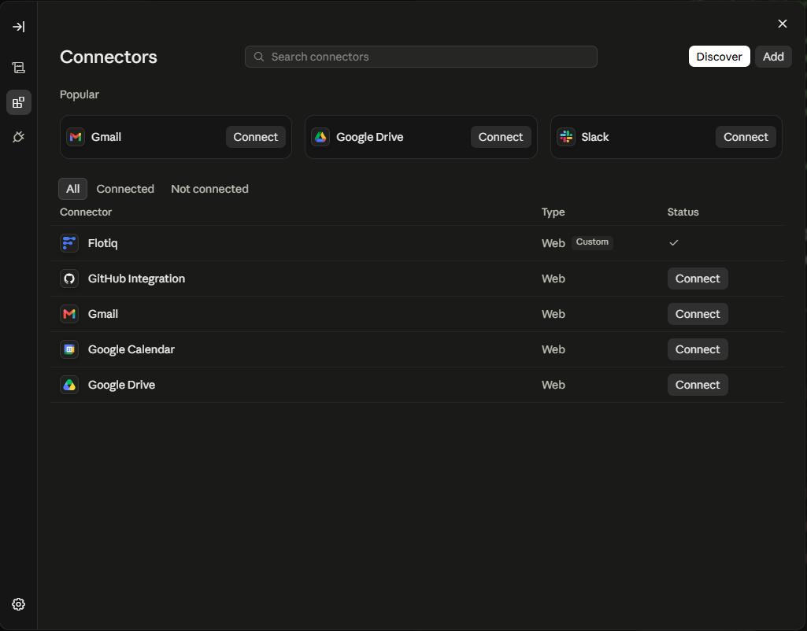
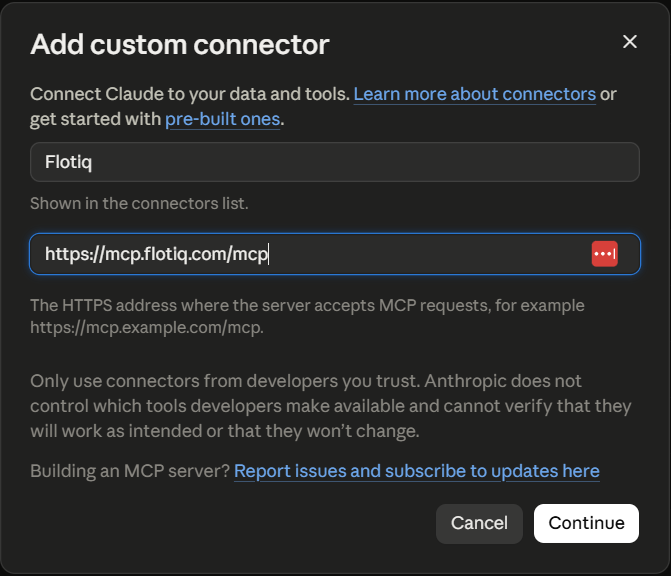
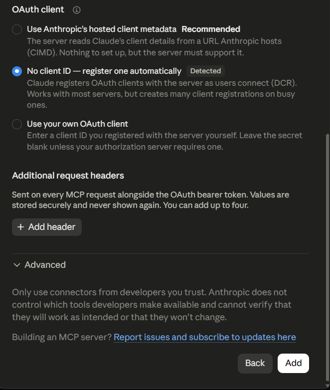
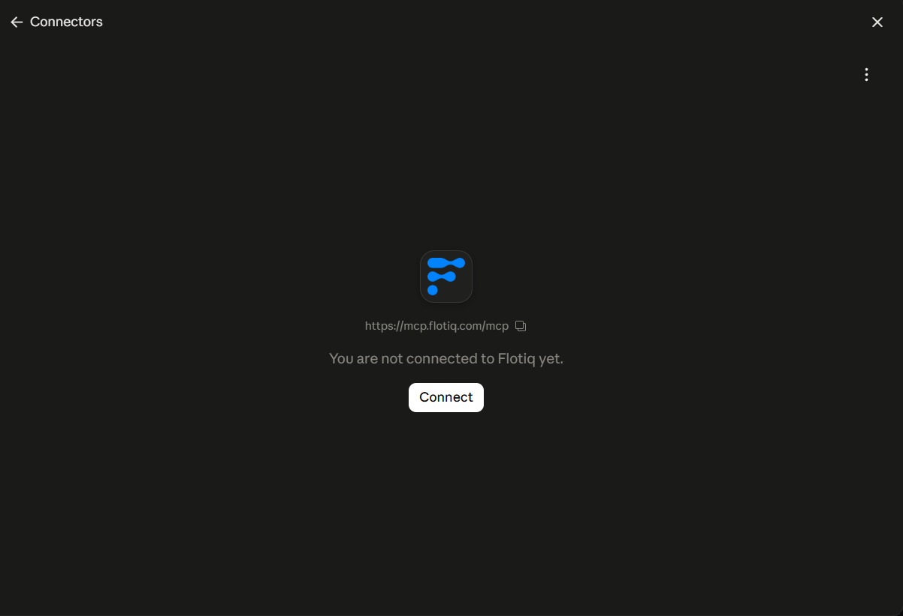
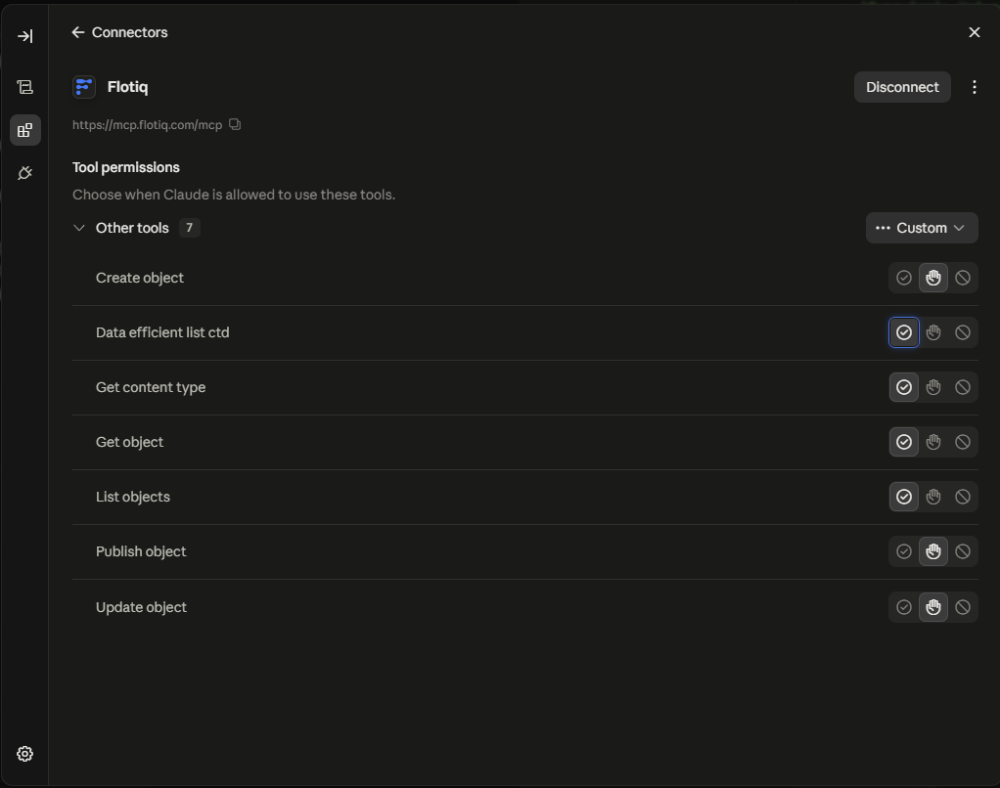
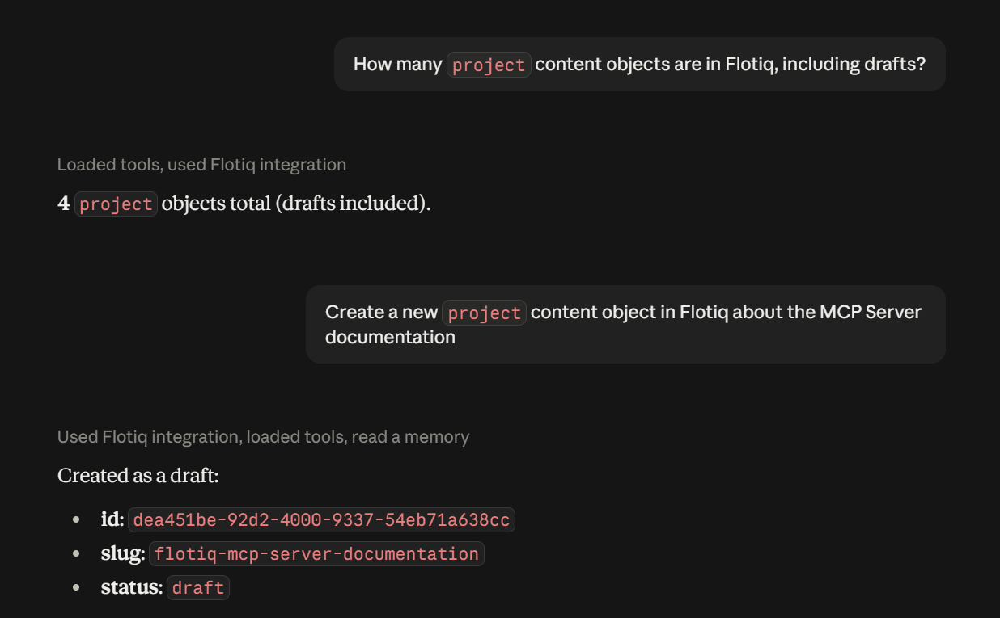

---
tags:
  - Developer
  - Content Creator
---

title: Flotiq MCP Server in Claude | Flotiq docs
description: Connect your Flotiq content to Claude using a custom connector.

# Flotiq MCP Server in Claude

This guide shows how to connect the [Flotiq MCP Server](index.md) to Claude as a custom connector. It works in the
Claude desktop app and on claude.ai.

## Prerequisites

1. [Flotiq account](https://editor.flotiq.com){:target="_blank"}
2. Claude plan that supports custom connectors

## Setup

### 1. Open the connector list

Go to **Settings &rarr; Connectors** and click **Add**.

{: .center .width75 .border}

### 2. Enter the configuration

Enter `Flotiq` as the name and `https://mcp.flotiq.com/mcp` as the URL, then click **Continue**.

{: .center .width50 .border}

{: .center .width50 .border}

Leave the detected **No client ID - register one automatically** option and click **Add**.

### 3. Connect

Open the connector and click **Connect**.

{: .center .width75 .border}

Flotiq takes you through the [authorization flow](index.md#authentication), where you pick the Space and the access
scope.

### 4. Adjust tool permissions

Open the connector in **Settings &rarr; Connectors &rarr; Flotiq** and set **Tool permissions** so Claude cannot change
your content without asking. A good starting point:

{: .center .width75 .border}

## Using the tools

Ask Claude about your content - it will pick the right tools on its own:

{: .center .width75 .border}

## Related docs

- [Flotiq MCP Server overview](index.md)
- [Universe overview](../overview.md)
- [Get Started with API](../../API/get-started.md)
