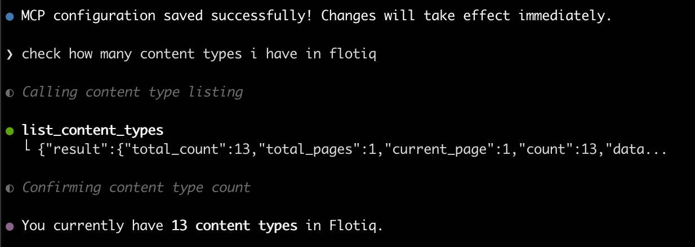

---
tags:
  - Developer
---

title: Flotiq MCP Server in GitHub Copilot CLI | Flotiq docs
description: Add the Flotiq MCP Server to GitHub Copilot CLI.

# Flotiq MCP Server in GitHub Copilot CLI

This guide shows how to add the [Flotiq MCP Server](index.md) to GitHub Copilot CLI.

## Prerequisites

1. [Flotiq account](https://editor.flotiq.com){:target="_blank"}
2. GitHub Copilot CLI installed and authenticated with your GitHub account

## Setup

### 1. Add the server

Start Copilot:

```bash
copilot
```

{ data-search-exclude }

Run the `/mcp add` command and fill in the form:

| Field       | Value                        |
|-------------|------------------------------|
| Name        | `FlotiqMCP`                  |
| Server Type | `HTTP`                       |
| URL         | `https://mcp.flotiq.com/mcp` |

Press `Ctrl` + `S` to save. Copilot confirms with *MCP configuration saved successfully*.

### 2. Authorize

Press `Enter` on the authorization prompt, sign in with your Flotiq credentials, select
the [Space](../../panel/spaces.md) and the permission scope (`Read` or `Read & Write`), then click **Grant access**.

## Check the configuration

Ask Copilot about your content:

```
check how many content types i have in flotiq
```

{ data-search-exclude }

{: .center .width75 .border}

## Related docs

- [Flotiq MCP Server overview](index.md)
- [VS Code Copilot](vscode-copilot.md)
- [Universe overview](../overview.md)
