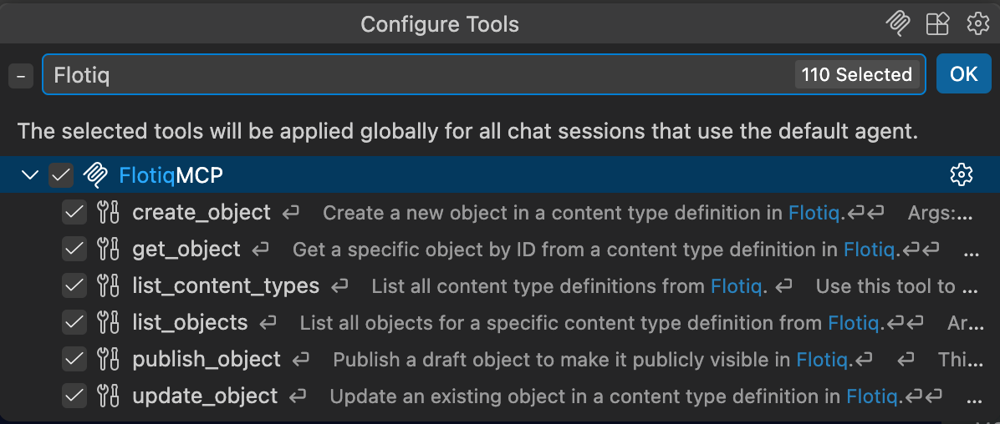

---
tags:
  - Developer
---

title: Flotiq MCP Server in VS Code Copilot | Flotiq docs
description: Use Flotiq content directly from GitHub Copilot Chat in Visual Studio Code.

# Flotiq MCP Server in VS Code Copilot

This guide shows how to add the [Flotiq MCP Server](index.md) to GitHub Copilot Chat in Visual Studio Code.

## Prerequisites

1. [Flotiq account](https://editor.flotiq.com){:target="_blank"}
2. Visual Studio Code with the GitHub Copilot Chat extension
3. Copilot Chat running in **Agent** mode - MCP tools are not available in Ask mode

## Setup

### 1. Add the server

Open the Command Palette (`Cmd/Ctrl` + `Shift` + `P`) and run **MCP: Add Server**.

1. Choose **HTTP** as the server type
2. Enter the URL: `https://mcp.flotiq.com/mcp`
3. Enter `FlotiqMCP` as the server name
4. Choose whether to store the configuration in your user settings or in the workspace

VS Code starts the OAuth flow automatically - sign in to Flotiq, select the [Space](../../panel/spaces.md) and the
permission scope (`Read` or `Read & Write`), then click **Grant access**.

### 2. Or edit `mcp.json` manually

Instead of using the Command Palette you can add the server to `.vscode/mcp.json` in your workspace:

```json
{
  "servers": {
    "FlotiqMCP": {
      "type": "http",
      "url": "https://mcp.flotiq.com/mcp"
    }
  }
}
```

{ data-search-exclude }

## Check the configuration

In the Copilot Chat sidebar click the **Tools** icon. You should see all Flotiq tools listed under `FlotiqMCP`:

{: .center .width75 .border}

Uncheck `create_object`, `update_object` and `publish_object` if you want Copilot to work in read-only mode.

!!! Note
    If the OAuth flow does not start, or fails with a registration error, your VS Code version may not support Dynamic
    Client Registration. Update VS Code and the Copilot Chat extension, then remove and re-add the server.

## Related docs

- [Flotiq MCP Server overview](index.md)
- [GitHub Copilot CLI](github-copilot-cli.md)
- [Universe overview](../overview.md)
