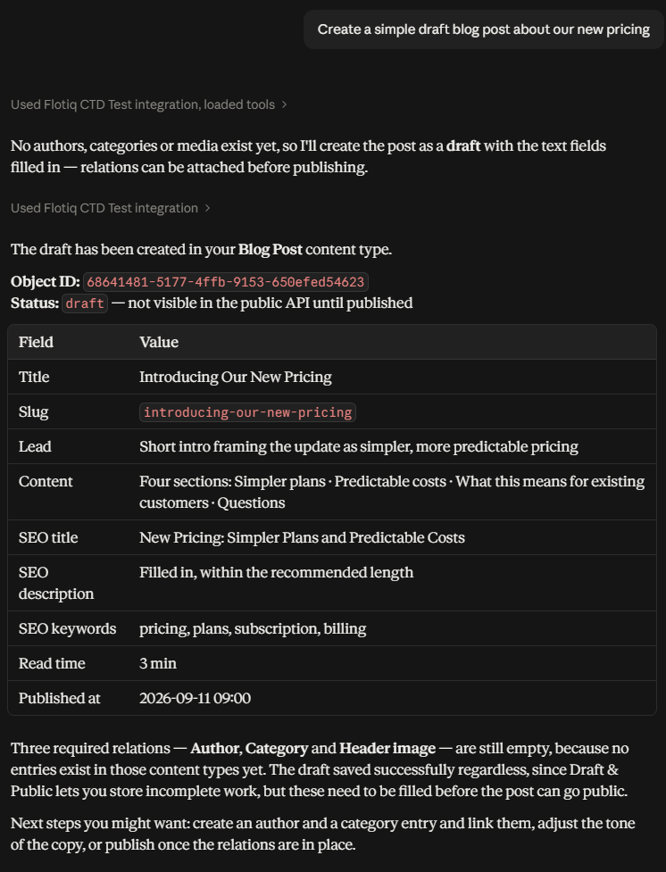
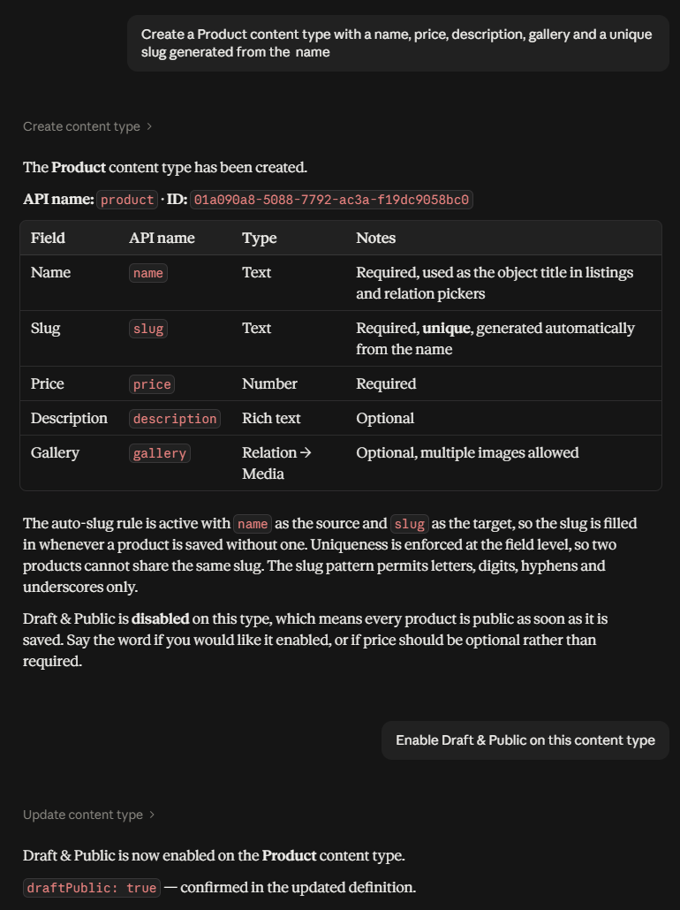

---
tags:
  - Developer
  - Content Creator
---

title: Flotiq MCP Server | Flotiq docs
description: Connect Flotiq to ChatGPT, Claude, Copilot and other AI assistants using the Model Context Protocol.

# Flotiq MCP Server

The Flotiq MCP Server lets AI assistants - like ChatGPT, Claude, GitHub Copilot or Codex - read and modify content in
your Flotiq account. It implements the [Model Context Protocol](https://modelcontextprotocol.io){:target="_blank"}, an
open standard for connecting language models to external data sources and tools.

Instead of copying content between your CMS and a chat window, you can simply ask:

* *"How many products do I have in Flotiq?"*
* *"Create a blog post about our new pricing and leave it as a draft."*
* *"Find all events without a cover image."*
* *"Create an Author content type and link it to my blog posts."*

## Server URL

Use the following address wherever your client asks for an MCP server URL:

```
https://mcp.flotiq.com/mcp
```
{ data-search-exclude }

The server uses the **streamable HTTP** transport.

## Authentication

The server authenticates with **OAuth 2.1** - you do not need to create or paste an API key. When you connect the server
for the first time, your client opens a Flotiq login page:

{: .center .width75 .border}

After signing in, Flotiq asks what the client may access:

{: .center .width75 .border}

**Space** - pick the [Space](../../panel/spaces.md) the assistant will work with. The connection is bound to that one
Space.

**Permissions** - choose the access scope:

| Scope          | Available tools                                                                                                          |
|----------------|--------------------------------------------------------------------------------------------------------------------------|
| `Read`         | `data_efficient_list_ctd`, `get_content_type`, `list_objects`, `get_object`                                              |
| `Read & Write` | all tools, including `create_object`, `update_object`, `publish_object`, `create_content_type` and `update_content_type` |

Grant `Read` unless you actually want the assistant to change your content. This limit is enforced by Flotiq, so it
holds regardless of how your client is configured.

!!! Note
    To switch to a different Space or change the scope, reconnect the server in your client and go through the login flow
    again. You can also add the server twice under different names - for example a read-only connection to production and
    a read-write one to a test Space.

The assistant acts on your behalf and inherits your permissions within the selected Space.

Most clients support Dynamic Client Registration, so the OAuth Client ID and Client Secret fields can be left empty.

## Available tools

| Tool                      | Access | Description                                                     |
|---------------------------|--------|-----------------------------------------------------------------|
| `data_efficient_list_ctd` | read   | Lists all Content Type Definitions in your Flotiq account       |
| `get_content_type`        | read   | Fetches a single Content Type                                   |
| `list_objects`            | read   | Lists Content Objects of a given Content Type                   |
| `get_object`              | read   | Fetches a single Content Object by its ID                       |
| `create_object`           | write  | Creates a new Content Object of a given Content Type            |
| `update_object`           | write  | Updates an existing Content Object                              |
| `publish_object`          | write  | Publishes a draft object so it becomes publicly visible         |
| `create_content_type`     | write  | Creates a new Content Type Definition                           |
| `update_content_type`     | write  | Changes fields and settings of an existing Content Type         |

## Managing content

With the `Read` scope the assistant can browse and search your [Content Objects](../../panel/ContentObjects/index.md).
With the `Read & Write` scope it can also create, update and publish them. You can describe what you need in plain
language, for example:

* *"List all blog posts published this month."*
* *"Create a draft blog post about our new pricing."*
* *"Fix typos in the description of the 'Summer sale' product and publish it."*

Objects created through `create_object` follow the same [Draft & Public](../../panel/ContentObjects/draft-public.md)
rules as objects created in the Flotiq editor.

{: .center .width50 .border}

## Managing Content Types

With the `Read & Write` scope the assistant can also design your data model - create new
[Content Types](../../panel/content-types.md) and change existing ones. You can describe what you need in plain
language, for example:

* *"Create a Product content type with a name, price, description, gallery and a unique slug generated from the
  name."*
* *"Add a required 'Reading time' number field to Blog post."*
* *"Enable Draft & Public on the Event content type."*

{: .center .width50 .border}

## Setting up your client

* [ChatGPT](chatgpt.md)
* [Claude](claude.md)
* [VS Code Copilot](copilot.md)
* [Codex](codex.md)
* [GitHub Copilot CLI](copilot-cli.md)

Any other MCP-compatible client will work as well - point it at the server URL above and complete the OAuth flow.

## Working safely with write tools

The write tools are available only if you granted the `Read & Write` scope, and they change content in your Flotiq
account immediately - Flotiq does not ask for a second confirmation. Before you start:

1. **Require confirmation for write tools.** Most clients let you decide per tool whether the model may run it
   automatically. Allow `data_efficient_list_ctd`, `get_content_type`, `list_objects` and `get_object`, and require
   confirmation for `create_object`, `update_object`, `publish_object`, `create_content_type` and
   `update_content_type`.
2. **Test on a separate Space.** [Spaces](../../panel/spaces.md) are isolated, so you can experiment without touching
   production content - just pick the test Space on the login screen when connecting. This is especially important
   for Content Type changes, which affect every object of that type.
3. **Review the diff.** Assistants can misread your data model. Check changed objects and Content Types in the Flotiq
   editor.

## Related docs

- [Universe overview](../overview.md)
- [Get Started with API](../../API/get-started.md)
- [Content Types](../../panel/content-types.md)
- [Spaces and Organization](../../panel/spaces.md)
