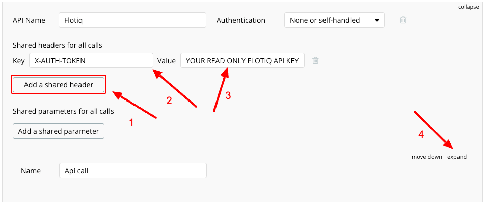
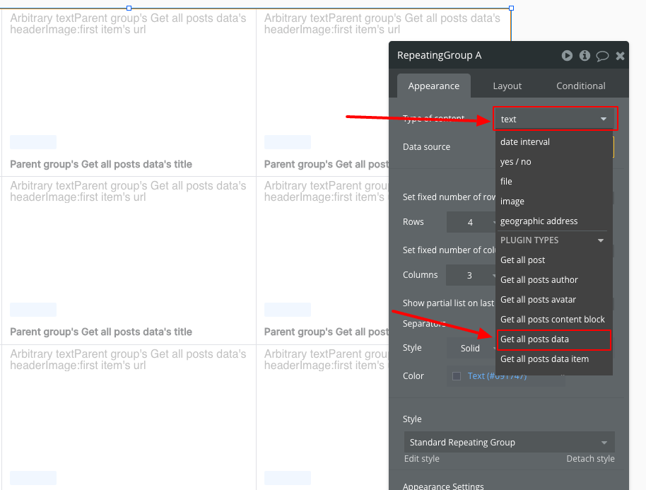
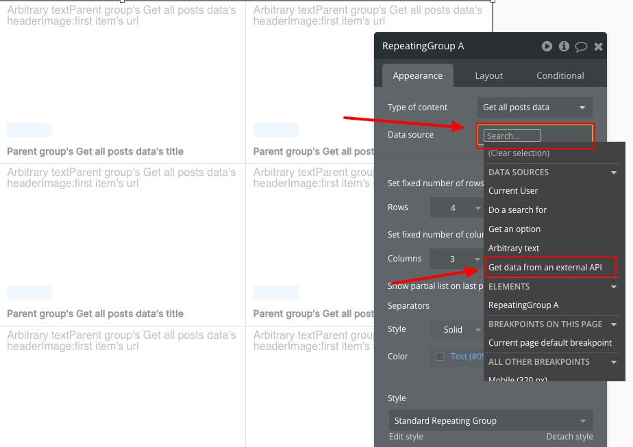
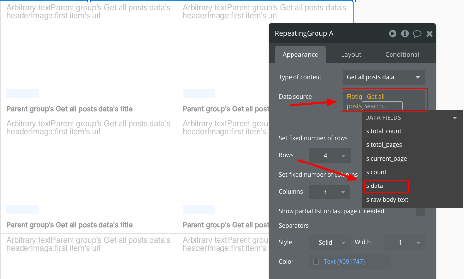
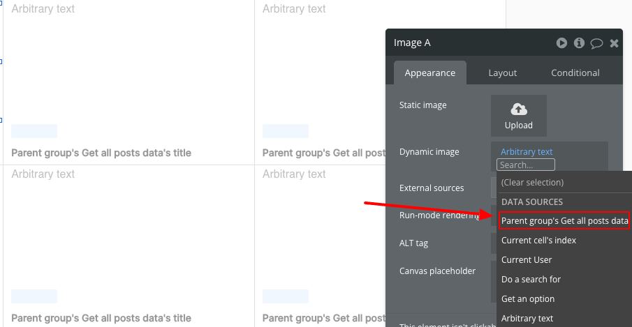
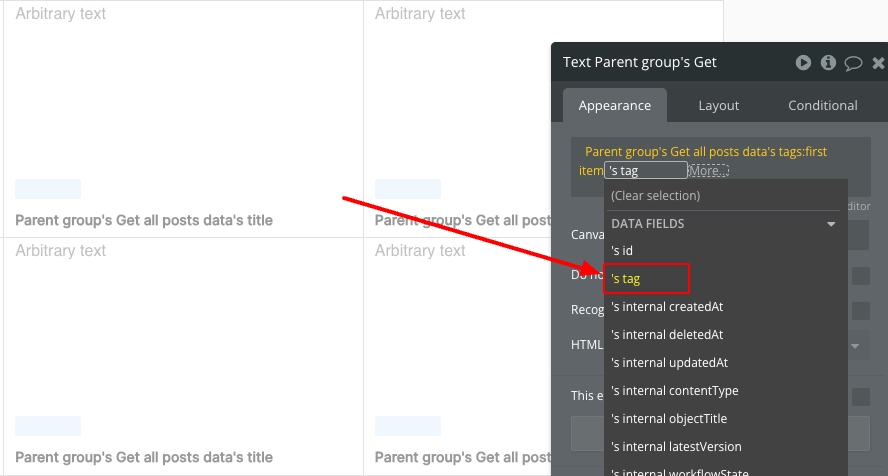
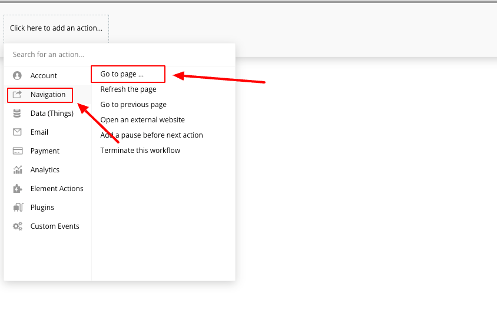
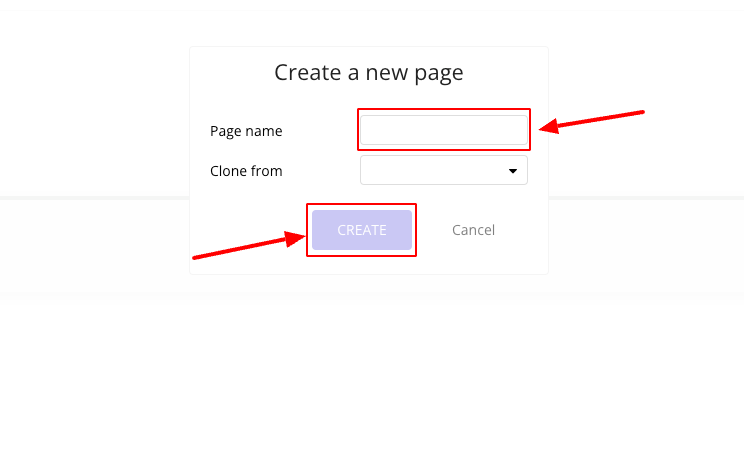
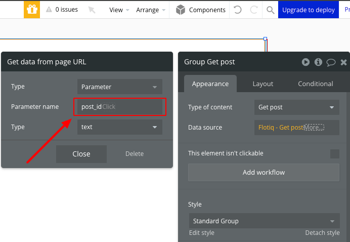

title: Flotiq Bubble integration | Flotiq docs
description: Flotiq allows you to integrate your content with any system easily.

# Flotiq and bubble integration

## Introduction

In Bubble.io, there's significant potential for various integrations with [Flotiq](https://editor.flotiq.com/){target="_
blank"}. The platform offers many communication possibilities with APIs, not limited to just GET requests, thanks to
its "API Connector" plugin. On their [YouTube channel](https://www.youtube.com/watch?v=nO8PSqeJaWk){target="_blank"},
Bubble.io has a video showcasing the capabilities of this plugin. As part of a sample integration, let's consider
replicating a section of [Flotiq blog](https://blog.flotiq.com/){target="_blank"} within a Bubble.io application.
Specifically, we aim to display our blog posts on the homepage as tiles. Upon clicking on any of these tiles, users
should be redirected to a dedicated page for that particular post.

## First step

To start working on connecting Flotiq with Bubble.io, we need to have some data in Flotiq to display. I
used the ["flotiq-cli"](https://flotiq.com/docs/CLI/contentful-importer/?h=flotiq+import#imported-data){target="_blank"}
to import a "CTD" (Content Type Definition) along with several "CO" (Content Objects) necessary for the blog's
functionality, The `.json` files with `CTD` and `CO` that will be used during this integration can be
found [here](https://github.com/flotiq/flotiq-blog){target="_blank"} in the `./flotiq` folder. Then, we need to create
our application in Bubble.io.

To do this, on the account management panel, we click on "create an app."

{: .center .width75 .border}

We enter the name of our application and click "Get started"

{: .center .width75 .border}

After clicking "get started," we will see several views with the basic configuration of our app, such as
the name, font, or color scheme. We are interested in the last step because here we have the option to choose basic
plugins that we can install. In our case, it will be the API Connector.

{: .center .width75 .border}

Upon successfully creating our application, we will be presented with the editor view.

## Connection with Flotiq API

To retrieve information about our posts from Flotiq, we need to go to the plugins tab, select "API Connector"
{: .center .width75 .border}

Then press “Add another API” button

{: .center .width75 .border}

We select the name of our API, which in our case will be "Flotiq," and then click the "add a shared header" button. In
the key field, we enter "X-AUTH-TOKEN," and in the value field, we input our API key for Flotiq. Then, we click "expand"
in the "API Call" section. You can read more about Flotiq API keys
in [our documentation](https://flotiq.com/docs/API/?h=api+keys##application-api-keys){target="_blank"}

{: .center .width75 .border}

Next, we choose a name for our request, for example, "Get all posts." We make sure it's a GET request and enter the URL
to the Flotiq API pointing to our CTD with posts (how to create such a
URL: [Docs](https://flotiq.com/docs/API/content-type/listing-co/){target="_blank"}).

{: .center .width75 .border}

Next, we click on "Add parameter" to set the parameter "hydrate" to 1, which enables us to retrieve data from
relationships such as tags or the author of our post. (more about hydrate
parameter: [Docs](https://flotiq.com/docs/API/content-type/listing-co/##hydrating-objects){target="_blank"}) And
finally, we click on "
Initialize call."

{: .center .width75 .border}

If everything went according to plan, we should see a modal with the data returned by our API along with the data types
deduced by Bubble. If needed, we can always modify them or hide data fields if they are not necessary. If the data and
their types match those from our Flotiq CTD (FlotiqBlogPost), we click "SAVE."

{: .center .width75 .border}

Next, we move to the design tab where we will design our application. We can use a pre-made template or design our own.
In this presentation, I will replicate a section of the page
[https://blog.flotiq.com/](https://blog.flotiq.com/){target="_blank"}, which includes tiles presenting posts on the
homepage, as well as a dedicated page for reading a
specific post.

## Designing

Let's start by adding a "Repeating Group" element, which will allow us to display a dynamic number of tiles depending on
the number of posts.

{: .center .width75 .border}

Next, let's proceed with its configuration. We're interested in the fields "Type of content," "Data source," and "Set
fixed number of rows/columns." Other fields can be adjusted according to preference.

{: .center .width75 .border}

Let's start with "type of content." We need to choose the option "Get all posts data." It's worth noting that if you
named your request differently during the Flotiq setup, it will be named according to the pattern "[your request name]
data."

{: .center .width75 .border}

Moving further in the "data source" section, you should select the option "Get data from an external API."

{: .center .width75 .border}

Next, we need to select the provider as "Flotiq - Get all posts." If you named your API connection or request
differently, this field will appear as "[your API name] – [your request name]."

{: .center .width75 .border}

And select the option " 's data."

{: .center .width75 .border}

Next, we add a "Group" element to our "Repeating Group." We set it in the element tree as a child of the "Repeating
Group," adjust its width and height to match a single cell of the "Repeating Group," and set the "type of content" to "
Get all posts data" and the "data source" to "Current cell's Get all posts data."

{: .center .width75 .border}

Next, we add two "Text" elements and one "Image" element to our Group. Then, we set these elements as children of the "
Group" and arrange them one below the other, with the image element on top and the texts below.

{: .center .width75 .border}

Next, we proceed to configure the image. In the "Dynamic Image" field, from the list, we select the element "Arbitrary
text" and enter "https://api.flotiq.com".

{: .center .width75 .border}

Next, let's dynamically add the rest of the URL that will point us to the specific image associated with the post. To do
this, we select the option "Parent group's Get all posts data."

{: .center .width75 .border}

Then, we select " 's headerImage."

{: .center .width75 .border}

We choose ":first item" and then " 's url."

{: .center .width75 .border}
{: .center .width75 .border}

Now, let's configure the text fields responsible for displaying the post title and tag name. Starting with the title,
similar to the image configuration, we begin by selecting "Parent group's Get all posts Data's," then choose " 's
title."

{: .center .width75 .border}

We proceed to configure the field displaying the tag name. Similarly to configuring the image, we start by selecting "
Parent group's Get all posts Data's," then "tags," ":first item," and finally choose " 's tag."

{: .center .width75 .border}

If we have successfully configured everything, there should be a notification on the top bar of our editor indicating
that there are 0 issues. If this is the case, we can proceed to "preview."

{: .center .width75 .border}

A new browser tab will open with a preview of our project. If everything went according to plan, you should see
something like this:

{: .center .width75 .border}

Now you can take a moment to adjust the styles of these elements according to your preference. After some minor visual
tweaks, our post tiles look like this:

{: .center .width75 .border}

## Dedicated page for a specific post

We'll create a dedicated page to display a selected post. To do this, we navigate to the configuration of the group that
is the parent for the two text fields and the image field, and then click on "Add workflow."

{: .center .width75 .border}

Next, we click on "Click here to add an action."

{: .center .width75 .border}

And then we select the "Navigation" element followed by "Go to page..."

{: .center .width75 .border}

A window will pop up with the action configuration. In the "Destination" section, we choose "Create a new page..."

{: .center .width75 .border}

We choose a name for our page. In our case, it will be "post."

{: .center .width75 .border}

Next, in the "Destination" section, we select the page "post", check the option "Send more parameters to the page," and
set the key to "post_id."

{: .center .width75 .border}

Then, we set a dynamic value for this key to the ID of the post whose tile was clicked. To do this, we select "Current
cell's get all posts data."

{: .center .width75 .border}

And then we're selecting " 's id".

{: .center .width75 .border}

Now, after navigating to "preview" and clicking on a tile, it should redirect us to a new page, and in the URL, "
?post_id=[your post id]" should appear. Now, let's proceed with adding a new request to the API that will retrieve data
about a specific post and pass the data to the "post" page depending on the "post_id" passed in the URL.

{: .center .width75 .border}

## Creating a request for single post

We go to the API connector tab and click on "Add another call."

{: .center .width75 .border}

Next, we configure the new request similarly to the previous one. We give it a name, set the "parameters" section, and
ensure that it is of type "GET." Then, we add "/[id]" to the URL. Now, our "id" will be recognized as a dynamic
parameter. Let's set some default value for it, for example, the id of the first post, and check the "private" checkbox
so that we can modify this parameter.

{: .center .width75 .border}

Next, similarly to before, we click on "initialize call" and ensure that all data types have been assigned correctly.

## Configuration of the "post" page.

In the editor view, navigate to edit the "post" page.

{: .center .width75 .border}

We add a group element and stretch it to fill the entire page.

{: .center .width75 .border}

Next, in the group configuration, we set the "type of content" to "Get post."

{: .center .width75 .border}

In the "data source" section, we set "Get data from an external API."

{: .center .width75 .border}

Next, we set the "provider" to "Flotiq - Get post" and "(patch) id" to "Get data from page URL."

{: .center .width75 .border}

The "Parameter name" field should be set to "post_id."

{: .center .width75 .border}

Now, we can create a text element, place it in the center of the page, and in its configuration, set "dynamic data" to "
Parent group's Get post" and then " 's title."

{: .center .width75 .border}

Now, if we go to the project and click on a tile of one of the posts, it should redirect us to the sub-page with the
title of our post displayed in the center.

## Conclusion

Now you can customize your page to display all post information, comments, links to social media, or implement post
filtering by any field, and much more, according to your preferences.
