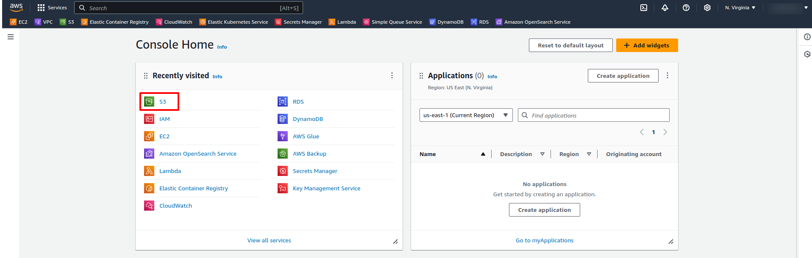
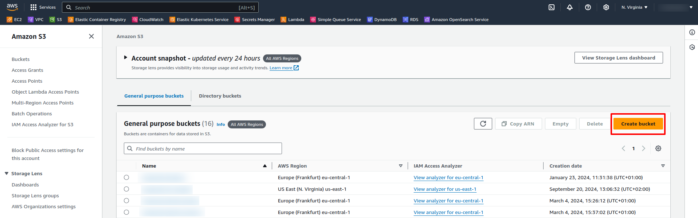
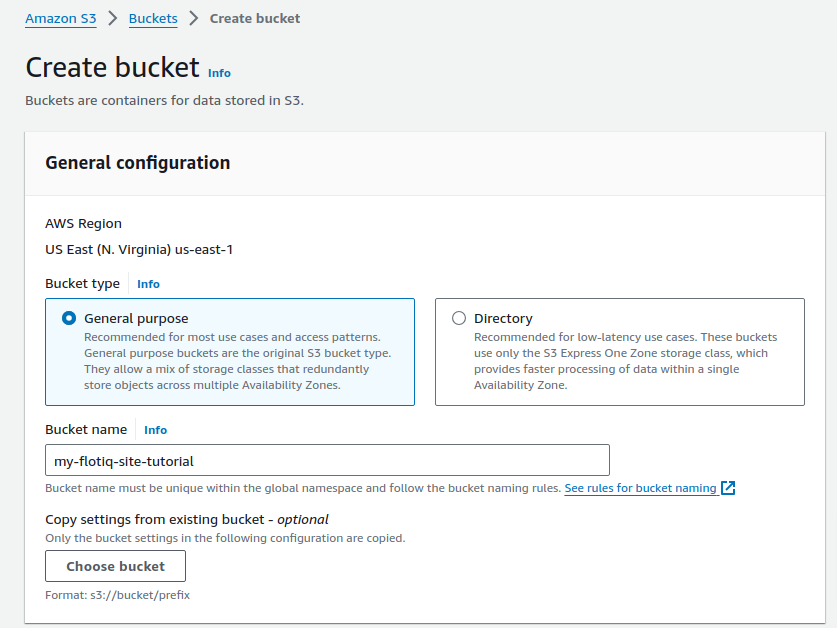
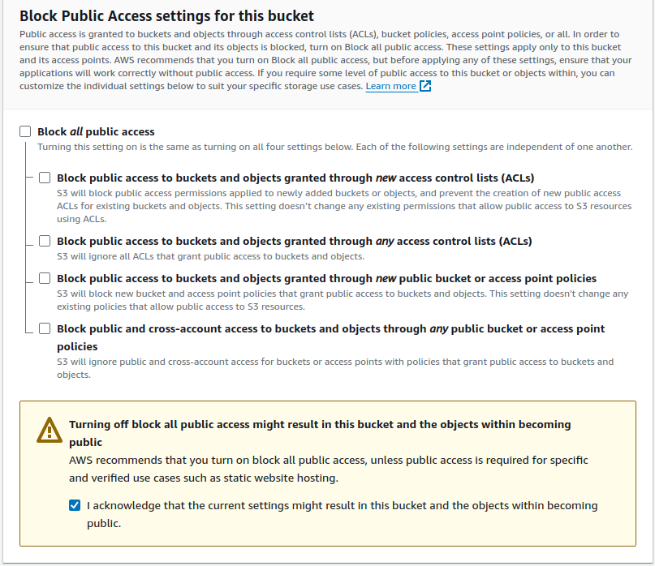
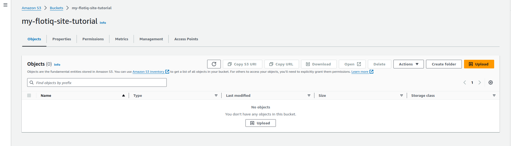
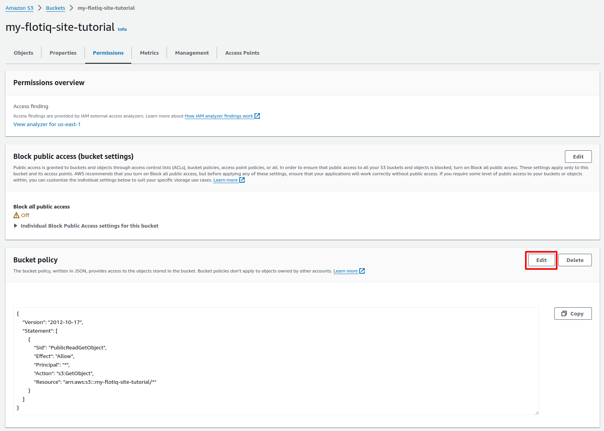
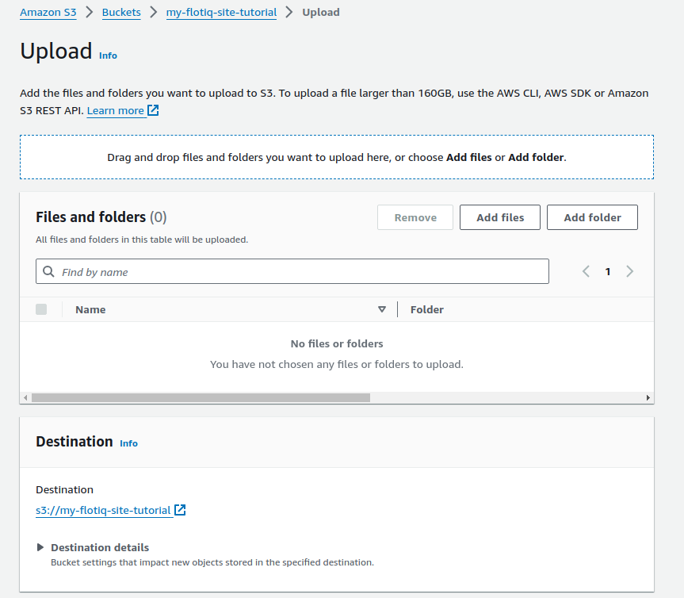
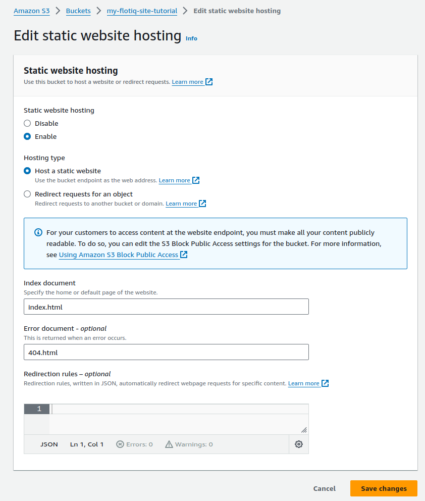
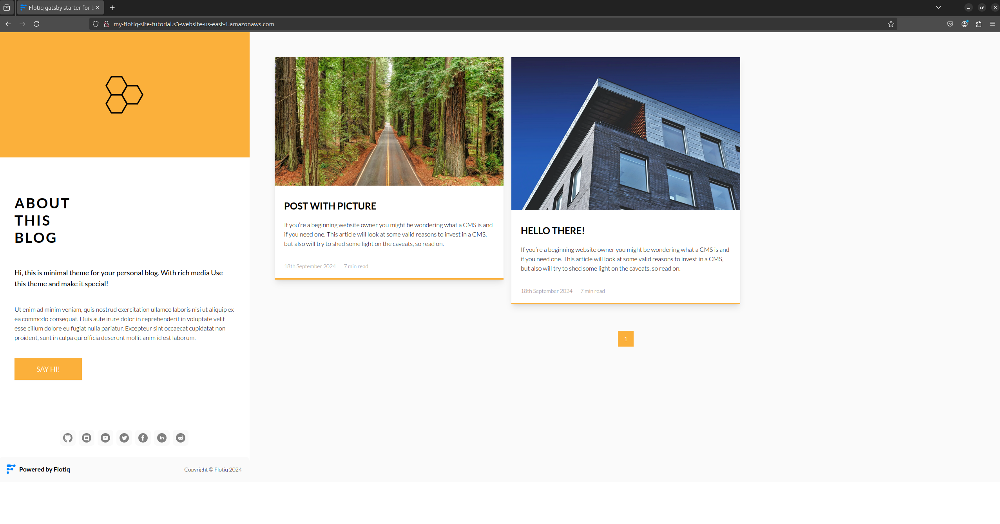

---
tags:
  - Developer
---

# Gatsby Amazon S3 Deployment

This article will walk you through the process of deploying your Gatsby project to Amazon S3 (S3 static website hosting).
We use one of our starters as an example, so you might want to check them out, check the links below.

## Prerequisites

1. **Flotiq account**
2. **Amazon Web Services account**
3. **Website, sourcing content from Flotiq.**

!!! info
    You might want to try one of our starters, which already comes with predefined content:

    * [Recipe website Gatsby starter](https://github.com/flotiq/flotiq-gatsby-recipe-1)
    * [Event calendar Gatsby starter](https://github.com/flotiq/flotiq-gatsby-event-1)
    * [Project portfolio Gatsby starter](https://github.com/flotiq/flotiq-gatsby-portfolio-1)
    * [Simple blog Gatsby starter](https://github.com/flotiq/flotiq-gatsby-blog-1)
    * [Gatsby and Snipcart boilerplate, sourcing products from Flotiq](https://github.com/flotiq/flotiq-gatsby-shop-1)
    * [Snipcart and Next.js, sourcing products from Flotiq](https://github.com/flotiq/snipcart-nextjs)
    * [Snipcart and Angular with Scully, sourcing products from Flotiq](https://github.com/flotiq/scully-products-starter)
    * [Simple blog using Angular with Scully](https://github.com/flotiq/scully-blog-starter)

    These starters all come with detailed READMEs and a one-line content import command, be sure to check those!

## Signing in to Amazon Web Services account

If you do not have an Amazon Web Services account, please follow this tutorial: [Creating Amazon Web Services account](https://docs.aws.amazon.com/accounts/latest/reference/manage-acct-creating.html)

## Building the site

This tutorial assumes you already have a Gatsby project running on your local environment.

If you haven't built it yet, use `gatsby build` command to compile it to static files.
After building the site, you should see a new folder called `public`. You will use these files to copy your site to Amazon S3.

## Deployment

Once you’ve configured your account, go to your AWS Console and go to S3 service. If you don't see it in your recently visited services or in the top bar, just type S3 in the AWS search bar.
 {: .center .width75 .border}


To create a new S3 bucket, click **Create bucket** on the right.

 {: .center .width75 .border}

At bucket creation page, name your bucket (the site address will use it), and make sure you select **General Purpose** bucket type, and disable **Block all public access**. 

 {: .center .width75 .border}
 {: .center .width75 .border}


After creating the bucket, you should see it on your AWS S3 panel. Click on the bucket name to view it's files (it should be empty for now).

 {: .center .width75 .border}


Go to the **Permissions** tab edit bucket permissions, so everyone can see your site. Look for **Bucket Policy** and click **Edit**.
Your bucket policy should look like this, remember to change the bucket name in **Resource** to your own bucket name:

```
{
    "Version": "2012-10-17",
    "Statement": [
        {
            "Sid": "PublicReadGetObject",
            "Effect": "Allow",
            "Principal": "*",
            "Action": "s3:GetObject",
            "Resource": "arn:aws:s3:::my-flotiq-site-tutorial/*"
        }
    ]
}
```

{: .center .width75 .border}

As you built the site in the previous section, we need to upload the files to the AWS S3 bucket and enable **Static website hosting** in the bucket properties.
Go to **Objects** tab in the Bucket site, and click **Upload** button. On this screen you can upload your site files, the contents of **public** folder from previous section. 

{: .center .width75 .border}


In the **Static website hosting** settings, you need to specify **Index document** and **Error Document**, in the example, these are **index.html** and **404.html** respectively.
After applying the settings, the Static website hosting will now show your bucket website endpoint.

{: .center .width75 .border}


Now your site is successfully deployed to AWS S3, and you can visit your bucket website endpoint to access it.

{: .center .width75 .border}