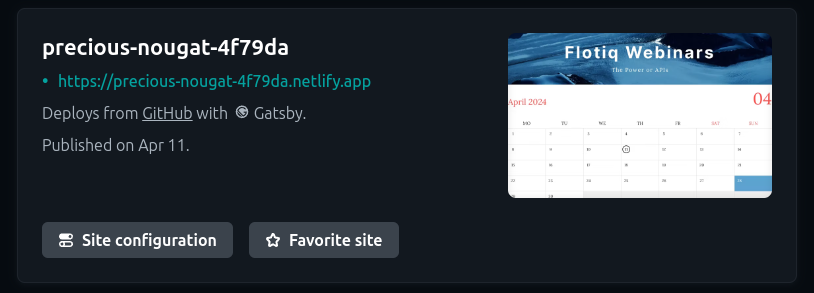
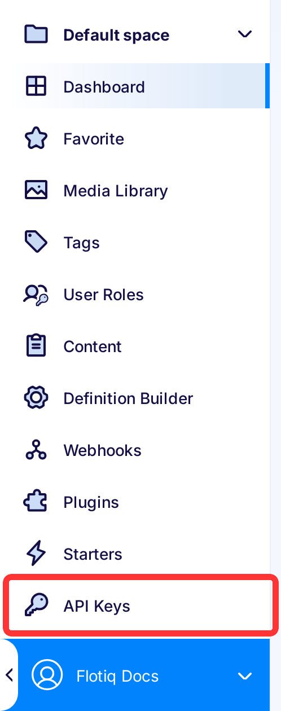

---
tags:
  - Developer
---

# Gatsby Netlify deployment

This article will walk you through the process of deploying your Gatsby project to Netlify.
We use one of our starters as an example, so you might want to check them out, check the links below.

## Prerequisites

1. **Flotiq account**
2. **Netlify account**
3. **Website, sourcing content from Flotiq.**

!!! info
You might want to try one of our starters, which already comes with predefined content:

* [Recipe website Gatsby starter](https://github.com/flotiq/flotiq-gatsby-recipe-1)
* [Event calendar Gatsby starter](https://github.com/flotiq/flotiq-gatsby-event-1)
* [Project portfolio Gatsby starter](https://github.com/flotiq/flotiq-gatsby-portfolio-1)
* [Simple blog Gatsby starter](https://github.com/flotiq/flotiq-gatsby-blog-1)
* [Gatsby and Snipcart boilerplate, sourcing products from Flotiq](https://github.com/flotiq/flotiq-gatsby-shop-1)
* [Snipcart and Next.js, sourcing products from Flotiq](https://github.com/flotiq/snipcart-nextjs)
* [Snipcart and Angular with Scully, sourcing products from Flotiq](https://github.com/flotiq/scully-products-starter)
* [Simple blog using Angular with Scully](https://github.com/flotiq/scully-blog-starter)

These starters all come with detailed READMEs and a one-line content import command, be sure to check those!

## Signing in to Netlify

If you do not have the Netlify account, the easiest way to create the account and use it in this tutorial will be to use `GitHub` on the Netlify sign-up page. Netlify will ask you to authorize with your GitHub account. If you need to request access to one or more repositories, you can click "**request access** here or later, when creating an instance.

   
 

## Deployment

Once you’ve configured your account, select a platform where your project repository is, in this tutorial we are using **GitHub**.

 
 You might need to approve the access to your GitHub repositories.

Then select the repository that contains your project.

 

After selecting the repository, you can specify a name for your site, base directory, build command, and environmental variables.\nAs our project is in the repository’s root, the base directory remains empty.

 

In this example, we need to specify two environment variables: **GATSBY_FLOTIQ_API_KEY**.

If you need to add some more, just click on **New variable**.

For more information about environment variables, check [this section.](#setting-up-environment-variables)

 

If everything looks fine, click the Deploy button and wait for Netlify to deploy your project.

Go to your Sites section and select your new project.
At the top you will see a thumbnail of your site, click on it to visit your new site.
  

Congratulations, you’ve successfully deployed your Flotiq-based site on Netlify!

### Setting up Environment Variables

An environment variable references a value that can affect how running processes will behave on a computer, for example, in staging and production environments. You must save environment variables in Netlify to authorize your instance to pull source data from Flotiq.

The environment variable needed for every Gatsby project is **GATSBY_FLOTIQ_API_KEY**. In some cases, you will provide additional environmental variables for your application to work.

For example, if you're using the [Gatsby and Snipcart starter](https://github.com/flotiq/gatsby-starter-products) you will also provide the Snipcart API key. The project Readme always described the needed variables.

To obtain the Flotiq API key - in your Flotiq account, click your profile icon in the sidebar and go to **API keys**:  

{: .center .width25 .border}

You can either select the application-wide read-only key:

{: .center .width75 .border}

Or, as a safer option, create a scoped read-only API key that will only be used for the Netlify build. Read more about [Flotiq API access](https://flotiq.com/docs/API/).

Copy the Read-Only key and paste it into Netlify settings as **GATSBY_FLOTIQ_API_KEY**.

!!! Note

    Flotiq doesn't enforce any particular way of selecting drafts or non-public versions of your pages. The Read-Only key you copied will give you access to all your content. If you'd like to set up draft and public versions of your pages - you can do so by adding an extra field to your content types and querying for it in your GraphQL queries.

    ## Installing the Netlify plugin

    Flotiq Netlify plugin allows you to trigger Netlifly builds within Content Objects forms. You will also be able to quickly navigate to your Netlify pages from the Flotiq content editor.

    [Netlify Integration](https://flotiq.com/docs/panel/Plugins/Netlify-integration/)