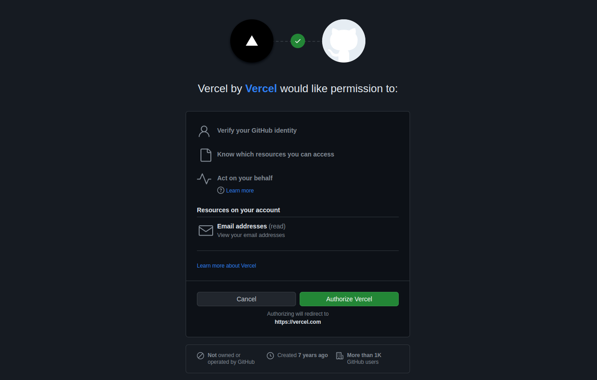

# NextJS Vercel Deployment

This article will walk you through the process of deploying your NextJS project to Vercel.
We use one of our starters as an example, so you might want to check them out, check the links below.

## Prerequisites

1. **Flotiq account**
2. **Vercel account**
3. **Website, sourcing content from Flotiq.**

!!! note
    You might want to try one of our starters, which already comes with predefined content:

    * [Recipe website Gatsby starter](https://github.com/flotiq/flotiq-gatsby-recipe-1)
    * [Event calendar Gatsby starter](https://github.com/flotiq/flotiq-gatsby-event-1)
    * [Project portfolio Gatsby starter](https://github.com/flotiq/flotiq-gatsby-portfolio-1)
    * [Simple blog Gatsby starter](https://github.com/flotiq/flotiq-gatsby-blog-1)
    * [Gatsby and Snipcart boilerplate, sourcing products from Flotiq](https://github.com/flotiq/flotiq-gatsby-shop-1)
    * [Snipcart and Next.js, sourcing products from Flotiq](https://github.com/flotiq/snipcart-nextjs)
    * [Snipcart and Angular with Scully, sourcing products from Flotiq](https://github.com/flotiq/scully-products-starter)
    * [Simple blog using Angular with Scully](https://github.com/flotiq/scully-blog-starter)

    These starters all come with detailed READMEs and a one-line content import command, be sure to check those!

## Signing in to Vercel

If you do not have a Vercel account, the easiest way to create one and use this tutorial is to use GitHub on the Vercel sign-up page. Vercel will ask you to authorize with your GitHub account. If you need to request access to one or more repositories, you can click request access here or later when creating an instance.

Go to the Vercel site and click the Sign Up button on the top right of the site.

You will be asked about the Plan type and your name. 

 {: .center .width75 .border}

On the next page, connect your Git provider. In this example, we will be using **GitHub:**

 {: .center .width75 .border}
Log in to your GitHub account and authorize Vercel to access your GitHub account information:

 {: .center .width75 .border}

## Deployment

Once you’ve configured your account, you should be taken to your project overview site. If not, go to the Vercel’s main site.

Then click **Import Project** to use a GitHub repository to create a project.

 {: .center .width75 .border}
 You might need to approve the access to your GitHub repositories. 

Then select the repository that contains your project.

 {: .center .width75 .border}

After selecting the repository, you can specify a name for your site, root directory, build command, and environmental variables. As our project is in the repository’s root, the root directory remains empty.

 {: .center .width75 .border}

In this example, we need to specify two environment variables: **FLOTIQ_API_URL** and **FLOTIQ_API_KEY**.

If you need to add some more, just click on `New variable`.

For more information about environment variables, check [this section](#setting-up-environment-variables)

 {: .center .width75 .border}

If everything looks fine, click the Deploy button and wait for Vercel to deploy your application.

After a while, you should see a notification, that your deployment succeeded.

 {: .center .width75 .border}

Congratulations, you’ve successfully deployed your Flotiq-based site on Vercel!

### Setting up Environment Variables

An environment variable references a value that can affect how running processes will behave on a computer, for example, in staging and production environments. You must save environment variables in Netlify to authorize your instance to pull source data from Flotiq.

The essential two environment variables needed for every Gatsby project are `FLOTIQ_API_KEY` and `FLOTIQ_API_URL`. In some cases, you will provide additional environmental variables for your application to work.

For example, if you're using the [Gatsby and Snipcart starter](https://github.com/flotiq/gatsby-starter-products) you will also provide the Snipcart API key. The project Readme always described the needed variables.

To obtain the Flotiq API key - in your Flotiq account, click `API keys` in the sidebar:

 {: .center .width25 .border}

You can either select the application-wide read-only key:

 {: .center .width75 .border}

Or, as a safer option, create a scoped read-only API key that will only be used for the Vercel build. Read more about [Flotiq API access](https://flotiq.com/docs/API/).

Copy the Read-Only key and paste it into Vercel settings as **FLOTIQ_API_KEY**. For the **FLOTIQ_API_URL** variable, put **https://api.flotiq.com**.

!!! info
    Flotiq doesn't enforce any particular way of selecting drafts or non-public versions of your pages.

    The Read-Only key you copied will give you access to all your content. If you'd like to set up draft and public versions of your pages, you can do so by adding an extra field to your content types and querying for it in your GraphQL queries.

