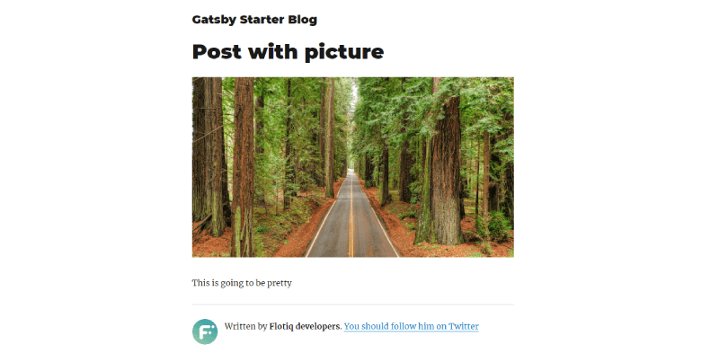
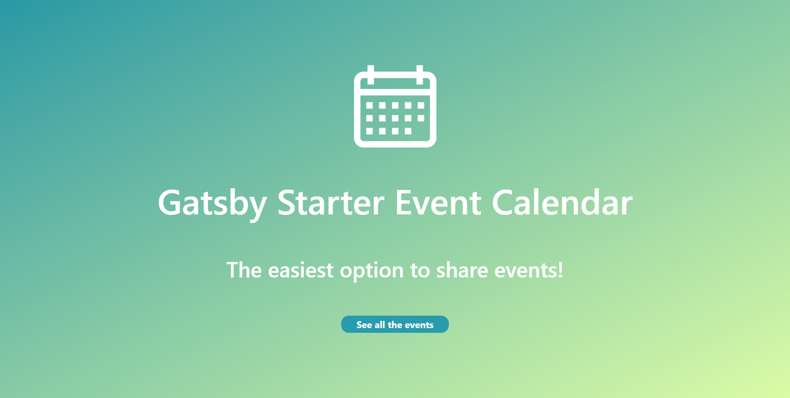
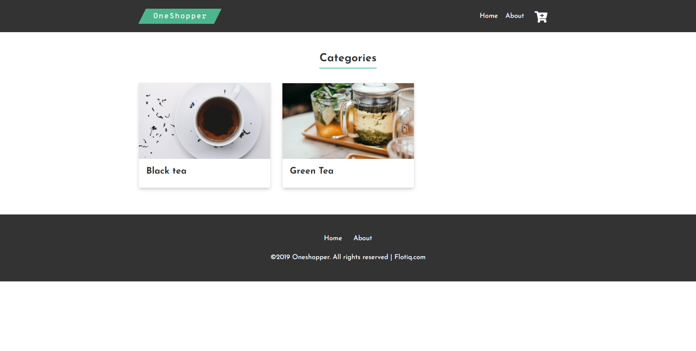

title: Flotiq Gatsby starters | Flotiq docs
description: Jump-start your projects with React Gatsby Starters.

# Gatsby starters

Gatsby is a static page generator using React.

## Starter for the simple blog

Gatsby starter for creating a blog with Flotiq

{: .center .width75 .border}

[GitHub](https://github.com/flotiq/gatsby-starter-blog){:target="_blank"}

[Working example](https://flotiq-blog.herokuapp.com/){:target="_blank"}

## Starter for WordPress-like blog

A starter blog demonstrating what Flotiq & Gatsby can do together when moving from WordPress.

{: .center .width75 .border}

[GitHub](https://github.com/flotiq/gatsby-starter-wordpress-blog){:target="_blank"}

[Working example](https://flotiq-gatsby-starter-wordpress-blog.netlify.app/){:target="_blank"}

## Starter for event calendar

Gatsby Starter to display information about events from Flotiq Events with Calendars

{: .center .width75 .border}

[GitHub](https://github.com/flotiq/gatsby-starter-event-calendar){:target="_blank"}

[Working example](https://flotiq-starter-for-events-cal.herokuapp.com/){:target="_blank"}

## Starter for products

A boilerplate repository to jumpstart your next e-commerce project, using Snipcart, Flotiq and Gatsby.

{: .center .width75 .border}

[GitHub](https://github.com/flotiq/gatsby-starter-products){:target="_blank"}

[Working example](https://flotiq-starter-products.herokuapp.com/){:target="_blank"}

## Starter for products with categories

Gatsby starter for products with categories using Snipcart

{: .center .width75 .border}

[GitHub](https://github.com/flotiq/gatsby-starter-products-with-categories){:target="_blank"}

[Working example](https://flotiq-products-with-categorie.herokuapp.com/){:target="_blank"}

## Starter for projects

A free, open-source, image-concentric starter for GatsbyJS

{: .center .width75 .border}

[GitHub](https://github.com/flotiq/gatsby-starter-projects){:target="_blank"}

[Working example](https://flotiq-starter-for-projects.herokuapp.com/){:target="_blank"}

## Starter for recipes

A Gatsby starter to build your own recipes page with Flotiq and Gatsby.

{: .center .width75 .border}

[GitHub](https://github.com/flotiq/gatsby-starter-recipes){:target="_blank"}

[Working example](https://flotiq-starter-recipes.herokuapp.com/){:target="_blank"}

[Register to start your project today](https://editor.flotiq.com/register.html){: .flotiq-button}

