title: Flotiq Gatsby starters | Flotiq docs
description: Jump-start your projects with React Gatsby Starters.

# Gatsby starters

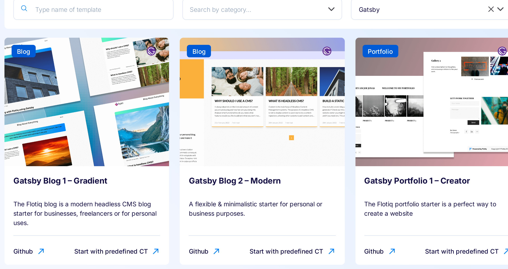{: .center .width75 .border}

We have a variety of [starters](https://flotiq.com/starters/){:target="_blank"} created especially for you. They are ready to use and easy to customize according to your needs.

Each starter is available for preview on our [GitHub](https://github.com/flotiq){:target="_blank"} and you can see how the built version works. You can also build it locally by following our step-by-step instructions.

This should save you some time in creating your own website and help you create a visually appealing page. Additionally, we have created two versions of starters using Gatsby and Nextjs - depending on which framework you prefer.

You can see all of our starters [here](https://flotiq.com/starters/){:target="_blank"}.
## Starter for the blog 1

Gatsby/Next.js starter for creating a blog with Flotiq

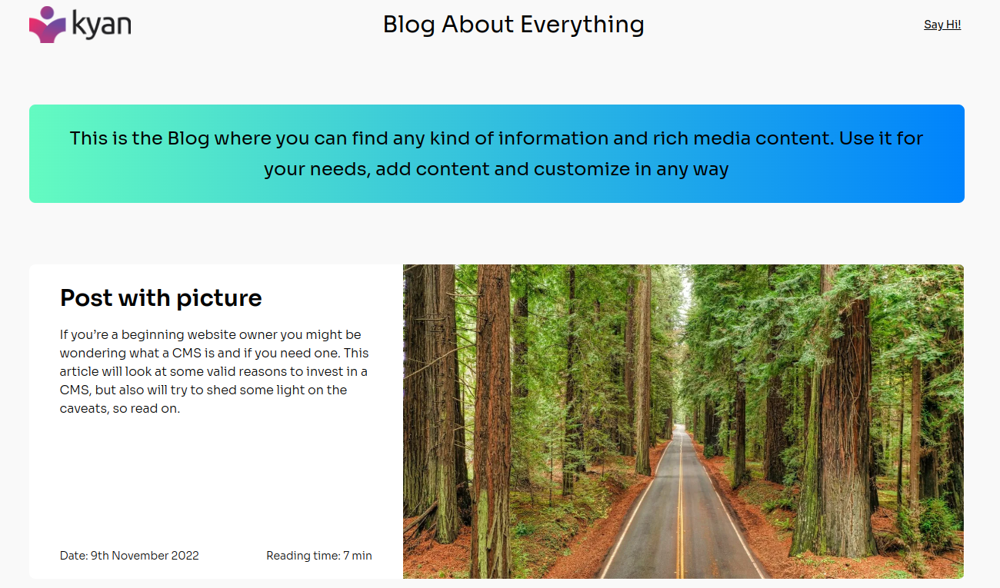{: .center .width75 .border}

[GitHub for Gatsby](https://github.com/flotiq/flotiq-gatsby-blog-1){:target="_blank"}

[GitHub for Next.js](https://github.com/flotiq/flotiq-nextjs-blog-1){:target="_blank"}

[Working example](https://flotiq-gatsby-blog-1.netlify.app){:target="_blank"}

## Starter for the blog 2

Gatsby starter for creating a blog with Flotiq

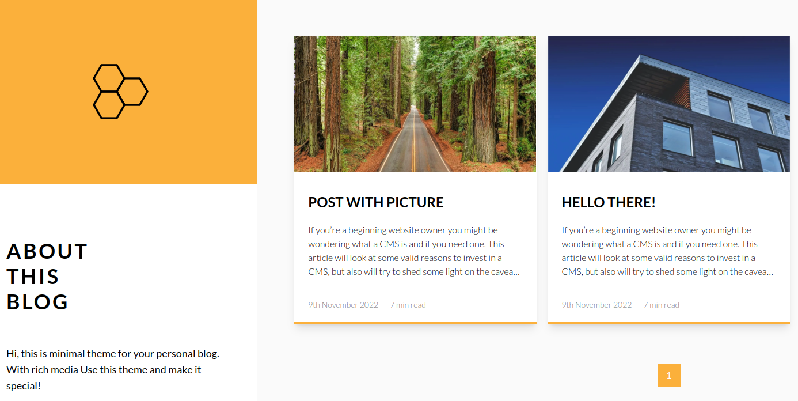{: .center .width75 .border}

[GitHub for Gatsby](https://github.com/flotiq/flotiq-gatsby-blog-2){:target="_blank"}

[Working example](https://flotiq-gatsby-blog-2.netlify.app){:target="_blank"}

## Starter for WordPress-like blog

A starter blog demonstrating what Flotiq & Gatsby can do together when moving from WordPress.

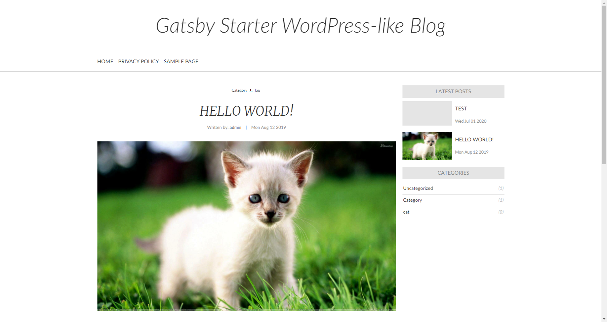{: .center .width75 .border}

[GitHub](https://github.com/flotiq/gatsby-starter-wordpress-blog){:target="_blank"}

[Working example](https://flotiq-gatsby-starter-wordpress-blog.netlify.app/){:target="_blank"}

## Starter for event calendar 1

Gatsby Starter to display information about events from Flotiq Events with Calendars

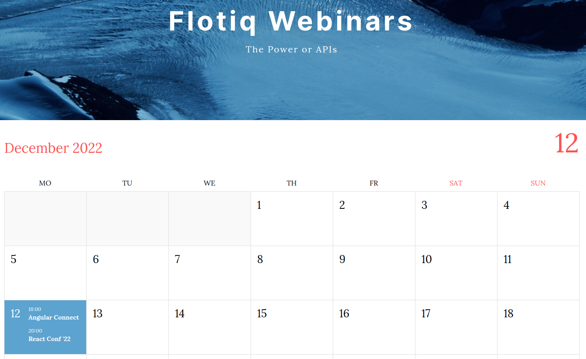{: .center .width75 .border}

[GitHub for Gatsby](https://github.com/flotiq/flotiq-gatsby-event-1){:target="_blank"}

[Working example](https://flotiq-gatsby-event-1.netlify.app){:target="_blank"}

## Starter for event calendar 2

Gatsby and Next.js Starter to display information about events from Flotiq Events with Calendars

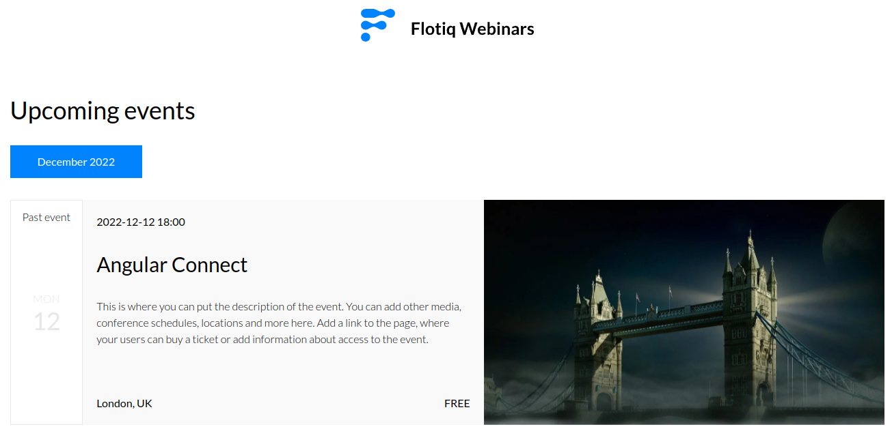{: .center .width75 .border}

[GitHub for Gatsby](https://github.com/flotiq/flotiq-gatsby-event-2){:target="_blank"}

[GitHub for Next.js](https://github.com/flotiq/flotiq-nextjs-event-2){:target="_blank"}

[Working example](https://flotiq-gatsby-event-2.netlify.app){:target="_blank"}

## Starter for shop 1

A boilerplate repository to jumpstart your next e-commerce project, using Snipcart, Flotiq and Gatsby.

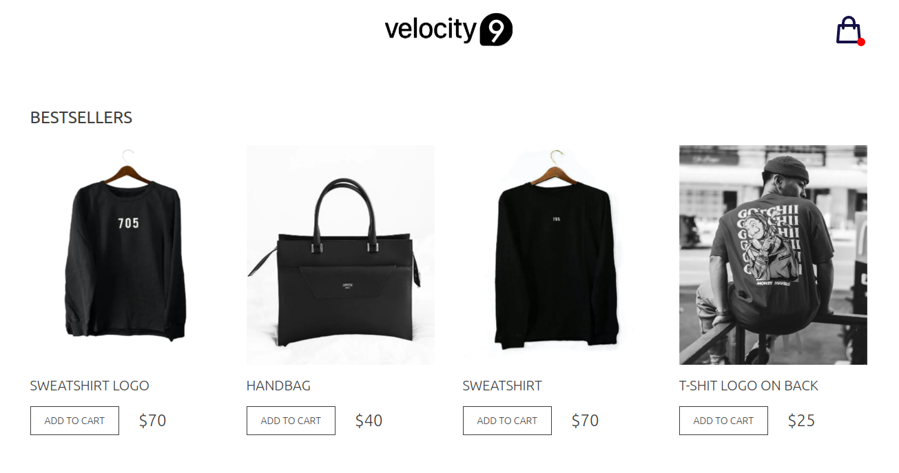{: .center .width75 .border}

[GitHub for Gatsby](https://github.com/flotiq/flotiq-gatsby-shop-1){:target="_blank"}

[Working example](https://flotiq-gatsby-shop-1.netlify.app){:target="_blank"}

## Starter for shop 2

A boilerplate repository to jumpstart your next e-commerce project, using Snipcart, Flotiq and Gatsby/Next.js.

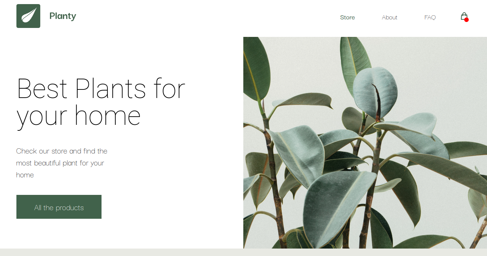{: .center .width75 .border}

[GitHub for Gatsby](https://github.com/flotiq/flotiq-gatsby-shop-2){:target="_blank"}

[GitHub for Next.js](https://github.com/flotiq/flotiq-nextjs-shop-2){:target="_blank"}

[Working example](https://flotiq-gatsby-shop-2.netlify.app){:target="_blank"}

## Starter for portfolio 1

A free, open-source, image-concentric starter for GatsbyJS.

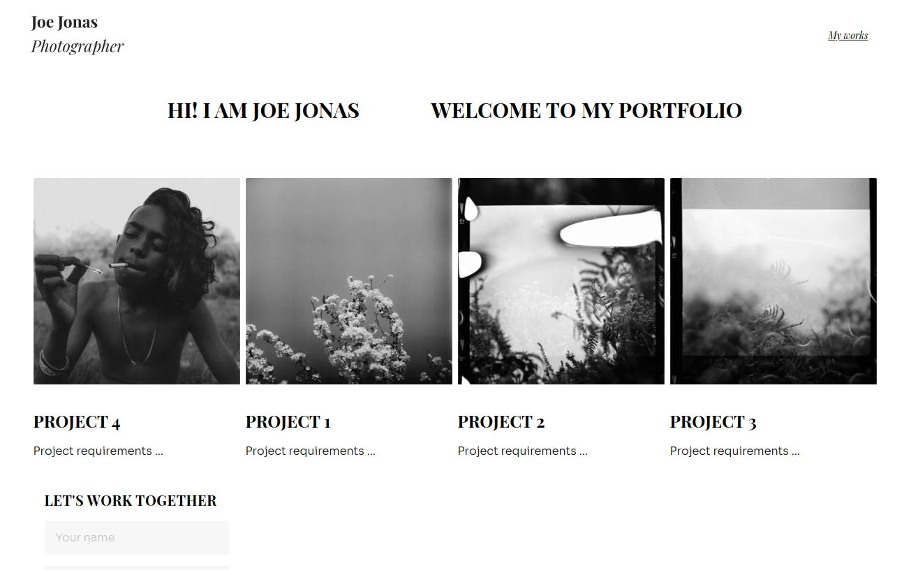{: .center .width75 .border}

[GitHub for Gatsby](https://github.com/flotiq/flotiq-gatsby-portfolio-1){:target="_blank"}

[Working example](https://flotiq-gatsby-portfolio-1.netlify.app){:target="_blank"}

## Starter for portfolio 2

A free, open-source, image-concentric starter for GatsbyJS/Next.js.

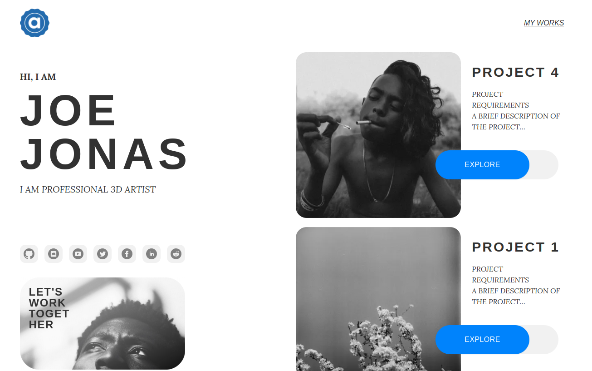{: .center .width75 .border}

[GitHub for Gatsby](https://github.com/flotiq/flotiq-gatsby-portfolio-2){:target="_blank"}

[GitHub for Next.js](https://github.com/flotiq/flotiq-nextjs-portfolio-2){:target="_blank"}

[Working example](https://flotiq-gatsby-portfolio-2.netlify.app){:target="_blank"}

## Starter for recipe 1

A Gatsby starter to build your own recipes page with Flotiq and Gatsby.

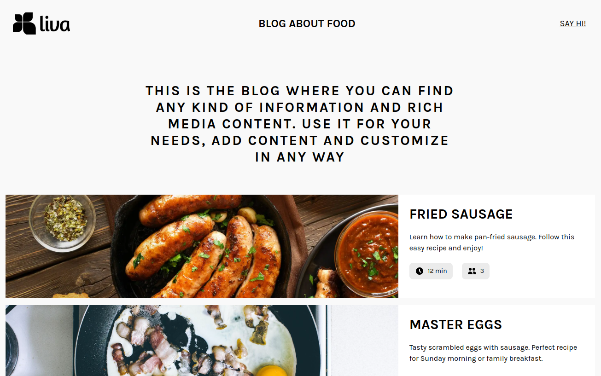{: .center .width75 .border}

[GitHub for Gatsby](https://github.com/flotiq/flotiq-gatsby-recipe-1){:target="_blank"}

[Working example](https://flotiq-gatsby-recipe-1.netlify.app){:target="_blank"}

## Starter for recipe 2

A starter to build your own recipes page with Flotiq and Gatsby/Next.js.

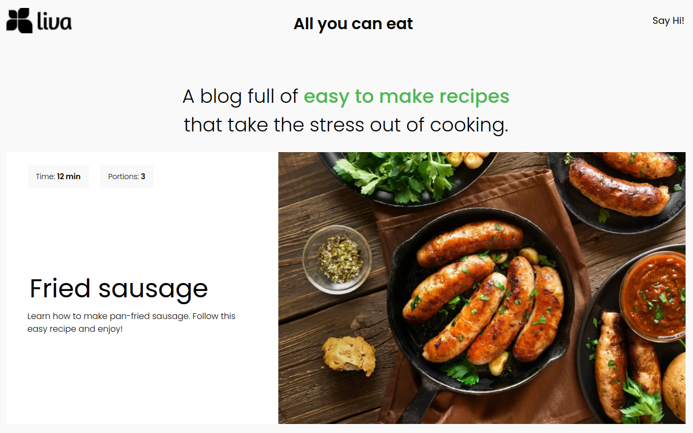{: .center .width75 .border}

[GitHub for Gatsby](https://github.com/flotiq/flotiq-gatsby-recipe-2){:target="_blank"}

[GitHub for Next.js](https://github.com/flotiq/flotiq-nextjs-recipe-2){:target="_blank"}

[Working example](https://flotiq-gatsby-recipe-2.netlify.app){:target="_blank"}

## Boilerplate for you 

If you want to start from scratch with a prepared boilerplate, we have also created it for you.

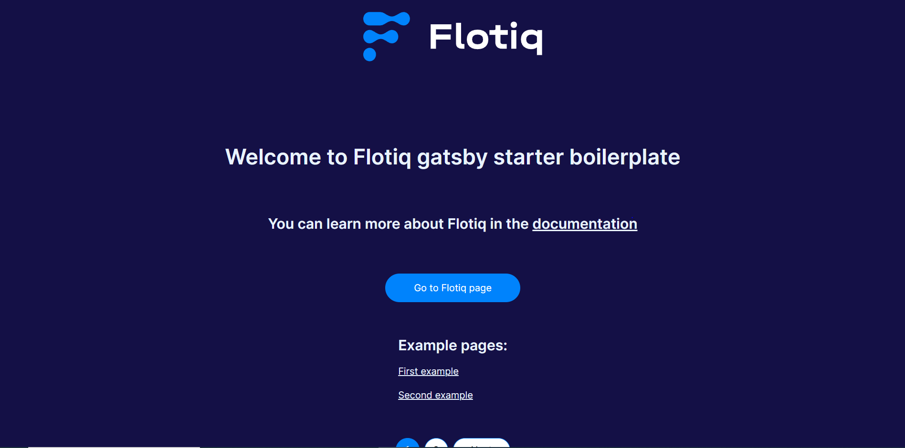{: .center .width75 .border}

[GitHub](https://github.com/flotiq/flotiq-starter-boilerplate){:target="_blank"}

[Working example](https://gatsby-starter-boilerplate.netlify.app){:target="_blank"}

[Register to start your project today](https://editor.flotiq.com/register.html){: .flotiq-button}

