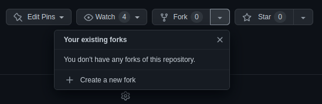
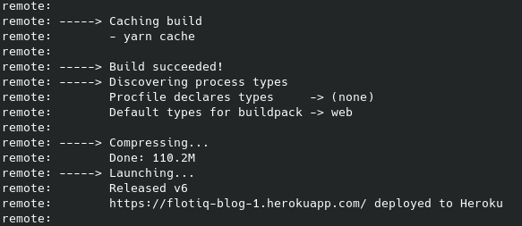

title: Deploy Next.js starter to Heroku | Flotiq docs
description: Deploy Next.js starter to Heroku

# Deploy a NextJS to Heroku

Flotiq Team prepared a few starters. They use frameworks like gatsby and NextJS.
Such starters can be hosted on many popular, often free clouds.
This post will guide you through the deployment process for one of the popular free clouds, Heroku.
An example will be a starter written in the NextJS framework.

## Before start
To start, you need an account on Heroku and install Heroku CLI on your PC.

The Heroku CLI is a command line tool to work with the Heroku cloud.
The installation process is described on the page:

[https://devcenter.heroku.com/articles/heroku-cli#install-the-heroku-cli](https://devcenter.heroku.com/articles/heroku-cli#install-the-heroku-cli)

After installation is required login to Heroku via CLI:

```bash
heroku login
```

When we log in, the CLI tool is ready to go.
## Select and fork starter

Select one starter from Flotiq NetJs starter:
[https://github.com/flotiq](https://github.com/flotiq)

For example, next's steps show deployment starter nextjs blog 1.
Fork this repository to your GitHub account.



After a fork, you need to clone the starter to your PC.

```bash
git clone git@github.com:ywur-account/flotiq-nextjs-blog-1.git
```

## Update packages.json

Add `-$PORT` to command `start` in packages.json

```json
  "scripts": {
    "dev": "next dev",
    "build": "next build",
    "start": "next start -p $PORT",
    "lint": "next lint"
  },
```
## Create a Heroku app

In the project directory, run the command:

```bash
heroku git:remote -a flotiq-blog-1
```
`flotiq-blog-1` - is application name,
when command return error about app name  is already taken
the name should be changed.

## Set environment variables

```bash
 heroku config:set FLOTIQ_API_URL=https://api.flotiq.com
 heroku config:set FLOTIQ_API_KEY=_FLOTIQ_API_KEY_
 heroku config:set NEXT_PUBLIC_GA_ID=_GOOGLE_ANALITICS_ID_
```
where:

`_FLOTIQ_API_KEY_` - Flotiq api key from: [https://editor.flotiq.com/api-keys](https://editor.flotiq.com/api-keys)

`_GOOGLE_ANALYTICS_ID_` - Google Analytics id

## Push your code to Heroku

Now commit your code changes (packages.json) and push it to Heroku:

```bash
git commit -a -m "Heroku deploy"
git push heroku main
```

After a few minutes, Heroku return URL address for your page.

